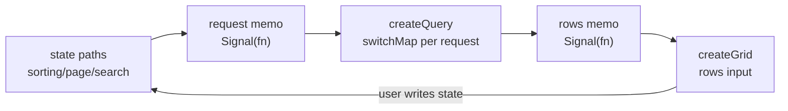

# JSON-RX bootstrap and authoring rules

## Lifecycle teardown naming

Name lifecycle teardown `unsubscribe` throughout this repository. Public return
types, object methods, local variables, renderer hooks, event-listener cleanup,
and adapter teardown use `unsubscribe`. Do not introduce `dispose`, `destroy`,
`stop`, `cleanup`, or `remove` as alternate names for the same lifecycle
operation. Preserve third-party method names only at the direct call site behind
the repository-owned `unsubscribe` boundary.

## Bootstrap invariant

The handwritten v1 compiler emits JSON-RX documents, target lowerers, adapters,
and cross-target fixtures. Generated libraries are checked artifacts. A later
self-hosting stage uses a pinned v1 compiler to generate v2 artifacts, then
requires generated-artifact diffs and the shared fixture corpus to pass before
promotion.

The serialized graph, IR discriminants, and marble fixtures are the
compatibility record across packages and target languages.

## TypeSpec authoring

Use aliases as the primary Flow<T> authoring surface. Preserve lexical flow
references so authors do not repeat explicit dependency tuples or stream
plumbing in function calls.

Repeated author-side TypeSpec parameters are a lab trigger. First test whether
the repetition belongs in an alias function, compiler IR primitive, or target
lowerer. Keep the TypeSpec call-site surface compact until the lab establishes
the required explicit form.

## Research history

### 2026-07-22: Cap'n Proto authoring and generator survey

Cap'n Proto is the external IDL found with all three of user-defined generic
schema declarations, user-defined typed annotations, and an external compiler
plugin protocol.

```capnp
struct Map(Key, Value) {
  entries @0 :List(Entry);
}

annotation jsonRx(struct, field) :Text;
```

Generic parameters are limited to pointer types. A scalar `Flow(Float64)` is
therefore invalid without a pointer-shaped wrapper payload.

`capnp compile` invokes `capnpc-<language>` executables. A plugin receives a
non-packed `schema.capnp::CodeGeneratorRequest` containing resolved schema
nodes, requested files, annotations, and source information. It can emit the
JSON-RX document, JSON Schema, TypeScript, and Rust artifacts from one schema.

Existing ecosystem routes:

- Rust: `capnproto/capnproto-rust`, `capnpc::CompilerCommand`, and the
  `capnpc-rust` plugin; `capnp-json` provides JSON codec functions.
- TypeScript: `unjs/capnp-es` emits JS, TS, and declarations and is labelled
  alpha; `jdiaz5513/capnp-ts` is an earlier generator labelled beta.
- C++: `libcapnp-json`, `capnp::JsonCodec`, and `capnp convert` support
  concrete-message JSON transcoding through JSON annotations.

No maintained Cap'n Proto to JSON Schema generator was found. The Cap'n Proto
roadmap lists JSON Schema representation as future work, so `capnpc-json-rx`
would own both JSON-RX and JSON Schema emission.

Cap'n Proto's schema grammar has constants and defaults, but no lexical value
bindings, function calls, expression AST, or inferred projection such as
`Flow<Price>.body -> Flow<decimal>`. A JSON-RX authoring surface would require
a companion expression grammar or a Cap'n Proto compiler fork.

Sources:

- https://capnproto.org/language.html
- https://capnproto.org/otherlang.html
- https://capnproto.org/capnp-tool.html
- https://capnproto.org/roadmap.html
- https://github.com/capnproto/capnproto-rust
- https://docs.rs/capnp-json/latest/capnp_json/
- https://github.com/unjs/capnp-es
- https://github.com/jdiaz5513/capnp-ts

## In-progress design: grid + pulse routes

Reactive-grid and typed-route work in flight. Doctrine for the underlying signal and RxJS primitives lives in the `rxjs` skill, not here. This section is product shape only.

### Grid

A grid is a view over a zod-typed row set. It fetches nothing. Columns and filter shape derive from the schema's deep paths via `ObjectPathsOf` (`packages/path/src/0_types.ts:124`). Two layers: a signal space built outside render, and a render bridge.



The loop closes without the grid knowing fetch exists. `mode: "server"` sets the manual flags so the grid renders `rows` as-is; the request memo plus query do the work. Client sort uses lodash; server sort listens to state and runs no logic.

```ts
function createGrid<S extends z.ZodType>(config: {
  schema: S
  id: IPath<ValuesOf<any>, any, any>
  rows: Signal<z.infer<S>[]>
  state?: Signal<GridState>
  columns?: Partial<{ [P in ObjectPathsOf<z.infer<S>>]: ColumnSpec }>
  mode: "client" | "server"
  virtualizer?: boolean | { enabled: boolean }
  selection?: { multi?: boolean; subRows?: boolean }
  globalSearch?: { columns?: string[] }
  getRowId: (row: z.infer<S>) => string
  getSubRows?: (row: z.infer<S>) => z.infer<S>[]
}): {
  id: IPath<...>
  schema: S
  state: Signal<GridState>
  events: Signal<GridEvent>
  rows: Signal<z.infer<S>[]>
  columns: Columns<z.infer<S>>
}
function useGrid<S extends z.ZodType>(grid): Table<z.infer<S>>
```

Constraints settled this design pass: no catalog or type registry (decentralization); `rows` consumer-owned (grid never fetches); `state` passable or default-created, both controllable outside render; events are one bare `Signal()` plus one `Signal<GridState>` per grid id; effects are returned signals, not descriptors; selection mirrors the current MUI row-selection API including sub-row propagation; edit mode and column filters deferred, global search is the now-form.

### Pulse routes

A route is a path template plus a zod query schema plus a payload schema, returning one signal you can read and emit into. Design checkpoint at `~/projects/instant/plans/2026-08-08-pulse-route-signal.md`. Target package `@hafley66/pulse-route` composes path + zod + signal without adding those deps to `@hafley66/path`.

```ts
type PulseRoute<Input, Output, Path extends string> = {
  readonly path: Path
  readonly schema: z.ZodType<Output, Input>
  readonly $: Signal<Output> & ((value: Input) => void)
  href(value: Input): string
  match(text: string): { matched: true; value: Output } | { matched: false; reason: "structure" | "values"; error?: unknown }
}
declare function route<Path extends string, Query extends z.ZodObject, Payload extends z.ZodType>(
  path: Path, query: Query, payload: Payload,
): PulseRoute<RoutePathInput<Path> & z.input<Query> & z.input<Payload>, RoutePathOutput<Path> & z.output<Query> & z.output<Payload>, NormalizeRoute<Path>>
```

Rules from the plan: three args (path template, query schema, payload schema; empty uses `z.object({})`); emission is one unary object combining path, query, payload once; `href` prints path keys into segments and query keys into the query string, payload-only keys omitted; event semantics ephemeral (replay or retained state is a separate signal choice, not implied by `route()`); no registry, routes are decentralized, uniqueness of normalized templates enforced only when assembling a router; path, query, payload keys disjoint. This supersedes the earlier `Route(template)` in `packages/signals/src/5_Route.ts`, which rolls its own matcher and lacks hash, JSON, and payload. Migrate onto `path` + zod when the lab settles.
