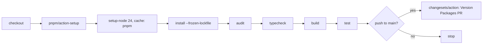

# Monorepo layout, verbs, and release

## Contents

1. [Shape of the workspace](#shape-of-the-workspace)
2. [The four verbs](#the-four-verbs)
3. [Root scripts](#root-scripts)
4. [The audit script](#the-audit-script)
5. [What the audit found before this pass](#what-the-audit-found-before-this-pass)
6. [Every package changed, and why](#every-package-changed-and-why)
7. [tsconfig.base.json](#tsconfigbasejson)
8. [Changesets configuration](#changesets-configuration)
9. [CI](#ci)
10. [Task runner decision](#task-runner-decision)
11. [Packages that are red today](#packages-that-are-red-today)
12. [Recommendations this lane did not apply](#recommendations-this-lane-did-not-apply)

## Shape of the workspace

`pnpm-workspace.yaml` declares two globs.

| glob | packages | note |
| --- | --- | --- |
| `packages/*` | 24 | `packages/claude-status-line` holds only `statusline.md` and is not a workspace project |
| `packages/grapht/adapters/*` | 8 | benchmark adapters for the `grapht-bench/0` protocol |
| total | 32 | 27 published, 5 private |

Private packages: `@hafley66/gothic`, `@hafley66/path-router-lab`, `@hafley66/grapht-render-canvaskit`, `@hafley66/grapht-render-sigma`, `@hafley66/grapht-render-vello-chromium`.

## The four verbs

Every one of the 32 packages answers to the same four script names.

| verb | contract | root fan-out |
| --- | --- | --- |
| `build` | emit the publishable artifact into `dist` | `pnpm build` |
| `test` | run the package's node-realm suite once, never in watch mode | `pnpm test` |
| `typecheck` | `tsc --noEmit` over the package's own sources | `pnpm typecheck` |
| `receipts` | the package's own full gate: lint, typecheck, test, build, plus whatever else that package needs to call itself correct | `pnpm receipts` |

`lint` is deliberately not a per-package verb. `biome.json` sits at the repository root and covers every path, so `pnpm lint` at the root is the whole story. Two packages keep a local `lint` because their own gate ran biome before this pass: `@hafley66/vitest-playwright` and `@hafley66/react-dock-and-flow`.

Watch mode moved to `test:watch` in the seven packages whose `test` was a bare `vitest`: `@hafley66/rxjs-debugger`, `@hafley66/grid`, `@hafley66/rxjs-ext`, `@hafley66/rxjsx`, `@hafley66/signals`, `@hafley66/virtualizations`, `@hafley66/xdom`. A bare `vitest` under `pnpm -r test` on a developer terminal never returns.

`check` survives as a one-line alias for `receipts` in the eight packages that already had it, because `packages/gothic/AGENTS.md`, `packages/json-rx/README.md` and `packages/react-dock-and-flow/README.md` all tell a contributor to run `pnpm check`.

## Root scripts

| script | body | purpose |
| --- | --- | --- |
| `build` | `pnpm -r build` | fan-out, dependency order |
| `test` | `pnpm -r test` | fan-out |
| `typecheck` | `pnpm -r typecheck` | fan-out |
| `receipts` | `pnpm -r receipts` | fan-out |
| `lint` | `biome check .` | repository-wide, not per package |
| `verify` | `pnpm -r typecheck && pnpm -r build && pnpm -r test` | the whole gate, phases in the order that lets a package's tests read a sibling's `dist` |
| `audit` | `node scripts/audit-packages.mjs` | the tables in this document |
| `changeset` | `changeset` | write a release note |
| `release:version` | `changeset version` | consume changesets, bump, write CHANGELOGs |
| `release:publish` | `pnpm release:check && changeset publish` | structural gate, then publish |

`pnpm -r run` sorts by workspace dependency order by default, so `verify` gets dependency order inside each phase for free.

## The audit script

`scripts/audit-packages.mjs` is read-only. It never writes a file.

```
node scripts/audit-packages.mjs          # markdown tables
node scripts/audit-packages.mjs --json   # the same data as JSON
```

| check | method |
| --- | --- |
| script coverage | `scripts` keys against `build`, `test`, `typecheck`, `receipts`, `lint` |
| entry point agreement | every path in `main`, `module`, `types` and `exports` is resolved on disk, compared against each other, and matched against the `files` allowlist |
| workspace protocol | a dependency on another workspace package that is a version range rather than `workspace:*` |
| undeclared imports | bare specifiers in `src/**` that appear in no dependency block; comments are stripped first, and a bare `mdast` resolves through a declared `@types/mdast` |
| unused runtime dependencies | a `dependencies` entry imported nowhere in the package |
| CHANGELOG | published package with no `CHANGELOG.md` |
| peer and dependency shape | a peer also held as a dependency, a peer range spelled `workspace:*`, a peer with no devDependency to develop against, and a runtime singleton (`react`, `react-dom`, `rxjs`, `vite`, `vitest`, `pixi.js`, `playwright`, `mermaid`) held as a hard dependency of a published package |

Entry point resolution reads `dist`, so run `pnpm build` first or the audit reports every artifact as missing.

## What the audit found before this pass

| check | before | after | moved by |
| --- | --- | --- | --- |
| packages missing `build` | 1 | 1 | unchanged, `@hafley66/path-router-lab` emits no artifact |
| packages missing `test` | 3 | 0 | `@hafley66/d2`, `@hafley66/mmd`, `@hafley66/grapht-render-vello-chromium` |
| packages missing `typecheck` | 1 | 0 | `@hafley66/marbler` |
| packages missing `receipts` | 28 | 0 | 28 packages, one rule |
| entry point findings | 10 | 8 | `@hafley66/rxjs-debugger` `files`, `@hafley66/grapht-layout-grid-wasm` `exports` |
| non workspace-protocol ranges | 3 | 3 | dependency blocks, not touched, see section 12 |
| undeclared imports | 5 | 5 | dependency blocks, not touched |
| unused runtime dependencies | 13 | 13 | dependency blocks, not touched |
| published with no CHANGELOG | 22 | 22 | `changeset version` writes these on first release |
| peer and dependency findings | 34 | 34 | dependency blocks, not touched |
| `pnpm release:check` | 1 failure | passes | `@hafley66/vitest-playwright` had no `prepack` |

`@hafley66/path-router-lab` keeps no `build` on purpose. It is a private type-compatibility lab that pins four major versions of react-router side by side; `tsc --noEmit` is the entire product, and there is no artifact to emit.

The 22 published packages with no `CHANGELOG.md` are not a defect to fix by hand. `changeset version` writes a `CHANGELOG.md` the first time a package appears in a release, so the list shrinks on its own. The five that have one (`@hafley66/boop-adapters`, `@hafley66/rxjs-debugger`, `@hafley66/marbler`, `@hafley66/md`, `@hafley66/vitest-telemetry`) are the five that have shipped through changesets already.

## Every package changed, and why

`packages/signal-grid/package.json` was left alone on purpose: five other lanes are editing that package during this pass.

### Script convergence

| package | change | reason |
| --- | --- | --- |
| `@hafley66/d2` | `test` added: `vitest run` | `src/1_parse.test.ts` existed but only the root script `test:sequence-local-documents` ever ran it |
| `@hafley66/mmd` | `test` added: `vitest run` | same, `src/1_parse.test.ts` |
| `@hafley66/grapht-render-vello-chromium` | `test` added: `vitest run --passWithNoTests --exclude 'e2e/**'` | no node-realm tests; `e2e/*.spec.ts` are playwright specs that vitest must not collect |
| `@hafley66/grapht-model` | `test`: `vitest run tests` becomes `vitest run --passWithNoTests` | there is no `tests` directory, so the script exited 1 on every run |
| `@hafley66/path-router-lab` | `test`: `tsc --noEmit` becomes `vitest run --passWithNoTests` | `test` was a second copy of `typecheck`; the type gate stays under `typecheck` where it belongs |
| `@hafley66/marbler` | `typecheck` added: `tsc --noEmit` | the only package with no type gate; `packages/marbler/tsconfig.json` already existed and passes |
| `@hafley66/react-dock-and-flow` | `lint` added: `biome check src` | lifted out of the old `check` so `receipts` can chain it |
| 7 packages | `test`: `vitest` becomes `vitest run`, watch mode moves to `test:watch` | a watch-mode `test` makes `pnpm -r test` hang |
| 28 packages | `receipts` added | one name for the package's own full gate |
| 8 packages | `check` becomes an alias for `receipts` | existing READMEs and AGENTS files say `pnpm check` |
| `@hafley66/vitest-playwright` | `prepack` added | `scripts/1_releaseCheck.mjs` requires the shared release gate on every public package, and this was the one failure |

The `receipts` body follows one rule: chain the verbs the package has, in the order `lint`, `typecheck`, `test`, `build`, and drop `build` when `test` already runs it. Eight packages had a fuller gate under the name `check` and kept that body verbatim: `@hafley66/gothic`, `@hafley66/json-rx`, `@hafley66/vitest-playwright`, `@hafley66/grapht-render-vello-chromium`, plus four whose `check` was a strict subset of the rule and was replaced by it (`@hafley66/react-dock-and-flow`, `@hafley66/grapht-render-sigma`, `@hafley66/grapht-render-pixijs`, `@hafley66/grapht-render-threejs`). Four packages already had `receipts` and were not touched: `@hafley66/boop-adapters`, `@hafley66/report-shell`, `@hafley66/vitest-telemetry`, `@hafley66/signal-grid`.

### Manifest shape

| package | change | reason |
| --- | --- | --- |
| 21 published packages | `publishConfig` normalised to `{ "access": "public", "registry": "https://registry.npmjs.org/" }` | 12 had it, 15 did not, and 3 spellings were in use; an explicit registry protects a publish from a contributor's scoped `.npmrc` |
| `@hafley66/rxjs-debugger` | `files` gains `"src"` | `exports["./hmr"]` points at `./src/tracking/v2/hmr/4_module-scope.ts`, which the published tarball did not contain |
| `@hafley66/grapht-layout-grid-wasm` | `exports` added, mirroring `main` and `types` | its sibling `@hafley66/grapht-layout-grid-worker` has the identical shape with `exports`; the two adapters are read as a pair |

### Root

| file | change | reason |
| --- | --- | --- |
| `package.json` | `receipts`, `lint`, `verify`, `audit` added | the fan-out and the whole-gate entry point the workspace had no name for |
| `package.json` | `check:json-rx` now calls `receipts` | `check` is now an alias, and the root should call the canonical name |
| `package.json` | `receipts:ui` calls `@hafley66/gothic receipts` | same |
| `.gitignore` | `docs/` narrowed to `docs/api/` | `docs/` was ignored wholesale, so this document could never be committed |
| `typedoc.json` | `out` moved from `docs` to `docs/api` | typedoc cleans its output directory, and it would have deleted this document on the next `pnpm docs` |

`pnpm-workspace.yaml` was read and left unchanged. Its two globs already cover every package, and the `minimumReleaseAgeExclude` and `allowBuilds` entries are current.

## tsconfig.base.json

The audit compared all 32 `tsconfig.json` files. Thirty of them repeat the same five options verbatim (`target: ES2022`, `module: ESNext`, `moduleResolution: bundler`, `strict: true`, `skipLibCheck: true`); the two exceptions are `packages/grapht/adapters/0_layout_grid_worker` and `packages/grapht/adapters/1_layout_grid_wasm`, which use `NodeNext`. Nine of them are byte-identical on the full library option set. That is copy drift, so `tsconfig.base.json` now exists.

`tsconfig.base.json` holds only path-free options. `outDir`, `rootDir`, `include`, `exclude` and `paths` stay in each package, because TypeScript resolves a path-valued option relative to the file that declares it; moving `outDir: "./dist"` into the root base would point every package at the repository root `dist`.

| package | extends the base | keeps |
| --- | --- | --- |
| `@hafley66/grid` | yes | `outDir`, `rootDir`, `include`, `exclude` |
| `@hafley66/md` | yes | same, and gains `esModuleInterop` from the base |
| `@hafley66/react-dock-and-flow` | yes | same, and gains `esModuleInterop` from the base |
| `@hafley66/report-shell` | yes | same |
| `@hafley66/rxjs-ext` | yes | same |
| `@hafley66/scene` | yes | same |
| `@hafley66/signals` | yes | same |
| `@hafley66/virtualizations` | yes | same |
| `@hafley66/xdom` | yes | same |

Not migrated, with the reason:

| package | reason |
| --- | --- |
| `@hafley66/signal-grid` | five other lanes are editing that package during this pass |
| `@hafley66/json-rx`, `@hafley66/rxjsx` | both fail `typecheck` today; a config change would confuse an already-red package |
| `@hafley66/boop-adapters`, `@hafley66/gothic`, `@hafley66/grapht`, `@hafley66/grapht-model`, `@hafley66/marbler`, `@hafley66/mmd`, `@hafley66/d2`, `@hafley66/path`, `@hafley66/path-router-lab`, `@hafley66/vitest-playwright`, `@hafley66/vitest-telemetry` | each carries options the base does not have (`types`, `lib`, `paths`, `noEmit`, no `composite`); folding them in needs a second archetype, which is a separate pass |
| all 8 `packages/grapht/adapters/*` | two use `NodeNext` module resolution and the rest compile loose `*.ts` files at the package root rather than a `src` tree |

`pnpm -r typecheck` was run against the nine migrated packages on its own before the full workspace run; all nine pass.

## Changesets configuration

`.changeset/config.json`:

| key | value | reason |
| --- | --- | --- |
| `linked` | `["@hafley66/grapht-model", "@hafley66/grapht", "@hafley66/mmd", "@hafley66/d2"]` | `@hafley66/grapht-model` owns the versioned sequence artifact schema. `@hafley66/grapht`, `@hafley66/mmd` and `@hafley66/d2` all read and write that schema, and `packages/grapht/tests/20_sequencePackageGate.test.ts` builds all four together as one gate. A schema change has to read as the same version number on all four. `linked` keeps them level when they are bumped together without forcing a bump on a package that did not change |
| `fixed` | `[]` | no group in this workspace must release together on every release. `fixed` would force a version bump on `@hafley66/d2` for a change that only touched `@hafley66/mmd` |
| `ignore` | `[]` | changesets already skips a package with `"private": true`, and all five private packages carry it. An `ignore` list would be a second place to keep the same fact |
| `privatePackages` | `{ "version": false, "tag": false }` | the changesets default versions private packages and writes them a CHANGELOG. `@hafley66/gothic` is a demo SPA pinned at `0.0.0` and the four private adapters are benchmark harnesses. None of them has a release to describe |
| `updateInternalDependencies` | `patch` | unchanged, already correct: a workspace consumer gets a patch bump when its dependency moves |
| `access` | `public` | unchanged; `publishConfig.access` on each package now says the same thing, which is the field npm reads at publish time |

## CI

`.github/workflows/ci.yml`, on push to `main` and on every pull request.



| job | trigger | does |
| --- | --- | --- |
| `verify` | push, pull request | install, audit, typecheck, build, test across the workspace |
| `changeset` | push, pull request | `changeset status`, which prints the pending release table into the job log |
| `release` | push to `main` only | `changesets/action@v1` with `version:` only, which opens or refreshes the "Version Packages" pull request |

The pnpm store is cached by `actions/setup-node@v4` with `cache: pnpm`, keyed on `pnpm-lock.yaml`.

Publishing stays out of CI. `changesets/action` can publish, and this workflow deliberately does not pass `publish:`, because npm two-factor lives on a person. `just publish` and `pnpm release:publish` remain the way a release goes out.

The `changeset` job runs `changeset status` with no `--since`. Adding `--since=origin/main` turns the job into a gate that fails any pull request without a changeset, which would block a documentation-only change. The job as written reports the pending release without gating.

Packages held out of the CI `test` step because their own `test` drives a browser, a GPU renderer or a network receiver:

| package | what its `test` starts |
| --- | --- |
| `@hafley66/boop-adapters` | playwright, `tests/network.e2e.test.ts` |
| `@hafley66/rxjs-debugger` | a vitest browser project for the HMR integration suite |
| `@hafley66/vitest-playwright` | playwright fixtures and screenshot baselines |
| `@hafley66/vitest-telemetry` | an OTLP receiver on port 14318 plus a sharded vitest run |
| `@hafley66/grapht-render-cytoscape` | playwright |
| `@hafley66/grapht-render-canvaskit` | the CanvasKit wasm renderer |
| `@hafley66/grapht-render-pixijs` | WebGL |
| `@hafley66/grapht-render-threejs` | WebGL |

Each of those has a `receipts` script that runs the full gate on a machine with a browser.

Packages held out of the CI `build` step because they compile Rust:

| package | needs |
| --- | --- |
| `@hafley66/grapht-layout-grid-wasm` | `cargo` and the `wasm32-unknown-unknown` target |
| `@hafley66/grapht-render-vello-chromium` | `cargo`, `wasm32-unknown-unknown`, and `wasm-bindgen` |

Adding `dtolnay/rust-toolchain` and `jetli/wasm-bindgen-action` to the workflow would bring both back in. That is a separate decision about CI minutes, not a hygiene question.

## Task runner decision

Recommendation: no task runner. Keep `pnpm -r`.

Measured on this workspace, cold shell, after `pnpm install`:

| command | wall time |
| --- | --- |
| `pnpm -r typecheck` across 32 packages | 3.1 s |
| `pnpm -r build` across 32 packages | 11.9 s |

| candidate | what it would add | why not here |
| --- | --- | --- |
| Turborepo | content-hashed local and remote task cache, task graph from `dependsOn`, `--filter` on changed packages | the cache saves a fraction of 15 seconds. `turbo.json` would restate the dependency graph that `pnpm -r` already reads from `workspace:*`, so the graph gets a second source that can drift from `package.json` |
| Nx | the same caching plus generators, module boundary lint rules, an affected-graph, plugin inference | a much larger surface than a 32-package workspace with one publish flow needs. Nx wants to own the project graph, which means `nx.json`, project inference and a plugin per tool (`@nx/vite`, `@nx/js`) sitting between a contributor and `vitest` |
| moonrepo | toolchain pinning, task caching, a language-agnostic graph including the Rust adapters | the strongest technical fit, because two packages already build Rust to wasm and moon can own the cargo half. Still buys caching this workspace does not need at 15 seconds, and adds a `.moon` toolchain layer over a `packageManager` field that already pins pnpm 11.10.0 |
| Lage | Microsoft's pipeline runner over npm scripts, cache, no config language of its own | closest to the current setup and the lightest of the four, and still a dependency whose only payoff is a cache for a 15 second graph |
| Wireit | per-script incremental caching declared inline in `package.json`, no separate graph file | the only candidate with no second graph to drift. Worth revisiting if `build` passes roughly 60 seconds, because each script then declares its own `files` and `output` next to the script it caches |
| `pnpm -r` | topological order, `--filter`, `--no-bail`, already installed | what the repository uses |

Revisit when `pnpm -r build` passes roughly 60 seconds on a laptop, or when CI minutes rather than developer wall time become the constraint. Wireit is the first candidate to try at that point, because it adds caching without adding a second dependency graph. The measurement to re-run is the two rows above.

## Packages that are red today

Every one of these was already failing before this pass and was left failing.

| package | command | error |
| --- | --- | --- |
| `@hafley66/json-rx` | `typecheck` | `src/4_typespec/4_typeFlow.test.ts(2,25): error TS2591: Cannot find name 'node:path'` and `(5,58): error TS2339: Property 'dirname' does not exist on type 'ImportMeta'`. `@types/node` is a devDependency but `packages/json-rx/tsconfig.json` has no `types` entry for it |
| `@hafley66/rxjsx` | `typecheck` | 12 errors in `src/jsx-runtime.tsx`, `src/toHTML.ts` and `src/util.dual.ts`, starting with `TS2305: Module '@hafley66/rxjs-ext' has no exported member 'DelegatedObservable'` |
| `@hafley66/react-dock-and-flow` | `build`, `test` | `failed to load config from vite.config.ts`, `TypeError: Cannot read properties of undefined (reading 'ESNext')` inside `vite-plugin-dts@4.5.4`. The package pins `vite-plugin-dts: ^4.5.4` while the root and `@hafley66/md` use `^5.0.3`; v4 does not read TypeScript 7 |
| `@hafley66/grapht` | `test` | 5 failures in `tests/17_sequenceBoard.test.ts`, `tests/18_sequenceBoardReceipts.test.ts` and `tests/19_sequenceCollapsePlacement.test.ts`, all `ENOENT ... packages/grapht/fixtures/sequence/2_d2.d2` |
| `@hafley66/grapht-render-cytoscape` | `test` | `e2e/0_scenarios.spec.ts` is a playwright spec that vitest collects: `Playwright Test did not expect test() to be called here` |
| `@hafley66/rxjs-debugger` | `test` | `src/1_runtime_vite_plugin/__tests__/hmr-integration/hmr.integration.test.ts`, one test times out at 10 s |
| `@hafley66/boop-adapters` | `test` | `tests/network.e2e.test.ts`, one assertion: `expected 0 to be greater than 0` on the status dot class |
| `@hafley66/vitest-playwright` | `test` | 2 failures in `tests/7_screenshot.test.ts` around baseline naming and locator routing |

## Recommendations this lane did not apply

No dependency block was edited anywhere in this pass. Every entry in `dependencies`, `devDependencies` and `peerDependencies` is untouched, because any edit to one dirties `pnpm-lock.yaml` and five other lanes hold that file open. Each item carries the exact edit.

| package | edit | effect |
| --- | --- | --- |
| `@hafley66/react-dock-and-flow` | `vite-plugin-dts` `^4.5.4` to `^5.0.3` | fixes the `build` and `test` failure listed above |
| `@hafley66/json-rx` | `@hafley66/signals` `^0.0.2` to `workspace:*` | clears the `changeset status` warning `must depend on the current version of @hafley66/signals: 0.1.1 vs ^0.0.2` |
| `@hafley66/react-dock-and-flow` | `@hafley66/signals` `0.0.2` to `workspace:*` | clears the same warning |
| `@hafley66/md` | `@hafley66/signals` peer `>=0.1.0` | already a semver range, correct as written; recorded only so the audit row reads as expected rather than as a defect |
| `@hafley66/report-shell` | 4 peers spelled `workspace:*` (`@hafley66/grid`, `@hafley66/marbler`, `@hafley66/path`, `@hafley66/signals`) to `>=` ranges | pnpm rewrites `workspace:*` to an exact version at publish, which pins a consumer to one exact version of each; a peer range should be a range |
| `@hafley66/signal-grid` | 3 peers spelled `workspace:*` (`@hafley66/path`, `@hafley66/signals`, `@hafley66/xdom`) to `>=` ranges | same. This package belongs to another lane; report only |
| `@hafley66/rxjs-debugger` | drop `d3`, `localforage`, `uuid`, `typescript` from `dependencies` | none of the four appears in `src/**`; `packages/devtool-plugin/PLAN-2026-07-26-debugger-core-v2.md` already names three of them as dead |
| `@hafley66/rxjs-debugger` | add `vite` to `devDependencies` | `src/1_runtime_vite_plugin/0_rxjs_devtool_patch_plugin.ts:14` does `import type { Plugin, ResolvedConfig } from "vite"` and no block declares it |
| `@hafley66/grid` | drop `@tanstack/react-virtual` from `dependencies` | imported nowhere; the package goes through `@hafley66/virtualizations` |
| `@hafley66/json-rx` | drop `@emotion/react` and `@emotion/styled` from `dependencies` | imported nowhere in `src/**` |
| `@hafley66/vitest-telemetry` | drop `@hafley66/path`, `@hafley66/rxjs-ext`, `@hafley66/xdom` from `dependencies` | imported nowhere in the package |
| `@hafley66/gothic` | drop `@hafley66/path` from `dependencies` | named in `packages/gothic/AGENTS.md` but imported in no source file |
| `@hafley66/grapht` | add `playwright` to `dependencies` | `src/15_sequenceGeometry.ts` imports it and no block declares it |
| `@hafley66/d2`, `@hafley66/mmd`, `@hafley66/path` | add `vitest` to `devDependencies` | each has a test file importing `vitest`; today it resolves only because the workspace root declares it |
| `@hafley66/grid`, `@hafley66/xdom` | add `react` to `devDependencies` | both declare `react` as an optional peer and develop against it through `react-dom` alone |
| `@hafley66/rxjsx` | add `rxjs` to `devDependencies` | declared as a peer with nothing to develop against |
| `@hafley66/rxjs-ext` | move `@types/debug` from `peerDependencies` to `devDependencies` | a types package is never a peer; the consumer of `@hafley66/rxjs-ext` does not need it |
| 14 published packages | move `react`, `react-dom`, `rxjs`, `pixi.js`, `mermaid`, `playwright` out of `dependencies` into `peerDependencies` | a published library that holds a runtime singleton as a hard dependency forces a second copy into the consumer's graph. `node scripts/audit-packages.mjs` prints the full list under "peerDependencies and dependencies" |

Two more, outside the dependency blocks:

| target | edit | reason |
| --- | --- | --- |
| `packages/grapht/adapters/2_render_cytoscape` | give vitest a config that excludes `e2e/**`, or move `main` off `./4_adapter.ts` | `main` currently points at a TypeScript source file in a published package, and the `test` script collects a playwright spec |
| `packages/devtool-plugin` | make `vite build` emit `dist/index.d.ts` | `types` points at a file the build does not produce |

Four secondary scripts still sit in watch mode. They are outside the four verbs, so `pnpm -r test` never reaches them, but each one hangs a terminal when run non-interactively.

| package | script | body |
| --- | --- | --- |
| `@hafley66/rxjs-debugger` | `test:browser` | `vitest --config vitest.browser.config.ts` |
| `@hafley66/grid` | `test:browser` | `vitest --config vitest.browser.config.ts` |
| `@hafley66/xdom` | `test:browser` | `vitest --config vitest.browser.config.ts` |
| `@hafley66/signals` | `test:jsx-e2e` | `vitest --config vitest.jsx-e2e.config.ts` |
