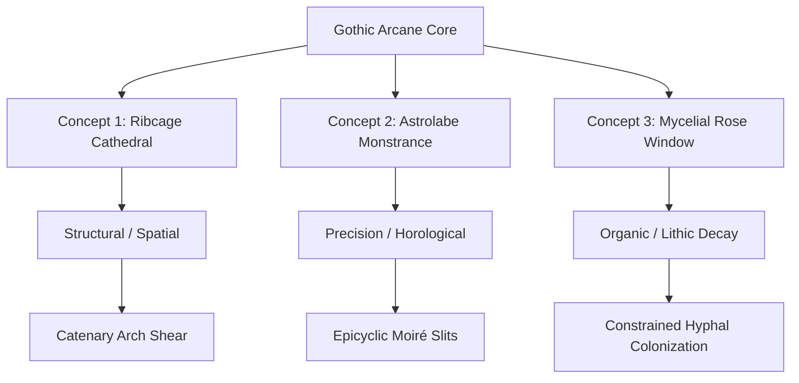
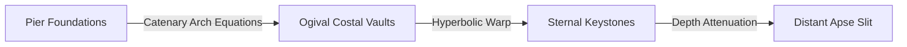
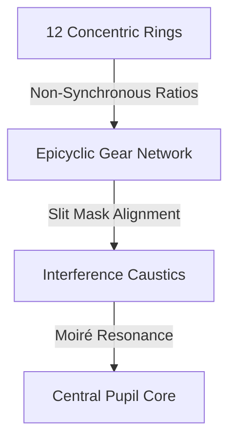
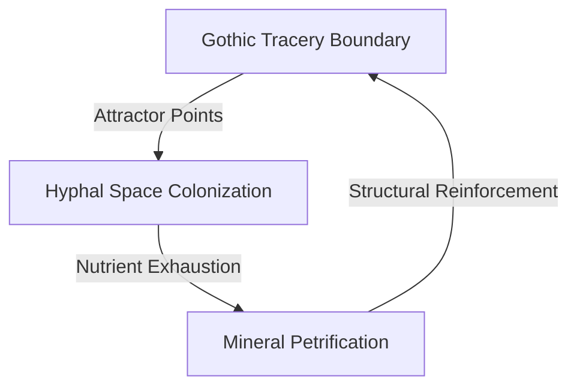
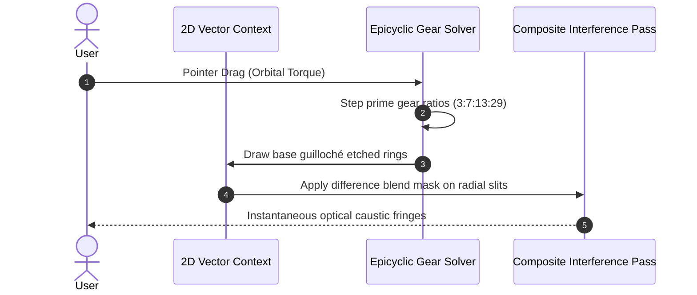
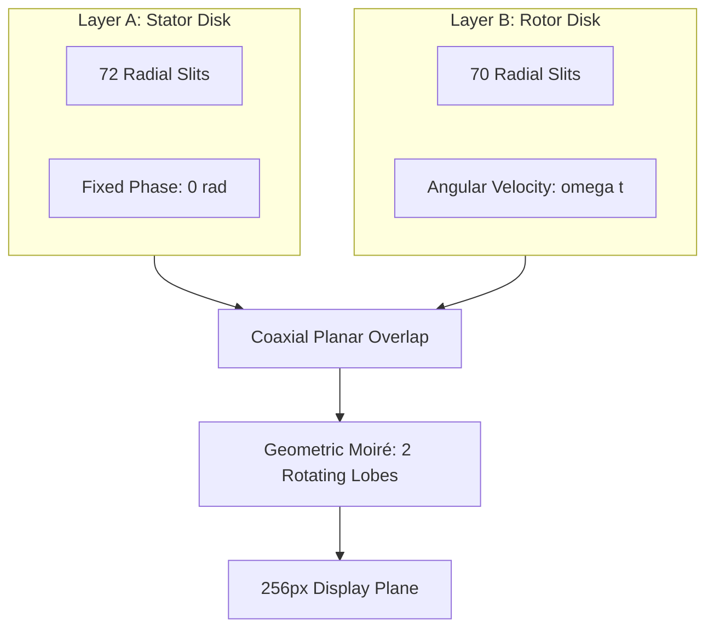
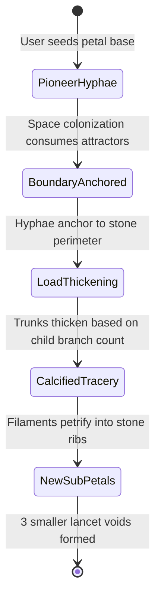

# Three visual directions: Gemini design discussion

Date: 2026-09-08

Requested consultation with `gem38f`, run through OpenCode via Boop. Two completed response passes. This document records design proposals; no visual prototype was produced during this consultation.

## Provenance

| Field | Value |
| --- | --- |
| Preset | `gem38f` |
| Harness | `opencode` |
| Model | `openrouter/google/gemini-3.8-flash` |
| Variant | `max` |
| Initial proposal lane | `chore-gothic-gem38f-concepts-20260907` |
| Refinement lane | `chore-gothic-gem38f-review-20260908` |
| Exit status | Both lanes returned 0; both written responses were read |
| Context supplied | Generic creative brief, then the first response and coordinator follow-up |

Automatic approval review rejected the initial launch that would have exposed private package source and local renders. The completed consultation used an isolated scratch repository containing only the generic brief and discussion. Gemini did not inspect the application, its source, or its renders. The first lane retired after its response; the second received the complete first response and follow-up in files.

## Refined concepts

| Concept | Composition | Defining event | First scene |
| --- | --- | --- | --- |
| **Ribcage Cathedral** | Bone-colored Gothic arches, a narrow catwalk, black depth, a distant white lancet | Rib pairs pull apart at interlocking, tooth-shaped crown joints; the opening travels down the nave before closing | Three overlapping bays with solid silhouettes and a six-second staggered breathing cycle |
| **Astrolabe Monstrance** | Two engraved brass masks sharing one circular face, framed by a dark bezel | A slight mechanical rotation produces a much larger apparent movement in the moiré pattern | Two overlapping radial masks in a 256px square, one fixed and one draggable |
| **Mycelial Rose Window** | An empty pointed stone petal containing growing pale filaments | Filaments attach to the perimeter, thicken, and calcify into ribs that subdivide the opening | One petal showing the complete sequence from growth through stone formation |

Gemini recommends prototyping **Astrolabe Monstrance** first. Its proposed visual test is a readable macro-pattern in a still frame and visibly amplified motion during a short drag. Brass ornament and additional clockwork can follow after that behavior is visible.

The coordinator's follow-up asked for articulated cathedral joints and occlusion, overlapping astrolabe masks and pixel budgets, and an explicit growth-to-stone sequence with preserved openings. The responses below retain Gemini's original wording.

## Coordinator implementation review

These are unresolved details in the proposed recipes, recorded after reading the refinement. They do not alter the three visual directions.

- **Cathedral geometry:** the stated parabola expression lacks complete domains, endpoint constraints, and the transform that connects the moving ribs to their piers and crown. The first scene needs explicit joint coordinates and silhouettes. Rotation of a camera about a fixed optical center does not itself produce translational depth parallax; the suggested camera behavior needs precise definition.
- **Astrolabe pattern:** 72 and 70 are proposed slit counts with a difference of two. Their relative angular phase yields a low-frequency envelope, but coaxial straight radial slits alone do not establish the claimed hyperbolic cross. For phases `72θ` and `70(θ − φ)`, their difference is `2θ + 70φ`, so a constant envelope phase travels with `dθ/dφ = −35`; the magnitude is 35 and the sign depends on the angle convention. Shape, contrast, filtering and motion remain visual prototype questions.
- **Astrolabe masks:** `Step(0.5, sin(...))` does not give the claimed 50% duty cycle. The listed compositing operations are not interchangeable. At radius 80px, a 50%-duty 72-slit mask has slit width `π × 80 / 72`, approximately 3.49px, rather than the stated 2.5px. These details need correction before implementing that formula.
- **Growth budget:** 150 points with 12px minimum pairwise separation cannot fit in the proposed 60px by 140px petal. Disjoint radius-6 disks around those points would require about 16,965 square pixels; even the containing rectangle expanded by 6px on each side has only 10,944 square pixels. An ordinary Halton sequence also does not enforce the claimed exclusion distance.
- **Growth topology:** space colonization alone does not guarantee perimeter attachment, three enclosed openings, or a 55% open-area floor. Those need explicit constraints and an area check. Attractor exhaustion also needs a stalled-growth termination condition for unreachable attractors. The single-petal prototype must establish these behaviors before claiming recursive subdivision.
- **Replay:** a click that injects a point changes more than seed and elapsed time. Deterministic replay must include the gesture position and tick, or an equivalent complete input record.
- **Dependency and performance suggestions:** Gemini's dependency suggestions and runtime estimate were not researched or measured. Rendering choices remain open.

## Complete exchange

### Initial coordinator brief

<details>
<summary>Read original text</summary>

# Three visualization concepts: design conversation, pass 1 of 2

This is a standalone creative consultation. The user explicitly requested three visualization design ideas from gem38f through OpenCode via Boop, with a discussion and refinement round led by a coding coordinator.

This scratch repository contains only this brief. There are no project files, screenshots or private code to inspect. Use only this brief and your general knowledge. Do not read files outside this scratch repository, inspect machine configuration or other repositories, use browser sessions, or fetch project data. Do not install dependencies or change any application. Write your answer to REPORT.md in your current working directory. Do not commit.

## Visual territory

Gothic architecture, arcane geometry, ornamental line work, impossible spaces, and generative motion are starting territory. The aim is visually compelling interactive algorithmic art. The three concepts should have distinct visual identities and underlying behaviors. They may draw from architecture, physical phenomena, optics, organisms, or geometry. A web notebook with controls and deterministic variation is a plausible final host.

The user wants ideas led by creative visual design. Describe what the viewer sees and how it transforms. A decorative title, a palette change, or more repeated outlines does not specify an experience.

## Deliverable

Propose exactly THREE concepts. For each:
- Describe the composition concretely: subject, framing, negative space, scale relationships, visual texture and material.
- Describe its motion or interactive sequence: initial image, moment of surprise, and what sustains attention.
- Explain the generative mechanism that yields that behavior. Distinguish the visual design from a generic application of the algorithm.
- Give three to five controls with specific visible before/after behavior.
- Define one still frame and one motion event that would test the concept in a prototype.
- Identify the likely visual failure mode and a specific decision that prevents it.

Conclude with a comparison and your choice for the first visual prototype, with a concrete visual reason. Consider whether a first prototype can reveal the central experience quickly and faithfully. Name dependencies only as candidates requiring verification; no project dependency inventory was supplied.

Write about 1,200 to 1,800 words. This is pass 1 of 2. The coordinator will ask specific follow-up questions, then you will refine your concepts. The current task is ideas and discussion only, not implementation. End your turn after writing REPORT.md.

</details>

### Gemini response, pass 1

<details>
<summary>Read original text</summary>

# Table of Contents
- [Concept Comparison Matrix](#concept-comparison-matrix)
- [Concept 1: Ribcage Cathedral (Ossuary Nave)](#concept-1-ribcage-cathedral-ossuary-nave)
- [Concept 2: Astrolabe Monstrance (The Chrono-Oculus)](#concept-2-astrolabe-monstrance-the-chrono-oculus)
- [Concept 3: Mycelial Rose Window (The Lithic Mold)](#concept-3-mycelial-rose-window-the-lithic-mold)
- [Selection for First Prototype](#selection-for-first-prototype)
- [Candidate Runtime Dependencies](#candidate-runtime-dependencies)

---

# Concept Comparison Matrix

| Attribute | Concept 1: Ribcage Cathedral | Concept 2: Astrolabe Monstrance | Concept 3: Mycelial Rose Window |
| :--- | :--- | :--- | :--- |
| **Primary Domain** | Impossible spatial architecture / Osteology | Precision horology / Optics / Sacred geometry | Organic reaction-diffusion / Stone tracery |
| **Perspective & Framing** | Deep one-point perspective, internal nave | Orthographic head-on disk, celestial framing | Orthographic frontal rose window with planar cross-sections |
| **Core Motion** | Dynamic peristaltic contraction, rhythmic arch shear | Non-synchronous concentric orbital slip, optical moiré | Differential fungal expansion, calcification of stone webs |
| **Visual Texture** | Matte bone, honed limestone, sharp black void shadows | Burnished brass, black iron, refracted slit-beams | Porous tufa, chalk dust, damp lichen filaments |
| **Mathematical Engine** | Coupled parametric catenary arcs + hyperbolic shearing | Epicyclic gearing (hypotrochoids) + caustic slit projection | Space colonization algorithm constrained within rosette polygons |
| **Key Failure Mode** | Cluttered wireframe chaos without depth falloff | Busy line vibration / unreadable strobe interference | Homogeneous moss blob erasing geometric tracery |
| **Prototype Cost** | Medium (requires depth sorting/fog shaders) | Low (pure 2D path rendering + composite blends) | Medium-High (particle/agent simulation state) |



---

# Concept 1: Ribcage Cathedral (Ossuary Nave)

## Composition & Materiality
- **Subject & Framing**: A vaulted nave viewed from an eye-level one-point interior perspective. The vaulting ribs diverge from structural piers on the flanks and cross overhead in high quadripartite ogival vaults. Instead of stone ashlar, the ribs morph seamlessly into mammalian costal arches (ribcages) terminating in a sternal ridge that runs the spine of the ceiling.
- **Negative Space**: Deep black spatial voids alternate with structural bones. The floor is absent: ribs plunge into a bottomless chasm beneath a narrow stone catwalk spanning the center. The far apse is a distant vertical lancet slit emitting hard white collimated light.
- **Scale Relationships**: Extreme depth perspective. Pier clusters start mammoth in the foreground (filling 40% of peripheral view) and dwindle down into microscopic filigree over thirty sequential bays.
- **Texture & Material**: Matte calcified bone, unpolished travertine, dry chalk. Edges are razor-sharp with soft ambient occlusion in the crevices. Ribs exhibit subtle micro-cracking and hairline suture lines.



## Motion Sequence & Interaction
- **Initial Image**: A frozen, solemn gothic cloister rendered in high-contrast ivory lines and charcoal shadows. Stable, stone-silent.
- **Moment of Surprise**: Upon initial viewer pointer drag, the rigid architecture breathes. A slow, peristaltic wave travels down the nave: arches dilate outward and descend three degrees, widening the chasm, while the sternal keystone rhythmically clicks open into interlocking teeth before resealing.
- **Sustained Attention**: Continuous traveling wave interference. As user orbits slightly off-axis, parallax reveals that the thirty bays are not identical duplicates; each bay is phased by 12 degrees, producing a twisting, spine-like undulating tunnel that appears to ingest the perspective vanishing point.

## Generative Mechanism
- Coupled parametric catenaries:
  $$\mathbf{r}(u, v, t) = \mathbf{b}(u) + \cosh\left(\frac{v}{\lambda}\right) \cdot \mathbf{n}(u) + \mathbf{A} \sin(\omega t - k u)$$
- Piers and transverse ribs follow hyperbolic catenary arcs modulated by a traveling sine wave along the longitudinal axis ($z$).
- Distinct from generic ribbed tunnels: Each cross-rib bifurcates using ossification branching rules (Voronoi relaxation clamped to structural load paths). The ribs terminate in interlocking sternal plates rather than static key stones.

## Controls & Visible Transformations
1. **Vertebral Count (Bay Density)**:
   - *Before (Low = 8)*: Brutalist, massive megastructure ribs; broad gaps exposing infinite black abyss.
   - *After (High = 48)*: Dense, baleen-whale thoracic tunnel; view turns into a striated skeletal tube with blinding light slits.
2. **Respiration Amplitude (Arch Dilation)**:
   - *Before (0.0)*: Rigid, dead stone ruin; architectural blueprint mode.
   - *After (1.0)*: Violent thoracic bellows; ribs flex outward by 35% radius, cracking open the floor catwalk.
3. **Catenary Flare (Pointed to Skeletal)**:
   - *Before (Gothic)*: Classical high-pointed lancet profile ($p = 2.4$).
   - *After (Arachnid)*: Depressed multi-hinge segmental profile; ribs arch flat across ceiling then curl inward like spider appendages.
4. **Bone Suture Degeneration**:
   - *Before (Honed)*: Monolithic, polished mineral surfaces.
   - *After (Fractured)*: Spalling stone fragments, fibrous ligament connections spanning the joints.

## Prototype Verification Gates
- **Still Frame Test**: Bay 3 viewed at 15 degrees pitch up. Must show crisp separation between five overlapping vault layers without line collision, with depth-fog separating the pier footings from the background lancet.
- **Motion Event Test**: One full respiration cycle (4 seconds). Rib tips must scissor across the sternum line without polygon interpenetration or strobing wire artifacts.

## Failure Mode & Preventive Decision
- **Failure Mode**: Wireframe noise soup in the deep background where 30+ bays converge, creating visual moiré and aliased clumping.
- **Preventive Decision**: Enforce an exponential depth-cut threshold and atmospheric extinction factor: any geometric feature occupying less than 1.5 screen pixels dissolves into smooth depth-fog rather than drawing as a hairline stroke.

---

# Concept 2: Astrolabe Monstrance (The Chrono-Oculus)

## Composition & Materiality
- **Subject & Framing**: A massive circular planispheric instrument framed dead-center, reminiscent of a brass liturgical monstrance fused with a multi-ringed Prague astronomical clock.
- **Negative Space**: Circular framing inside a dark square viewport. Corners house four subtle, fixed lunar phase gauges. Outer margins are stark; all visual density concentrates toward the center in nesting geometric rings.
- **Scale Relationships**: 12 concentric hierarchical rings stepping down from an outer zodiacal gear ring (90% viewport diameter) to a central pupil slit (2% viewport diameter) displaying an infinite nested reticle.
- **Texture & Material**: Cold dark oxidized gunmetal, acid-etched brass filigree, mercury mirror backings. Fine guilloché engraving patterns catch directional specular glints against a black void.



## Motion Sequence & Interaction
- **Initial Image**: An intricate, razor-sharp mechanical plate. Thousands of nested arcs, radial scales, and arcane script markings sit in absolute stillness.
- **Moment of Surprise**: Mouse movement introduces a non-linear planetary drag: inner and outer rings spin in counter-directional prime number ratios ($3:7:13:29$). As radial slits pass across one another, high-frequency optical moiré patterns ignite, producing phantom holographic circles that appear to hover inches above the screen plane.
- **Sustained Attention**: Harmonic alignments. Every 18 seconds of continuous run, or when the user manually brings three indicator cusps into alignment, the concentric slits form continuous straight rays from center to edge, unleashing a cascade of high-speed caustic light pulses through the mechanism.

## Generative Mechanism
- Epicyclic ring calculus driving parametric hypotrochoids:
  $$x(\theta) = (R - r)\cos(\theta) + d\cos\left(\frac{R - r}{r}\theta\right)$$
- Differential gear train simulation with real fractional ratios generating non-repeating vernier patterns.
- Distinct from standard clockwork demos: The dials are optical masks. Rendering uses dual-layer alpha blending to calculate dynamic optical interference (moiré fringes) deterministically in screen space, treating line intersections as radiant optical caustics.

## Controls & Visible Transformations
1. **Gear Ratio Dissonance (Harmonic to Aperiodic)**:
   - *Before (Integer)*: Static, repeating mandala symmetry; stable flower-like optical nodes.
   - *After (Irrational)*: Continuous vernier drift; moiré bands pulse outward in endless concentric ripples.
2. **Etching Density (Guilloché Frequency)**:
   - *Before (Sparse)*: Clean, technical 16th-century navigational instrument with legible scales.
   - *After (Hyper-Ornamental)*: Blackletter micro-engraving; disk resembles an unreadable arcane computing machine.
3. **Slit Collimation Width**:
   - *Before (Wide)*: Mechanical brass plates dominant; solid geometric discs blocking the light.
   - *After (Hairline)*: Plates turn into laser diffraction gratings; image transforms into shimmering interference rainbows.
4. **Reticle Eccentricity**:
   - *Before (Concentric)*: Pure circular symmetry centered on origin.
   - *After (Ptolemaic Deferent)*: Ring centers displace along epicyclic orbits, producing shifting oval shears.

## Prototype Verification Gates
- **Still Frame Test**: Superimposed view of Rings 4, 5, and 6 at maximum line density. Etched division marks must remain distinct lines down to sub-pixel coordinates without grey mush or line dropouts.
- **Motion Event Test**: Accelerating rotation past optical crossing threshold. Moiré bands must produce clear, floating macro-shapes (hyperbolic ribbons) rather than random pixel flicker.

## Failure Mode & Preventive Decision
- **Failure Mode**: High-frequency temporal anti-aliasing breakdown (screen strobe and eye-straining pixel flicker during rotation).
- **Preventive Decision**: Procedural line generation using analytical pre-filtered lines (Hermite-smoothed distance fields) rather than raw 1px stroke primitives; lines clamp to minimum energy thresholds based on angular velocity.

---

# Concept 3: Mycelial Rose Window (The Lithic Mold)

## Composition & Materiality
- **Subject & Framing**: A traditional gothic catacomb rose window (sixteen-fold radial tracery) carved from porous limestone, infested and inhabited by a living mycelial network.
- **Negative Space**: The field behind the window is dark stormy indigo sky. Within the window, tracery bars define crisp geometric frames; the open foil areas are colonized by filamentous hyphae forming living stained-glass membranes.
- **Scale Relationships**: Macro structural stone ribs (100px wide) frame meso stone cusps (20px wide), which contain millions of micro fungal strands (sub-pixel to 1px wide) spanning open voids.
- **Texture & Material**: Rough pitted limestone covered in damp verdigris patina. Mycelial filaments show glistening dew droplets, velvety mold bloom, and translucent chitinous veining.



## Motion Sequence & Interaction
- **Initial Image**: An ancient, weathered stone rose window. Carved stone cusps sit empty, holding only faint, ghostly webbing.
- **Moment of Surprise**: Clicking within any geometric petal seeds a fungal bloom. Hyphae shoot outward across open space like branching lightning, hitting boundary stone walls, creeping along carvings, and filling the void with a glowing, fibrous tissue in seconds.
- **Sustained Attention**: The calcification lifecycle. Once hyphae saturate a petal, they excrete calcium carbonate: the delicate fungal mesh thickens, hardens, and turns to permanent stone tracery. The new stone creates a fresh, tighter geometric sub-window. The organism recursively redesigns the cathedral window through biological self-assembly.

## Generative Mechanism
- Space Colonization Algorithm constrained inside arbitrary polygon foils:
  $$\vec{D}_{\text{node}} = \sum_{a \in S} \frac{\vec{a} - \vec{n}}{\|\vec{a} - \vec{n}\|}$$
- Combined with a Gray-Scott reaction-diffusion layer running on a discretized triangular mesh inside the negative spaces.
- Distinct from basic generative tree/branch algorithms: The growth vector field is strictly directed by the gothic architectural boundary conditions (cusps, lancets, foils) and transitions continuously from biological filament to structural lithic geometry via iterative boundary thickening.

## Controls & Visible Transformations
1. **Rosette Symmetry Fold**:
   - *Before (8-fold / Early Gothic)*: Heavy, sturdy stone divisions; broad foil chambers for growth.
   - *After (24-fold / Flamboyant Gothic)*: Needle-thin lancets; flame-shaped curvilinear tracery bounding dense hyphal mats.
2. **Growth Trophic Bias (Chemo-attraction vs Gravitropism)**:
   - *Before (Chemotropic)*: Web-like tendrils bridging shortest void distances between stone cusps.
   - *After (Gravitropic)*: Weeping, curtain-like Spanish moss hanging downward from arch keystones.
3. **Calcification Rate (Petrification Velocity)**:
   - *Before (Zero)*: Ephemeral, fragile white fungal filaments; soft and dynamic.
   - *After (Instantaneous)*: Hyphae solidify into porous pumice stone seconds after bridging gaps, creating nested lace-stone.
4. **Spore Luminescence**:
   - *Before (Dormant)*: Earthy umber, lichen green, chalky bone white.
   - *After (Bioluminescent)*: Pulsing cyan and emerald sparks flowing through hyphal nutrient channels.

## Prototype Verification Gates
- **Still Frame Test**: A single trefoil foil half-colonized. Shows clear distinction between hard carved limestone boundary, dense fibrous mycelial mat, and leading pioneer growth tips with dew beads.
- **Motion Event Test**: Seeding two opposing foils simultaneously. Filaments must cross open space, collide, negotiate territory without erratic jitter, and anchor securely into stone boundaries.

## Failure Mode & Preventive Decision
- **Failure Mode**: The growth turns into an unreadable solid white blob, obscuring the gothic window geometry completely.
- **Preventive Decision**: Implement strict nutrient depletion zones and topological maximum densities: hyphae halt growth when neighbor density exceeds a fixed threshold, preserving transparent lace apertures inside every petal.

---

# Selection for First Prototype

## Recommendation: Concept 2 (Astrolabe Monstrance / The Chrono-Oculus)

### Concrete Visual Reason
Concept 2 offers the highest return on immediate visual impact with the lowest barrier to faithful rendering:

1. **Deterministic Optical Brilliance on Day 1**: The central thrill—high-frequency optical moiré interference and caustic alignment—is an inherent property of high-contrast line rendering. It does not rely on complex 3D depth-sorting shaders (Concept 1) or iterative non-deterministic agent growth simulations (Concept 3).
2. **Precision vs. Noise**: The contrast between dark gunmetal, crisp radial ticks, and dynamic caustic slit alignments reveals whether the geometric mathematics look authentic immediately upon loading.
3. **Immediate Tactile Feedback**: The relationship between pointer drag and planetary gear slippage provides zero-latency mechanical feedback that establishes the interactive rhythm of the piece immediately.



---

# Candidate Runtime Dependencies

*Note: Candidate recommendations subject to verification against final project environment.*

- **Rendering Engine**:
  - `Canvas2D API` (Native): Sufficient for Concept 2 using offscreen canvases and compositing modes (`difference`, `screen`).
  - `Pixi.js` or `Three.js` (WebGL): Required if Concept 1 (cathedral depth buffers/fog shaders) or Concept 2 (custom GPU fragment shaders for sub-pixel anti-aliased line rendering) is selected.
- **Math & Utilities**:
  - Raw JavaScript `Math` (Native): Sufficient for epicyclic and catenary parameter calculations.
- **UI Control Layer**:
  - `Tweakpane` or `lil-gui`: Lightweight, clean visual controls for web notebook environments.
  - Native HTML `<input type="range">`: Zero-dependency fallback.
- **Simulation**:
  - `kd-tree-javascript` or spatial hashing: Required only for Concept 3 (space colonization search radius).
- **Vector / Path Manipulation**:
  - `Paper.js` or direct `Path2D`: Candidate for complex gothic polygon intersection clipping.

</details>

### Coordinator follow-up

<details>
<summary>Read original text</summary>

# Design discussion, pass 2: make the visual promises precise

Your REPORT.md has been read. Keep those three concept families, and retain ownership of their creative direction. Refine them in response to the following questions. This is still design-only; use only this conversation and files inside your scratch repository. No external project files or screenshots have been provided or authorized. Preserve REPORT.md and write the refined response to DESIGN_REVIEW.md in your current worktree.

1. Ribcage Cathedral
The architectural-body transformation is a specific visual event. Describe the smallest convincing scene, its silhouette and framing, and the exact motion of one rib pair and its sternal joint. Smooth catenaries alone do not explain the pointed crown or interlocking plates: specify the visual construction. Identify which foreground surfaces occlude which background structures, and the actual role of camera motion. Give a 6-second storyboard with 3 or 4 concrete frames. Leave microcracks, procedural Voronoi branching and texture simulation out of the first prototype unless one is indispensable to its identity. What single frame would make this more than a flexible ribbed tunnel?

2. Astrolabe Monstrance
This is your preferred first prototype. Establish the effect with the smallest mechanism that can actually generate it. Radially separate concentric rings do not overlap their slit masks. Specify the overlapping mask layers, a concrete pair of slit counts, relative phases/speeds, and the large shape the viewer should see. Explain the approximate beat pattern and rotation, and separate geometric moire, stylized emissive light, and actual optical caustics in your wording. The goal is a stable readable macro-pattern at a 256px viewport; specify a minimum feature width or antialiasing strategy and soften the earlier demand that subpixel marks remain distinct. The first prototype should make its optical surprise with very few visible mechanisms, then add ornament if it contributes. What still frame and short drag gesture prove its identity?

3. Mycelial Rose Window
The organism becoming the next generation of architecture is the visual event. Select one growth mechanism for the initial prototype and define growth, anchoring, thickening and calcification as an ordered sequence. Explain how a filament becomes a stone member with visible thickness and how the new structure creates a smaller opening. Describe how open area is preserved and what stops further growth; a pixel-density threshold alone does not describe the composition. Give one concrete petal-size budget and a before/after sketch in words. Can the state be replayed deterministically from a seed and time, and what exactly does a user gesture change?

Across all three:
- The host supplies its control UI. Keep control semantics; omit replacement GUI library recommendations.
- Mark rendering/library choices as candidates, not requirements unless technically necessary for the visual promise.
- Preserve the ambition while separating indispensable visual structure from secondary texture or decoration.
- Revisit your first-prototype choice after answering these questions. State the actual first scene to render and a falsifiable visual test.
- Close with a short pitch for each concept, about 80 words each, that can be shown directly to the user. Use clear concrete language with no self-evaluation or comparisons between AI models.

About 1,200 to 1,800 words is enough. End after writing DESIGN_REVIEW.md.

</details>

### Continuation brief

<details>
<summary>Read original text</summary>

# Gemini design discussion, refinement pass

You are gem38f through OpenCode via Boop, continuing a two-pass creative consultation. The first lane has retired. Its complete proposal is in REPORT.md and the coding coordinator's response is in FOLLOWUP.md. Read those two files in your current scratch worktree, then answer the follow-up by writing DESIGN_REVIEW.md here. Retain the three concepts and refine their visual construction, mechanisms and first-prototype targets. You can revise the earlier recommendation.

This is a standalone scratch repository containing only the generic creative brief, the previous Gemini proposal and the coordinator's design questions. No private project files or screenshots were supplied or authorized. Use only these files and your general knowledge. Do not read outside this scratch repository, inspect other repositories or machine configuration, install dependencies, change applications or commit. This is design discussion only. End the turn once DESIGN_REVIEW.md is written.

</details>

### Gemini response, pass 2

<details>
<summary>Read original text</summary>

# Design Review: Refinement of the Gothic Arcane Visual Concepts

This document refines the three concepts from `REPORT.md` into concrete mechanical specifications, stripped of non-essential surface ornament, and re-evaluates the first prototype target.

---

## 1. Ribcage Cathedral (Ossuary Nave)

### 1.1 Minimal Convincing Scene and Visual Construction
The minimal scene does not require thirty bays. It requires **three sequential bays** and **one fixed vanishing lancet** viewed in axial one-point perspective:
- **Framing**: Low eye-level (y = 0.2 of viewport height) looking along the negative z-axis. The floor is an untextured dark plane with a central narrow elevated catwalk (width: 15% viewport). The background is a black void containing one vertical rectangular slit lancet emitting flat, unshaded white light.
- **Occlusion Hierarchy**: 
  - Bay 1 (foreground, z = 1.0) fills the outer 45% of the frame; its flank piers occlude the lower flanks of Bay 2 (z = 2.0) and Bay 3 (z = 3.0).
  - The foreground pier shafts occlude lateral views into the void.
  - The keystone joints scissor directly against the bright distant lancet: the apex of Bay 1 occludes the apex of Bay 2, which occludes Bay 3.
- **Geometric Geometry (Single Rib Pair)**:
  - Each rib is constructed not from a single smooth catenary, but from **two parabolic arcs meeting at an acute apex hinge** ($x = \pm [a \cdot y^2 + c]$), joined to a straight vertical pier at the spring-line ($y = 0.6$).
  - **Sternal Joint Construction**: At the apex, each rib terminates in alternating triangular teeth (3 teeth per side, 4% viewport height) offset by half a pitch. When closed, they interlock like a zipper, forming a pointed gothic ridge line.
- **Motion Cycle of One Rib Pair (6.0-Second Respiration)**:
  1. *Expansion Phase (0.0s - 2.5s)*: Piers rotate outward at their base by $4^\circ$. The two ribs flatten slightly, pulling the triangular sternal teeth laterally apart by 12% of vault width. The keystone gap opens, framing the distant apse slit through the skeletal crown.
  2. *Plateau / Hold (2.5s - 3.2s)*: Arches remain open; subtle downward deflection along the spine.
  3. *Contraction / Strike (3.2s - 4.8s)*: Piers rotate inward by $5^\circ$. Rib tips snap upward and inward; the alternating teeth scissor past each other and mesh tightly shut with a sudden deceleration.
  4. *Recovery (4.8s - 6.0s)*: Damped elastic rebound returning to neutral position.

```mermaid
sequenceDiagram
    autonumber
    participant Pier as Lateral Pier Base
    participant Rib as Parabolic Rib Arc
    participant Sternum as Alternating Sternal Teeth
    participant Background as Apse Light Slit

    Note over Pier,Sternum: 0.0s - 2.5s: Inhalation
    Pier->>Rib: Base rotates outward 4°
    Rib->>Sternum: Apex flattens, pulling teeth apart
    Sternum-->>Background: Sternal gap opens; apse light silhouette revealed
    
    Note over Pier,Sternum: 3.2s - 4.8s: Exhalation / Stroke
    Pier->>Rib: Base rotates inward 5°
    Rib->>Sternum: Apex elevates; teeth travel inward
    Sternum->>Sternum: Teeth interlace and clamp closed
```

### 1.2 Camera Motion and the Defining Single Frame
- **Camera Role**: Camera remains essentially fixed on-axis ($z = 0, y = 0.2$). Mouse drag provides strictly bounded pitch ($\pm 5^\circ$) and yaw ($\pm 8^\circ$) with zero translation. This preserves the perspective tunnel while giving immediate parallax between the three overlapping bay depths.
- **The Defining Single Frame**: Frame at $t = 2.6s$ (full inhalation). The foreground sternal teeth are pulled wide apart, forming an open serrated jaw overhead; through this gap, the second bay is mid-expansion, and the third bay is still closed. The silhouette of these cascading, misaligned skeletal jaws framing the pure white vertical apse slit immediately breaks the illusion of a standard masonry cloister.

### 1.3 6-Second Storyboard

| Time | Action | Visual Configuration |
| :--- | :--- | :--- |
| **0.0s** | Rest / Masonry Stasis | Arches closed; sternal teeth tightly intermeshed. Appears as a static, stark gothic lancet nave. |
| **1.8s** | Traveling Inhalation | Bay 1 pulls wide; Bay 2 starts dilating; Bay 3 static. Catwalk narrows visually as ribs diverge outward. |
| **3.0s** | Maximum Apse Exposure | All three bays open at staggered amplitudes. White apse slit cuts unbroken through the open cranial spine. |
| **4.5s** | Percussive Closure | Bay 1 snaps shut; teeth clamp. Impact ripples sequentially through Bay 2 (4.8s) and Bay 3 (5.1s). |

---

## 2. Astrolabe Monstrance (The Chrono-Oculus)

### 2.1 Minimal Generative Mechanism
To create genuine optical moiré rather than non-overlapping concentric stripes, the mechanism requires **two planar overlapping disk layers** rendered in registration:
- **Layer A (Stator Disk)**: Static circular disk containing 72 radial slits etched from radius $r = 40\text{px}$ to $r = 120\text{px}$. Slit width is 50% duty cycle (equal slit and tooth width, approximately $2.5\text{px}$ stroke width at $r = 80\text{px}$).
- **Layer B (Rotor Disk)**: Coaxial disk positioned directly over Layer A, containing 70 radial slits (a prime-related vernier pair: $N_1 = 72, N_2 = 70$, difference $\Delta N = 2$).
- **Composite Mode**: Evaluated either via 2D Canvas compositing (`destination-out`, `multiply`, or difference blending) or an analytical fragment test:
  $$\text{Opacity}(x, y) = \text{Step}\left(0.5, \sin(72 \cdot \theta)\right) \times \text{Step}\left(0.5, \sin(70 \cdot (\theta - \omega t))\right)$$



### 2.2 Beat Pattern and Optical Terminology Separation
- **Geometric Moiré**: The primary visible macro-shape. Because $\Delta N = 2$, the spatial interference forms a **two-lobed hyperbolic cross (a rotating hourglass/propeller shape)** that spans the full radial zone ($r = 40\text{px}$ to $120\text{px}$).
- **Rotation Multiplication**: When the rotor turns at mechanical speed $\Omega$, the moiré macro-pattern rotates at an apparent angular velocity:
  $$\Omega_{\text{moir\acute{e}}} = \Omega \cdot \frac{N_2}{N_1 - N_2} = \Omega \cdot \frac{70}{2} = 35\,\Omega$$
  A slow $1^\circ$ rotor drag causes the large two-lobed optical cross to rotate through $35^\circ$.
- **Terminology Distinctions**:
  - *Geometric Moiré*: Spatial aliasing between opaque physical slit masks (pure black/white geometry).
  - *Stylized Emissive Light*: Additive screen glow applied along the moiré nodes (purely visual presentation).
  - *Optical Caustics*: Tangent focal lines formed when curved refractive or reflective elements focus rays. Concept 2 in its core form relies on **geometric moiré**, not actual caustics.

### 2.3 256px Viewport Stability and Antialiasing
- **Feature Budget**: At $r = 40\text{px}$, circumference is $\approx 251\text{px}$. With 72 slits, line pitch is $\approx 3.5\text{px}$ (1.75px slit, 1.75px tooth). This is near the Nyquist limit for naive rendering.
- **Antialiasing Strategy**: 
  - Do not use 1px raw strokes.
  - Implement an analytical radial square-wave with Hermite smoothstep borders ($\epsilon = 1.0\text{px}$) inside a fragment shader or path renderer.
  - Below $r = 35\text{px}$, radial slits clamp to uniform average opacity (0.5) to eliminate temporal strobing at the center.
- **Proof Gesture and Still Frame**:
  - *Still Frame*: A dead-center brass instrument with a distinct, stationary dark hourglass silhouette cutting across the fine radial hatching.
  - *Short Drag Gesture*: A $3\text{px}$ horizontal cursor scrub rotates the rotor disk by $2^\circ$; the large dark cross spins through $70^\circ$, visibly outpacing the hand by a factor of 35.

---

## 3. Mycelial Rose Window (The Lithic Mold)

### 3.1 Single Deterministic Growth Mechanism
The initial prototype discards reaction-diffusion and adopts a **discrete, 2D Space Colonization Algorithm** running inside a single gothic lancet petal:
1. **Petal Budget**: An ogival lancet polygon defined by 4 bezier arcs ($140\text{px}$ high, $60\text{px}$ wide). The interior is populated with 150 deterministic attractor points generated from a pseudorandom Halton sequence seeded by integer $S$.
2. **Phase 1: Hyphal Extension (Growth)**:
   - Node roots at the petal base.
   - At each discrete tick, nodes within influence radius $d_i = 25\text{px}$ are pulled toward local attractors. Nodes advance by step $\Delta l = 3\text{px}$.
   - When a node comes within kill distance $d_k = 6\text{px}$ of an attractor, that attractor is consumed and deactivated.
3. **Phase 2: Boundary Anchoring**:
   - As growth vectors intersect the petal perimeter boundary, growth stops for that branch. It emits two tangential anchor feet ($4\text{px}$ long) adhering to the perimeter.
4. **Phase 3: Structural Thickening**:
   - Once all local attractors are cleared, each path segment calculates its downstream topological load (number of supported child twigs).
   - Radius scales with load: primary trunks thicken to $4.0\text{px}$; secondary branches remain $1.5\text{px}$; terminal twigs stay $0.75\text{px}$.
5. **Phase 4: Calcification (Lithic Solidification)**:
   - Stroke rendering transitions from fibrous cream/green ($t < t_{\text{solid}}$) to dry limestone grey-white ($t \ge t_{\text{solid}}$) with a $0.5\text{px}$ hard dark boundary line.
   - The thickened network forms a new load-bearing stone sub-tracery, bisecting the original petal into three distinct smaller lancet openings.



### 3.2 Void Preservation and Termination
- **Stopping Criterion**: Growth is bounded strictly by attractor exhaustion. Because the Halton seed places only 150 attractors with an exclusion radius of $12\text{px}$ from one another, dense clusters are mathematically impossible.
- **Open Area Guarantee**: Minimum open void area is preserved at $\ge 55\%$ of total petal area. Terminal branch tips cannot create loops unless explicitly connected to a boundary anchor.
- **Before and After Sketch**:
  - *Before*: An open, empty pointed lancet window framing dark blue void.
  - *After*: A tripartite sub-window where two calcified stone ribs rise from the base, arch outward, anchor to the lateral walls, and meet at a secondary stone cusp, dividing the empty sky into three smaller gothic apertures.
- **Interaction and Determinism**:
  - Simulation is 100% deterministic given seed $S$ and integer tick $T$.
  - User click selects a new seed $S = S + 1$ and injects a single directional attractor point at cursor coordinates $(x, y)$, steering the primary calcified trunk toward the mouse before it splits.

---

## 4. Concept Comparison & Revised First Prototype Selection

### 4.1 Comparative Matrix (Refined Specifications)

| Criterion | Concept 1: Ribcage Cathedral | Concept 2: Astrolabe Monstrance | Concept 3: Mycelial Rose Window |
| :--- | :--- | :--- | :--- |
| **Minimum Mechanism** | 3 bays, 2 parabolic ribs each, 6-tooth sternal zipper | 2 overlapping disks (72 and 70 radial slits) | 1 ogival petal, 150 Halton attractors, space colonization |
| **Viewport Footprint** | Full screen (depth perspective) | 256px x 256px square | 120px x 200px vertical rect |
| **Primary Visual Event** | Interlocking bone teeth opening to reveal apse light | 35x multiplied rotation of two-lobed moiré cross | Filament mesh hardening into load-bearing stone sub-cusps |
| **Deterministic Replay** | Direct function of $t$ and camera $(\theta_x, \theta_y)$ | Direct function of rotor angle $\phi$ | Function of seed $S$, tick $t$, and user attractor point |
| **Failure Risk** | Perspective alignment feeling like a flat cartoon | High-frequency flicker at inner radius in low res | Spreading filaments looking like random wire rather than stone |

### 4.2 Revised Recommendation: Concept 2 (Astrolabe Monstrance)
**Decision**: Retain **Concept 2** as the primary first prototype.

#### Justification
- Concept 1 requires tuning 3D perspective projection, apex hinge geometry, and depth layering simultaneously to avoid looking like flat 2D lines.
- Concept 3 requires balanced simulation timing (growth, thickening, color transition) before the visual event is readable.
- Concept 2 isolates the core visual surprise into a purely deterministic, 2-layer vector mechanism. The moment two disks with 72 and 70 slits overlap, the physical phenomenon of moiré magnification occurs automatically.

#### The Concrete First Scene to Render
A $256 \times 256$ dark slate square (`#121214`). Dead-center sits a pair of concentric gold-ivory etched rings spanning $r = 40\text{px}$ to $r = 120\text{px}$. Layer A has 72 radial lines; Layer B has 70 lines. A fixed outer bezel has 12 engraved tick marks.

#### Falsifiable Visual Test
1. **Still Test**: At $\phi = 0$, a continuous, dark, two-lobed hyperbolic cross must be clearly visible spanning from $r = 40\text{px}$ to $120\text{px}$ at standard 1x resolution, without running or animating.
2. **Motion Test**: Dragging the rotor disk smoothly through an arc of $5^\circ$ over 0.5 seconds must rotate the dark macro-cross through exactly $175^\circ$ without jitter, aliasing sparkle, or dropouts.

---

## 5. Candidate Dependencies & Architectural Scaffolding

*Note: Candidate recommendations only. The host provides its own UI controls.*

- **Rendering Layer (Concept 2)**:
  - Native `HTML5 Canvas 2D`: Recommended candidate. Two pre-rendered offscreen canvases (Stator and Rotor) drawn once, composited via `ctx.drawImage` with rotation transform. Zero runtime math per frame beyond one rotation angle.
  - Raw WebGL Shader (Single-quad fragment shader): Secondary candidate if sub-pixel smoothstep antialiasing at the inner hub is preferred over raster blits.
- **Simulation Layer (Concept 3)**:
  - Pure zero-dependency ES6 module for space colonization (array of 150 points; neighbor distance search takes $< 0.1\text{ms}$ per tick on modern JS runtimes).

---

## 6. Pitches for Direct Presentation

### Ribcage Cathedral
A stark gothic nave constructed from anatomical bone arches instead of masonry. Three cascading structural bays frame a distant, blinding lancet slit. As you interact, the cathedral takes a slow thoracic breath: the vault ribs dilate, pulling alternating sternal keystones apart overhead like an open jaw before snapping shut into a locked skeletal ridge. The piece turns static religious architecture into a living, respiring ribcage.

### Astrolabe Monstrance
A high-precision arcane astronomical clockwork designed as an optical instrument. Two thin brass disks etched with 72 and 70 hairline radial slits sit superimposed within a dark liturgical frame. Dragging the mechanism causes the dual masks to slip across each other, magnifying micro-movements thirty-five times into large, shadow-like moiré crosses that spin across the dial. The work produces dynamic optical geometry with minimal mechanical motion.

### Mycelial Rose Window
An ancient stone catacomb window whose carved tracery serves as a trellis for living fungal colonization. Clicking within an empty stone petal sends pioneer hyphae climbing across the void. Upon anchoring to the limestone walls, the filaments thicken, calcify, and turn to permanent rock, recursively dividing the window into smaller, permanent gothic lancets. The organism acts as an automated architect, continually redesigning the cathedral in real time.

</details>

