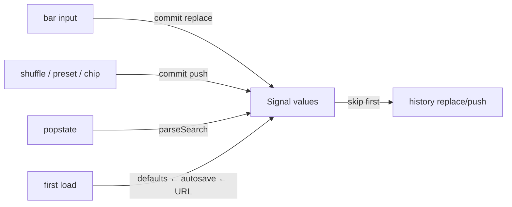

# kit

Shared notebook framework: a spec drives the bar, the URL, shuffle, pins, named states, draw-in, and the algo contract. Nothing in this directory knows about seals, eyes, or slices.

## TOC

1. Files
2. Spec and derived schema
3. URL namespaces
4. Bar: drawer panel, group columns, rows, shuffle, pins, reroll, presets, state combobox
5. Section and page
6. Depth contract (data-z / zDepth)
7. Animation: draw-in and clock
8. Algo contract
9. Harvest

## 1. Files

| file | owns |
|---|---|
| `0_spec.ts` | `Field`, `Spec<P>`, `ValuesOf<S>`, zod derivation, `parseValues`, `shuffle`, pins helpers, local `mulberry32` |
| `1_url.ts` | one `@hafley66/path` route per notebook, `queryRoute` / `parseSearch` / `printSearch` / `mergeSearch` |
| `2_algo.ts` | `Algo<P>`, `AlgoOut`, `algoCtx` |
| `3_store.ts` | localStorage autosave + named states |

The React side of the old kit lives outside this directory: `src/app/2_state.ts` (signals, url binding, autosave, shuffle), `src/ui/1_Bar.tsx` (the bar), `src/ui/2_Section.tsx` (section + anchors + scroll restore), `src/ui/0_hooks.ts` (`useClock`, `useDrawIn`, `useAnchor`, `stagger`), `src/ui/4_Algo.tsx` (`AlgoSection`), `src/app.css` (theme, depth rule, draw-in keyframes).

## 2. Spec and derived schema

```ts
const SPEC = {
  seed: { kind: "seed", default: 3 },
  shape: { kind: "select", options: ["human", "cat"], default: "human", pool: ["cat", "cat", "human"] },
  segs: { kind: "range", min: 8, max: 160, default: 96, roll: [24, 160], group: "lids" },
  auto: { kind: "bool", default: true, p: 0.8 },
  weight: { kind: "range", min: 0.5, max: 2.5, step: 0.1, default: 1, static: true },
  names: { kind: "text", default: "a b", shuffle: false },
} as const satisfies AnySpec
type V = ValuesOf<typeof SPEC>
```

| field key | meaning |
|---|---|
| `kind` | `range`, `number`, `seed`, `select`, `bool`, `text` |
| `static: true` or `shuffle: false` | shuffle never touches it; rendered in the last column; no pin, no reroll |
| `group` | drawer column label; first-appearance order |
| `roll: [lo, hi]` | shuffle window inside `min..max` (ranges, numbers) |
| `pool` | select shuffle draws uniformly from this list (repeat an option to weight it) |
| `p` | bool shuffle true-probability (default .5) |
| `hint` | first tooltip line; `describe(key, fd)` appends kind, window, default and the shuffle behaviour. The bar puts it on the row's `title`, so every input has a hover tooltip |

Derived, never written twice: `schemaOf(spec)` gives a zod object; `parseValues(spec, raw)` safeParses per key, so a junk value falls to the field default and unknown keys are ignored.

## 3. URL namespaces



- One route per notebook (`route("/", z.object(shape), z.object({}))`); every key is `<section>.<key>` so `?eye.seed=3&eye.shape=cat&seal.minPx=4` carries several sections.
- Pins travel as `<section>.pin=seed,shape`.
- Only non-default values print. Foreign query keys survive writes.
- `commit("push", fn)` in `app/2_state.ts` marks the writes inside `fn` as pushState; everything else is replaceState.

## 4. Bar

| element | class | behaviour |
|---|---|---|
| inputs | `[data-key]`, id `kit-<section>-<key>` | `input` event writes the values Signal |
| pin | `.kit-pin[data-pin]` | toggles membership in the section pin set; pinned fields skip shuffle |
| shuffle | `.kit-shuffle` | one seeded rng rolls every non-static, non-pinned field; one push |
| preset | `.kit-preset` | `presets: Record<name, Partial<Values>>`; merges and pushes; shows the matching name |
| extra | `.kit-extra` | notebook-owned slot (stats, scrub, custom buttons); persists across renders |
| state combobox | `.kit-combo` | input shows the selected state (● synced); typing an existing name or clicking a row loads and selects it (push); Enter on a new name saves and selects; rows carry star and delete. `state.selected`, store `.selected` |
| reroll | `.kit-roll` | one field, `state.roll(key)`, push |

Inputs with `data-live="1"` are skipped by sync (an animation loop owns them).

## 5. Section and page

```tsx
<Section page="eye" def={{ id: "eye", title: "eye", spec: SPEC, presets, zDepth: false }} extra={<Stats />}>
  {(values, ctx) => <Body v={values} state={ctx.state} z={ctx.z} />}
</Section>
```

- The body re-renders on every value change; memo the heavy geometry on the keys that change it.
- Scroll: the section's viewport fraction is restored after each render.
- Autosave: every value/pin change writes `gothic.<page>.<section>.current`; start order is defaults, then autosave, then URL keys present.
- Header: file tabs (row 1) never move, zDepth and draw-in sit in their own column, section anchors are row 2, the page title is row 3. `--kit-top` tracks the header height so section bars stick under it.

## 6. Depth contract

- Any element with `data-z="0..1"` (0 near, 1 far) is styled by `app.css`: `stroke-opacity = 1 - 0.8·z·zDepth`, `stroke-width = --w · (1 - 0.6·z·zDepth)`.
- `zDepth` is the global range in the header (`?page.z=`); 0 = flat. `applyDepth(root)` copies `data-z` into `--z` after each render.
- Sections with `zDepth: true` re-render when zDepth changes and can read `ctx.zDepth`.

## 7. Animation

- Draw-in: give every path `pathLength="1"`, put class `kit-draw` on an ancestor, call `stagger(root)` (or `useDrawIn`) to number paths with `--i`. Tune with `--kit-ms` and `--kit-stagger`; the header's draw-in toggle sets `--kit-ms` to 0. Reduced motion disables it.
- `useClock(frame, { tempo, running })`: rAF loop bound to the component's lifetime; `elapsed()` advances only while running, scaled by tempo; `run`, `seek`, `reset`, `stop`; `bindScrub(input, period)` mirrors elapsed into a 0..100 slider and seeks on input.

## 8. Algo contract

```ts
type Algo<P> = {
  name: string
  spec: Spec<P>
  presets: Record<string, Partial<P>>
  run(params: P, ctx: { size: number; seed: number; minPx: number }): { paths: { d: string; z?: number; cls?: string }[]; caption: string; lod: string[] }
}
<AlgoCells algo={algo} sizes={sizes} params={v} />   // one cell per size: svg + "<size> · caption · lod"
<AlgoSection page algo sizes title? />               // section keyed by algo.name, zDepth on
```

`ctx.seed` and `ctx.minPx` come from `params.seed` / `params.minPx` when the spec has them.

## 9. Harvest

Copy these files into another project:

```
kit/0_spec.ts  kit/1_url.ts  kit/2_algo.ts  kit/3_store.ts  kit/index.ts
app/2_state.ts  ui/0_hooks.ts  ui/1_Bar.tsx  ui/2_Section.tsx  ui/4_Algo.tsx  app.css
```

`kit/` needs two imports: `@hafley66/path` (`route`) and `zod`. The React layer adds `@hafley66/signals` (`Signal`, `SignalReact`), `rxjs` (`skip`), `react`, `react-dom` and Tailwind v4.
