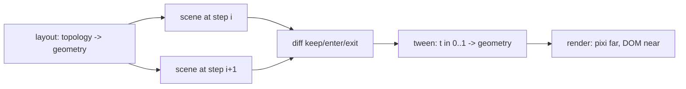

# Keyed scene renderer plan

Status: design, 2026-08-20. No code moves in this document. Source session: anim breakdown +
grapht labbing (boop favorite 7).

1. [Goal](#goal)
2. [The three planes](#the-three-planes)
3. [Type signatures](#type-signatures)
4. [Primitives mapped to existing code](#primitives-mapped-to-existing-code)
5. [Library split across anim, grapht, marbler, dock-and-flow](#library-split-across-anim-grapht-marbler-dock-and-flow)
6. [Interchange formats survey](#interchange-formats-survey)
7. [Algorithm libraries survey](#algorithm-libraries-survey)
8. [Renderer decision: Pixi plus DOM](#renderer-decision-pixi-plus-dom)
9. [sprefa v6 in the browser](#sprefa-v6-in-the-browser)
10. [Build order](#build-order)

## Goal

Rich primitives (flashcards, slideshows, code morphs slide to slide, graph tours) and
efficient graph animation (layout, interpolation, 10k+ items) over one discipline: every item
has a stable id, every plane is a pure function, any implementation is swappable per call.
`@hafley66/signals` sits above all planes as the state spine.

## The three planes



## Type signatures

```ts
type Id = string
type Item = { id: Id; kind: string; parent?: Id; attrs: Record<string, unknown> }
type Scene = { items: Map<Id, Item>; edges: Map<Id, [Id, Id]> }          // topology at one step

type Geometry = { ids: Id[]; pos: Float32Array; size?: Float32Array; routes?: Map<Id, Float32Array> }
type Layout = (scene: Scene, prev?: Geometry, opts?: object) => Promise<Geometry> | Geometry
// elk, dagre, tier-grid, force (ngraph / graphology), preset-from-svg, grid-wasm

type Diff = { keep: Id[]; enter: Id[]; exit: Id[] }                      // anim core/transition.ts:9
type Tween = (from: Geometry, to: Geometry, diff: Diff, t: number) => Geometry
// linear, eased, force-fade entry, attach-to-anchor entry, FLIP

type Renderer = {
  mount(el: HTMLElement): void
  apply(g: Geometry, scene: Scene, diff: Diff): void                      // same id = same display object
  dispose(): void
}
// pixi retained, DOM, svg, cytoscape; PixiProjection in adapters/6_render_pixijs is closest
```

A deck, a flashcard set, a tour, and a graph animation are all `Scene[]` plus a `Tween`.
Only `kind` and `attrs` differ. Algorithms never appear in the interface; `Layout`
implementations pull graphology, ngraph, elk, or sprefa rows internally, and topology queries
(cone, SCC, reach) run before `Scene` construction.

Signals layer: `step = Signal(0)`, `scene = Signal(() => scenes[step.$()])`,
`geometry = Signal(layout$)`, `t` from a rAF stream.

## Primitives mapped to existing code

| primitive | scene items | key | exists | missing |
|---|---|---|---|---|
| slideshow / tour | entities in a `View` per step | node id | `anim/src/core/tour.ts`, `tourView`, `transition.ts` | nothing structural |
| code morph | tokens | token hash + occurrence | `shiki-magic-move` dep in anim, `core/spotlight.ts` | a `Layout` emitting token rects |
| flashcards | card with `attrs.face` | card id | `card`/`card_about` rels in `anim/DESIGN.md` | rows -> `Scene`, flip `Tween` |
| graph anim | nodes, edges | dotted id | d2 -> Model, `diff`, pixi adapter | `Tween` lib, `toGeometry`, svg harvester |
| file tree | paths | path | `core/tree.ts`, `transitionRefs` | nothing |
| time axis | events | event id | marbler `0a_TimeViewport.ts`, Pixi waterfall | `Layout` mapping time -> x |

## Library split across anim, grapht, marbler, dock-and-flow

Two seams exist already: topology `Model` (`anim/src/core/model.ts:26-70`) and geometry
`Geometry` (`grapht/src/1_geometryProtocol.ts:20`).

| lib (working name) | pull from | lines | deps | fused today by |
|---|---|---|---|---|
| `graph-model` | `anim/src/core/{model,views,tarjan,tour,codec,annotations,rows,groups,tree,panels,spotlight}.ts` | ~1000 | none | already pure; `metrics.ts` pulls graphology, split it |
| `graph-diff` | `anim/src/core/transition.ts` | 88 | none | nothing |
| `graph-source-d2` | `anim/src/core/d2.ts`, `worker-shim.ts` | 139 | `@terrastruct/d2` | nothing |
| `graph-layout-tier` | `anim/src/core/layout.ts` + `tarjan.topoTiers` | 142 | none | AtlasPanel turns cells into cytoscape preset inline |
| `graph-layout-grid` | `adapters/0_layout_grid_worker`, `1_layout_grid_wasm` | small | worker / wasm | bench wrappers |
| `graph-layout-headless-cy` | `anim/src/CssGraph.ts` layout half | ~100 | cytoscape, dagre, elk | welded into the CSS renderer |
| `graph-camera` | pixijs `fitCamera/zoomCamera/panCamera/worldToScreen`, canvaskit `Camera/zoomAt/screenToWorld/pickNearest`, cytoscape `Camera` | ~120, written 3 times | none | duplicated per adapter |
| `graph-backend` | `anim/src/CssGraph.ts:20-60` `GraphBackend`, `CyEle`, `CyColl` | ~60 types | none | declared inside the CSS renderer |
| `graph-render-cytoscape` | `AtlasPanel.tsx` cy half + `adapters/2_render_cytoscape/1_projection.ts` | 749 + 60 | cytoscape | AtlasPanel owns React state, tours, cone, theme, cy |
| `graph-render-css` | `CssGraph.ts` render half | ~350 | none | fused with its headless layout |
| `graph-render-pixi` | `adapters/6_render_pixijs` (published 0.1.1) + marbler Pixi components | | pixi.js | marbler's are React components |
| `time-viewport` | `marbler/src/0a_TimeViewport.ts` | ~80 | none | inside marbler |
| `placement-journal` | `react-dock-and-flow/src/2_rectangleJournal.ts` | 70 | signals | closed `RectangleContent` union |

Missing glue: `toGeometry(model, positions): Geometry` and `harvestD2Svg(svg): Geometry`
(d2 0.7.1 `<g class>` carries base64 dotted ids; no layout export exists).

Delete: `anim/atlas/core` is a byte-identical copy of `anim/src/core` (28/28 files).

## Interchange formats survey

| format | shape | positions | nesting | ports | readers |
|---|---|---|---|---|---|
| graphology serialized | `{attributes, nodes:[{key, attributes}], edges:[{key, source, target, attributes}]}` | `attributes.x/y` | no | no | graphology, sigma, graphology-layout-*, -metrics |
| Cytoscape elements | `[{data:{id, parent}, position}, {data:{id, source, target}}]` | `position` | `data.parent` | no | cytoscape, cytoscape-elk/-dagre |
| D3 node-link | `{nodes:[{id}], links:[{source, target}]}` | mutated in place | no | no | d3-force, networkx |
| ELK JSON | `{id, children:[{id, width, height, x, y, ports, children}], edges:[{id, sources, targets, sections}]}` | output x/y + `sections` | full tree | yes | elkjs, cytoscape-elk, Sprotty |
| dagre graphlib | `{options, nodes:[{v, value}], edges:[{v, w, value}]}` | `value.x/y`, `points` | `setParent` | no | dagre, graphlib |
| XYFlow | `nodes:[{id, position, data, parentId}]`, `edges:[{id, source, target, sourceHandle}]` | required | `parentId` | handles | React Flow, Svelte Flow only (xyflow org) |
| JSON Graph Format | `{graph:{nodes:{id:{label, metadata}}, edges:[...]}}` | metadata | no | no | spec, little live use |
| GraphML / GEXF | XML; yEd writes GraphML with `y:` extensions | GEXF viz, `y:Geometry` | GraphML nested | GraphML | Gephi, networkx, yEd, graphology importers |
| DOT | text; `pos`, `bb`, splines after `dot -Tjson` | yes | `subgraph cluster_*` | `a:port:compass` | graphviz, `@hpcc-js/wasm`, d3-graphviz |
| JSON Canvas (Obsidian) | `{nodes:[{id, type, x, y, width, height}], edges:[{fromNode, toNode, fromSide, toSide}]}` | required | group nodes by geometry | sides | Obsidian |
| CSR / typed arrays | `offsets, targets: Uint32Array; positions: Float32Array` | separate | no | no | cosmos.gl, forceatlas2 worker, grapht `Geometry` |
| d2 compiled | `{shapes:[{id, label, pos, width, height}], connections:[{src, dst, route}]}` | after layout | dotted-id containers | no | d2 |

Decisions: ELK JSON is the layout-result type (hierarchy + ports + routing + geometry
together; ELK and yEd share the KIELER/yFiles lineage and algorithm set). graphology is the
topology/algorithm object beside `Model` (serializer, GraphML/GEXF door, sigma's required
input). `Model` stays above both for tours and refs. Adapters for graphology, cytoscape
elements, ELK JSON, and XYFlow cover every renderer in the tree.

cytoscape vs graphology in one line: cytoscape is model + canvas renderer + layout runner +
events + selector language with compounds; graphology is a ~50 KB data structure with
opt-in algorithms, no rendering, no compounds.

## Algorithm libraries survey

From memory at time of writing; versions unverified.

| lib | language | strength | weakness |
|---|---|---|---|
| graphology | JS | breadth, serialization, sigma pairing | middling per-algorithm speed |
| ngraph (`ngraph.graph`, `.path`, `.forcelayout`, `.louvain`) | JS, anvaka | fastest JS pathfinding and force layout at 100k+ (NBA* ~10 ms vs ~170 ms graphology Dijkstra on anvaka's NY road benchmark, from memory) | smaller pack |
| `@antv/graphlib` + `@antv/layout-wasm` / `-gpu` | JS, Rust wasm, WebGPU | force layouts in wasm/GPU | AntV-shaped API |
| cosmos.gl | WebGL2 | ~1M-node force layout on GPU with render | one algorithm family |
| elkjs | Java via GWT | layered/orthogonal/ports | slow at thousands, big bundle |
| graphviz `@hpcc-js/wasm` | C wasm | dot/sfdp, `-Tjson` | layout only |
| petgraph via wasm-bindgen | Rust | full crate; sprefa v6 pins `petgraph::Csr` | bindings are yours to write |
| DuckDB-wasm + DuckPGQ, SQLite recursive CTE | SQL | queries over `rel_*` rows, no import | no layout |

Own code: `tarjan.ts` + `views.ts` (170 lines) already cover SCC, tiers, cone, reach. sprefa
dl rules replace them once the browser SQLite path lands.

## Renderer decision: Pixi plus DOM

Pixi cannot host HTML inside WebGL. `DOMContainer` (v8, verified 8.19.0) parents a DOM
element into the scene graph and syncs its transform each frame, so one `Geometry` and one
camera drive both sprites and HTML.

| item class | count | renderer |
|---|---|---|
| graph nodes, marbles, particles | 10k to 1M | Pixi sprites / ParticleContainer |
| code panels, flashcards, rectangles, labels near focus | tens | DOM via `DOMContainer`, positioned from the same `Geometry` |

Level of detail is a `kind` swap per id driven by `hopDistances` (`anim/src/core/views.ts:30`):
sprite exits, card enters at the sprite's last position, same `diff`, no flicker.

Pixi facts, measurements, and the official guidance are in
`adapters/6_render_pixijs/LEARNINGS.md`; the lab is `adapters/6_render_pixijs/labs/dom-cube.html`.

## sprefa v6 in the browser

| piece | state | browser cost |
|---|---|---|
| TS engine `sprefa/v6/sprefa-store/js/src/engine` (4032 lines) on rxjs | golden-gated 11/11 | runs as-is |
| SQL dialect used | `WITH RECURSIVE` x5, `CREATE TEMP` x12, `ON CONFLICT` x9, `RETURNING` x2, `json_each` x1 | every wasm SQLite build |
| driver seam | `engine/types.ts:31` `Db` = `@libsql/client` `Client`; `SqlRunner.execute` at `engine.ts:128` | one adapter `{ execute(stmt) -> {rows} }` with bigint parity, outside the frozen files |
| candidates | `@sqlite.org/sqlite-wasm` (OPFS, worker), `wa-sqlite`, `sql.js`, `sqlocal` | |

Loop: dl program -> wasm SQLite cascade -> `rel_node`/`rel_edge`/`tour_step` ->
`modelFromRows` (`anim/src/core/rows.ts`) -> `Scene` -> renderer.

## Build order

1. `Scene`, `Geometry`, `Diff`, `Tween`, `Renderer` types plus `diff` from `transition.ts`. ~150 lines, zero deps.
2. `Layout` adapters: tier-grid, elk, preset-from-svg.
3. `Renderer` for Pixi from `adapters/6_render_pixijs`, keep/enter/exit aware, sprite pool instead of `destroy()`.
4. `Tween`: linear + eased, then force-fade entry.
5. Producers: d2 -> Scene, rows -> Scene, code tokens -> Scene.
6. `graph-camera` fold of the three adapter copies.
7. Move `anim/src/core` into this repo; delete `anim/atlas/core`; split `AtlasPanel.tsx` and put its step/view on signals.
