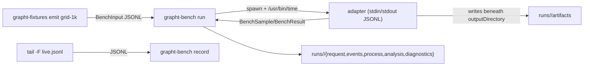

# grapht benchmark protocol

Implementation-agnostic graph benchmark harness. The protocol is JSON Lines over stdin/stdout;
processes and artifacts are the measured surface. JS, workers, Wasm, Rust, and renderers are
replaceable adapters. This is the protocol lane (merge order 0); layout, projection, and
CanvasKit lanes land on top.



## Protocol

`BenchInput` (one JSON object on stdin), then JSON Lines output of `BenchSample`, exactly one
terminal `BenchResult` or `BenchError`, then exit. Geometry crosses binary-oriented adapters as
files referenced by a `grapht-geometry/0` `GeometryManifest`. Types are zod-schema'd in
`src/0_benchProtocol.ts` and `src/1_geometryProtocol.ts`.

## Storage

```
runs/<run-id>/request.json      normalized BenchInput
runs/<run-id>/events.jsonl      adapter stdout (raw JSONL)
runs/<run-id>/process.json      external wall/CPU/RSS, stdout/stderr/artifact bytes, exit
runs/<run-id>/analysis.json     terminal kind, issues, artifact-hash validation
runs/<run-id>/diagnostics.txt   adapter stderr
runs/<run-id>/artifacts/        adapter-written artifacts
```

`runId` is unique per invocation. The collector rejects records whose `runId` differs from the
request. Timing observations do not participate in correctness hashes; artifact hashes are file
bytes, implementation-agnostic.

## Usage

```bash
pnpm --filter @hafley66/grapht build
./bin/grapht-fixtures list
./bin/grapht-fixtures emit grid-1k | ./bin/grapht-bench run --adapter ./bin/grapht-adapter-identity --output runs
tail -F live.jsonl | ./bin/grapht-bench record --output runs/tailed
```

## Just

The `justfile` is the named interface over shell commands and composes executables only.

```bash
just fixtures
just bench grid-1k identity       # adapter run against a fixture
just record path/to/events.jsonl
just tail  path/to/live.jsonl
```

Renderer and layout lanes (Cytoscape, CanvasKit, worker/Wasm layout adapters) add their recipes
with their implementers.

## Exit codes (`grapht-bench run`)

| code | meaning |
|---|---|
| 0 | valid terminal `BenchResult`, matched runId, adapter exit 0 |
| 1 | invalid `BenchInput` on stdin, or harness error |
| 2 | adapter process failed (non-zero exit or signal) |
| 3 | no terminal, `BenchError`, runId mismatch, or malformed records |
