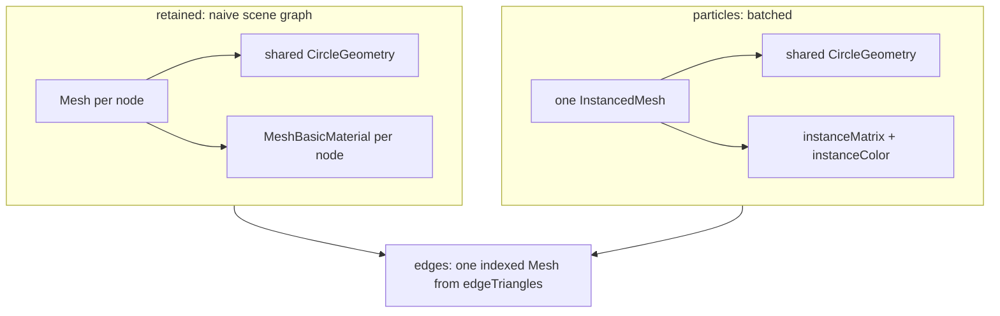

# Three.js projection adapter learnings

## TOC

1. [Representation mapping](#representation-mapping)
1a. [Scene pipeline load receipt](#scene-pipeline-load-receipt)
2. [Scenario support delta versus PixiJS](#scenario-support-delta-versus-pixijs)
3. [WebGPU under SwiftShader](#webgpu-under-swiftshader)
4. [Places Three's API forced a different shape](#places-threes-api-forced-a-different-shape)
5. [Measured receipts](#measured-receipts)
6. [Sources](#sources)

## Representation mapping

The `Representation` axis is about node storage. Both values draw identical edges.



| Pixi | Three | why |
| --- | --- | --- |
| `Graphics` per node | `Mesh` per node with its own `MeshBasicMaterial` | matches the per-node scene-graph object and per-node style ownership that makes the retained path the slow case |
| `ParticleContainer` + `Particle` | one `InstancedMesh` | one draw call, per-instance matrix and color, no per-node scene-graph object |

`InstancedMesh` was chosen over `Points` for the batched case. `Points` sizes come from
`PointsMaterial.size` in screen pixels with optional attenuation, so a `Points` field would
stop matching `NODE_RADIUS` as soon as the camera zoomed. `InstancedMesh` keeps the node a
world-space circle of radius 4, which is what the Pixi particle path draws, so the two lanes
stay pixel-comparable across the camera scenarios.

Edges use `edgeTriangles` in both representations. Three's `LineBasicMaterial.linewidth` is
ignored by the WebGL backend, which always draws one device pixel, so honoring
`EDGE_THICKNESS = 1.5` requires triangle geometry regardless of representation. Keeping edges
identical also isolates the representation axis to node storage alone.

## Scene pipeline load receipt

`labs/scene-cube.html?n=<points>` + `e2e/5_scene_cube.spec.ts`. One constant `Scene`; every
animation frame emits it again, `keyframes(layout)` projects the rotated cube into a reused
`Float32Array`, `frames(tween(), of(1))` passes it through, `three()` walks `pos` into pooled
meshes. 8 corner cards are `CSS2DObject`. The numbers are the cost of the abstraction per frame
with a retained `Mesh` per node; no culling, no `InstancedMesh`.

Three sinks over the same cube: scene pipeline -> `three()`, scene pipeline -> `dom()`
(`@hafley66/scene`, plain elements + SVG lines), and native Three.js with direct mesh writes and
no Scene/keyframes/frames. `e2e/6_scene_compare.spec.ts`, receipt
`receipts/generated/scene-cube.compare.json`.

| points | native three fps | scene -> three() fps | scene -> dom() fps |
|---|---|---|---|
| 1 000 | 42.0 | 40.0 | 19.0 |
| 5 000 | 11.0 | 11.3 | 4.3 |
| 20 000 | 4.3 | 4.3 | 1.0 |
| 100 000 | 2.0 | 2.0 | |

3 s windows after 0.5 s warm-up, 800x600, `setPixelRatio(1)`, headless Chromium with
`--use-angle=swiftshader` (CPU raster, so floors). 120 is the `maxFPS` cap, never reached.

`three()` tracks its native baseline within measurement noise at every load, so the pipeline
itself costs nothing measurable here. The load ceiling is the retained representation: one
`Mesh` per node is one draw call per node, which is the same slow path
[Representation mapping](#representation-mapping) already records. The PixiJS lane reaches
120 fps at 1k and 13 fps at 100k on the same machine because its sprites batch; a fair
comparison of the two sinks is a comparison of batching, not of the scene pipeline.

| divergence from `7_pixi.ts` | why |
|---|---|
| cards are `CSS2DObject` with `center.set(0, 0)` | `CSS2DRenderer` centers an element on its position by default; a pixi `DOMContainer` sits at its top-left, so the center is moved to reproduce the placement |
| the label layer is a second `Scene` rendered by `CSS2DRenderer` | `CSS2DRenderer.render` walks the whole graph it is given, so pointing it at the mesh scene would re-traverse 100k meshes per frame for 8 cards |
| `maxFPS` is a repaint gate with a trailing `requestAnimationFrame` | Three has no ticker; a capped frame still has to reach the screen, so the throttle schedules the repaint instead of dropping it |
| `WebGLRenderer` is `null` when the document has no WebGL2 | keeps the sink drivable under jsdom, where `src/8_three.test.ts` asserts view mapping, pooling, and the camera pixel mapping without a GPU |

## Scenario support delta versus PixiJS

Three.js: 15 supported, 17 unsupported. PixiJS: 14 supported, 18 unsupported. One key moved.

| scenario | Pixi | Three | reason |
| --- | --- | --- | --- |
| `device-pixel-ratio-change` | unsupported | **supported** | `WebGLRenderer.setPixelRatio(value)` reconfigures the drawing buffer on demand, and `ThreeProjection` owns its own `devicePixelRatio` in `opts`. The scenario changes the renderer's pixel ratio rather than the browser's, so it measures the real raster cost of the change. Pixi marked the key unsupported on the reading that device pixel ratio is browser-owned. |

Every other key keeps Pixi's status. The unsupported reasons are rewritten for Three where the
cause is specific to this adapter: `ThreeProjection has no group compound-node model`,
`Three.js ships no graph layout engine and this adapter embeds none`, and
`ThreeProjection draws no text labels, so label policy has nothing to select`. The remaining
keys stay outside the initial scenario slice, which is a harness boundary shared by both lanes.

## WebGPU under SwiftShader

WebGPU is unavailable in the Playwright Chromium build on this machine, matching the PixiJS
lane. `navigator.gpu.requestAdapter()` returns `null` even with
`--enable-unsafe-swiftshader --enable-webgpu-developer-features --use-angle=swiftshader`.

```
"status": "webgpu-unavailable",
"reason": "WebGPU not available in this browser: requestAdapter returned null",
"webgpuProbe": { "available": false, "reason": "requestAdapter returned null", "deviceRequested": false }
```

`e2e/1_webgpu.spec.ts` stays in place and passes by taking the blocked branch: the probe data
is recorded, a WebGL projection renders into `#webgl-evidence`, and the screenshot captures it.
The requested backend is never reported as the actual one. `ThreeProjection.actualBackend`
reads `renderer.backend.isWebGPUBackend` off the live renderer, so a silent fallback surfaces
as `webgpu-unavailable` with `fallbackReason` carrying the thrown error text.

## Places Three's API forced a different shape

| area | Pixi | Three | consequence |
| --- | --- | --- | --- |
| camera | `root.scale` and `root.position` on the stage | `OrthographicCamera` with `zoom` and `position` | frustum is `(-w/2, w/2, -h/2, h/2)` with `top` below `bottom`, which flips y so world coordinates stay y-down and match the Pixi mapping exactly. The flip reverses triangle winding, so every material sets `side: DoubleSide`. |
| pixel readback | `renderer.extract.pixels(stage)` returns stage bounds | `ThreeProjection.readPixels()` draws the canvas into a 2D canvas and calls `getImageData` | Three's `readRenderTargetPixelsAsync` has different signatures on `WebGLRenderer` and the unified `Renderer`, and needs a render target. Canvas readback is one path for both backends. It reports the full 800x600 canvas, so `totalPixels` is 480000 against Pixi's stage-bounds count; the non-background ratio is the comparable number. |
| two module graphs | one `pixi.js` entry | `three` and `three/webgpu` each bundle a full copy of the core | `three/webgpu` re-exports `Three.Core` and adds `WebGPURenderer`, and it does not export the classic `WebGLRenderer`. Mixing top-level imports from both duplicates every core class. Scene classes are imported from `three` only, and `three/webgpu` is reached through a dynamic `import()` confined to the WebGPU branch of `createRenderer`. Three's internals dispatch on `.isMesh` style flags rather than `instanceof`, so a cross-bundle scene is workable; the WebGL fallback path avoids the question entirely in this environment. |
| renderer lifetime | `new Application()` in the constructor, `app.init()` async | renderer instance is unknown until the backend is chosen | `renderer` is a getter that throws before `init()` completes, rather than a `readonly` field assigned in the constructor. |
| async init | `app.init()` for both backends | `WebGLRenderer` is synchronous, `WebGPURenderer.init()` is async | `createRenderer()` awaits in both branches so `init()` keeps one signature. |
| node color | `Graphics.clear()` then refill, or `tint` | `material.color.setHex` per node, or `setColorAt` plus `instanceColor.needsUpdate` | the instanced path needs the base material at white so per-instance color multiplies to the intended value. |

## Measured receipts

`grid-1k`, 800x600 viewport, DPR 1, headless Chromium with `--use-angle=swiftshader`.

| representation | backend | total pixels | non-background | valid | supported | unsupported |
| --- | --- | --- | --- | --- | --- | --- |
| retained | webgl | 480000 | 189383 | true | 15 | 17 |
| particles | webgl | 480000 | 189383 | true | 15 | 17 |
| retained | webgpu | blocked | blocked | WebGL evidence | 0 | 0 |
| particles | webgpu | blocked | blocked | WebGL evidence | 0 | 0 |

Both representations produce the same non-background count, which is the intended result of
sharing `NODE_RADIUS`, `EDGE_THICKNESS`, `NODE_COLOR`, and `EDGE_COLOR` across the two paths.

`geometryHash` for `grid-1k` is `1f692931273c6489c28d961f5c4db40e26c7539494e34a99a4a49c5bad6b9522`
from both the Three.js and the PixiJS shell adapters. `tests/2_geometry_hash.test.ts` asserts
that equality by running both adapters over one fixture, and also compares the hash
construction line in the two sources for character equality.

## Sources

- https://threejs.org/docs/#api/en/cameras/OrthographicCamera
- https://threejs.org/docs/#api/en/objects/InstancedMesh
- https://threejs.org/docs/#api/en/materials/LineBasicMaterial (`linewidth` platform note)
- https://threejs.org/docs/#manual/en/introduction/How-to-use-WebGPURenderer
- https://github.com/mrdoob/three.js/blob/dev/build/three.webgpu.js
