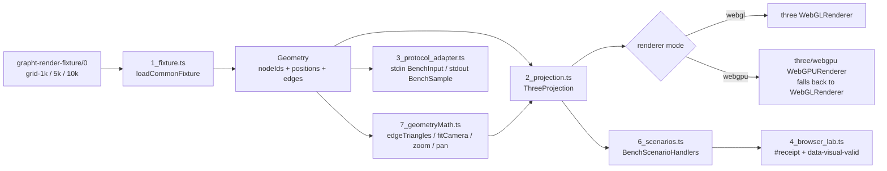

# @hafley66/grapht-render-threejs

## TOC

1. [What it is](#what-it-is)
2. [Shape](#shape)
3. [Scene labs](#scene-labs)
4. [Scene renderer](#scene-renderer)
5. [Commands](#commands)
6. [Query parameters](#query-parameters)
7. [Receipts](#receipts)
8. [Comparability with the PixiJS lane](#comparability-with-the-pixijs-lane)

## What it is

Reusable Three.js projection for `@hafley66/grapht` geometry. `ThreeProjection`
supports retained and instanced node representations, WebGL and WebGPU renderer
selection, camera fitting, pan, zoom, picking, replacement, resizing, and disposal.

The scene is flat. An `OrthographicCamera` holds every node at `z = 0` and the
frustum is expressed in viewport pixels, so the camera transform reproduces the
PixiJS stage transform exactly and both lanes report the same visible-node counts.
A perspective camera would make the frame-time comparison meaningless, so none is used.

## Shape



| file | role |
| --- | --- |
| `src/1_fixture.ts` | fixture-name to node count, common fixture fetch |
| `src/2_projection.ts` | `ThreeProjection`: renderer init, scene build, camera, render, picking |
| `src/3_protocol_adapter.ts` | `grapht-bench/0` shell adapter, writes `threejs-<fixture>.receipt.json` |
| `src/4_browser_lab.ts` | browser lab: WebGPU probe, visual predicate, scenario run |
| `src/6_scenarios.ts` | the canonical scenario handlers, conformance-bound |
| `src/7_geometryMath.ts` | pure edge triangles and camera fit/zoom/pan, unit-tested |
| `src/index.ts` | public re-exports |

## Scene labs

- `labs/scene-grid.html`: the `@hafley66/scene` pipeline (`keyframes` -> `frames` -> `three()`)
  over 400 ids across three scenes; meshes are pooled by id, `kind: "card"` items render as
  `CSS2DObject`. `e2e/4_scene_renderer.spec.ts` asserts mount, recycling by mesh identity,
  a kept id tweening between steps, and teardown on unsubscribe.

- `labs/scene-cube.html?n=<points>`: spinning cube as a constant `Scene` whose `Layout` is the
  rotation; `e2e/5_scene_cube.spec.ts` writes a frames-per-second receipt at 1k, 20k, 100k
  points to `receipts/generated/scene-cube.load.json`. `?renderer=three|dom|native` switches the
  sink; `e2e/6_scene_compare.spec.ts` writes the three-way receipt
  `receipts/generated/scene-cube.compare.json`.

## Scene renderer

```ts
import { three } from "@hafley66/scene/three"
scene$.pipe(keyframes(layout), frames(tween(), raf$), three({ width: 800, height: 600 })(host)).subscribe()
```

`three(options)` lives in `@hafley66/scene/three` (this adapter hosts its labs and e2e) and
returns a `Renderer`: subscribe mounts a `WebGLRenderer` plus a `CSS2DRenderer` overlay, `next`
applies the diff (exit -> pool, enter -> pooled `Mesh` or `CSS2DObject`, keep -> index walk over
`pos`) and repaints under the `maxFPS` cap, and unsubscribe disposes views, pool, geometry,
materials, and both renderers. The camera is the lane's flat `OrthographicCamera`
(`0, width, 0, height`), so a `Geometry.pos` pair lands on the screen pixel of the same name and
the PixiJS lane's picture is reproduced exactly.

## Commands

| Recipe | Action |
| --- | --- |
| `just test-threejs` | typecheck plus vitest unit tests |
| `just browser-threejs` | headless Playwright run, writes PNG and JSON receipts |
| `just receipt-threejs` | shell-protocol receipt through the `grapht-bench/0` adapter |
| `just headed-threejs` | headed Chromium, reachable only through this recipe |

The browser lane binds port 4181, so it runs beside the PixiJS lane on 4180.

## Query parameters

`index.html` reads four parameters off the lab URL.

| parameter | values | default |
| --- | --- | --- |
| `nodes` | any generated fixture size | `1000` |
| `renderer` | `webgl`, `webgpu` | `webgl` |
| `representation` | `retained`, `particles` | `retained` |
| `pause` | `1` holds after first render until a `grapht-continue` event | `0` |

## Receipts

`#three-container` carries `data-visual-valid`, `data-actual-backend`,
`data-receipt-status`, and `data-non-background-pixels`. `#receipt` carries the JSON
payload with `status` and `visualValidity.valid`. Committed receipts live under
`receipts/`; the shell adapter writes `receipts/generated/` (ignored by git).

## Comparability with the PixiJS lane

`NODE_RADIUS`, `EDGE_THICKNESS`, `NODE_COLOR`, and `EDGE_COLOR` carry the same values
as `adapters/6_render_pixijs`, so the two lanes draw the same picture from the same
fixture. `tests/2_geometry_hash.test.ts` runs both shell adapters over one fixture and
asserts a single `geometryHash`, which is the check that both loaded the same graph.
Measured differences are recorded in [`LEARNINGS.md`](./LEARNINGS.md).
