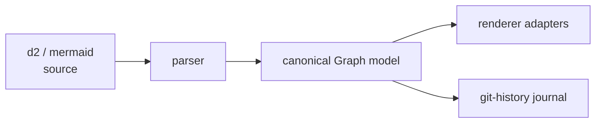

# Overview

- [What grapht is](#what-grapht-is)
- [The pipeline](#the-pipeline)
- [Ingest](#ingest)
- [Canonical model](#canonical-model)
- [Renderers](#renderers)
- [History journal](#history-journal)

## What grapht is

`@hafley66/grapht` is a graph diagram toolkit. It ingests d2 and mermaid sources into one canonical,
flat `Graph` model, renders that model through swappable renderer adapters, and journals git history
for the graph over time.

| lane | package | what it owns |
| --- | --- | --- |
| ingest | `@hafley66/d2`, `@hafley66/mmd` | parse d2 and mermaid into the canonical model |
| model | `@hafley66/grapht-model` | `Graph`, validation, indexes, sticky placement |
| frame | `@hafley66/grapht` | geometry, camera, presentation, renderer contract |
| history | `@hafley66/grapht` | offline journal, `grapht-history` CLI |
| render | `adapters/*` | project the model into Cytoscape, Pixi, Three, Sigma |

## The pipeline

The durable model stays framework-free. Adapters project the same normalized entities into each
renderer, so a receipt measured on one renderer is comparable against the others.

## Ingest

Parsers live in the `@hafley66/d2` and `@hafley66/mmd` packages. Each turns one source language
into a sequence local document and an SVG binding, then the model normalizes that into a `Graph`.

## Canonical model

`Graph` is a flat record of `GraphNode` and `GraphEdge` keyed by `GraphId`. The [model](./model)
page shows one real literal and what `validateGraph` rejects.

## Renderers

The renderer contract is `GraphFrameResource`, one `render(frame, receipt)` call plus an
`unsubscribe`. The [renderers](./renderers) page lists the adapters and the gestures the document
renderer answers.

## History journal

`grapht-history` walks git and writes a self-contained JSONL journal, one revision per line with a
content hash. The [history](./history) page covers the format and verification.
