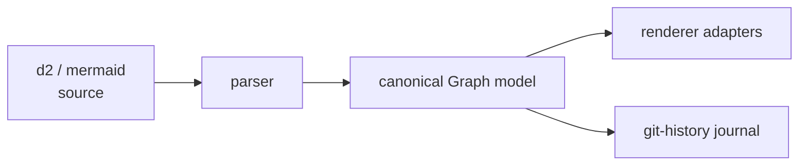

# Overview

- [What grapht is](#what-grapht-is)
- [The pipeline](#the-pipeline)
- [Adapters](#adapters)
- [Sealed artifacts and history](#sealed-artifacts-and-history)
- [Status](#status)

## What grapht is

`@hafley66/grapht` is a graph diagram toolkit. It ingests d2 and mermaid sources into one canonical,
flat `Graph` model, then renders that model through swappable renderer adapters. A separate offline
journal records git history for the graph over time.

## The pipeline

The durable model stays framework-free. Adapters project the same normalized entities into SVG,
Cytoscape, and Pixi, so a receipt measured on one renderer is comparable against the others.

## Adapters

| Lane | Adapter | Output |
| --- | --- | --- |
| render | `2_render_cytoscape` | Cytoscape |
| render | `6_render_pixijs` | PixiJS v8 (WebGL + WebGPU) |
| render | `7_render_threejs` | Three.js (WebGL + WebGPU) |

Every adapter is an interchangeable `grapht-bench/0` implementation over the same fixture graph.

## Sealed artifacts and history

Pre-rendered diagrams ship as sealed SVG artifacts: the geometry is extracted once, retained as an
immutable revision, and replayed without a live layout engine. The `grapht-history` CLI journals
source revisions and human placement edits so the graph can be reconstructed at any point in time.

## Status

Early. The state model and the first renderer adapters exist; the parser surface, the geometry
revision rules, and the API move as the lab settles them. Nothing on this site is a stability
promise.
