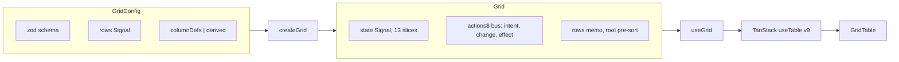

# @hafley66/grid

A headless signal seam over TanStack Table v9. Owns every state slice as one
RxJS signal; renders nothing until you mount `GridTable`.

> **Authorship attestation:** This README was written by Claude (AI). No human
> has verified it against the source. Treat the examples as unverified until you
> run them, and check signatures against `src/` before depending on them.

📚 **[Full API Documentation](https://hafley66.github.io/hafley-rxjs/)**

## Contents

- [How it fits together](#how-it-fits-together)
- [Install](#install)
- [Quick start](#quick-start)
- [createGrid](#creategrid)
- [State model](#state-model)
- [GridTable](#gridtable)
- [TreeTable](#treetable)
- [GridTree](#gridtree)
- [Client vs server](#client-vs-server)
- [URL binding](#url-binding)
- [Build / test](#build--test)

## How it fits together



`createGrid` turns a config into a `Grid`: one `state` signal holding every
TanStack slice, one `actions$` bus every write and DOM intent passes through,
and a `rows` memo that pre-sorts roots off the `sorting` slice (TanStack's
sorted row model then sorts every level). `useGrid` feeds all of that into
TanStack `useTable` and subscribes the grid's epics for the component's
lifetime; `GridTable` is the reference render layer over the table instance.

## Install

```sh
npm install @hafley66/grid @hafley66/signals @tanstack/react-table rxjs zod
```

React bindings and the render component live on the `/react` subpath:

```ts
import { useGrid, GridTable } from "@hafley66/grid/react"
import { createGrid } from "@hafley66/grid"
```

## Quick start

A filesystem tree. The `__expand` column renders the depth toggle; the `name`
column indents by row depth; custom `cell` renderers carry the iconography.

```tsx
import { Signal } from "@hafley66/signals"
import { z } from "zod"
import { createGrid } from "@hafley66/grid"
import { GridTable } from "@hafley66/grid/react"

type Node = { id: string; name: string; kind: "folder" | "file"; size: number; children?: Node[] }

const tree: Node[] = [
  { id: "src", name: "src", kind: "folder", size: 0, children: [
    { id: "idx", name: "index.ts", kind: "file", size: 412 },
  ]},
  { id: "pkg", name: "package.json", kind: "file", size: 720 },
]

const grid = createGrid<Node>({
  schema: z.object({
    id: z.string(), name: z.string(),
    kind: z.enum(["folder", "file"]), size: z.number(),
  }),
  rows: Signal<Node[]>(tree),
  getRowId: (n) => n.id,
  getSubRows: (n) => n.children,
  columnDefs: [
    { id: "__expand", header: "" },
    { id: "name", accessorKey: "name", header: "Name" },
    { id: "size", accessorKey: "size", header: "Size" },
  ],
  mode: "client",
})

export function Explorer() {
  return <GridTable grid={grid} density="cozy" />
}
```

## createGrid

```ts
function createGrid<TData>(config: GridConfig<TData>): Grid<TData>
```

| `GridConfig` field | type | notes |
| --- | --- | --- |
| `schema` | `z.ZodType<TData>` | row shape; top-level keys derive columns when no `columns`/`columnDefs` |
| `rows` | `Signal<TData[]>` | source rows signal |
| `columns` | `Partial<Record<ObjectPathsOf<TData>, ColumnSpec>>` | declare columns by schema path |
| `columnDefs` | `ColumnDef[]` | full TanStack defs; overrides `columns` and derivation |
| `getRowId` | `(row) => string` | stable row identity |
| `getSubRows` | `(row, index) => TData[] \| undefined` | tree children |
| `mode` | `"client" \| "server"` | client sorts/paginates locally; server is manual |
| `state` | `Signal<GridState>` | inject to share state across grids |
| `epics` | `GridEpic<TData>[]` | grid-level epics, run while `epics$` is subscribed |

A `Grid` exposes `state`, `actions$`, `dispatch`, `epics$`, `epicCtx`, `rows`,
`columns`, `schema`, `mode`, `getRowId`, `getSubRows`, and twelve `on*Change`
handlers. Each handler dispatches one `{ phase: "change", type, ...slice }`
action; the reducer writes that slice in one atomic emit.

## Actions and epics

The grid is a `createSlice` from `@hafley66/signals`: a reducer over
`GridState`, one action bus, and epics that turn actions into more actions.

| phase | who emits | carries | who consumes |
| --- | --- | --- | --- |
| `intent` | `TreeTable` DOM handlers | `cell.click`, `cell.dblclick`, `header.click` (with `mods`), `row.hover` | epics |
| `change` | `on*Change`, epics | one `GridState` slice | reducer |
| `effect` | epics | `select`, `pivot`, `custom` | the consumer |

```
step 0  user alt-clicks the status cell of row r7
step 1  dispatch intent  {cell.click, column:"status", rowId:"r7", mods.alt:true}
step 2  selectOnPlainClick epic: alt set, emits nothing
step 3  status column epic (pivotOnAltClick): emits effect {pivot, column:"status", value:"fail"}
step 4  dispatch effect; reducer ignores; useGridEffect(grid, "pivot", handler) runs the consumer
```

Lifetime is rxjs. `dispatch` reduces synchronously with nobody subscribed;
epics run only while `grid.epics$` (grid-level) or the `TreeTable`'s column
epic subscription is live. `useGrid` subscribes `epics$` in a `useEffect`;
two mounts share one run through `share()`.

```ts
type GridEpicCtx<TData> = {
  grid$: Observable<GridAction<TData>>
  phase$: { intent: Observable<GridIntent>; change: Observable<GridChange>; effect: Observable<GridEffect> }
  column$: (id: string) => Observable<GridAction & { column: string }>
  state: Signal<GridState>
  rows: Signal<TData[]>
  dispatch: (action: GridAction<TData>) => void
}
```

A `TreeColumn` can own its receiver:

```tsx
{
  id: "status",
  header: "status",
  cell: (row) => <StatusDot status={row.status} />,
  sortValue: (row) => STATUS_RANK[row.status],
  epic: pivotOnAltClick((row) => row.status),        // or ({ column$, phase$, state, dispatch, id }) => Observable<GridAction>
}

useGridEffect(grid, "pivot", (effect) => pushPivot(model, effect.column, effect.value))
```

Built-in epics: `selectOnPlainClick(columns)` (plain click outside a
`noRowClick` column becomes `effect select`; `onRowClick` is sugar over it)
and `pivotOnAltClick(value)`.

## State model

Twelve TanStack v9 slices, one signal. `defaultGridState()` returns the seed.

| slice | type |
| --- | --- |
| `sorting` | `SortingState` |
| `columnFilters` | `ColumnFiltersState` |
| `globalFilter` | `unknown` |
| `columnOrder` | `ColumnOrderState` |
| `columnPinning` | `ColumnPinningState` |
| `columnVisibility` | `ColumnVisibilityState` |
| `columnSizing` | `ColumnSizingState` |
| `rowPinning` | `RowPinningState` |
| `rowSelection` | `RowSelectionState` |
| `expanded` | `ExpandedState` |
| `grouping` | `GroupingState` |
| `pagination` | `PaginationState` |

Every v9 feature module is registered (`rowSorting`, `rowPagination`,
`rowAggregation`, `rowExpanding`, `rowSelection`, `rowPinning`,
`columnGrouping`, `columnFiltering`, `columnFaceting`, `columnOrdering`,
`columnPinning`, `columnSizing`, `columnVisibility`, `globalFiltering`) alongside
the `filtered`, `grouped`, `expanded`, `faceted`, and `paginated` row models.

## GridTable

```tsx
function GridTable<TData>({ grid, density?, maxHeight?, scrollMode?, scrollElement? }: ...)
```

| prop | default | effect |
| --- | --- | --- |
| `grid` |, | a `Grid` from `createGrid` |
| `density` | `"standard"` | `"compact"` 30px · `"standard"` 42px · `"cozy"` 52px rows |
| `maxHeight` | `600` | height for legacy `scrollMode="internal"` |
| `scrollMode` | `"external"` | uses document or nearest overflow-y ancestor; `"internal"` retains the card scrollbar |
| `scrollElement` | automatic | explicit external scroll owner override |

When the current page's estimated rows exceed the owner viewport, external mode
keeps the full estimated table height in parent/document flow and renders a
sticky live window capped at `100dvh`. The window is a CSS grid of a clipped
table area (`overflow: hidden`, sub-row translate for smooth scrolling), a
phantom horizontal-scrollbar strip, and the footer; it does not take over
ancestor scrolling. Client pagination runs before this layer, so virtual
indexes always address the current page. `rawRows` opts into a fast path that
skips `getRowModel()` and indexes `grid.rows.$()` directly for multi-million-row
datasets (no tree/sub-rows/selection in that path).

### External-scroll platform receipt

Chromium receipts cover document scroll with preceding content, a nested
`overflow:auto` parent inside CSS grid + flex-column layout, viewport resize,
and positions before, inside, and past the grid. `position: sticky` binds to
the nearest scrolling ancestor, so Grid deliberately leaves external ancestors'
overflow unchanged. `content-visibility:auto` and `contain-intrinsic-size` are
not applied to the live table: they can substitute an intrinsic size while
content is skipped, while this component needs its explicit estimated extent to
remain the parent scroll contribution. `ResizeObserver` updates geometry; CSS
`100dvh` applies the viewport cap; TanStack Virtual owns overscan and item
measurement. The non-Grid geometry/range boundary and scroll-owner discovery
live in the `@hafley66/virtualizations` package (`geometry`, `scrollSync`,
`phantomScrollbar`, `useExternalVirtualizer`, `usePhantomScrollbar`); grid only
composes the buffered window the virtualizer hands it.

Conventions the render layer honors:

- column id `"__expand"` renders the animated depth toggle.
- column id `"name"` indents by `row.depth * 18px`.
- `columnDef.cell` and `header` run through TanStack `flexRender`; fall back to the raw value.
- `columnDef.meta.align` (`"left" \| "right" \| "center"`) sets cell + header alignment.

To bind a slice yourself, read and write `grid.state`:

```ts
const { expanded } = grid.state.$()
grid.state.$.setImmer((d) => { d.expanded = { src: true } })
```

## TreeTable

Multi-column tree/table renderer over a `Grid`. `sorting`, `expanded`,
`columnSizing`, and `columnVisibility` are read and written through the
grid's own signals (via `useGrid`); `TreeTable` never keeps that state
locally. One column carries `tree: true` and renders the twisty plus the
depth indent; any column can opt into `toggleExpand` (click anywhere in that
cell toggles the row) or `noRowClick` (an action cell that swallows clicks
before they reach `onRowClick`). Rows virtualize through
`useExternalVirtualizer`, the same external-scroll-owner seam `GridTable`
uses; a sticky `<thead>` (`position: sticky`, `z-index: var(--grid-tree-header-z, 2)`)
stays pinned inside whichever ancestor owns the scroll. An expanded row can
render a full-width detail region underneath via `renderDetail`.

```ts
import { TreeTable, ColumnVisibilityToolbar, type TreeColumn } from "@hafley66/grid/react"
```

```tsx
const columns: TreeColumn<Node>[] = [
  { id: "name", header: "Name", tree: true, toggleExpand: true, cell: (n) => n.name, sortValue: (n) => n.name },
  { id: "size", header: "Size", cell: (n) => String(n.size) },
]

<ColumnVisibilityToolbar grid={grid} columns={columns} />
<TreeTable
  grid={grid}
  columns={columns}
  renderDetail={(n) => <pre>{JSON.stringify(n, null, 2)}</pre>}
/>
```

| prop | default | effect |
| --- | --- | --- |
| `grid` |, | a `Grid` from `createGrid` |
| `columns` |, | `TreeColumn<TData>[]`; exactly one should set `tree: true` |
| `density` | `"standard"` | row height, overridable per-px via `rowHeight` |
| `rowHeight` |, | explicit row height in px, overrides `density` |
| `scrollMode` | `"external"` | `"internal"` retains a bounded, own-scrollbar card |
| `maxHeight` | `600` | height cap for `scrollMode="internal"` |
| `showHeader` / `showFooter` | `true` | toggle the `<thead>` / row-count footer |
| `indentUnit` | `14` | px per depth level on the tree column |
| `indentGuides` | `false` | render per-ancestor vertical guide lines |
| `renderDetail` |, | `(row) => ReactNode`; renders under an expanded row |
| `rowClassName` |, | extra class per row, e.g. for selection highlighting |
| `onRowClick` |, | sugar over the `select` effect; skips `noRowClick` cells and modified clicks |

`TreeColumn<TData>` fields: `id`, `header`, `headerCell?()`, `cell(row)`,
`cellClass?(row)`, `sortValue?(row)`, `epic?(ctx)`, `tree?`, `toggleExpand?`,
`noRowClick?`, `size?`, `minSize?`, `maxSize?`.

Each `<tr>` carries `data-row-id`, `data-row-index`, `data-expanded`; each
`<td>`/`<th>` carries `data-column`. Row background reads
`var(--grid-row-bg, <stripe>)`, so hover/selected/status rules set
`--grid-row-bg` on the row instead of fighting the inline stripe. Column widths follow the same width-signal rule as
Instant's `treetableSize.ts`: a column gets a fixed px width only once it
carries a signal (an authored `size`, or a `columnSizing` entry), otherwise
every column stays auto-sized.

`ColumnVisibilityToolbar` lists `columns` as checkboxes bound to the grid's
`columnVisibility` slice; unchecking one hides it from both the header and
every row without touching any other state slice.

Left out of this port: `instant/src/treetableEdit.tsx` (inline cell editing)
and drag-to-resize column handles, neither was requested for this pass, and
folding them in would have pushed files over the 200-line budget.

## GridTree

A thin preset over `TreeTable`: one `tree` column, icons keyed off `kind`,
and indent guides on by default. Same public props as before, so existing
`FileTree` call sites keep working unchanged. Same `Grid`, one nestable
column, per-depth indent guides, chevron toggles, and a trailing `/` on any open
node, so a file that expands into its own children (a markdown doc into its AST)
reads as a container too.

```ts
import { GridTree } from "@hafley66/grid/react"
```

```tsx
<GridTree grid={grid} label="Explorer" />
```

| prop | default | effect |
| --- | --- | --- |
| `grid` |, | a `Grid` whose rows carry `name` (+ optional `kind`) |
| `indentUnit` | `14` | px per depth level; children shift right, never aligned |
| `rowHeight` | `24` | row height |
| `label` |, | optional VS Code-style uppercase panel header |
| `width` | `360` | panel width |

Icons key off `row.kind`: `"folder"` (blue, open/closed), `"file"` (colored by
extension), anything else renders a generic node icon. Expansion is driven by
`getSubRows`, so nesting depth is arbitrary.

## Client vs server

`mode: "client"` memoizes rows through a lodash `orderBy` sort over the
`sorting` slice and lets TanStack filter and paginate locally. `mode: "server"`
sets `manualFiltering` and `manualPagination`; you feed `rows` from your backend
and drive `pagination` / `columnFilters` yourself. `manualSorting` stays on in
both modes so the source-of-truth order is always the `sorting` slice.

## URL binding

The grid binds to `@hafley66/path` `route` output, never to raw `location`.
`route` is the typed interface; raw `location` is the wire format underneath.

| direction | call | returns |
| --- | --- | --- |
| read (wire → typed) | `route.match(url)` | `{ path, query }` from zod |
| write (typed → wire) | `route.href({ params, query })` | URL string for `history.push` |

`location` stays a read-only signal from `signalHistory`; URL changes go through
`history.push(to)` as a side-channel.

## Build / test

```sh
pnpm typecheck   # tsgo --noEmit
pnpm test        # vitest (node)
pnpm test:browser # vitest browser (playwright chromium) + screenshot baselines
pnpm build       # vite build
```

## Playground

Run the persistent browser playground from the package directory or workspace:

```sh
pnpm --filter @hafley66/grid playground
```

Open [http://127.0.0.1:4177/playground.html](http://127.0.0.1:4177/playground.html).
It renders the real `createGrid` and `GridTable` seam with document and nested
scroll owners, server/client paging, variable row measurement, and live DOM
diagnostics. It does not use the Vitest browser lifecycle.
