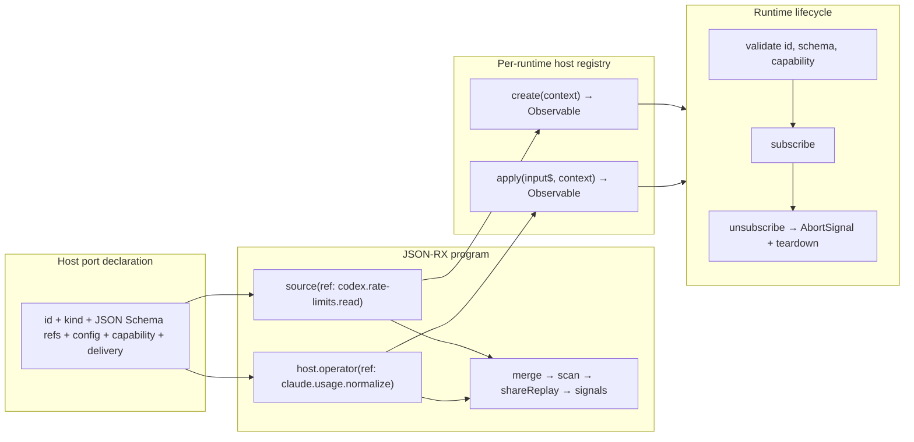

# JSON-RX compiler compression and test ladder

## Corrections after review

This section supersedes conflicting terminology and open questions below.

### Actual goal

Author an RxJS-shaped program once, parse and type-check it through TypeSpec,
then generate an equivalent reactive program in another language.

```text
RxJS-shaped TypeSpec
  -> checked portable Rx program
  -> TypeScript using @hafley66/signals and RxJS
  -> Rust using Tokio, futures streams, and a maintained signal crate
```

TypeSpec is the authoring language because it provides JSON-shaped data,
references, generics, validation, editor tooling, and polyglot emitters. JSON
Schema is an emitted validation and editor artifact. The compiler does not
implement a second general JSON Schema type checker.

### Inline pipelines

Named sources, state, effects, pipelines, and outputs may be referenced.
Operators inside a pipeline are inline instances. They receive derived source
locations for diagnostics and code generation, not globally reusable semantic
identities.

```ts
type RxProgram = {
  schemas: SchemaGraph
  sources: Record<string, SourceDefinition>
  states: Record<string, StateDefinition>
  effects: Record<string, EffectDefinition>
  pipelines: Record<string, PipelineDefinition>
  outputs: Record<string, OutputDefinition>
}

type PipelineDefinition = {
  input: InputExpression
  pipe: OperatorExpression[]
}

type InputExpression =
  | { kind: 'ref'; ref: string }
  | { kind: 'tuple'; inputs: InputExpression[] }
  | { kind: 'record'; inputs: Record<string, InputExpression> }

type OperatorExpression =
  | { kind: 'map'; expression: TypedExpression }
  | { kind: 'filter'; predicate: TypedExpression }
  | { kind: 'scan'; reducer: ReducerReference; seed: TypedExpression }
  | { kind: 'switchMap'; project: PipelineExpression }
  | { kind: 'concatMap'; project: PipelineExpression }
  | { kind: 'exhaustMap'; project: PipelineExpression }
  | { kind: 'mergeMap'; project: PipelineExpression; concurrent?: number }
  | { kind: 'share'; reset: ShareResetPolicy }
  | { kind: 'shareReplay'; bufferSize: number; refCount: boolean }
```

This syntax preserves RxJS terminology. A derived dependency graph records
references, fan-in, fan-out, effects, host placement, and cross-process edges.
Inline operators remain ordered syntax inside their owning pipeline.

```text
source ref
  -> [map, filter, switchMap, scan, shareReplay]
  -> output ref
```

### Reducible state

Generated async state is one denormalized record reduced from notification and
lifecycle events:

```ts
type ReactiveState<Next, Failure> = {
  status: 'idle' | 'loading' | 'next' | 'error' | 'complete' | 'finalize'
  data?: Next
  error?: Failure
  complete: boolean
  loading: boolean
  stale: boolean
  updatedAt?: number
  unsubscribed?: string
}

type ReactiveStateEvent<Next, Failure> =
  | { kind: 'subscribe' }
  | { kind: 'loading' }
  | { kind: 'next'; data: Next; at: number }
  | { kind: 'error'; error: Failure }
  | { kind: 'complete' }
  | { kind: 'invalidate' }
  | { kind: 'unsubscribe'; reason: string }
  | { kind: 'finalize' }

function reduceReactiveState<Next, Failure>(
  state: ReactiveState<Next, Failure>,
  event: ReactiveStateEvent<Next, Failure>,
): ReactiveState<Next, Failure>
```

The state record permits simultaneous facts such as retained `data`, an
`error`, `status: 'error'`, and `complete: false`. TypeScript and Rust targets
generate the same fields and reducer timeline.

### Rust generation and runtime

Use the existing `hafley66/hafley-tsp` package `@hafley66/alloy-rs` for Rust
generation. It already provides:

- TypeSpec `Program` to neutral Rust type extraction
- Rust structs, enums, tagged serde variants, traits, impls, and functions
- cross-file reference and `use` generation
- crate and module emission
- Axum endpoint components
- multi-transport endpoint bindings
- generated/manual code zones
- Vitest snapshots and generated Cargo-check fixtures

Extend that package's union and literal handling required by JSON-RX instead of
adding Typify as a parallel Rust type generator.

The initial Rust runtime uses Tokio and futures streams for event pipelines.
`futures-signals` is the initial purchased signal runtime for current-value UI
state. Its `Mutable<T>` is `Send + Sync`, and its signals convert to streams.
The generator retains ordinary streams anywhere every event matters because
signals intentionally represent the latest value and may skip intermediate
updates.

### Resolved protocol defaults

1. TypeSpec checking is authoritative for authored types. Emitted JSON Schema
   validates serialized documents and wire payloads.
2. Generated frames use discriminated TypeScript unions and serde-tagged Rust
   enums. Raw JSON exists only during initial decode. Generated handlers receive
   typed payloads.
3. One atomic activation state chooses the first terminal outcome. Completion,
   failure, or cancellation arriving later is discarded.
4. An unavailable extension capability fails immediately with a typed
   `capabilityUnavailable` failure. Retry or waiting is authored explicitly in
   the Rx pipeline.
5. The first protocol requires an exact protocol version and catalog hash.
   Mismatch closes the connection with a deterministic incompatibility frame
   and close code.
6. Polling is ordinary authored reactive structure. A generated timer feeds the
   same refresh input as manual refetch and invalidation. Subscription teardown
   owns the timer.

### Narrow compiler representations

Use these names below:

```text
SchemaGraph
  checked TypeSpec payload model and emitted-schema identities

RxProgram
  named boundaries plus inline RxJS-shaped pipelines

DeploymentPlan
  derived placement and transport bridges
```

`BehaviorGraph` below means the dependency graph derived from `RxProgram`. It
is an analysis result used for type flow, placement, and generation. It is not
the authored document shape.

## Small proof slices from the current package

These slices build directly on `examples/0_cross_language_scan`. Each adds one
semantic claim and one package-local gate. Instant, browser UI, Tauri, egui,
Playwright, and deployment infrastructure remain outside these slices.

### Slice 0: make the existing scan proof bilateral

Current assets already provide:

```text
0_pipeline.tsp
  -> SnapshotPatchPipeline
  -> generated RxJS merge + scan
  -> generated Rust tokio::select! + reducer
```

Add a Rust test that consumes the same ordered input fixture as the Vitest
test. Both tests serialize output states to canonical JSON and compare with one
shared snapshot file.

Gate:

```text
npm run cross-language:check
```

Proof: one TypeSpec algorithm produces matching TypeScript and Rust state
timelines.

### Slice 1: replace SnapshotPatchPipeline with inline PipelineIr

Generalize the existing domain-specific IR without adding operators:

```ts
type PipelineIr = {
  name: string
  input: {
    kind: 'record'
    entries: Record<string, SourceIr>
  }
  pipe: [MergeByKeyIr, ScanIr]
  output: TypeReference
}
```

`@mergeByKey` and `@snapshotPatch` lower into inline operator instances owned by
one pipeline. Generated TypeScript and Rust remain byte-equivalent in behavior
to Slice 0.

Gate: existing generated snapshots change structurally while the shared output
timeline remains unchanged.

Proof: the portable representation is an ordered Rx pipeline rather than a
catalog of reusable operator nodes.

### Slice 2: add pure map and filter

Add one fixture:

```text
source<number>
  -> map(value * 2)
  -> filter(value >= 4)
  -> scan(sum, 0)
```

Use a closed expression form for this slice:

```ts
type ExpressionIr =
  | { kind: 'parameter'; name: string }
  | { kind: 'literal'; value: JsonValue }
  | { kind: 'binary'; operator: '*' | '>=' | '+'; left: ExpressionIr; right: ExpressionIr }
```

Generate RxJS `map`, `filter`, and `scan`. Generate Rust `StreamExt::map`,
`filter`, and `scan` or an equivalent stream closure using purchased futures
operators.

Gate: TypeScript and Rust consume `[1, 2, 3, 4]` and share the exact output
snapshot `[4, 10, 18]`.

Proof: pure operator order and typed expression lowering survive language
translation.

### Slice 3: add switchMap cancellation

Add one virtual operation whose delay is controlled by input:

```text
input A -> result after 20 ticks
input B -> result after 5 ticks
input B arrives 2 ticks after A
```

Generate RxJS `switchMap`. Generate a Tokio stream that aborts or replaces the
previous owned future when the next input arrives.

Gate: both languages emit only `B`; the A task records cancellation; teardown
leaves zero active tasks and timers.

Proof: the central temporal meaning of an RxJS flattening operator survives the
port.

### Slice 4: generate the reducible lifecycle state

Feed a fixed event vector through generated reducers in both languages:

```text
subscribe
loading
next A
invalidate
loading
error E
unsubscribe("source error")
finalize
```

Both generators emit the denormalized `ReactiveState<Next, Failure>` record and
its reducer. They compare every intermediate state through one canonical JSON
snapshot.

Gate: TypeScript and Rust state snapshots match at every event.

Proof: next, error, completion, invalidation, unsubscription, and finalization
are one reducer problem.

### Slice 5: bind the output to purchased signal runtimes

TypeScript writes the Slice 4 reducer output into `@hafley66/signals`.
Rust writes it into `futures_signals::signal::Mutable<ReactiveState<...>>`.

Tests subscribe two observers, drive the shared event vector, drop one
observer, drive another event, and then dispose the owner.

Gate:

- both observers see the latest state before the first drop
- the surviving observer sees the next state
- final disposal leaves zero runtime subscriptions
- intermediate event preservation remains in streams, while signal consumers
  read the latest reduced state

Proof: translated pipelines can expose idiomatic current-value state in both
languages without cloning the TypeScript Signal implementation.

### Slice 6: generate one typed process seam

Define one request in TypeSpec:

```typespec
op double(input: DoubleInput): DoubleOutput | DoubleFailure;
```

Generate:

- a discriminated TypeScript request/result union
- a serde-tagged Rust request/result enum through `@hafley66/alloy-rs`
- one TypeScript encoder/decoder
- one Rust encoder/decoder
- one generated Axum handler trait and route

Gate order:

```text
generated Rust cargo check
TS encode -> Rust decode
Rust encode -> TS decode
real local WebSocket request -> generated Axum handler -> response
```

Proof: a typed reactive effect can cross a process boundary and return to the
owning pipeline.

### Slice 7: performance and allocation tuning

Benchmark only generated programs that already pass shared semantic timelines.
Each language gets a handwritten idiomatic control implementation with the
same types, operators, scheduler policy, inputs, outputs, and ownership.

```text
TypeScript generated pipeline
  versus handwritten RxJS + @hafley66/signals

Rust generated pipeline
  versus handwritten Tokio + futures + futures-signals
```

Raw TypeScript-versus-Rust timing is descriptive. Regression decisions compare
generated code with its same-language control and compare scaling curves across
input sizes.

Benchmark workloads:

```text
construction and first subscription
1,000 / 10,000 / 100,000 synchronous map-filter-scan events
1,000 switchMap replacements with cancelled inner work
fanout to 1 / 10 / 100 observers
state payloads at 64 B / 4 KiB / 256 KiB
subscribe-unsubscribe cycles
WebSocket frame encode-decode
Axum request-response and subscription fanout
```

Metrics:

```text
elapsed time and events per second
p50 / p95 / p99 iteration time where applicable
heap allocation count
allocated bytes
peak live bytes
retained bytes after teardown
live tasks, timers, subscriptions, and channel entries after teardown
```

TypeScript uses Vitest's benchmark fixture for timing. Memory fixtures run in
isolated Node processes with `--expose-gc`, force collection before and after a
fixed workload, and record retained heap and RSS. Heap profiles remain
diagnostic artifacts because VM allocation and collection timing are noisy.

Rust uses Divan for timing and its `AllocProfiler` for allocation counts and
bytes. DHAT release-mode fixtures measure peak and retained heap for focused
ownership tests. Allocation tests run serially in dedicated binaries so the
Rust test harness does not contaminate global allocator measurements.

Optimization sequence:

1. Capture generated and handwritten baselines.
2. Inspect scaling curves and allocation profiles.
3. Change one generator scheme or runtime boundary.
4. Re-run semantic timelines.
5. Re-run the focused benchmark.
6. Retain the change only when the measured target improves without moving
   work or allocation outside the measurement boundary.

Initial performance gates record baselines without hard thresholds. After three
stable local runs establish variance, add per-language regression budgets for
throughput, allocation count, peak heap, retained heap, and teardown residue.

Proof: portability overhead and runtime overhead are measurable separately,
and generator tuning improves every future emitted program.

## Host ports

Host ports declare named executable boundaries in a JSON-RX graph. The program
stores a JSON Schema contract; a per-runtime registry supplies the executable
observable implementation. The first port kinds are `source` and `operator`.



The port contract carries `source` or `operator` kind, input and output schema
references, JSON configuration, delivery policy, and required capabilities.
Runtime values retain payload plus optional URL/timestamp origin so dashboard
emissions preserve source provenance.

```ts
const usage$ = host.source("codex.rate-limits.read").pipe(
  host.operator("usage.normalize"),
  scan(reduceUsage, emptyUsage),
  shareReplay({ bufferSize: 1, refCount: true }),
  catchError((error) => of({ status: "error", error })),
)
```

Host implementation errors use the regular Rx error channel. Downstream
`catchError`, `retry`, `materialize`, Result, and Option operators choose the
program's failure behavior. Port construction creates one `AbortSignal` per
subscription; teardown aborts the signal and unsubscribes the host observable.
Shared ports acquire once and release after the final subscriber.

Codex app-server snapshot and update streams are source ports whose merge and
sparse-patch scan remain authored JSON-RX. Claude and ChatGPT browser capture
remain existing browser sources; provider normalization can move into an
operator port while preserving the shared reactive portion. Browser reload
effects, dashboard sinks, and TypeSpec-emitted schema provenance remain later
work.

### Slice progression

```text
existing merge + scan
  -> generic inline pipeline IR
  -> pure operators
  -> cancellation semantics
  -> reducible lifecycle state
  -> idiomatic signals in TS and Rust
  -> one typed Axum process seam
  -> same-language performance and allocation controls
```

Each slice retains one TypeSpec input, generated `.auto.ts` and `.auto.rs`
artifacts, one shared canonical timeline, a Vitest test, a Cargo test, and one
package script. Later browser-extension and multi-UI examples consume Slice 6
instead of defining a second protocol stack.

## Purpose

This brief compresses the architecture in
`0_typespec_json_rx_generation.md` into three compiler representations and one
executable fixture. It defines the order in which claims become testable.

Current generation scope:

- TypeSpec and JSON-RX inputs
- JSON Schema payload contracts
- `@hafley66/signals` state generation
- TypeScript and Rust protocol generation
- generated Axum WebSocket integration
- generated browser-extension service-worker integration
- one Tauri-compatible Signals client and one egui Rust client

CDP, OpenAPI, LSP, VS Code, Temporal, coroutine protocols, broad Chromium API
imports, and additional state-management targets follow the complete example.

## Canonical compiler representations

```text
authoring and imported sources
  -> SchemaGraph
  -> BehaviorGraph
  -> DeploymentPlan
  -> target generators
```

### SchemaGraph

```ts
type SchemaId = string

type SchemaGraph = {
  schemas: Map<SchemaId, JsonSchema>
  origins: Map<SchemaId, ImportedSymbolOrigin>
}

function isAssignable(
  graph: SchemaGraph,
  from: SchemaId,
  to: SchemaId,
): AssignabilityResult
```

TypeSpec is an authoring and import surface. JSON Schema is the serialized
payload contract. `SchemaGraph` is the checked compiler representation.

### BehaviorGraph

```ts
type NodeId = string
type InteractionId = string

type BehaviorGraph = {
  nodes: Map<NodeId, BehaviorNode>
  edges: BehaviorEdge[]
  interactions: Map<InteractionId, Interaction>
}

type Port = {
  schema: SchemaId
  cardinality: 'zero' | 'one' | 'many'
  direction: 'in' | 'out'
}

type BehaviorNode =
  | SourceNode
  | OperatorNode
  | StateNode
  | EffectNode
  | SinkNode

type Operator =
  | { kind: 'map'; expression: TypedExpression }
  | { kind: 'filter'; predicate: TypedExpression }
  | { kind: 'scan'; state: SchemaId; reducer: TypedExpression }
  | { kind: 'flatten'; policy: FlattenPolicy; graph: BehaviorGraphReference }
  | { kind: 'share'; replay: number; lifetime: SharedLifetime }

type FlattenPolicy =
  | { kind: 'latest' }
  | { kind: 'concat' }
  | { kind: 'exhaust' }
  | { kind: 'merge'; maximum?: number }
```

Resources, queries, state machines, browser capabilities, subscriptions, and
coroutines are analyses over connected behavior regions. They do not introduce
parallel foundational graphs.

```ts
type ResourceRegion = {
  nodes: Set<NodeId>
  key: TypedExpression
  request: NodeId
  state: NodeId
  invalidations: NodeId[]
}
```

### Interaction cardinality

```ts
type Interaction = {
  id: InteractionId
  input: Port
  output: Port
  failure?: SchemaId
  cancellation: 'none' | 'cooperative' | 'required'
}
```

| Authoring name | Input | Output |
| --- | --- | --- |
| event | one | zero |
| request | one | one |
| stream | one | many |
| state observation | zero or one | many |
| coroutine | many | many |

A coroutine adds an optional protocol-state analysis describing legal message
alternation. Request IDs, subscription IDs, and coroutine IDs lower to one
activation identity.

### DeploymentPlan

```ts
type DeploymentInput = {
  placement: Map<NodeId, HostId>
  bindings: Binding[]
}

type DeploymentPlan = {
  hosts: HostPlan[]
  localGraphs: Map<HostId, BehaviorGraph>
  bridges: Bridge[]
}

type Bridge = {
  edge: EdgeId
  from: HostId
  to: HostId
  interaction: InteractionId
  binding: BindingId
}
```

Behavior owns causality and state transitions. Deployment owns placement.
Bindings own serialization, delivery, buffering, authentication, heartbeat,
reconnection, and transport lifecycle.

## Generator boundary

Generators consume checked representations and emit files. Alloy renders
syntax after target analysis completes.

```ts
type TargetGenerator = {
  target: TargetId
  analyze(input: CheckedCompilerInput): GeneratorDiagnostic[]
  emit(input: CheckedGeneratorInput): GeneratedFile[]
}
```

Target passes may recognize connected regions. Each pass reports the graph
nodes and interactions it consumed. Two passes cannot claim the same required
output artifact.

Generated UI layout is outside the first slice. The Tauri and egui views are
handwritten consumers of generated client and state surfaces.

## Canonical frame protocol

```ts
type Frame =
  | {
      kind: 'hello'
      protocolVersion: string
      catalogHash: string
      capabilities: InteractionId[]
    }
  | {
      kind: 'input'
      interaction: InteractionId
      activation: string
      sequence: number
      payload: unknown
    }
  | {
      kind: 'output'
      interaction: InteractionId
      activation: string
      sequence: number
      payload: unknown
    }
  | {
      kind: 'failure'
      interaction: InteractionId
      activation: string
      sequence: number
      error: unknown
    }
  | {
      kind: 'complete' | 'cancel' | 'ack'
      activation: string
      sequence: number
    }
```

The interaction cardinality and optional protocol state determine which frame
sequences are legal. WebSocket ping, pong, close codes, and heartbeat remain
binding concerns.

## Canonical vertical fixture

Models:

```text
PageKey
PageSnapshot
CapturePageInput
CapturePageOutput
CapturePageFailure
TabChanged
```

Interactions:

```text
browser.tabs.changed
  extension -> server event

browser.page.capture
  UI -> server -> extension request with typed failure

page.snapshot.watch
  server -> UI state subscription
```

Topology:

```text
extension tabs event
  -> server reducer
  -> PageSnapshot
  -> Tauri Signals client
  -> egui Rust client

Tauri or egui capture request
  -> server capability broker
  -> extension service worker
  -> correlated response
  -> requesting UI
```

## Shared fixtures

One canonical timeline and frame corpus are consumed by TypeScript and Rust
tests. Language-specific copies are generated from the same source.

The frame corpus covers:

- absent optional property and explicit `null`
- integer boundaries and floating-point values
- enum variants and nested tagged unions
- unknown property rejection
- Unicode
- empty arrays and maps
- typed application failure
- cancellation and completion races

Canonical JSON comparison normalizes object-key ordering while retaining array
ordering, number spelling rules, absent properties, and explicit nulls.

## Cheapest-first test ladder

### Stage 0: schemas and contracts

Fixture: the six models and three interactions above.

```text
TypeSpec compile
JSON Schema snapshot
contract catalog snapshot
duplicate-ID diagnostic
unresolved-reference diagnostic
incompatible-edge diagnostic
```

Go condition: deterministic schema and catalog snapshots with negative cases.

### Stage 1: deterministic generation

Generate twice in separate temporary directories with shuffled input discovery
order.

Go condition: identical artifact paths and bytes.

### Stage 2: BehaviorGraph

Lower the fixture and snapshot nodes, ports, edges, and interactions.

Go condition: every edge is assignable and every required node is reachable.

### Stage 3: Signals resource

Generate the `PageSnapshot` Signals state and test with fake timers.

Required timeline:

```text
subscribe
loading
success A
retained-data refresh
failed refresh retaining A
key change cancelling old request
unsubscribe cancelling active request and polling
```

Assertions use the existing `QueryState` fields, including `status`,
`isLoading`, `isSuccess`, `isError`, `isStale`, `data`, and `error`.

Go condition: exact state snapshot and zero active timers/subscriptions after
teardown.

### Stage 4: TypeScript and Rust wire types

```text
canonical fixture -> TS decode -> TS encode
canonical fixture -> Rust decode -> Rust encode
```

Go condition: both outputs equal the canonical corpus and reject the same
invalid fixtures.

### Stage 5: generated Axum crate

Compile generated payloads, frames, handler trait, dispatcher, client, and
router before implementing an application handler.

Go condition: `cargo check` and compile-time fixture tests pass warning-free.

### Stage 6: real Axum socket

Use an in-memory handler over a real local WebSocket.

Failure injection:

- duplicate activation ID
- cancel versus complete race
- handler panic
- request timeout
- outbound queue full
- malformed JSON
- unknown interaction
- oversized message
- disconnect with live requests and subscriptions

Go condition: one terminal outcome per activation and zero surviving owned
tasks or guards after disconnect.

### Stage 7: generated TypeScript client

Run the client against the Stage 6 Axum server from Vitest node.

Failure injection:

- protocol mismatch
- catalog mismatch
- unauthorized interaction
- server restart

Go condition: negotiation, error, cancellation, and reconnect timelines match
snapshots.

### Stage 8: extension runtime

First use injected socket, storage, clock, and Chrome adapters in Vitest
browser. Then load the unpacked extension in Chromium for lifecycle coverage.

Failure injection:

- socket close
- server restart
- service-worker termination and activation
- duplicate listener installation
- duplicate capability registration

Go condition: one listener per capability, one authoritative connection, and
the declared reconnect policy is observed.

### Stage 9: deployment partition

Snapshot `DeploymentPlan` and exercise illegal placements.

Invariants:

- every node has one execution owner unless explicitly replicated
- every cross-host edge has one bridge
- local edges have no bridge
- every remote request has a reverse terminal route
- browser-only capabilities remain on permitted hosts
- replicated consumers receive distinct generated node identities

Go condition: all invariants are mechanically checked.

### Stage 10: three-client system

Connect one extension client, one Tauri-role TypeScript client, and one
egui-role Rust client to one Axum service.

Go condition:

- one extension event reaches both UI subscriptions
- concurrent commands from both UIs correlate independently
- replacing the extension connection removes the prior registration
- disconnecting one UI does not affect the other subscription

### Stage 11: UI adapters

- Cargo tests drive egui state through `watch` and assert repaint requests.
- Vitest browser tests render Tauri-compatible Signals states and screenshot
  loading, success, failure, reconnecting, and disconnected states.

Native window startup remains a smoke gate separate from deterministic tests.

### Stage 12: clean-checkout example

```text
generate
generation diff check
TypeScript typecheck
Cargo check
Vitest node
Vitest browser
Cargo tests
three-client system test
```

Go condition: the full example regenerates and passes from a clean checkout.

## Required failure timeline

```text
t=0   server starts
t=1   extension registers capture capability
t=2   both UI clients subscribe
t=3   extension sends TabChanged(A)
t=4   both UIs receive PageSnapshot(A)
t=5   UI-1 requests capture R1
t=6   server forwards R1
t=7   UI-2 requests capture R2
t=8   extension disconnects
t=9   R1 and R2 terminate under the declared absence policy
t=10  extension reconnects with a new connection ID
t=11  old registration is absent
t=12  UI-1 requests capture R3
t=13  extension returns success
t=14  only UI-1 receives the R3 response
t=15  UI-2 outbound queue fills
t=16  configured overflow behavior occurs
t=17  server shuts down
t=18  all clients enter disconnected state
```

Snapshot externally visible frames, connection registry state, live activation
IDs, Signals state, and cancellation/drop counters at each transition.

## Decisions required by stage

### Before Stage 0

1. Is JSON-RX an authoring syntax lowered into `BehaviorGraph`, or its serialized
   representation?
2. Which JSON Schema dialect and assignability subset are compiler-authoritative?
3. Can JSON Schema plus an interaction manifest enter without TypeSpec?

### Before Stage 3

4. Does polling belong in `createQuery`, a generated wrapper, or the application
   host?
5. How does generated failure decoding produce `QueryState<O, E>` rather than
   `unknown`?

### Before Stage 4

6. Does Rust type generation use Typify directly from emitted JSON Schema or a
   controlled compiler representation?
7. Are unknown object properties rejected consistently in TypeScript and Rust?
8. What generated suffix and header policy applies to Rust files?

### Before Stage 6

9. Are Axum handlers generic concrete values or trait objects?
10. Does the outer frame contain a contract address plus raw payload, or a fully
    tagged generated message enum?
11. Which terminal result wins a cancellation/completion race?
12. What happens when a handler panics?
13. Which outbound queue overflow behavior is implemented first?

### Before Stage 7

14. Is catalog compatibility exact hash equality, subset negotiation, or
    per-interaction hashes?
15. What authentication and per-interaction authorization are required?

### Before Stage 8

16. While the extension is absent, do routed requests fail, queue with a bound,
    or wait until timeout?
17. Are events durable across service-worker or server downtime?
18. What reconnect backoff, jitter, and maximum delay apply?
19. Which browser runs the real extension lifecycle test?

### Before Stage 9

20. Does placement on two hosts create two replicated node instances?
21. What lifetime and key scope server state: process, user, browser profile,
    connection, or explicit domain key?
22. How are browser capabilities authorized by user, profile, tab, and frame?

### Before Stage 11

23. Does Tauri acceptance mean a browser-tested compatible frontend or a full
    desktop build?
24. Does egui consume snapshots only, or generated loading, stale, failure, and
    reconnect states?

## Phase order

```text
0  freeze current document and schema behavior
1  define SchemaGraph and BehaviorGraph identities
2  lower existing JSON-RX into BehaviorGraph
3  lower TypeSpec into the same BehaviorGraph
4  emit JSON Schema and TypeScript payload types
5  generate one Signals resource and prove its timeline
6  generate canonical TypeScript and Rust activation frames
7  generate Axum adapter and TypeScript/Rust clients
8  import the minimal Chrome API subset and generate service-worker adapters
9  lower placement into DeploymentPlan
10 assemble the one-server, one-extension, two-UI example
11 expand imports and execution targets
```

Each phase stops at its corresponding test-ladder gate. Later directories are
created only after their input representation passes its gate.
