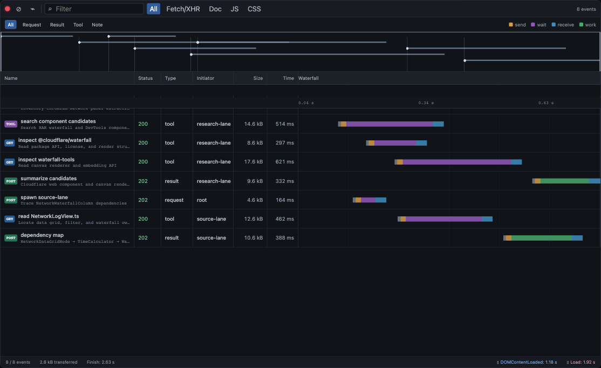
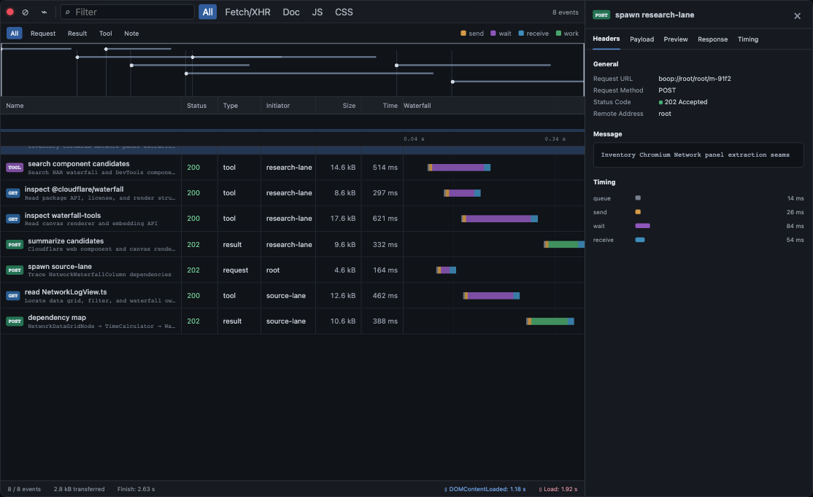

# @hafley66/marbler

Signal-driven marble, sequence, and HTTP-style network visualization built on
`@hafley66/grid` and `@hafley66/signals`.

The tabular columns use DOM rows. PixiJS renders the viewport-clipped waterfall
and the density overview. The overview owns a shared time viewport supporting
cursor-anchored wheel zoom, horizontal pan, live-follow state, and fit on double
click. Phase and event counts do not change the DOM node count.

## Run

```sh
pnpm --filter @hafley66/marbler dev
```

Open `http://127.0.0.1:5173/demo.html` for the interactive event-burst,
hover, pan, and zoom test page. Vite may choose the next available port.

## Build

```sh
pnpm --filter @hafley66/marbler build
pnpm --filter @hafley66/marbler test:browser
```

## Screenshots

Generated and verified by `src/2_Marbler.browser.test.tsx` at 1440 × 900.





## Retained renderer benchmark

- [10-second PixiJS receipt](./benchmarks/0_pixi-retained-10s.md)
- [100k-event pan/zoom and CDP heap receipt](./benchmarks/1_time-navigator-chaos.md)
- `src/2_PixiRetained.browser.test.ts` is the executable benchmark.

## Source

- `src/0_types.ts`: zod schemas and event types
- `src/1_model.ts`: signals and `createGrid` model
- `src/1a_WaterfallPixi.tsx`: viewport-clipped retained PixiJS waterfall renderer with span hover and selection events
- `src/2_Marbler.tsx`: React grid, waterfall, and details renderer
- `src/2_marbler.css`: Network-panel presentation
- `src/3_main.tsx`: executable fixture application
