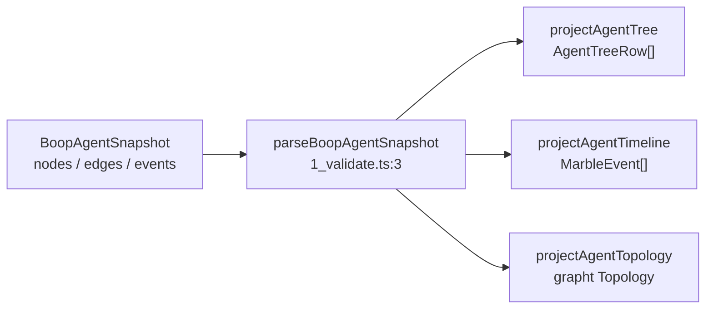

# Agent network view

Render the agent tree over time as a Chromium-network-tab websocket list: one row
per agent session, a lifespan bar from open to close, message frames drawn on the
bar and listed in a messages sub-panel, parent/child as tree indentation.

Base sha `ea690cc39cf68dfbbfc3aeda324ba03cb98fabdb`.

## Contents

- [1. Receipts](#1-receipts)
- [2. What marbler already is](#2-what-marbler-already-is)
- [3. What boop-adapters already is](#3-what-boop-adapters-already-is)
- [4. The store](#4-the-store)
- [5. Row and frame model](#5-row-and-frame-model)
- [6. Type signatures](#6-type-signatures)
- [7. Instance lifetimes](#7-instance-lifetimes)
- [8. Storage layout, reads, writes, uniqueness](#8-storage-layout-reads-writes-uniqueness)
- [9. Read path: the named boop query](#9-read-path-the-named-boop-query)
- [10. Live follow](#10-live-follow)
- [11. Topology view](#11-topology-view)
- [12. Slices](#12-slices)
- [13. Open, needs Chris](#13-open-needs-chris)

## 1. Receipts

Every number below came from a command run 2026-08-17 against
`~/.agent/boop.db` and from files at the base sha.

| fact | receipt |
|---|---|
| `MarbleEvent` shape (14 fields, `phases[]`) | `packages/marbler/src/0_types.ts:9-23` |
| phase kinds are a closed 5-member enum | `packages/marbler/src/0_types.ts:4` |
| grid columns of the network panel | `packages/marbler/src/1_model.ts:18-26` |
| no `getSubRows` on the marbler grid | `packages/marbler/src/1_model.ts:13-27` |
| lane assignment is `index % 5`, a placeholder | `packages/marbler/src/2_Marbler.tsx:23` |
| drawer already renders General / Message / Timing | `packages/marbler/src/2_Marbler.tsx:80-86` |
| `TimeViewport.followLive` exists | `packages/marbler/src/0a_TimeViewport.ts:6,19,46` |
| `TimelineMark` already has `span`, `dot`, `link` and `lane?` | `packages/marbler/src/0a_TimeViewport.ts:9-12` |
| demo feeds 40 synthetic events, `append(100)`/`append(1000)` | `packages/marbler/src/3_demo.tsx:12-56` |
| `getSubRows` is a first-class grid config field | `packages/grid/README.md` `GridConfig` table |
| `GridTree` renders a single-column VS Code tree over the same `Grid` | `packages/grid/README.md` GridTree section |
| `grapht` exports exactly one graph type, `Topology = { nodeIds, edges }` | `packages/grapht/src/2_fixtures.ts:17`, `src/index.ts:42` |
| grapht names Instant's network/subagent trace viewer as the extraction source | `packages/grapht/2_instant_extraction_plan.d2:10-24` |
| the extraction plan already declares `NetworkDocument`, `NetworkViewState.mode`, `NetworkProjection.waterfall/sequence/marble` | `packages/grapht/2_instant_extraction_plan.d2:32-52` |
| boop-adapters already projects tree, timeline, topology from a snapshot | `packages/boop-adapters/src/2_tree.ts:20`, `src/3_timeline.ts:39`, `src/4_topology.ts:4` |
| `projectAgentTimeline` already emits `MarbleEvent[]` | `packages/boop-adapters/src/3_timeline.ts:16-37` |
| snapshot identity is `harness:id` | `packages/boop-adapters/src/1_validate.ts:19-21` |
| nothing in the repo reads `~/.agent/boop.db`; the snapshot is hand-written in the test | `packages/boop-adapters/src/6_boopAdapters.test.ts:11-32` |

Store receipts, `sqlite3 ~/.agent/boop.db`:

| table | rows | what it carries |
|---|---|---|
| `agent_session` | 3571 | `session_id, harness_id, nickname, cwd_id, branch_id, started_ts` |
| `agent_live_span` | 6771 (3200 closed) | `session_id, from_ts, to_ts, status_id, pid, tmux_pane_id` |
| `agent_edge` | 1871 | `parent_session_id, child_session_id, edge_kind_id, first_ts, last_ts, n` |
| `agent_turn` | 449943 | `session_id, turn, ts, role_id, said` |
| `agent_lane` | 254 | `spawn_id, lane_id, harness_id, branch_id, cwd_id, model_id, goal, brief_path_id, spawned_ts` |
| `agent_trace_event` | 246 | `event_key, lane_id, kind_id, started_ts, finished_ts, classification_id, detail` |
| `agent_trace` / `agent_trace_span` | 346 / 1920 | trace grouping |
| `agent_span` | 0 | empty, ignore |

Dictionaries: `dict_edekind = {spawned, result, deliver-nextturn, hail, deliver-midturn}`;
`dict_trace_kind = {supervisor-start, channel-open, turn-start, error, supervisor-exit, turn-finish}`;
`dict_role = {user, assistant, tool, system, developer}`;
`dict_harness = {claude, codex, kimi, opencode, gemini}`;
`dict_status` has exactly one row, `idle`.

Edge kind histogram: `spawned` 1547, `result` 286, `deliver-midturn` 25, `hail` 9,
`deliver-nextturn` 4. `agent_edge.agent_type_id` is NULL on all 1871 rows, so the
Agent-tool subagent type is not recorded.

## 2. What marbler already is

`createMarbler(seed)` at `1_model.ts:6` returns seven signals plus a `Grid`.
`MarblerPanel` at `2_Marbler.tsx:90` is `SignalReact(MarblerView)` and renders
toolbar, `TimeNavigatorPixi` overview, DOM header row, `WaterfallPixi` canvas
behind DOM rows, and a right drawer for the selected event. `WaterfallPixi` draws
one 44px row per event and one rect per phase (`1a_WaterfallPixi.tsx:5,9-15`).

Zero `.subscribe()` calls exist in `packages/marbler/src`; every read is
`Signal.$()` under `SignalReact`. That budget must survive.

## 3. What boop-adapters already is

Three pure projections over one hand-shaped `BoopAgentSnapshot`:



It is the right seam and the wrong grain. `projectAgentTimeline` emits one
`MarbleEvent` per *message*, so a row is a message and an agent is only the
`initiator` string. The network-tab reading needs the inverse: a row is a
*connection* (an agent) and a message is a *frame inside* it. Nothing in the
package reads SQLite; `BoopAgentSnapshot` has no producer.

## 4. The store

A session is the unit of identity in boop and it already covers every harness,
including Claude Code Agent-tool subagents.

| session id shape | count in `dict_session` | what it is |
|---|---|---|
| `<uuid>` (36 chars, dashed) | 1390 | a Claude Code or kimi top-level session |
| `<uuid>/agent-<hex>` | 1250 | a Claude Code Agent-tool subagent (sidechain) |
| `ses_<base62>` | 933 | a codex thread |
| bare name (`feature-dl6-id-access-first-slice`) | 345 | a boop lane |

`agent_session` harness histogram: claude 1586, codex 941, opencode 933, kimi 111.

The premise that native subagents are absent is FALSE. Verified:

```
sqlite> select count(*) from agent_edge e join dict_session c on c.id=e.child_session_id
        where c.value like '%/agent-%';
1250
```

with parent rows like
`ce26f5c3-b493-4acc-bb2c-5e0b29f9fe39 -> ce26f5c3-.../agent-ace31b0935a2057db`
at `first_ts=1786985443580`, harness `claude`, cwd
`/Users/chrishafley/projects/sprefa/.claude/worktrees/agent-ace31b0935a2057db`,
223 turns spanning 1090 s. The ingest lives at
`hafley-rs/crates/boop/src/harness/claude.rs:1,159` reading
`~/.claude/projects/<encoded-cwd>/`.

The real gap is narrower and has three parts:

1. **No `agent_lane` row.** `agent_lane` is boop-spawn-only, 254 rows, so a
   subagent has no goal, brief, model, or branch. Its label has to come from
   `agent_session.nickname` (`agent-ace31b0935a2057db`) and its cwd.
2. **No `agent_trace_event` rows.** `agent_trace_event` covers exactly two lane
   names, `mine` (206) and `feature-fresh-codex` (40); zero rows join to a uuid
   or `/agent-` session. So `turn-start` / `turn-finish` / `supervisor-exit`
   frames do not exist for subagents and must be derived from `agent_turn.ts` +
   `dict_role`.
3. **`agent_edge.agent_type_id` is NULL everywhere**, so the Agent-tool
   `subagent_type` (`Explore`, `fork`, `general-purpose`) is not stored. The
   view shows `agent-<hex>` until boop records it.

Nothing here blocks the view. Every subagent already has an id, a parent, a cwd,
a first turn, a last turn, and a live span.

## 5. Row and frame model

The Chromium websocket entry has two levels. The list row is the connection: URL,
status `101`, type `websocket`, and a time bar. Clicking it opens a Messages
sub-panel: one line per frame with direction, time, length, and payload preview.
The view is that, with agents as connections.

| chromium | agent network view | source |
|---|---|---|
| request URL | `boop://<harness>/<sessionId>` | `agent_session` + `dict_harness` |
| initiator | parent session id | `agent_edge` kind `spawned` |
| status `101` / `200` / `500` | open / closed / errored | `agent_live_span.to_ts`, `agent_trace_event` kind `error` |
| type | harness (`claude`, `codex`, `opencode`, `kimi`) | `dict_harness` |
| time bar start .. end | `openedTs .. closedTs` | `agent_live_span` min/max, floored by `agent_turn` min/max |
| frame ▲ sent | outbound: mail sent, result returned, spawn issued | `agent_edge` where parent = this row |
| frame ▼ received | inbound: mail delivered, spawn brief, tool result | `agent_edge` where child = this row |
| frame payload preview | first 200 chars of `agent_turn.said` | `agent_turn` |
| connection close | `supervisor-exit` or last live span close | `agent_trace_event`, `agent_live_span` |

Frame kinds, exactly the seven Chris named plus one:

| kind | direction | source | uniqueness key |
|---|---|---|---|
| `spawn` | in | `agent_edge` kind `spawned`, child = row | `spawn:<parent>:<child>` |
| `turn-start` | self | `agent_trace_event` kind `turn-start`, else `agent_turn` where role = `user` | `turn:<session>:<turn>:start` |
| `turn-finish` | self | `agent_trace_event` kind `turn-finish`, else `agent_turn` where role = `assistant` | `turn:<session>:<turn>:finish` |
| `mail-in` | in | `agent_edge` kind `hail` / `deliver-midturn` / `deliver-nextturn`, child = row | `mail:<from>:<to>:<kind>:<first_ts>` |
| `mail-out` | out | same edge kinds, parent = row | same key, opposite endpoint |
| `result` | out | `agent_edge` kind `result`, parent = row | `result:<from>:<to>:<last_ts>` |
| `error` | self | `agent_trace_event` kind `error` | `trace:<event_key>` |
| `exit` | self | `agent_trace_event` kind `supervisor-exit`, else `agent_live_span.to_ts` | `exit:<session>:<ts>` |

`agent_edge` is collapsed (`n` counts repeats, `first_ts`/`last_ts` bracket them),
so an edge with `n > 1` yields two frames, at `first_ts` and `last_ts`, labelled
`×n`. Restoring per-message rows is a boop-side ask, item 3 in section 9.

## 6. Type signatures

Signatures first, body as a comment beneath.

### 6.1 marbler `src/0_types.ts`, additive

```ts
export const FrameSchema = z.object({
  id: z.string(),
  t: z.number(),
  kind: z.enum(["spawn", "turn-start", "turn-finish", "mail-in", "mail-out", "result", "error", "exit"]),
  direction: z.enum(["in", "out", "self"]),
  peer: z.string().nullable(),
  preview: z.string(),
  repeat: z.number().default(1),
})
export type MarbleFrame = z.infer<typeof FrameSchema>

// MarbleEventSchema gains two optional fields and stays backward compatible with
// the existing demo, which passes neither.
export const MarbleEventSchema = z.object({
  /* ...the 14 existing fields at 0_types.ts:9-23, unchanged... */
  frames: z.array(FrameSchema).default([]),
  parentId: z.string().nullable().default(null),
  children: z.lazy(() => z.array(MarbleEventSchema)).optional(),
})
```

Rationale for extending `MarbleEvent` rather than adding a parallel row type: the
grid, the waterfall hit-test (`1a_WaterfallPixi.tsx:54-63`), the drawer, and
`eventRange` (`0a_TimeViewport.ts:24`) all take `MarbleEvent`. A second row type
forks all four. `phases[]` stays for the request case and is empty for agents;
`frames[]` is empty for the request case.

### 6.2 marbler `src/1_model.ts`

```ts
export function createMarbler(seed: MarbleEvent[]): Marbler
// unchanged signature; the createGrid call gains two things:
//   getSubRows: (row) => row.children
//   columnDefs: [..., { id: "__expand", header: "" }] prepended when any row has children
// and `rows` flattens depth-first for the waterfall while the grid keeps the tree,
// because WaterfallPixi indexes rows by scroll position (1a_WaterfallPixi.tsx:57)
// and must see exactly the rows the DOM renders.
```

### 6.3 boop-adapters `src/0_types.ts`, additive

```ts
export type BoopSessionRow = {
  session: string          // dict_session.value, the natural key
  harness: string          // dict_harness.value
  nickname: string | null
  cwd: string | null
  branch: string | null
  model: string | null     // agent_lane only
  goal: string | null      // agent_lane only
  parent: string | null    // agent_edge kind spawned
  spawnedTs: number | null
  openedTs: number | null  // min agent_live_span.from_ts
  closedTs: number | null  // max to_ts, NULL when any span is still open
  firstTurnTs: number | null
  lastTurnTs: number | null
  turns: number
}

export type BoopFrameRow = {
  session: string
  ts: number
  kind: string             // dict_edekind.value | dict_trace_kind.value | dict_role.value
  peer: string | null
  detail: string
  repeat: number
}

export type AgentNetworkExport = { rows: BoopSessionRow[]; frames: BoopFrameRow[] }

export type AgentNetworkProjection = (input: AgentNetworkExport) => MarbleEvent[]
export type AgentNetworkTopologyProjection = (input: AgentNetworkExport) => Topology
```

`BoopSessionRow` / `BoopFrameRow` are the wire shape of the two named queries in
section 9, one JSON object per line. They are transport types and stay flat.

### 6.4 boop-adapters `src/7_network.ts`

```ts
export const projectAgentNetwork: AgentNetworkProjection = (input) => { /* ... */ }
// 1. zod-parse both arrays; reject a frame whose `session` is not in `rows`.
// 2. index frames by session, sort by (ts, kind) so ties are deterministic.
// 3. for each row compute
//      start   = openedTs ?? spawnedTs ?? firstTurnTs
//      end     = closedTs ?? lastTurnTs ?? start
//      status  = closedTs === null ? 101 : hasErrorFrame ? 500 : 200
//      method  = harness.toUpperCase()
//      type    = parent === null ? "root" : session.includes("/agent-") ? "subagent" : "lane"
//      name    = nickname ?? branch ?? session
//      preview = goal ?? ""
//      size    = `${turns} turns`
//      phases  = []                          // agents do not have request phases
//      frames  = frameRows.map(toFrame)
// 4. build children by parent, depth-first, cycle-guarded exactly as 2_tree.ts:49-53.
// 5. return roots; a row whose parent is absent from `rows` is a root.

export const projectAgentNetworkTopology: AgentNetworkTopologyProjection = (input) => { /* ... */ }
// nodeIds = rows.map(r => r.session); edges = parent index pairs, same shape as 4_topology.ts:9-14.

export function flattenNetworkRows(rows: MarbleEvent[], expanded: ReadonlySet<string>): MarbleEvent[]
// depth-first walk honoring `expanded`, so the waterfall row order equals the DOM row order.
```

### 6.5 boop-adapters `src/8_read.ts`, node only

```ts
export function readAgentNetworkExport(sql: (query: string) => string): AgentNetworkExport
// `sql` runs one statement and returns ndjson on stdout. In the CLI it is
// `execFileSync("boop", ["db", query])`; in the test it reads the fixture file.
// Sync on purpose: this is below the SqlRunner seam, no Promise crosses it.
```

Async law: nothing in this plan returns a Promise above the read seam. The live
poll in section 10 is an rxjs `interval` and the browser fetch is the one
Observable boundary.

## 7. Instance lifetimes

| instance | created | lives until | holds |
|---|---|---|---|
| `Marbler` model (`1_model.ts:6`) | once at module scope in the demo entry | page unload | 7 signals, 1 `Grid` |
| `Grid` (`createGrid`) | inside `createMarbler` | with the model | 12 TanStack state slices |
| `TimeViewport` | inside the model, replaced on every gesture | with the model | `full`, `visible`, `followLive` |
| `PIXI.Application` (`1a_WaterfallPixi.tsx:47`) | in `useEffect` on mount | effect cleanup | canvas, one `Container`, one `Graphics` |
| `AgentNetworkExport` | per poll tick | replaced by the next tick | plain arrays, no handles |
| the frame index (`Map<string, MarbleFrame[]>`) | inside `projectAgentNetwork` | that call | discarded before return |
| the poll subscription | one `.subscribe()` at the app root | page unload | the single subscription budget |

`projectAgentNetwork` is pure and holds nothing across calls. The only long-lived
mutable state is the model signals and the Pixi application.

## 8. Storage layout, reads, writes, uniqueness

No new table, no new file in `~/.agent`. The view is read-only over boop's store.

**Reads.** Two statements per refresh, section 9. `agent_turn` at 449 943 rows is
the only one that can hurt; the frames query is bounded by `ts >= :since` and by
the session set the rows query returned, and there is no index on
`agent_turn(ts)`, only the `(session_id, turn)` primary key. So the frames query
must drive from the session list and filter turn range in the same statement, or
the planner SCANs 450k rows. Receipt to take before shipping: `EXPLAIN QUERY PLAN`
must show `SEARCH agent_turn USING PRIMARY KEY`, never `SCAN`.

**Writes.** None from this repo. The view never opens the db read-write.

**Uniqueness.**

| set | key | why it holds |
|---|---|---|
| row | `session` | `dict_session.value` is `UNIQUE` |
| frame | the per-kind key in section 5 | `agent_edge` PK is `(parent, child, kind)`; `agent_turn` PK is `(session, turn)`; `agent_trace_event.event_key` is `UNIQUE` |
| parent | one per child | `agent_edge` can hold several `spawned` rows per child in principle; take `MIN(first_ts)` and treat the rest as duplicates |
| lane metadata | one per session | `agent_lane` keys on `spawn_id`, so a lane name respawned twice has two rows; take the latest `spawned_ts` |

Surrogate-key law: every join above goes through the existing `dict_*` integer
ids and the TEXT natural key appears once, on output. No composite TEXT key is
introduced anywhere.

## 9. Read path: the named boop query

The hafley-rs navigator owns the boop side under card `boop-agent-network-view`.
The contract this half needs, by name:

**`boop db agent-network rows [--cwd <path>] [--since <ms>] [--limit <n>]`**
emits one `BoopSessionRow` per line.

```sql
WITH sess AS (
  SELECT s.session_id AS sid, d.value AS session, h.value AS harness, s.nickname,
         c.value AS cwd, b.value AS branch, s.started_ts
  FROM agent_session s
  JOIN dict_session d ON d.id = s.session_id
  JOIN dict_harness h ON h.id = s.harness_id
  LEFT JOIN dict_cwd    c ON c.id = s.cwd_id
  LEFT JOIN dict_branch b ON b.id = s.branch_id
), span AS (
  SELECT session_id AS sid, MIN(from_ts) AS opened_ts,
         CASE WHEN SUM(to_ts IS NULL) > 0 THEN NULL ELSE MAX(to_ts) END AS closed_ts
  FROM agent_live_span GROUP BY session_id
), turns AS (
  SELECT session_id AS sid, MIN(ts) AS first_turn_ts, MAX(ts) AS last_turn_ts,
         COUNT(*) AS turns
  FROM agent_turn GROUP BY session_id
), parent AS (
  SELECT e.child_session_id AS sid, p.value AS parent, MIN(e.first_ts) AS spawned_ts
  FROM agent_edge e
  JOIN dict_edekind k ON k.id = e.edge_kind_id AND k.value = 'spawned'
  JOIN dict_session p ON p.id = e.parent_session_id
  GROUP BY e.child_session_id
), lane AS (
  SELECT l.lane_id AS sid, l.goal, m.value AS model, MAX(l.spawned_ts) AS lane_ts
  FROM agent_lane l LEFT JOIN dict_model m ON m.id = l.model_id
  GROUP BY l.lane_id
)
SELECT sess.session, sess.harness, sess.nickname, sess.cwd,
       COALESCE(sess.branch, '') AS branch, lane.model, lane.goal,
       parent.parent, parent.spawned_ts AS spawnedTs,
       span.opened_ts AS openedTs, span.closed_ts AS closedTs,
       turns.first_turn_ts AS firstTurnTs, turns.last_turn_ts AS lastTurnTs,
       COALESCE(turns.turns, 0) AS turns
FROM sess
LEFT JOIN span   ON span.sid   = sess.sid
LEFT JOIN turns  ON turns.sid  = sess.sid
LEFT JOIN parent ON parent.sid = sess.sid
LEFT JOIN lane   ON lane.sid   = sess.sid
WHERE COALESCE(span.opened_ts, turns.first_turn_ts, sess.started_ts) >= :since
ORDER BY COALESCE(span.opened_ts, turns.first_turn_ts, sess.started_ts);
```

**`boop db agent-network frames --since <ms> [--cwd <path>]`** emits one
`BoopFrameRow` per line, the union of three sources:

```sql
SELECT d.value AS session, e.first_ts AS ts, k.value AS kind, p.value AS peer,
       '' AS detail, e.n AS repeat
FROM agent_edge e
JOIN dict_edekind k ON k.id = e.edge_kind_id
JOIN dict_session d ON d.id = e.child_session_id
JOIN dict_session p ON p.id = e.parent_session_id
WHERE e.first_ts >= :since
UNION ALL
SELECT l.value, te.created_ts, tk.value, NULL, te.detail, 1
FROM agent_trace_event te
JOIN dict_trace_kind tk ON tk.id = te.kind_id
JOIN dict_session l ON l.id = te.lane_id
WHERE te.created_ts >= :since
UNION ALL
SELECT d.value, t.ts, r.value, NULL, SUBSTR(COALESCE(t.said, ''), 1, 200), 1
FROM agent_turn t
JOIN dict_session d ON d.id = t.session_id
JOIN dict_role r ON r.id = t.role_id
WHERE t.session_id IN (SELECT id FROM dict_session WHERE value IN (:sessions))
  AND t.ts >= :since;
```

Three asks on the boop side, in priority order:

1. Name and ship the two statements as `boop db agent-network rows|frames` so the
   SQL lives once, in hafley-rs, and this package holds a client not a copy.
2. Record `agent_edge.agent_type_id` from the Claude Code Agent-tool
   `subagent_type` (NULL on all 1871 rows today), so a subagent row can read
   `Explore` instead of `agent-a20ea02e1661c84a2`.
3. Stop collapsing mail into `(parent, child, kind)` with an `n` counter, or add
   a per-message table, so every hail is one frame instead of two.

Until 1 lands, `readAgentNetworkExport` passes the literal SQL to
`boop db "<sql>"`, which already emits ndjson (verified:
`boop db "select count(*) as n from agent_session"` prints `{"n":3571}`). Slice 1
is therefore not blocked on hafley-rs.

## 10. Live follow

`TimeViewport.followLive` is already implemented and already correct: a `full`
gesture with `followLive` true slides `visible` to the new right edge
(`0a_TimeViewport.ts:48-52`), and the demo already calls it on append
(`3_demo.tsx:55`). Nothing about the viewport needs building.

What is missing is the source. The rule is one manual `.subscribe()` per app, so:

```ts
// packages/marbler/src/3_demo.tsx, the only subscribe in the app
const poll$ = interval(1000).pipe(
  switchMap(() => fromFetch("/__agent-network", { selector: (r) => r.json() })),
  map(parseAgentNetworkExport),
  map(projectAgentNetwork),
  distinctUntilChanged((a, b) => a.length === b.length && lastFrameTs(a) === lastFrameTs(b)),
)
poll$.subscribe((rows) => {
  model.source.$(rows)
  model.viewport.$(reduceTimeViewport(model.viewport.$(), { type: "full", range: eventRange(rows) }))
})
```

`/__agent-network` is a vite dev-server middleware that shells `boop db` and
returns the two ndjson blocks; it is dev-only plumbing and never ships in the
library build. `distinctUntilChanged` on `(count, lastFrameTs)` is the recompute
guard: a poll that returns nothing new does not re-project.

File-watching `~/.agent/boop.db-wal` was considered and rejected for slice 3: the
WAL changes on every unrelated boop write, the browser cannot watch a file, and a
1 s poll of two indexed statements is well inside the 10-second law. It stays on
the table for a native host.

## 11. Topology view

`grapht` today exports exactly one graph type, `Topology = { nodeIds: string[];
edges: [number, number][] }` (`packages/grapht/src/2_fixtures.ts:17`), and
`projectAgentTopology` already produces it (`4_topology.ts:4`). No renderer
exists in the package; `2_instant_extraction_plan.d2:10-24` names the Instant
files (`src/plugins/harnessTrace/4_Waterfall.tsx`, `0_tree.ts`, `0_types.ts`) as
the extraction source, and lines 32-52 already declare the target interfaces
`NetworkDocument`, `NetworkViewState.mode = "grid" | "graph" | "waterfall" |
"sequence"`, and `NetworkProjection`. Those files are in the `instant` repo, not
here.

So the topology half of Chris's ask is a fourth `mode` on the same document, and
this plan ships the document plus the `grid` and `waterfall` modes. The `graph`
mode is a later slice that either extracts Instant's renderer or drives
XYFlow through `react-dock-and-flow`. Named, not scheduled.

## 12. Slices

Each is one lane, disjoint file ownership.

| # | lane | owns | forbidden | needs Chris |
|---|---|---|---|---|
| 1 | `agent-network-adapter` | `packages/boop-adapters/src/7_network.ts`, `8_read.ts`, `9_network.test.ts`, additions to `0_types.ts` and `index.ts`, `packages/boop-adapters/fixtures/*`, `packages/boop-adapters/scripts/0_export_agent_network.sh` | everything under `packages/marbler`, `packages/grid`, `packages/grapht`; files `1_validate.ts` through `6_boopAdapters.test.ts` | no |
| 2 | `agent-network-frames` | `packages/marbler/src/0_types.ts`, `1_model.ts`, `2_Marbler.tsx`, `2_marbler.css`, `2_Marbler.browser.test.tsx` | `3_demo.tsx`, `2a_DemoViz.tsx`, `0a_TimeViewport.ts`, `1a_WaterfallPixi.tsx` unless the frame ticks force it, all other packages | no |
| 3 | `agent-network-demo` | `packages/marbler/src/2b_AgentNetworkDemo.tsx`, `3_demo.tsx`, `packages/marbler/src/2b_AgentNetworkDemo.browser.test.tsx` | `0_types.ts`, `1_model.ts`, `2_Marbler.tsx`, all of boop-adapters | no |
| 4 | `agent-network-live` | the vite middleware + the single `.subscribe()` | everything slice 3 owns after it lands | transport choice |
| 5 | `agent-network-graph` | grapht graph mode | none | yes, extract Instant or drive XYFlow |

Slices 1 and 2 are concurrent, different packages. Slice 3 depends on both.

Acceptance, per slice:

1. `pnpm --filter @hafley66/boop-adapters test` green; a committed fixture of real
   rows exported today; a test asserting root/child nesting, `status` 101 for an
   open row, and the frame kind set for one real subagent.
2. `pnpm --filter @hafley66/marbler test:browser` green; a new screenshot baseline
   showing frame ticks on a lifespan bar and a messages sub-panel in the drawer;
   the existing two Marbler baselines unchanged.
3. `pnpm --filter @hafley66/marbler test:browser` green; a screenshot of the
   `agents` tab rendering the committed fixture, with at least one
   `<uuid>/agent-<hex>` row nested under its parent.

## 13. Open, needs Chris

- Transport for live follow: vite middleware shelling `boop db`, a boop HTTP
  endpoint, or a native host that watches the WAL.
- Whether the graph mode extracts Instant's `harnessTrace` plugin or is written
  fresh against XYFlow through `react-dock-and-flow`.
- Whether an idle-but-unclosed session (3571 rows carry `dict_status = idle`, the
  only status value that exists) reads as an open connection or as unknown.
