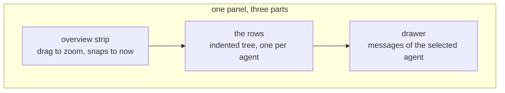
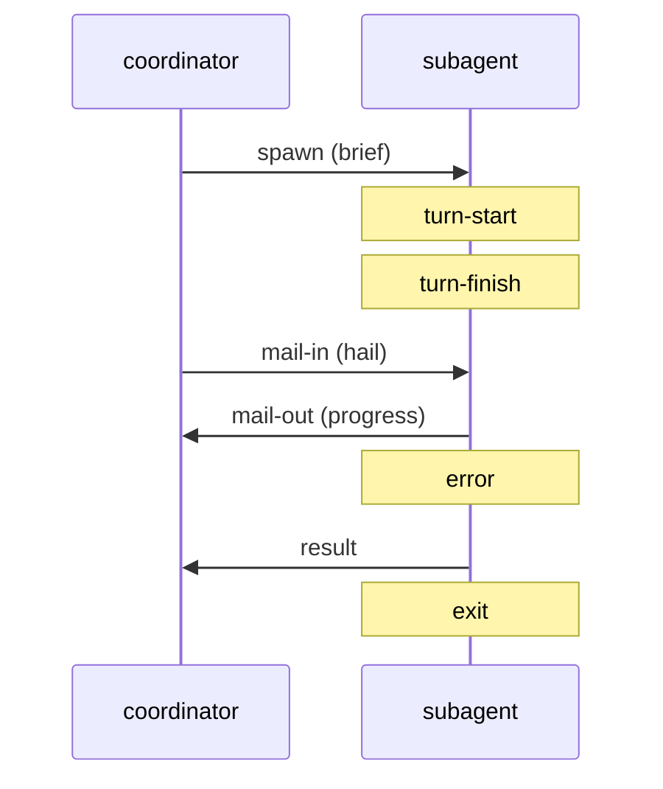
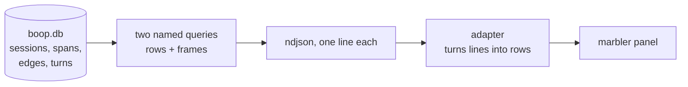
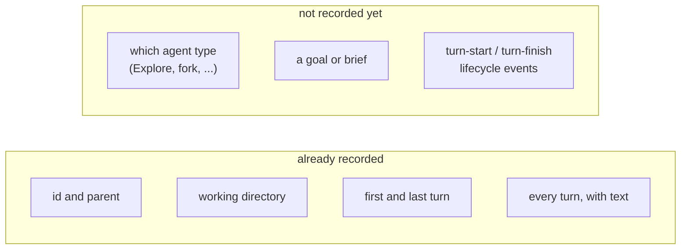
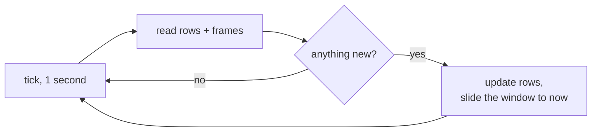
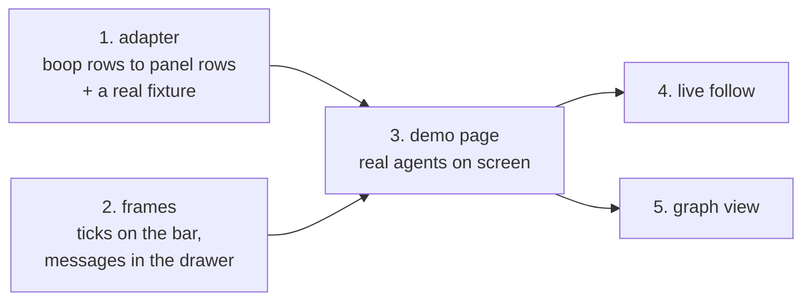

# Agent network view, in plain words

## Contents

- [The one-sentence version](#the-one-sentence-version)
- [What you see](#what-you-see)
- [The row](#the-row)
- [The frames](#the-frames)
- [Where the data comes from](#where-the-data-comes-from)
- [The subagent question, answered](#the-subagent-question-answered)
- [Live follow](#live-follow)
- [Build order](#build-order)
- [Three things I need from you](#three-things-i-need-from-you)

## The one-sentence version

Every agent becomes one row that looks like a websocket connection in the Chrome
network tab: a bar showing how long it lived, tick marks on the bar for every
message, and a messages panel when you click it.

## What you see

## The row

```mermaid
gantt
  dateFormat X
  axisFormat %S s
  title one row is one agent connection
  section coordinator
  claude sprefa-coordinator  :active, c1, 0, 3600
  section its children
  agent-a20ea02e (subagent)  :s1, 400, 3845
  agent-ace31b09 (subagent)  :s2, 900, 1990
  feature-dl6-id-access (lane) :s3, 1200, 2300
  research-openapi (lane)      :s4, 2400, 3100
```

The bar starts when the agent opened and ends when it exited. A bar with no end
is still running, and that row shows a `101` the same way an open websocket does.
Children sit indented under their parent, and the chevron folds them away.

## The frames

Tick marks sit on the bar. Click the row and you get the list.

Eight kinds, colored three ways: arriving, leaving, and happening inside.

| tick | means |
|---|---|
| spawn | somebody started this agent |
| turn-start | it began a turn |
| turn-finish | that turn finished |
| mail-in | a message landed |
| mail-out | it sent a message |
| result | it reported back to its parent |
| error | something broke |
| exit | the connection closed |

## Where the data comes from

Everything already exists on disk. Nothing new gets written.

The store already holds 3571 agent sessions, 6771 live spans, 1871 parent-child
edges, and 449943 turns. The view reads and never writes.

## The subagent question, answered

The ones you cannot see when you hit cmd+period ARE in the store. Every Claude
Code Agent-tool subagent lands there with an id like
`ce26f5c3.../agent-ace31b0935a2057db`, a parent, a working directory, and its
whole turn history. 1250 of them.

So the row draws today. It just says `agent-ace31b09` where you would rather read
`Explore`. Fixing that is a small change on the boop side and I have asked for
it.

## Live follow

The panel already knows how to stick to the right edge as new things arrive. What
it lacks is somebody handing it new data. A one-second tick that re-reads the two
queries is enough, and it skips the redraw entirely when nothing changed.

## Build order

Steps 1 and 2 run at the same time in different packages. Steps 1 through 3 need
no decision from you. Steps 4 and 5 do.

## Three things I need from you

1. How live data reaches the browser: a small dev server that shells out to boop,
   or an endpoint boop serves itself, or a native window that watches the file.
2. Whether the graph picture pulls Instant's existing trace viewer over, or gets
   written fresh here.
3. An agent that is sitting idle with no exit recorded: does that read as an open
   connection, or as unknown? Today the store has exactly one status value and it
   is `idle`, so both readings are available.
