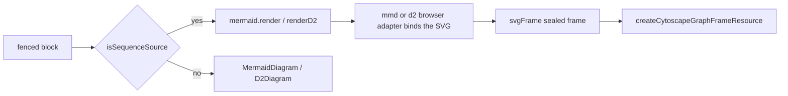

# @hafley66/md

`@hafley66/md` is the Markdown viewer extracted from Instant. It is a React
Dockview panel with document navigation, heading and list folding, a file
explorer, Streamdown rendering, Mermaid and D2 diagrams, and an SVG lightbox.

The package began as Instant's `src/mdview` feature. Before extraction, that
feature directly imported Instant's filesystem commands, Dockview helpers,
plugin registry, application store, persisted plugin state, TreeTable file
browser, zoom system, diagnostics, and pan/zoom viewport. The extraction moved
the renderer and its state into this package and replaced those application
imports with the `MdviewHost` interface in `src/ports.ts`.

The resulting package still implements an Instant-shaped viewer. It does not
provide filesystem access, a dock manager, a file table, or application theme
state. A host application supplies those facilities.

## Runtime structure

| Layer | Implementation | Responsibility |
| --- | --- | --- |
| Panel UI | React | Toolbar, explorer, folded sections, rendered body, diagrams, and lightbox |
| Panel registration | Dockview types plus `MdviewHost` | Register and open `md:<path>` panel instances |
| Reactive state | `@hafley66/signals` | Document cache, current path, folding, explorer visibility, and split layouts |
| Document structure | Unified plus `remark-parse` | Parse headings and list source ranges into the viewer model |
| Markdown rendering | Streamdown | Render the original Markdown slices as React elements |
| Markdown tables | `@hafley66/signal-grid` | Sort, hide/show and resize columns while preserving inline Markdown |
| Reading width | Package state plus `@hafley66/xdom` | Persist bounded prose width and handle pointer resizing under content zoom |
| Code highlighting | `@streamdown/code` | Render fenced code with Shiki |
| Mermaid diagrams | `mermaid` | Render `mermaid` fences to SVG |
| Sequence diagrams | `@hafley66/grapht` plus `@hafley66/grapht-render-cytoscape` | Ingest `sequenceDiagram` and `shape: sequence_diagram` fences as grapht frames |
| D2 diagrams | `@terrastruct/d2` | Compile and render `d2` fences to SVG |
| Split layout | `react-resizable-panels` | Resize the explorer and content panels |
| Diagram viewing | Package React components | Display SVG with pan, zoom, source data, and diagram history |

## Reading controls

The **reading width** toolbar menu contains a slider, pixel width, editable
minimum/maximum bounds, and reset. The grip above the document resizes the
centered prose column. It also supports Left/Right arrow keys and Home/End.
Widths are stored per panel through the existing host plugin-state port; the
last selected width becomes the default for new panels. A narrow pane can
shrink the displayed prose below its preferred minimum without overwriting
the stored width.

Tables, code, and diagram renderers retain the available content width outside
the prose measure. Markdown tables use `@hafley66/signal-grid`, so inline
formatting remains in cells while headers support sorting, column resizing, and
column reordering. Hovering a header reveals its action strip above the header;
at narrow widths the actions collapse into a dot menu. The visibility action
opens a flyout listing visible and hidden columns, and a hidden-column affordance
appears beside the header without reserving another toolbar row. Table height
can be resized independently.

Column width, order, and visibility preferences are stored per table. The
storage identity combines the Git root, the file path relative to that root,
and the table anchor, keeping repeated tables in one document separate. Hosts
can provide the optional `MdviewHost.repoRootFor(path)` resolver to enable the
Git-root identity; when it is absent, the normalized file path is used.

The registered Dockview component activates its own panel on pointer or focus
interaction. The host's existing active-panel zoom resolver can then target
that panel when multiple groups are visible.

## Tests

No jsdom in this package. Three environments, one per kind of test:

| command | environment | what it covers |
| --- | --- | --- |
| `pnpm test` | node | pure model and wiring: the section and block model, fence origins, theme palettes, link resolution, the source index |
| `pnpm test:browser` | chromium (vitest browser mode) | components that need a real DOM and real SVG measurement: the lightbox viewport, the sequence frame, the element-to-bytes resolver |
| `pnpm test:e2e` | chromium (real page, `@hafley66/vitest-playwright`) | the viewer as a user sees it: `fixtures/` mounts the panel over an in-memory host and `tests/*.e2e.test.ts` drives it with locators |

## End-to-end sequence

```text
openMarkdownPanel(path)
  -> MdviewHost.openMdPanel(path, title)
  -> Dockview mounts the registered md:<path> panel
  -> pathSignalFor(panelId, path) supplies the panel's current path
  -> loadMdDoc(path) calls MdviewHost.readText(path)
  -> parseMdSections(text) builds the heading and list-fold model
  -> MdPanel renders the section tree
  -> each expanded section passes its original source slice to Streamdown
  -> ordinary Markdown becomes React elements
  -> mermaid and d2 fences use the package's custom diagram renderers
  -> clicking a rendered SVG opens DiagramLightbox
```

## Why the package accesses Instant state

It does not import Instant state modules. `MdPanel` calls
`MdviewHost.useAppState()`, whose return type is the two values the panel reads:

```ts
interface MdviewAppState {
  dark: boolean;
  panelZoom: Record<string, number>;
}
```

Instant installs a host implementation whose `useAppState` method subscribes
to Instant's store. The package uses `dark` to select Mermaid, D2, and code
themes. It uses `panelZoom[panelId]` to apply Instant's per-tab zoom setting.

This indirection exists because those values were already application-owned
when the viewer lived inside Instant. Moving another store into the package
would create separate theme and zoom state. The host interface keeps Instant's
existing store authoritative while removing source imports from the package
back into the application.

The same extraction rule applies to the rest of `MdviewHost`:

| Host member | Why it remains host-owned |
| --- | --- |
| `readText`, `readImage`, `listDir` | Instant performs native filesystem operations through Tauri |
| `watchFile` | Instant owns watcher sharing and teardown |
| `FileTree` | Instant supplies its canonical TreeTable file browser |
| `PanZoomViewport` | Instant supplies its shared media viewport |
| `openMdPanel`, `mdPanelId` | Instant owns the Dockview layout and panel identifiers |
| `registerPlugin` | Instant owns plugin discovery and routes |
| `registerZoomKind`, `resetPanelZoom` | Instant owns keyboard zoom and per-panel zoom state |
| `readPluginState`, `savePluginState` | Instant owns persisted plugin settings |
| diagnostic hooks | Instant owns render, lifecycle, and operation probes |

## Installing the host

The host must be installed before calling `registerMdview()` or mounting a
viewer component:

```ts
import {
  installMdviewHost,
  registerMdview,
  type MdviewHost,
} from "@hafley66/md";

const host: MdviewHost = {
  // Application implementations for filesystem, Dockview, state, TreeTable,
  // pan/zoom, persistence, zoom, routing, and diagnostics.
};

installMdviewHost(host);
registerMdview();
```

`getMdviewHost()` throws when a component reads the host before installation.

## Parsing and rendering

The viewer performs structural parsing and visual rendering as separate
operations.

`parseMdSections(text)` uses `remark-parse` to produce an mdast tree. It derives
an `MdDoc` containing:

- heading sections and parent-child relationships;
- stable heading IDs;
- source offsets for each section;
- list and long-item folding ranges.

The offsets let `MdPanel` pass the original, unmodified source slice for each
expanded section to Streamdown. Streamdown handles paragraphs, inline markup,
links, lists, tables, images, and code blocks. The structural model controls
which source slices exist in the React tree at a given time.

Links are intercepted by package React components. Fragment links expand the
required heading chain. Relative Markdown links resolve against the current
document and navigate the existing panel. Other links are delegated to
`MdviewHost.openHref`.

## Diagram rendering

`0_Streamdown.tsx` registers custom fence renderers for `mermaid` and `d2`.

Mermaid rendering initializes Mermaid with the current light or dark palette,
renders the source to SVG, and inserts the SVG into a clickable React
component.

D2 rendering dynamically imports `@terrastruct/d2` on the first D2 block,
creates one cached D2 instance, compiles the source, and renders the compiled
diagram to SVG. The dynamic import keeps the D2 renderer out of the initial
viewer execution path.

Both renderers use `DiagramLightbox`. The lightbox is a React portal mounted
under `document.body`; it rewrites the SVG `viewBox` for pointer pan and wheel
zoom. Instant's terminal diagram overlay also imports this lightbox, the shared
diagram palettes, and `renderD2` from this package.

## State and lifetime

| State | Storage | Lifetime |
| --- | --- | --- |
| Fold defaults and explorer visibility | `mdUi` signal plus host plugin persistence | Application sessions |
| Split layouts | `mdUi.layouts[panelId]` plus host plugin persistence | Application sessions |
| Current document path | Signal keyed by Dockview panel ID | Open panel |
| Loaded text and parsed `MdDoc` | `mdDocs[path]` signal | Cached document |
| Collapsed headings | Signal keyed by document path | Open document session |
| Folded list blocks | Signal keyed by document path | Open document session |
| Mermaid component result | React state | Mounted diagram |
| D2 renderer instance | Module-level cached promise and instance | JavaScript runtime |
| Open lightbox | React state | Mounted diagram or terminal overlay |

Filesystem watches call `reloadMdDoc(path)`, replacing the cached text and
parsed model. Signal subscriptions cause the mounted panel to render the new
document.

## Styling contract

Package components emit selectors including:

```text
.mdview-root
.mdview-content
.mdview-head
.mdview-streamdown
.mdview-mermaid
.mdview-d2
.diagram-lightbox
```

The package stylesheet owns Markdown layout, Streamdown/Shiki corrections,
fold controls, diagram surfaces, and lightbox layout. Its rules consume host
theme variables when available:

```css
var(--panel-bg)
var(--panel-fg)
var(--frame)
var(--row-hover)
var(--term-bg)
```

Instant defines those variables through its active skin. This makes the viewer
inherit panel colors and borders without importing Instant's stylesheet.
Mermaid and D2 use explicit paired palettes selected from the host's `dark`
state.

The package exports its generated stylesheet as `@hafley66/md/style.css`.
Hosts import that stylesheet once from their composition root.

## Public exports

`isMarkdownPath` and `markdownHeadingRows` identify Markdown files and project their headings into tree rows.

The SVG viewport helpers parse source bounds, normalize entities, fit, zoom, pan, and manage painted surfaces.

`DiagramRenderCache` shares in-flight renders and bounds retained SVG output by bytes and entries.

`d2SiblingPaths` and `resolveD2Preview` choose a sibling SVG, rendered source SVG, or PNG fallback.

```ts
installMdviewHost
getMdviewHost
registerMdview
openMarkdownPanel
parseMdSections
mdDocument
blockAt
withFenceOrigins
fenceOriginOf
absoluteSpan
sourceSpanOfElement
sequenceSourceIndex
sequenceFrame
sequenceFrameWithSource
preloadD2
renderD2
DiagramLightbox
diagramSvgMarkup
diagramPalette
mermaidTheme
d2ThemeId
```

The markdown structural model is owned by `@hafley66/grapht-model`, which reads a document
into sections and blocks with absolute source offsets. `parseMdSections`, `mdDocument`, and
`blockAt` are re-exported here, so existing callers keep the same names.

The package exports `MdviewHost` and `DiagramLightboxEntry` as types.

## Sequence diagrams through grapht

Two fence shapes leave the plain SVG path and mount a grapht frame instead:

| fence | condition | component |
| --- | --- | --- |
| `mermaid` | first non-frontmatter, non-directive, non-comment line starts with `sequenceDiagram` | `SequenceDiagram` |
| `d2` | source contains `shape: sequence_diagram` | `SequenceDiagram` |
| every other `mermaid` fence | | `MermaidDiagram` |
| every other `d2` fence | | `D2Diagram` |

`isSequenceSource(language, code)` is the pure routing predicate; `0_Streamdown.tsx` calls it
inside the two stable renderer callbacks.



`sequenceFrame` recovers native actor and message bindings through `@hafley66/mmd/browser` or
`@hafley66/d2/browser`. A source the language adapter cannot bind still ingests as a
source-preserving sealed frame, so the fence keeps rendering.

Known limitation: `@hafley66/mmd`'s message pattern reads `Bob-->>Alice` as a participant named
`Bob-`, so dashed-arrow mermaid messages take the unbound sealed path.

A fence's absolute origin rides in its info string as `{md-origin=<codeStart>:<lineStart>}`,
because Streamdown hands a fenced renderer its code, language, and metastring but not its
position. The metastring is invisible in the rendered header, the fence body is untouched,
and two identical fences keep distinct origins. `sourceSpanOfElement` turns a rendered
element back into the bytes it came from, and `sequenceSourceIndex` exposes the same record
for a graph id.

The grapht host carries `data-grapht-host="<language>"` and `data-grapht-items="<graph size>"`.
The corner button opens the rendered SVG in the existing `DiagramLightbox`.
