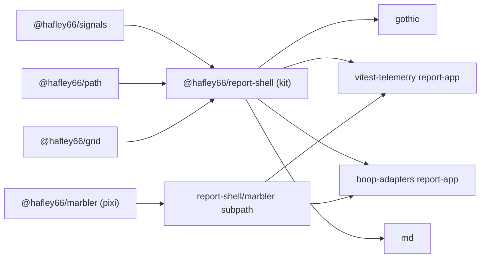
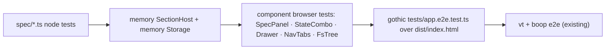

# UI kit unification: plan

Companion to `SITREP-2026-09-07-ui-kit.md` (inventory, duplication, gaps). This file is the build plan: what the kit is, its types, how state lives, the migration order, and the e2e vitest receipts that gate each step.

## TOC

1. Goal and scope
2. Target shape
3. Type signatures
4. Pseudo-code bodies
5. Instance lifetimes
6. Storage layout, read/write sequence, uniqueness
7. Migration steps with gates
8. E2E receipts: test plan
9. Decisions taken
10. Out of scope

## 1. Goal and scope

| item | value |
|---|---|
| goal | one kit package every demo app imports for: nav tabs, sticky knob drawer, spec-driven rows, state combobox, sidebar rail + gutter, popover, grid + fs tree grid, tokens, URL section state, named-state autosave |
| kit package | `@hafley66/report-shell` (sitrep §4.1). Rename is a later decision; exports stay stable |
| consumers after | `gothic`, `vitest-telemetry/report-app`, `boop-adapters/report-app`, `marbler` demo, `md` (components only) |
| stays separate | `@hafley66/grid` (TanStack), `@hafley66/marbler` (pixi), `@hafley66/signals`, `@hafley66/path` |
| receipts | vitest browser mode in the kit (`*.browser.test.tsx`, playwright provider, same as grid), raw-playwright e2e files in each app (`tests/*.e2e.test.ts`, same as vitest-telemetry), one root command runs all |

## 2. Target shape



Kit source layout after the plan:

| path | contents | origin |
|---|---|---|
| `src/spec/0_spec.ts` | `Field`, `Spec`, `ValuesOf`, zod derivation, `shuffle`, `rollField`, pins, `describe` | gothic `kit/0_spec.ts` |
| `src/spec/1_url.ts` | namespaced query: `queryRoute`, `parseSearch`, `printSearch`, `mergeSearch` | gothic `kit/1_url.ts` |
| `src/spec/2_store.ts` | named states + autosave + selected, over `Storage<string>` | gothic `kit/3_store.ts` |
| `src/spec/3_sections.ts` | `createSections(host)` factory: `sectionState`, `commit`, `syncFromUrl`, `setActivePage` | gothic `app/2_state.ts` |
| `src/components/NavTabs.tsx` | tab row + anchor row + title row on a fixed grid | gothic `ui/3_Header.tsx` |
| `src/components/Drawer.tsx` | sticky `<details>` under the tabs, summary slot, `--kit-drawer` var | gothic `app/4_App.tsx` |
| `src/components/SpecPanel.tsx` | one panel per section: head, `StateCombo`, group columns, rows | gothic `ui/1_Bar.tsx` |
| `src/components/StateCombo.tsx` | combobox over the store | gothic `ui/1_Bar.tsx` `Combo` |
| `src/components/Section.tsx` | portals its panel into the drawer, renders title + host, anchors, scroll keep | gothic `ui/2_Section.tsx` |
| `src/components/FsTree.tsx` | `TreeTable` preset: path, size, age columns, lazy children | new, over grid |
| `src/lib/hooks.ts` | `useAnchor`, `useResizeVar`, `useDrawIn`, `stagger` | gothic `ui/0_hooks.ts` |
| `src/style.css` | tokens (existing) + `@layer components` kit classes (`kit-*`) + grid `--grid-*` defaults | existing + gothic `app.css` |
| `src/marbler.ts` | `EventsPanel`, `syncMarbler` | existing, moved behind a subpath |
| `vitest.browser.config.ts` | browser-mode receipts | new, copy of grid's |

Gothic keeps: `src/pages/**`, `src/lib/**`, `src/algos/**`, `src/kit/2_algo.ts` + `ui/4_Algo.tsx` (the algo contract is gothic's), its router (`app/1_router.ts`, hash mode on file://), Tailwind for page bodies only.

## 3. Type signatures

```ts
// spec/3_sections.ts
export type Mode = "replace" | "push"
export type SectionHost = {
  search: Signal<string>                       // the live query string, owned by the app's router
  write(search: string, mode: Mode): void      // history.replaceState / pushState
  storage(key: string): Storage<string>        // localStorage by default, memory in tests
  transition?(fn: () => void): void            // optional startViewTransition wrapper
}
export type Sections = {
  sectionState<S extends AnySpec>(page: string, id: string, spec: S, presets?: Presets<ValuesOf<S>>): SectionState<S>
  setActivePage(page: string, search: string): void
  syncFromUrl(search: string): void
  commit(mode: Mode, fn: () => void): void
}
export function createSections(host: SectionHost): Sections

export type SectionState<S extends AnySpec> = {
  page: string; id: string; spec: S; presets: Presets<ValuesOf<S>>
  values: Signal<ValuesOf<S>>; pins: Signal<PinValues>; states: Signal<Saved[]>; selected: Signal<number | null>
  set(patch: Partial<ValuesOf<S>>, mode?: Mode): void
  rollAll(): void; roll(key: keyof S & string): void; togglePin(key: string): void
  applyPreset(name: string): void
  save(name: string): void; load(id: number): void; select(id: number | null): void; star(id: number): void; remove(id: number): void
}

// spec/2_store.ts
export function store(key: string, kv: Storage<string>): Store   // was: (key, ls: localStorage)

// components/NavTabs.tsx
export type Tab = { id: string; label: string; href: string; current?: boolean; title?: string }
export type Anchor = { id: string; label: string }
export function NavTabs(p: { tabs: Tab[]; anchors: Anchor[]; title: string; onNavigate?(tab: Tab, e: MouseEvent): void; end?: ReactNode }): ReactNode

// components/Drawer.tsx
export const DRAWER_BODY_ID = "kit-panels"
export function Drawer(p: { summary: ReactNode; pageKey: string; open?: boolean }): ReactNode

// components/SpecPanel.tsx
export function SpecPanel(p: { state: SectionState<AnySpec>; title: string; extra?: ReactNode }): ReactNode

// components/StateCombo.tsx
export function StateCombo(p: { state: SectionState<AnySpec> }): ReactNode

// components/Section.tsx
export function Section<S extends AnySpec>(p: { sections: Sections; page: string; def: SectionDef<S>; extra?: ReactNode; children(v: ValuesOf<S>, ctx: { state: SectionState<S> }): ReactNode }): ReactNode
export function PlainSection(p: { id: string; title: string; children: ReactNode }): ReactNode

// components/FsTree.tsx
export type FsRow = { id: string; path: string; name: string; kind: "dir" | "file"; size?: number; mtime?: number; children?: FsRow[]; loaded?: boolean }
export function fsColumns(o?: { age?: boolean; size?: boolean; now?: number }): TreeColumn<FsRow>[]
export function FsTree(p: { rows: Signal<FsRow[]>; getChildren?(row: FsRow): Promise<FsRow[]>; onOpen?(row: FsRow): void; maxHeight?: number }): ReactNode
```

## 4. Pseudo-code bodies

```ts
export function createSections(host) {
  // cells: Map<"page.id", Cell>; active page; applying flag; last written search
  // nsSpecs() = specs of active cells + PIN_SPEC per namespace
  // writeUrl(mode): search = mergeSearch(host.search.$(), printSearch(nsValues(), specs), specs); host.write(search, mode)
  // commit(mode, fn): (host.transition ?? id)(() => { modeRef = mode; fn(); modeRef = "replace" })
  // syncFromUrl(search): if search === written return; parse; applying = true; set every active cell; applying = false
  // sectionState(page, id, spec, presets):
  //   key = `${page}.${id}`; return cached
  //   st = store(`${prefix}.${key}`, host.storage(...)); start = defaults <- autosave <- url keys present
  //   values/pins/states/selected signals; on change (skip first): persist (autosave + selected state) then writeUrl(modeRef)
  //   save(name): byName ? update : add; select
  //   roll(k): set({[k]: rollField(spec[k], rng(freshSeed()))}, "push")
}

// StateCombo keyboard model
//   focus -> open list; blur -> close (list buttons preventDefault on mousedown so clicks land first)
//   change: if text matches a saved name exactly -> load(id) (selects); else keep typing (datalist filters natively)
//   Enter: text non-empty -> save(text) (create or overwrite by name, selects); Escape -> blur
//   ArrowDown/ArrowUp: move `active` index over the visible rows; Enter on an active row -> load(id)
//   row buttons: name -> load; star -> star; × -> remove (clears selected when it was that one)

// fsColumns
//   path: tree column, toggleExpand, cell = name with dir glyph; sortValue = kind rank then name (dirs first)
//   size: cell = formatBytes(size) for files, "" for dirs; sortValue = size
//   age:  cell = formatAge(mtime, now) (report-shell lib/time); sortValue = mtime
// FsTree
//   grid = createGrid({ rows, columnDefs: treeColumnDefs(fsColumns()), getSubRows: r => r.children })
//   on expand of a dir with loaded === false and getChildren: fetch, patch rows signal (children, loaded: true)
//   <TreeTable grid indentGuides onRowClick={r => r.kind === "file" && onOpen?.(r)} />

// Drawer
//   <details class="kit-drawer" open ref><summary>{summary}</summary><div id={DRAWER_BODY_ID} key={pageKey}/></details>
//   useResizeVar(ref, "--kit-drawer"); section titles use top: calc(var(--kit-top) + var(--kit-drawer))
```

## 5. Instance lifetimes

| type | created | lives | destroyed |
|---|---|---|---|
| `Sections` (factory result) | once per app at module load with the app's `SectionHost` | app lifetime | never |
| `SectionState` | first `sectionState(page, id, ...)` call | app lifetime, cached in the factory map; re-used across route visits | never (values survive route changes; URL sync re-applies on return) |
| `Store` | inside `sectionState` | same as its `SectionState` | never |
| `Cell` map entry | with `SectionState` | app lifetime; filtered by active page for URL work | never |
| `Drawer` DOM | per `App` render, keyed by page id | one route | route change (portals re-attach on the new body) |
| `SpecPanel` | per `Section` mount, portaled into the drawer body | section mounted | section unmount |
| `StateCombo` open/text state | per panel | while focused / mounted | blur / unmount |
| `Clock` (`useClock`) | per animated body | body mounted | body unmount (`stop()`) |
| grid `Grid` in `FsTree` | `useMemo` per `FsTree` mount | mount | unmount |
| view timeline names (`useAnchor`) | per section mount | section mounted | unmount removes the name from `timeline-scope` |

## 6. Storage layout, read/write sequence, uniqueness

| store | key | value | writer | reader |
|---|---|---|---|---|
| localStorage | `<prefix>.<page>.<section>.current` | `{ vals, pin }` | every value/pin change | `sectionState` start (after defaults, before URL) |
| localStorage | `<prefix>.<page>.<section>.states` | `Saved[]` `{ id, name, star, vals, pin }` | save / update / star / remove | combobox list, `load` |
| localStorage | `<prefix>.<page>.<section>.selected` | `number \| null` | `select`, `remove` of the selected id | `sectionState` start |
| localStorage | `<prefix>.tracks`, `<prefix>.nav-collapsed` | layout px, bool | gutter, NavRail | `layout()` |
| URL query | `?<section>.<key>=` only for non-default values; `?<section>.pin=a,b`; `?page.z`, `?page.draw` | strings | `writeUrl` after each change (`replace`), shuffle / preset / load (`push`) | `syncFromUrl` on popstate, route change, first load |
| CSS vars on `:root` | `--kit-top`, `--kit-drawer`, `--kit-zdepth`, `--kit-ms`, `--w`, `--track-*` | px / numbers | ResizeObserver, page knobs, layout | stylesheet |

Sequence on load: defaults → autosave → URL keys present → render → (skip first) every later change writes autosave, selected state, URL.
Sequence on popstate: `syncFromUrl` sets values under `applying`, so no URL write echoes back.

Uniqueness: `page.id` identifies a section state; `Saved.id` = `max(Date.now(), ids+1)` so it is strictly increasing per section; `Saved.name` is unique per section by construction of `save` (create or overwrite by name); one `SectionHost` per app; one `Sections` factory per host; one drawer body element per page render (`id` + `key`).

## 7. Migration steps with gates

Each step is one commit. A gate is the exact command list that must pass before the commit.

| # | step | files (owner: this session) | net lines | gate |
|---|---|---|---|---|
| 1 | marbler subpath: `src/marbler.ts`, `exports["./marbler"]`, `@hafley66/marbler` peer optional, vt + boop import from the subpath | report-shell `package.json`, `src/marbler.ts`, `src/index.ts`, `vite.config.ts`, `README.md`; vt `App.tsx`, `model.ts`; boop `App.tsx`, `model.ts` | +20 / −4 | `pnpm --filter @hafley66/report-shell receipts`; `pnpm --filter @hafley66/vitest-telemetry test` then `vitest -c vitest.e2e.config.ts`; boop e2e |
| 2 | kit core: `src/spec/{0_spec,1_url,2_store,3_sections}.ts` + tests moved; `Storage<string>` seam on the store; `SectionHost` seam on sections; browser test config; gothic imports the kit (its `kit/` becomes re-exports, then deleted) | report-shell `src/spec/**`, `vitest.browser.config.ts`, `package.json` (`zod`, `@hafley66/path` deps); gothic `src/kit/*`, `src/app/2_state.ts` | +600 / −560 | report-shell receipts + `test:browser`; `pnpm --filter @hafley66/gothic check` |
| 3 | kit components: `NavTabs`, `Drawer`, `SpecPanel`, `StateCombo`, `Section`, `hooks`; plain-css `kit-*` classes into `style.css` mapped onto the token names; gothic switches its `ui/` to the kit, its `app.css` keeps only theme mapping, depth, draw-in, page css | report-shell `src/components/*`, `src/lib/hooks.ts`, `style.css`; gothic `src/ui/*`, `src/app/4_App.tsx`, `app.css` | +700 / −650 | browser receipts for rows, combo, drawer, tabs; gothic e2e (§8) |
| 4 | gothic smoke becomes `tests/app.e2e.test.ts` (raw playwright over `dist/index.html`, vt style); `check` runs it | gothic `tests/`, `vitest.e2e.config.ts`, `package.json`, `scripts/0_smoke.mjs` deleted | +160 / −60 | `pnpm --filter @hafley66/gothic check` |
| 5 | `NavTabs` adopted by vt and boop headers (tab list = report sections; anchors = nav roots) | vt `Header.tsx`, boop `Header.tsx`, their css | +40 / −120 | vt + boop e2e unchanged |
| 6 | tokens: kit `style.css` defaults for the 14 `--grid-*` names; vt deletes its mapping block; marbler `--marbler-*` defaults move behind the marbler subpath css | report-shell `style.css`, `src/marbler.css`; vt `style.css` | +70 / −43 | grid browser screenshots unchanged; vt e2e |
| 7 | `FsTree` preset over grid `TreeTable`: `fsColumns`, lazy children, `formatBytes`; browser receipt with a 3-level tree | report-shell `src/components/FsTree.tsx`, `src/lib/bytes.ts`, browser test | +220 | report-shell `test:browser` |
| 8 | delete `NavGrid` once boop uses `TreeTable`; root `receipts:ui` script | report-shell `NavGrid.tsx`, `index.ts`, `README.md`; boop nav; root `package.json` | −111 | full `pnpm receipts:ui` |

Status (2026-09-07): all 8 steps landed on main: 1 `784de8f`, 2 `e443231`, 3 `3a1a50c`, 4 `0e98419`, 5 `6e3d5eb`, 6 `acf5dfc`, 7 `c3fc39a`, 8 this commit. Gate for the whole set: `pnpm receipts:ui` at the root.

Order rationale: 1 removes pixi from every consumer before anything else imports the kit; 2 moves state before components so component tests run against the final state API; 4 converts gothic's smoke early so steps 5 to 8 have an app-level receipt on the richest consumer.

## 8. E2E receipts: test plan

What breaks if this is wrong: a knob edit that does not reach the URL or the selected state loses work silently; a drawer whose height var is stale hides section titles under it; a combobox that saves on the wrong key duplicates or overwrites states; a tab row whose x positions differ per route makes the header jump; an fs tree that never lazy-loads shows empty folders.

Units under test:

- `spec/1_url.ts` namespaced round trip (node test, moved)
- `spec/2_store.ts` over a memory `Storage` (node test, moved and extended: update, byName, selected)
- `spec/3_sections.ts` with a memory `SectionHost` (node test, new)
- `SpecPanel` rows, `StateCombo`, `Drawer`, `NavTabs`, `FsTree` (browser tests, new)
- gothic app end to end over `dist/index.html` (e2e file, converted smoke)
- vt and boop report apps (existing e2e files, must stay green)

Seam: the kit's browser tests mount one component with a memory host; the app e2e drives the built single file through real history and localStorage.



| case | input | expected | why this case exists |
|---|---|---|---|
| url round trip | `printSearch({slice:{cut:20,seed:7}})` then `parseSearch` | defaults omitted, `slice.cut=20` only, foreign key `x=1` preserved | the URL is the shareable receipt of a view |
| store save by name | `save("tight")` twice with different values | one record, second values, selected = its id | duplicate names were the old chip behaviour |
| store remove selected | `select(id)` then `remove(id)` | `selected()` null | a dangling selected id would write into nothing |
| sections start order | autosave `{cut:30}`, url `?slice.cut=20` | values.cut = 20 | URL wins over autosave, defaults lose to both |
| sections popstate | `syncFromUrl("?slice.cut=12")` | values updated, no `host.write` call | echo writes would corrupt history |
| row edit | drag `cut` range in `SpecPanel` | `output` shows the value, `values.cut` updated, url `replace` | the row is the whole reason for the panel |
| pin skips shuffle | pin `cut`, click shuffle | `cut` unchanged, `seed` changed, `?slice.pin=cut` | pins are the study tool |
| reroll one | click ↻ on `cut` | only `cut` changes, one `push` | new behaviour, no other coverage |
| combo fork | type `tight`, Enter | new state selected (●), list shows it | create path |
| combo overwrite | type existing name, Enter | same id, new values | overwrite path, the uniqueness rule |
| combo select by typing | type an existing name exactly | that state loads (`push`), selected | datalist selection has no click to test otherwise |
| combo star / delete | click ☆ then × on a row | star toggles; row gone; selected cleared when it was that row | per-row actions were the ask |
| combo keyboard | ArrowDown ×2, Enter | second row loads | keyboard model is otherwise unspecified (sitrep §5) |
| drawer fold | click summary | `--kit-drawer` shrinks to the summary height; section title `top` equals drawer bottom | the wireframe's sticky bug |
| tabs fixed x | render `NavTabs` with 3 vs 12 anchors | tab x positions identical | header must never jump between routes |
| tooltips everywhere | query every drawer control | each has `title` on itself, its label, or its row | user rule: every input has a tooltip; smoke already checks it |
| fs tree lazy | expand a dir with `loaded:false` | `getChildren` called once, rows appear, glyph flips | lazy loading is the md need |
| fs tree sort | click size header | files sorted by size, dirs first | sortValue on dirs must not interleave |
| gothic routes | visit each tab in `dist/index.html#/…` | svg present, zero page errors, tabs same x, drawer present | the app-level receipt, converted smoke |
| gothic history | edit, shuffle, back | values return to pre-shuffle, url matches | push vs replace modes |
| gothic file:// | open `dist/index.html#/eye` | renders, hash routing active | the single-file promise |

Untested and why:

- view transitions: `startViewTransition` timing is engine-driven and already guarded (first mount skipped); asserting it would test Chromium, not the kit.
- scroll-driven anchor highlight: named view timelines have an IntersectionObserver fallback; the receipt would need scroll geometry that differs per viewport. A follow-up once `animation-timeline` lands in Firefox stable.
- pixel screenshots of gothic art: generators are seeded and pure; their tests belong to `src/lib`, not the kit.
- md's host-injected storage: md cannot use kit storage (sitrep §5), so its adoption covers components only and its own tests stay.

Receipt commands:

```bash
pnpm --filter @hafley66/report-shell receipts          # typecheck + node tests + build
pnpm --filter @hafley66/report-shell test:browser      # component receipts
pnpm --filter @hafley66/gothic check                    # typecheck + tests + build:single + tests/app.e2e.test.ts
pnpm --filter @hafley66/vitest-telemetry test && pnpm --filter @hafley66/vitest-telemetry exec vitest run -c vitest.e2e.config.ts
pnpm --filter @hafley66/boop-adapters test              # includes its e2e
pnpm receipts:ui                                        # root: all of the above, added in step 8
```

## 9. Decisions taken

| decision | pick | reason |
|---|---|---|
| Tailwind in the kit | no. Kit ships plain css classes `kit-*` in `style.css`; gothic keeps Tailwind for page bodies and maps its `@theme` colours onto the kit token names | 1 of 23 packages uses Tailwind (sitrep §5); kit consumers must not inherit a build plugin |
| framework | React only (`SignalReact`) | 38 call sites, no framework-free consumer today |
| router seam | `SectionHost` interface; gothic passes its hash-aware router, others pass `signalHistory` | the only gothic-specific import inside the old kit |
| storage seam | `Storage<string>` from signals through `storageSignal`; the store exposes `current`, `states`, `selected` as signals; `SectionHost.storage(key)` defaults to `localStorageAdapter`; `memoryStorage()` (kit, `2_store.ts`) in tests, its `write.next` stores silently like localStorage and `set()` plays the other tab | md and tests cannot use `localStorage`; no second storage contract beside signals |
| NavTabs in vt + boop (step 5) | one tab (the report name, `current`), no anchors, the filter bar in the `end` slot; the slot is `nowrap` and shrinks so the row stays 34px; boop scrolls its slot sideways | the reports have one view each today; a second view is one more `Tab` entry |
| host search | `SectionHost.search(): string` getter (step 2) instead of the `Signal<string>` in §3 | gothic keeps one `loc` signal of `{path, search}`; a getter avoids a derived signal the kit never subscribes to |
| knob drawer per section (user 2026-09-07: "knobs belong to section not for whole page") | `Section` renders its own sticky `<details class="kit-drawer">` (summary = title, body = its `SpecPanel`), sticky under the tabs only while its section is in view; the page-level `Drawer`, the `#kit-panels` portal and `--kit-drawer` are gone; page-wide knobs sit in the `NavTabs` `end` slot | a six-section page (arches) stacked six panels in one drawer; the knobs now sit with the art they drive |
| TanStack | stays in `@hafley66/grid`; the kit peer-depends on grid only for `FsTree` | 1870 lines and 13 screenshot baselines stay where they are |
| combobox keyboard | ArrowUp/Down over rows, Enter loads the active row or saves the typed name, Escape blurs; native `datalist` does the text filtering | smallest model that covers the wireframe |
| marbler | behind `@hafley66/report-shell/marbler`; peer optional | pixi stops entering every consumer (sitrep step 1) |
| json-rx | untouched | different type system (JSON Schema + RJSF + MUI) |

## 10. Out of scope

- renaming `@hafley66/report-shell`
- a framework-free (xdom / rxjsx) tier
- md's storage (host-injected)
- json-rx's form stack
- grid internals beyond `FsTree` and the token defaults
