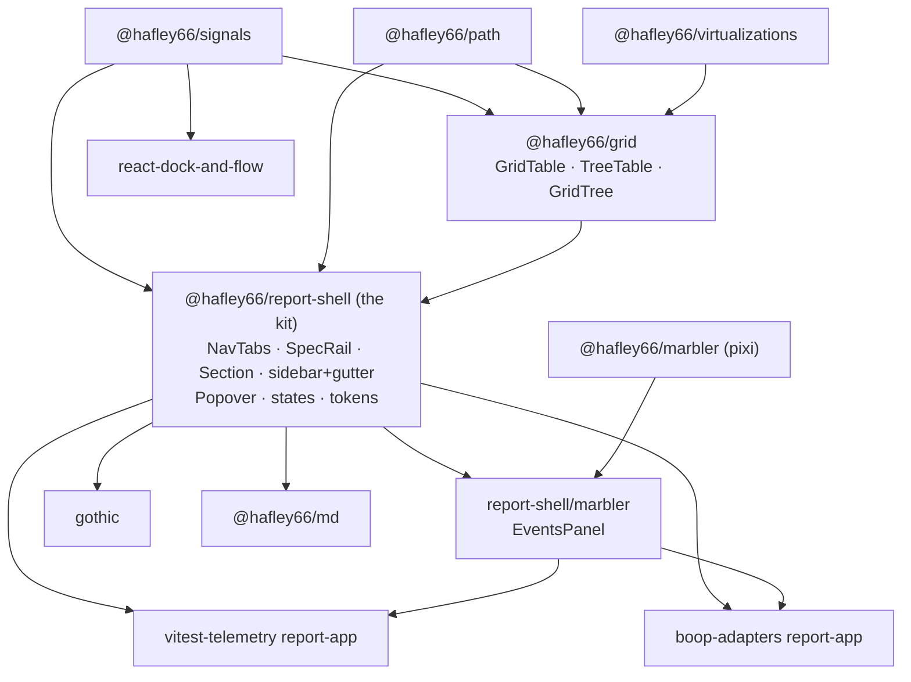

# UI kit sitrep, 2026-09-07

Survey of every reusable UI piece in `hafley-rxjs` (23 workspace packages + 8 `grapht/adapters/*`),
scored against one wanted kit: one nav tabs system, a resizable collapsible sidebar, grid, tree grid
for filesystem tables, combobox, spec-driven form rows, popover, theme tokens, URL state per section,
named states autosave, all over `@hafley66/signals` + `@hafley66/path`.

> Status note (same day, after the survey): gothic landed the knob drawer in the meantime. `gothic/src/ui/1_Bar.tsx` now
> renders the wireframe row (pin / label / control / `<output>` / reroll with a `<datalist>` default tick) and the state
> combobox (selected state receives every edit, Enter forks a new one, star and delete per row). §3 rows "Combobox" and
> "Spec-driven form rows" are therefore mostly done inside gothic; the remaining delta is the move into this package and
> the Tailwind to plain-css port. §4.5 step 3 and step 6 shrink accordingly.

## TOC

1. [Inventory](#1-inventory)
2. [Duplication](#2-duplication)
3. [Gaps vs the wanted kit](#3-gaps-vs-the-wanted-kit)
4. [Consolidation proposal](#4-consolidation-proposal)
5. [Risks and open decisions](#5-risks-and-open-decisions)
6. [Receipts](#6-receipts)

---

## 1. Inventory

One row per implementation found. `state` = signals / react = React `useState` / DOM = direct
element writes. `URL` = binds to the address bar. `tests` = test files covering that file's directory.

| # | Piece kind | Package | Path | Exported symbols | State | Styling | Storage key | URL | Tests | Consumers |
|---|---|---|---|---|---|---|---|---|---|---|
| 1 | tabs/header | gothic | `packages/gothic/src/ui/3_Header.tsx` (94) | `Header` | signals (`pageState`) | Tailwind v4 utilities | via `sectionState` | yes, `?page.z`, `?page.draw` | 0 direct | gothic only |
| 2 | tabs/header | vitest-telemetry | `packages/vitest-telemetry/src/report-app/components/Header.tsx` (57) | `Header` | signals (`model.continuous`) | `style.css` classes | `vitest-telemetry.prefs` | via `historyAdapter` in model | 16 pkg-wide | report bundle |
| 3 | tabs/header | boop-adapters | `packages/boop-adapters/src/report-app/components/Header.tsx` (58) | `Header` | signals | `style.css` classes | `boop-network.prefs` | via `historyAdapter` | 7 pkg-wide | report bundle |
| 4 | tabs | marbler | `packages/marbler/src/3_demo.tsx:59-70` (74) | none (demo) | react `useState` | `2_marbler.css` | none | no | 10 pkg-wide | demo only |
| 5 | tabs | react-dock-and-flow | `packages/react-dock-and-flow/src/2_DockAndFlow.tsx` (113) | `DockAndFlow` | signals + dockview api | dockview theme css | dockview layout json | no | 4 | none in-repo |
| 6 | tabs/toolbar | md | `packages/md/src/MdPanel.tsx:391-470` (473) | `MdPanel` | signals (`mdUi`) | `mdview.css` (334) | host `savePluginState` | no | 4 | external host app |
| 7 | sidebar/rail | report-shell | `packages/report-shell/src/components/ReportShell.tsx` (44) + `NavRail.tsx` (39) + `lib/navCollapse.ts` (26) | `ReportShell`, `NavRail`, `createNavCollapse`, `NAV_RAIL_PX` | signals | `style.css` `.nav-rail-toggle` | `${storageKey}.tracks`, `${storageKey}.nav-collapsed` | no | 6 | vitest-telemetry, boop-adapters |
| 8 | sidebar/rail | md | `packages/md/src/MdPanel.tsx:394-413` + `MdExplorer.tsx` (77) | `MdPanel`, `MdExplorer` | signals + react `useState` | `mdview.css` | host plugin state, `layouts[pid]` | no | 4 | external host app |
| 9 | resize gutter | report-shell | `packages/report-shell/src/layout.ts` (136) | `layout`, `gutter`, `Track`, `GutterOptions` | signals + `storageSignal` | `.gutter`, `.gutter-x/-y` | `${key}.tracks` | no | 2 (`layout.test.ts`, `sizing.test.ts`) | vitest-telemetry, boop-adapters |
| 10 | resize memory | report-shell | `packages/report-shell/src/sizing.ts` (61) + `sizingRestore.ts` (104) | `createSizingStore`, `Sizing`, `SizingStore` | signals | n/a | consumer-supplied `Storage<string>` | no | 1 (104-line spec test) | report-shell `layout` |
| 11 | resize gutter | md | `packages/md/src/MdPanel.tsx:8,394-412` | n/a | `react-resizable-panels` `PanelGroup` | library css | `mdUi.layouts` | no | 4 | external host app |
| 12 | resize handle | marbler | `packages/marbler/src/2_marbler.css:117-124`, `1b_TimeNavigatorPixi.tsx` | `TimeNavigatorPixi` | signals + pointer events | hardcoded hex in css | none | no | 10 | boop-adapters, vitest-telemetry |
| 13 | grid | grid | `packages/grid/src/2_createGrid.ts` (172), `4_grid.tsx` (397) | `createGrid`, `GridTable`, `useGrid`, `useGridEffect`, `gridStateParam`, `defaultGridState`, 12 `on*Change` | signals (`createSlice`) + rxjs epics | inline styles + `var(--grid-*)` hooks, **no shipped css file** | via `sync.key` → `urlAdapter` | 10 (incl. 955-line browser suite, 13 screenshot baselines) | report-shell, marbler, vitest-telemetry, boop-adapters |
| 14 | tree grid | grid | `packages/grid/src/12_treeTable.tsx` (207), `11_treeTableRow.tsx` (157), `14_treeTableHead.tsx` (86), `10_treeColumn.ts` (94) | `TreeTable`, `TreeColumn`, `TreeTableProps`, `treeColumnDefs`, `ColumnVisibilityToolbar` | signals via `useGrid` | inline + `var(--grid-*)` | grid state through `sync.key` | yes | `15_treeTable.browser.test.tsx` (219) | vitest-telemetry `Nav.tsx`, boop-adapters `sessionColumns.tsx` |
| 15 | tree grid (fs preset) | grid | `packages/grid/src/6_tree.tsx` (156) | `GridTree` | signals | inline + `var(--grid-folder)` | grid state | yes | shared with #14 | none in-repo; `examples/file-explorer.tsx` (81) |
| 16 | tree grid (legacy) | report-shell | `packages/report-shell/src/components/NavGrid.tsx` (111) | `NavGrid`, `NavGridProps` | signals | `.nav-grid`, `.nav-row` in `style.css` | none | no | 0 | boop-adapters only; marked `@deprecated` in `src/index.ts:12` |
| 17 | grid (hand-rolled) | devtool-plugin | `packages/devtool-plugin/src/2_ui/0_DebuggerGrid.tsx` (219) | `DebuggerGrid` | react `useState` | inline styles, hardcoded `#ccc` | none | no | 15 pkg-wide | devtool app |
| 18 | sub-table | report-shell | `packages/report-shell/src/components/SubTable.tsx` (22) | `SubTable` | props only | `.subtable` | none | no | 0 | `EventsPanel`, vitest-telemetry |
| 19 | pivot grid | report-shell | `packages/report-shell/src/components/PivotStack.tsx` (71) + `lib/pivotStack.ts` (28) | `PivotStack`, `pivotStackSignal`, `pushPivot`, `popPivotsTo`, `encodePivotStack`, `decodePivotStack`, `usePivotEffect` | signals | `.pivot-grid`, `.pivot-row` | none | encode/decode exists, not wired to a route | 1 | vitest-telemetry |
| 20 | popover | report-shell | `packages/report-shell/src/components/Popover.tsx` (26) | `GearButton`, `PopoverPanel` | none (native `popover` attr + CSS anchor positioning) | `.popover`, `.gear-button` | none | no | 0 unit; covered by e2e | vitest-telemetry `PrefsMenu`/`NavStatusLegend`, boop-adapters `StatusLegend` |
| 21 | tooltip | report-shell | `packages/report-shell/src/components/Truncated.tsx` (78) | `Truncated` | react | `.truncated-*` | none | no | 0 | vitest-telemetry |
| 22 | tooltip | gothic | `packages/gothic/src/kit/0_spec.ts:155` `describe()` + `title=` attrs in `1_Bar.tsx` | `describe` | pure fn | native `title` | none | no | `0_spec.test.ts` (113) | gothic |
| 23 | modal/lightbox | md | `packages/md/src/0_DiagramLightbox.tsx` (282) | `DiagramLightbox`, `diagramSvgMarkup` | react | `0_diagramLightbox.css` (139) | none | no | 1 | md |
| 24 | presets menu | report-shell | `packages/report-shell/src/components/PresetsMenu.tsx` (51) | `PresetsMenu`, `PresetsMenuProps` | signals + `Storage<string>` | `.popover` | consumer-supplied | no | 0 | vitest-telemetry |
| 25 | presets menu | vitest-telemetry | `packages/vitest-telemetry/src/report-app/components/PresetsMenu.tsx` (49) | `PresetsMenu` | signals | inherits | `vitest-telemetry.prefs` | no | 16 pkg-wide | report bundle |
| 26 | named states | gothic | `packages/gothic/src/kit/3_store.ts` (54) + `ui/1_Bar.tsx:180-238` | `store`, `Store`, `Saved`, `currentPin` | signals | Tailwind | `gothic.<page>.<section>.{current,list,selected}` | pins ride `?<section>.pin=` | `3_store.test.ts` (39) | gothic |
| 27 | combobox | (design only) | `packages/gothic/design/0_bar-wireframes.html:58-66` (92) | n/a | static html | inline `<style>` | n/a | n/a | 0 | none |
| 28 | select/preset picker | gothic | `packages/gothic/src/ui/1_Bar.tsx:141-156` | part of `Bar` | signals | Tailwind | n/a | via section ns | 0 | gothic |
| 29 | form row/bar (spec-driven) | gothic | `packages/gothic/src/ui/1_Bar.tsx` (241) + `kit/0_spec.ts` (172) | `Bar`, `inputId`, `Field`, `Spec`, `ValuesOf`, `schemaOf`, `parseValues`, `shuffle`, `rollField`, `pinSet`, `readout`, `describe` | signals | Tailwind v4 | via `sectionState` | yes, `?<section>.<key>=` | `0_spec.test.ts` (113) | gothic pages (9) |
| 30 | form rows (hand-rolled) | vitest-telemetry | `Header.tsx` (57) + `PrefsMenu.tsx` (59) | `Header`, `PrefsMenu` | signals | `style.css` | `vitest-telemetry.prefs` | via model | 16 pkg-wide | report bundle |
| 31 | form rows (hand-rolled) | boop-adapters | `Header.tsx` (58) | `Header` | signals | `style.css` | `boop-network.prefs` | via model | 7 pkg-wide | report bundle |
| 32 | form (schema-driven) | json-rx | `packages/json-rx/src/3_editor/2_form.tsx` (48), `1_formRoot.tsx` (58), `0_formSchema.ts` (29) | `JsonRxForm`, `JsonRxFormProps`, `JsonRxObjectFieldTemplate`, `automationFormSchema` | RJSF internal | MUI v7 + emotion | none | no | `2_form.browser.test.tsx` (84) + 2 screenshots | json-rx |
| 33 | column toolbar | grid | `packages/grid/src/13_columnVisibilityToolbar.tsx` (58) | `ColumnVisibilityToolbar` | signals slice | inline | none | grid state | shared w/ #14 | vitest-telemetry (available, unused) |
| 34 | theme | report-shell | `packages/report-shell/src/components/useTheme.ts` (19) + `style.css:4-29` (191) | `useTheme`, `ThemePrefs` | signals → `<html data-theme>` | `light-dark()` tokens: `--bg --fg --dim --line --sel --row-hover --panel-bg --err --warn --ok --info --accent`, plus `--marbler-*` | consumer prefs | no | 0 | vitest-telemetry, boop-adapters |
| 35 | theme | gothic | `packages/gothic/src/app.css` (481) `@theme` block | n/a | CSS only | Tailwind v4 `@theme`: `--color-bg --color-fg --color-muted --color-dim --color-ink --color-panel --color-line --color-well --color-edge` | none | `?page.z` drives `--kit-zdepth` | 0 | gothic |
| 36 | theme hooks | grid | consumed in `4_grid.tsx`, `11_treeTableRow.tsx` | n/a | CSS var reads | 14 `--grid-*` names, no defaults shipped | none | no | screenshots only | vitest-telemetry maps them at `report-app/style.css:36-43` |
| 37 | theme | marbler | `packages/marbler/src/2_marbler.css` (669) | n/a | CSS only | 7 `var(--marbler-*)` reads; defaults live in **report-shell** `style.css:20-26` | none | no | 10 | boop-adapters, vitest-telemetry |
| 38 | theme | md | `packages/md/src/mdview.css` (334) + `0_diagramTheme.ts` | `d2ThemeId`, `diagramPalette`, `mermaidTheme` | react | `--panel-bg --panel-fg --sdm-* --shiki-*` | none | no | `0_diagramTheme.test.ts` | md |
| 39 | router | gothic | `packages/gothic/src/app/1_router.ts` (69) + `0_pages.ts` (35) | `loc`, `navigate`, `parseHref`, `toHref`, `hashMode`, `listen`, `PAGES`, `matchPage` | signals | n/a | none | owns `location`, `file://` hash fallback | `1_router.test.ts` (24), `0_pages.test.ts` (34) | gothic |
| 40 | URL state per section | gothic | `packages/gothic/src/kit/1_url.ts` (120) + `app/2_state.ts` (205) | `queryRoute`, `parseSearch`, `printSearch`, `mergeSearch`, `readUrl`, `bindUrl`, `commit`, `sectionState`, `SectionState` | signals + `@hafley66/path` `route` | n/a | `gothic.<page>.<section>.*` | yes, namespaced `?<ns>.<key>=` | `1_url.test.ts` (64) | gothic (9 pages) |
| 41 | URL state (grid) | grid | `packages/grid/src/2_createGrid.ts:47-90` | `gridStateParam: Param<GridState>` | `storageSignal(urlAdapter(key))` | n/a | none | yes, one devalue blob per key | `2_createGrid.test.ts` (252) | `examples/url-synced-grid.ts` |
| 42 | URL / storage primitives | signals | `packages/signals/src/6_Storage.ts`, `9_history.ts`, `5_Route.ts` | `Storage<T>`, `storageSignal`, `StorageSignal`, `localStorageAdapter`, `urlAdapter`, `hashAdapter`, `historyAdapter`, `signalHistory`, `Route`, `RouteSignal` | signals | n/a | caller-supplied key | yes | 14 pkg-wide | every UI package |
| 43 | route typing | path | `packages/path/src/2_route.ts`, `1_path.ts` | `route`, `slash`, `Param`, `PulseRoute`, `NumberPathParam`, `StringPathParam`, `BooleanPathParam` | pure | n/a | none | yes (typed) | 1 | grid, gothic, boop-adapters, vitest-telemetry, xdom |
| 44 | virtualization | virtualizations | `packages/virtualizations/src/*` (5 modules) | `geometry`, `scrollSync`, `phantomScrollbar`, `useExternalVirtualizer`, `usePhantomScrollbar` | react hooks + `@tanstack/react-virtual` | n/a | none | no | 3 | grid only |
| 45 | routed DOM events | xdom | `packages/xdom/src/0_domEvents.ts`, `1_domTemplate.ts`, `react/1_domBox.tsx` | `HEvents`, `HEVENTS`, `HtmlEvent`, `DelegatedObservable`, `Dom`, `BoxProps`, `DomTemplateR` | rxjs | n/a | none | path-templated event routing | 3 | vitest-telemetry |
| 46 | workspace shell | react-dock-and-flow | `src/2_DockAndFlow.tsx` (113), `3_RectangleCanvas.tsx` (88), `1_model.ts` (52) | `DockAndFlow`, `RectangleCanvas`, `rectangleJournal`, model types | signals | `3_style.css` (11), `4_rectangle.css` (28) | dockview serialized layout | no | 4 | none in-repo |
| 47 | scene/animation | scene, gothic | `packages/scene/src/*` (9 modules), `packages/gothic/src/ui/0_hooks.ts` (146) | scene: `diff`, `geometry`, `tween`, `renderer`, `frames`, `dom`, `pixi`, `graph`; gothic: `clock`, `useClock`, `useDrawIn`, `useResizeVar`, `useAnchor`, `stagger`, `reducedMotion` | signals / rAF | n/a / Tailwind | none | no | 7 / 0 | scene: none in-repo; gothic hooks: gothic |

Aggregate sizes (non-test source lines, `find | xargs cat | wc -l`):
`grid/src` 1870 · `gothic/src/{kit,ui,app}` 1472 · `vitest-telemetry/src/report-app` 1207 ·
`report-shell/src` 1193 · `boop-adapters/src/report-app` 617. CSS across the repo: 2126 lines in 17 files.

---

## 2. Duplication

| Piece kind | Independent impls | Paths | Concrete difference (one line each) |
|---|---|---|---|
| tabs / top header | **6** | gothic `ui/3_Header.tsx`; vt `report-app/components/Header.tsx`; boop `report-app/components/Header.tsx`; marbler `3_demo.tsx:59`; rdaf `2_DockAndFlow.tsx`; md `MdPanel.tsx:391` | gothic: page tabs + section anchors on a 3-row CSS grid, Tailwind, `aria-current`. vt: filter bar, no tabs, `<header>` + raw `<input>`/`<label>`. boop: same shape as vt with different field list (window select, counts, kind chips). marbler: 3 `useState` buttons with `.active`. rdaf: dockview owns tabs entirely. md: a toolbar row of buttons, tabs come from the host dock. |
| sidebar / rail | **3** | report-shell `ReportShell.tsx` + `NavRail.tsx`; md `MdPanel.tsx:394` + `MdExplorer.tsx`; rdaf `2_DockAndFlow.tsx` | report-shell: `<nav>` sized by a `--track-nav` CSS var, chevron collapses to 28px (`NAV_RAIL_PX`), state in a signal + localStorage. md: `react-resizable-panels` percentage `Panel`, hide/show toggle, no rail state. rdaf: dockview panel groups, no collapse-to-rail concept. |
| resize gutter | **4** | report-shell `layout.ts` (`gutter`); report-shell `sizing.ts`+`sizingRestore.ts`; md `react-resizable-panels`; marbler `2_marbler.css:117` + `1b_TimeNavigatorPixi.tsx` | report-shell `gutter`: pointer-drag on a 6px absolute div writing px into a `Signal<number>`. `sizingRestore`: separate viewport-reflow algorithm, only wired through `layout`. md: third-party percentage sashes. marbler: `cursor: ew-resize` on the whole time-navigator canvas, drag = time-window pan, not a layout resize. |
| grid / table | **5** | grid `4_grid.tsx` `GridTable`; grid `12_treeTable.tsx` `TreeTable`; report-shell `SubTable.tsx`; report-shell `PivotStack.tsx`; devtool-plugin `0_DebuggerGrid.tsx` | `GridTable`: TanStack v9 + virtualizer + phantom scrollbar. `TreeTable`: same grid, own thead/tbody, per-column epics. `SubTable`: 22-line static two-column key/value CSS grid. `PivotStack`: 3-column CSS grid with breadcrumb, no TanStack. `DebuggerGrid`: inline-styled `grid-template-columns` inside a `<pre><code>`, `useState` selection, no sorting/virtualization. |
| tree grid (fs shape) | **4** | grid `12_treeTable.tsx`; grid `6_tree.tsx` `GridTree`; report-shell `NavGrid.tsx`; md `MdExplorer.tsx` (+ host `FileTree` via `ports.ts:108`) | `TreeTable`: generic multi-column, sticky thead, virtualized, `renderDetail`. `GridTree`: preset over it, `kind`-keyed icons, indent guides, single column. `NavGrid`: hand-rolled `.nav-grid`, no virtualization, no sorting, deprecated in `report-shell/src/index.ts:12`, kept alive for boop-adapters. `MdExplorer`: flat `listDir` per directory with an `↑` walk, no tree state at all, delegates rendering to a `FileTree` component injected from outside this repo. |
| popover | **2 + 3 wrappers** | report-shell `Popover.tsx`; md `0_DiagramLightbox.tsx`; wrappers: vt `PrefsMenu.tsx`, vt `NavStatusLegend.tsx`, boop `StatusLegend.tsx` | report-shell: native `popover="auto"` + CSS anchor positioning, zero JS state, 26 lines. md lightbox: 282-line React modal with its own keyboard/backdrop handling and a 139-line stylesheet. The 3 wrappers all reuse `GearButton`/`PopoverPanel`, so that primitive is already consolidated. |
| tooltip | **2** | report-shell `Truncated.tsx`; gothic `kit/0_spec.ts:155` `describe()` | report-shell: overflow-detecting anchor + popover + copy button. gothic: generates a multi-line string put on the native `title` attribute of every bar label, so every control is self-documenting with no component. |
| presets / state menu | **3** | report-shell `PresetsMenu.tsx`; vt `PresetsMenu.tsx`; gothic `kit/3_store.ts` + `Bar` chips | report-shell: apply/save/reset over a `Storage<string>`, generic `T`. vt: 49-line adapter that only serializes its `SavedFilters` into that. gothic: numbered records with `star`, autosave into the selected record, `byName` overwrite, plus per-state pin text; the only one with autosave-into-selected semantics. |
| combobox | **1 design, 0 code** | `gothic/design/0_bar-wireframes.html:58-66` | Wireframe only: text input + `.sync` dot + list of `<li>` each with name, value summary, star button, delete button, and a trailing "+ new state from typed name" row. Nothing in `src/` renders it; gothic ships the chip row instead. |
| form row / control bar | **5** | gothic `ui/1_Bar.tsx`; vt `Header.tsx`+`PrefsMenu.tsx`; boop `Header.tsx`; json-rx `3_editor/2_form.tsx`; grid `13_columnVisibilityToolbar.tsx` | gothic: derives every control, its zod schema, its tooltip, its shuffle rule and its URL key from one `Spec` object. vt/boop: each control written out by hand, one `onChange` per field. json-rx: RJSF + MUI, JSON Schema instead of the `Field` union. grid toolbar: checkbox list bound to one state slice. |
| theme tokens | **5 namespaces** | report-shell `style.css:4-29`; gothic `app.css` `@theme`; grid `var(--grid-*)`; marbler `var(--marbler-*)`; md `--panel-*`/`--sdm-*` | report-shell: 12 semantic `light-dark()` names, the only light/dark-aware set. gothic: 9 Tailwind `--color-*` names, dark only. grid: 14 names read but never defined (vt defines them at `report-app/style.css:36-43`; boop must too). marbler: 7 names read, defaults defined inside **report-shell**'s sheet, an inverted dependency. md: unrelated third set. |
| router / URL state | **4** | gothic `app/1_router.ts` + `kit/1_url.ts`; grid `gridStateParam` + `sync.key`; signals `5_Route.ts`/`9_history.ts`; report-shell `lib/pivotStack.ts` | gothic: owns `location` in a signal, `file://` hash mode, namespaced `?<ns>.<key>=` with defaults omitted and foreign keys preserved. grid: one opaque devalue blob per key. signals `Route`: template-typed signal, unused by any app here. report-shell: `encodePivotStack`/`decodePivotStack` exist but nothing mounts them on a route. |
| storage / autosave | **5** | signals `6_Storage.ts`; gothic `kit/3_store.ts`; report-shell `ReportShell.tsx:22-24` + `sizing.ts`; vt `prefs.ts`; md `signals.ts:26-48` | signals: the `Storage<T>` trait, 4 adapters. gothic: `gothic.<page>.<section>.{current,list,selected}` triple, the only named-state scheme. report-shell: `${storageKey}.tracks` / `.nav-collapsed` for layout only. vt: two flat keys, `vitest-telemetry.prefs` and `vitest-telemetry.tracks`. md: routes everything through an injected host (`readPluginState`/`savePluginState`), so it cannot use `localStorageAdapter`. |

---

## 3. Gaps vs the wanted kit

Delta = new + rewritten lines to reach the wanted behavior, from the counts in §1.

| Wanted piece | Best existing candidate | What it lacks | Delta (lines) |
|---|---|---|---|
| Single nav tabs system | `packages/gothic/src/ui/3_Header.tsx` (94) | Tailwind-only (no plain-css build); tabs hardcoded to gothic's `PageDef`/`pageState`; no overflow scroll or keyboard `role="tablist"` semantics; no per-tab close/badge slot | ~120 new (generic `tabs: {id,label,href,badge?}[]` + plain-css port), −57 vt header, −58 boop header, −12 marbler demo |
| Resizable collapsible sidebar | `packages/report-shell/src/components/ReportShell.tsx` (44) + `NavRail.tsx` (39) + `layout.ts` (136) | No vertical rail content when collapsed (button only); no keyboard resize; `ReportShell` hardwires exactly one `nav` track; wireframe wants a section-scoped rail (`design/0_bar-wireframes.html:56`), not a page-level one | ~90 (rail slot + multi-sidebar tracks + arrow-key resize) |
| Grid | `packages/grid/src/4_grid.tsx` `GridTable` (397) | Ships no stylesheet: 14 `var(--grid-*)` names are read and never defaulted, so every consumer re-declares them | ~70 (a `@hafley66/grid/style.css` with defaults over the report-shell token names) |
| Tree grid for fs tables | `packages/grid/src/12_treeTable.tsx` (207) + `6_tree.tsx` `GridTree` (156) | Has: folder collapse, sticky `<thead>`, virtualized rows, column sizing/visibility, `data-row-id`. Lacks: a path column type (breadcrumb/ellipsized middle segments), size formatter, mtime/relative-age column (`formatAge` exists in report-shell `lib/time.ts:1-40`, wrong package), lazy `listDir` loading (md's need, `MdExplorer.tsx:31`), drag-to-resize handles (called out as skipped in `grid/README.md`) | ~180 (fs column presets 60, lazy children 60, resize handles 60) |
| Combobox with per-item actions | none in code; `packages/gothic/design/0_bar-wireframes.html:58-66` | Everything: no listbox, no `aria-activedescendant`, no filter-as-you-type, no per-item star/delete buttons, no "create from typed name" row. Nearest code is the gothic chip row (`ui/1_Bar.tsx:180-238`) and the preset `<select>` (`:141`) | ~200 new |
| Spec-driven form rows (pin, reroll, tooltip, default tick) | `packages/gothic/src/ui/1_Bar.tsx` (241) + `kit/0_spec.ts` (172) | Has: pin toggle, tooltip via `describe()`, group clusters, static cluster, readout. Lacks: per-field reroll button (`state.roll(key)` exists at `app/2_state.ts:186`, no UI calls it), `<output>` value column, `<datalist>` default tick, and the vertical row layout the wireframe shows; also Tailwind-bound | ~150 (row layout + reroll + output + datalist), plus ~80 to de-Tailwind |
| Popover | `packages/report-shell/src/components/Popover.tsx` (26) | Nothing structural. Only missing a non-gear trigger variant and a placement prop | ~25 |
| Theme tokens | `packages/report-shell/src/style.css:4-29` (191 total) | 12 semantic names exist; grid's 14 `--grid-*`, marbler's 7 `--marbler-*` and gothic's 9 `--color-*` are three parallel sets that must be mapped onto them; marbler's defaults currently sit inside report-shell's sheet, backwards | ~120 (one token sheet + 3 mapping layers), −43 in vt `style.css` |
| URL state per section | `packages/gothic/src/kit/1_url.ts` (120) + `app/2_state.ts` (205) | Nothing structural: namespaced keys, default-omission, foreign-key preservation, push/replace modes, all tested (`1_url.test.ts` 64 lines). Lacks: extraction from `gothic/` (imports `../app/1_router.js` for `loc`), and a documented seam with grid's `gridStateParam` blob so a page can carry both | ~90 (extract + adapter to `signalHistory`) |
| Named states autosave | `packages/gothic/src/kit/3_store.ts` (54) | Nothing structural: create/overwrite-by-name, star, delete, selected-receives-edits, pin text, all tested (`3_store.test.ts` 39 lines). Lacks: a `Storage<string>` seam (hardcodes `localStorage` at `3_store.ts:23`), and export/import of a state set | ~60 |

Gap total: roughly **1105 new/rewritten lines**, against roughly **440 lines deleted** from the demos (§4).

---

## 4. Consolidation proposal

### 4.1 Which package becomes the kit

| Candidate | Already owns | Costs | Verdict |
|---|---|---|---|
| `@hafley66/report-shell` | sidebar+rail+gutter+sizing (219 lines), popover (26), presets (51), tooltip (78), theme tokens + the only light/dark sheet (191), `formatAge`/`formatDuration` (40); 6 test files; 2 consumers already on it | Name says "report"; peer-depends on `@hafley66/marbler`, which pulls **pixi.js** into any consumer's graph; carries `EventsPanel` (71) and `NavGrid` (111, deprecated) that are not kit pieces | **Pick this.** Move `EventsPanel` + `marblerSync` behind a `./marbler` subpath so the pixi peer stops being mandatory, delete `NavGrid` after boop-adapters moves off it |
| New `@hafley66/kit` | nothing | Third package to version and publish; forces a rename migration on vitest-telemetry and boop-adapters for zero behavior change; report-shell would become a re-export shim nobody deletes | Reject |
| `gothic/src/kit` | spec/bar/url/store (1472 lines with `ui`+`app`), the only spec-driven bar and the only named-state store | `private: true`, no build/exports map, Tailwind v4 is a dependency no other package has, and `kit/1_url.ts` reaches into `../app/1_router.js` | Reject as the home; **harvest it into report-shell** (its own README §9 already lists the harvest file set) |

Kit = **`@hafley66/report-shell`**, with `@hafley66/grid` staying a separate dependency (it has 1870 lines of source, 10 test files and 13 screenshot baselines; folding it in would double the kit and drag TanStack into every consumer).

### 4.2 What moves in

| From | To | Lines |
|---|---|---|
| `gothic/src/kit/0_spec.ts` | `report-shell/src/spec/0_spec.ts` | 172 (+113 test) |
| `gothic/src/kit/1_url.ts` | `report-shell/src/spec/1_url.ts` (swap `loc` import for `signalHistory`) | 120 (+64 test) |
| `gothic/src/kit/3_store.ts` | `report-shell/src/spec/3_store.ts` (take a `Storage<string>` instead of `localStorage`) | 54 (+39 test) |
| `gothic/src/app/2_state.ts` `sectionState` | `report-shell/src/spec/4_sectionState.ts` | 205 |
| `gothic/src/ui/1_Bar.tsx` | `report-shell/src/components/SpecRail.tsx` (Tailwind → `style.css` classes, add reroll/output/datalist rows) | 241 → ~390 |
| `gothic/src/ui/2_Section.tsx` | `report-shell/src/components/Section.tsx` | 90 |
| `gothic/src/ui/3_Header.tsx` | `report-shell/src/components/NavTabs.tsx` (generic tab list) | 94 → ~120 |
| `gothic/src/ui/0_hooks.ts` `useAnchor`, `useResizeVar` | `report-shell/src/lib/hooks.ts` | ~50 of 146 |
| `report-shell/src/lib/time.ts` | stays; becomes the mtime/age column formatter for the fs tree grid | 40 |
| grid `--grid-*` defaults | `report-shell/src/style.css` (or a new `grid/style.css` importing the token names) | ~70 new |

### 4.3 What each demo deletes after adopting

| Demo | Deletes | Lines |
|---|---|---|
| gothic | `src/kit/*`, `src/ui/{0_hooks,1_Bar,2_Section,3_Header}.tsx`, `src/app/2_state.ts`; keeps `pages/*`, `lib/*`, `algos/*`, `app/{0_pages,1_router,3_view,4_App}` | ~1030 |
| vitest-telemetry report-app | `components/Header.tsx` (spec-driven rail replaces the filter bar), `components/PresetsMenu.tsx` (kit's named states replace it), `components/PrefsMenu.tsx`, the `--grid-*` mapping block at `style.css:36-43` | ~173 |
| boop-adapters report-app | `components/Header.tsx`, `components/StatusLegend.tsx` (kit popover + a legend spec), and the last `NavGrid` import | ~79 |
| marbler | the 3-button tab strip at `src/3_demo.tsx:59-70` | ~12 |
| grapht | nothing in `src/`; the 5 adapter `*_style.css` files (4-53 lines each) could take the kit token names instead of their own `prefers-color-scheme` blocks | ~0 code, ~138 css optional |
| react-dock-and-flow | nothing; dockview owns its own tabs and panels, kit tabs do not apply | 0 |
| md | nothing in the first passes; it renders inside an external host and cannot reach `localStorage`. Second pass: `MdExplorer.tsx` (77) once the fs tree grid takes a lazy `listDir` loader | 0, then 77 |

### 4.4 Target dependency graph

### 4.5 Migration order

| # | Step | Net lines | Gate |
|---|---|---|---|
| 1 | Split `EventsPanel` + `marblerSync` onto a `@hafley66/report-shell/marbler` subpath; drop `@hafley66/marbler` from the root peer deps | +15 / −0 | `pnpm --filter @hafley66/report-shell receipts`, vt + boop e2e |
| 2 | Move gothic `kit/*` (spec, url, store) + `sectionState` into `report-shell/src/spec/`, `Storage<string>` seam on the store, `signalHistory` seam on the url; gothic imports the kit | +560 kit / −551 gothic | `gothic/scripts/0_smoke.mjs` + the 5 gothic test files still pass |
| 3 | Port `Bar` → `SpecRail` with the wireframe row shape (pin / label / control / `<output>` / reroll) and the plain-css classes; gothic switches | +390 / −241 | screenshot of `/slice` vs `design/0_bar-wireframes.html` |
| 4 | `NavTabs` from gothic `Header`, generic tab list; gothic, vt, boop adopt | +120 / −209 | vt `report.shell.e2e.test.ts`, boop `network.e2e.test.ts` |
| 5 | Ship the token sheet: kit `style.css` defaults for the 14 `--grid-*` and 7 `--marbler-*` names; delete vt's mapping block | +70 / −43 | grid browser screenshots unchanged |
| 6 | Combobox with per-item actions; `SpecRail` swaps the chip row + preset select for it | +200 / −60 | new browser test alongside `15_treeTable.browser.test.tsx` |
| 7 | Fs presets on `TreeTable`: path column, size formatter, age column from `lib/time.ts`, lazy `getChildren` | +180 | `grid/examples/file-explorer.tsx` becomes a browser test |
| 8 | Delete `report-shell/src/components/NavGrid.tsx` once boop's `sessionColumns.tsx` is the only nav | −111 | boop e2e |

### 4.6 First PR, exact file list

Step 1 only. Read-only until then; this PR touches 6 files.

| File | Change |
|---|---|
| `packages/report-shell/package.json` | add `"./marbler"` to `exports`; move `@hafley66/marbler` from `peerDependencies` to `peerDependenciesMeta.optional` |
| `packages/report-shell/src/marbler.ts` | **new**: `export { EventsPanel, defaultEventDetail, type EventsPanelProps } from './components/EventsPanel'; export { syncMarbler } from './lib/marblerSync'` |
| `packages/report-shell/src/index.ts` | drop lines 15 and 18 (`EventsPanel`, `syncMarbler` re-exports) |
| `packages/report-shell/vite.config.ts` | add the second entry point |
| `packages/vitest-telemetry/src/report-app/components/App.tsx` | `EventsPanel` import → `@hafley66/report-shell/marbler` |
| `packages/report-shell/README.md` | move the `EventsPanel` row of the Exports table under a "marbler subpath" heading |

---

## 5. Risks and open decisions

- Tailwind v4 lives in exactly 1 of 23 packages (`gothic`); porting `Bar` to the kit means rewriting ~90 utility-class strings into `style.css` classes, or making Tailwind a kit dependency and pushing it onto vitest-telemetry and boop-adapters.
- The kit is React-only in practice (38 `SignalReact(` call sites, 14 packages declaring `react`); `xdom` and `rxjsx` are the framework-free seams and neither renders any kit piece today, so a framework-free tier would be new work with no current consumer.
- `@hafley66/grid` pins `@tanstack/react-table@^9.1.0` and `@tanstack/react-virtual@^3.14.9`, both listed under `pnpm-workspace.yaml` `minimumReleaseAgeExclude`; the fs tree grid inherits that pin, and `gothic` would gain TanStack transitively the moment its sections render a table.
- MUI v7 + emotion + 4 `@rjsf/*` packages sit in `json-rx` only, driving JSON Schema; the kit's `Field` union in `kit/0_spec.ts` is a different type system, so either json-rx keeps its own form stack or someone writes a `Field[]` → `RJSFSchema` bridge.
- `@hafley66/marbler` depends directly on `pixi.js@^8.19.0`; until step 1 lands, any package importing the kit inherits pixi.
- `packages/md` reads and writes all state through an injected host (`ports.ts:107-108` supplies even the `FileTree` component), so it can adopt kit components but not kit storage; its `--panel-*`/`--sdm-*` tokens may have to stay separate.
- `marbler`'s 7 `--marbler-*` defaults are currently defined inside `report-shell/src/style.css:20-26`; whichever package ends up owning them, one of the two stylesheets changes.
- `NavGrid` is exported and marked deprecated in the same file (`report-shell/src/index.ts:12`) with exactly one consumer left; leaving it costs 111 lines and a second tree-grid API surface for readers to choose between.
- The gothic combobox exists only as a static wireframe, so its keyboard model, filtering rule and "create from typed name" semantics are unspecified and must be decided before step 6.

---

## 6. Receipts

| Command | Key numbers |
|---|---|
| `ls -d packages/*/ apps/*/ labs/*/` | 23 packages; `apps/` and `labs/` do not exist (glob failed, exit 2) |
| `cat pnpm-workspace.yaml` | workspaces = `packages/*` and `packages/grapht/adapters/*`; 8 adapter dirs |
| `find packages/
 -type f \( -name '*.ts*' -o -name '*.css' -o -name '*.html' \) \| wc -l` | grapht 150 · json-rx 65 · gothic 62 · vitest-telemetry 61 · signals 38 · grid 31 · report-shell 28 · md 24 · marbler 21 · react-dock-and-flow 21 · scene 19 · virtualizations 10 · xdom 9 · rxjsx 8 · mmd 7 · d2 7 · path-router-lab 7 · path 5 |
| `find packages/
 -name '*.test.ts*' -o -name '*.spec.ts' \| wc -l` | vitest-telemetry 16 · devtool-plugin 15 · signals 14 · json-rx 14 · grid 10 · marbler 10 · scene 7 · boop-adapters 7 · report-shell 6 · gothic 5 · md 4 · react-dock-and-flow 4 · virtualizations 3 · xdom 3 · path 1 · rxjsx 1 |
| `grep -rl -E 'gutter\|[Rr]esizable\|PanelResize\|splitter\|col-resize\|ew-resize' packages \| wc -l` | 14 files |
| `grep -rl -E 'popover\|Popover' packages \| wc -l` | 17 files |
| `grep -rn 'SignalReact(' packages \| wc -l` | 38 call sites |
| `grep -l '"react"' packages/*/package.json \| wc -l` | 14 packages |
| `grep -rl 'tailwind' packages/*/package.json` | 1 package (`packages/gothic`) |
| `find packages -name '*.css' \| xargs wc -l` | 2126 total in 17 files; marbler 669 · gothic 481 · md 334 + 139 · report-shell 191 · vt 72 · boop 37 |
| `wc -l packages/grid/src/*` | 3627 total; `5_grid.browser.test.tsx` 955 · `4_grid.tsx` 397 · `2_createGrid.test.ts` 252 · `15_treeTable.browser.test.tsx` 219 · `12_treeTable.tsx` 207 |
| `wc -l packages/report-shell/src/**` | 1514 total; `style.css` 191 · `layout.ts` 136 · `NavGrid.tsx` 111 · `sizingRestore.ts` 104 · `Truncated.tsx` 78 · `PivotStack.tsx` 71 · `EventsPanel.tsx` 71 · `PresetsMenu.tsx` 51 · `ReportShell.tsx` 44 · `NavRail.tsx` 39 · `Popover.tsx` 26 · `SubTable.tsx` 22 · `useTheme.ts` 19 |
| `find … \| grep -v '\.test\.' \| xargs cat \| wc -l` | grid/src 1870 · gothic kit+ui+app 1472 · vt report-app 1207 · report-shell/src 1193 · boop report-app 617 |
| `grep -rho 'var(--grid[a-z-]*' packages/grid/src \| sort -u` | 14 distinct `--grid-*` names, 0 css files in `packages/grid` |
| `grep -o 'var(--[a-z-]*' packages/marbler/src/2_marbler.css \| sort -u` | 7 distinct `--marbler-*` names, 15 `var()` uses; defaults defined in `report-shell/src/style.css:20-26` |
| `grep -o 'var(--[a-z-]*' packages/md/src/mdview.css \| sort -u` | 9 distinct names (`--panel-*`, `--sdm-*`, `--shiki-*`, `--frame`), 19 `var()` uses |
| `grep -rn '"@hafley66/report-shell"' packages/*/package.json` | 2 consumers: boop-adapters:32, vitest-telemetry:38 |
| `grep -rn '"@hafley66/grid"' packages/*/package.json` | 4 consumers: boop-adapters, report-shell (dev+peer), marbler, vitest-telemetry |
| `grep -rn '"@hafley66/virtualizations"' packages/*/package.json` | 1 consumer: grid |
| `grep -rln '"@hafley66/signals"' packages/*/package.json` | 9 consumers |
| `grep -rln '"@hafley66/path"' packages/*/package.json` | 7 consumers |
| `grep -rn '"@hafley66/md"' packages/*/package.json` | 0 in-repo consumers |
| `sed -n '/dependencies/,/}/p' packages/marbler/package.json` | direct dep on `pixi.js@^8.19.0` |
| `wc -l packages/gothic/design/0_bar-wireframes.html` | 92 lines; the state combobox is lines 58-66 |
