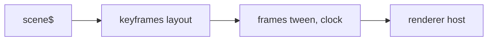

# @hafley66/scene

Keyed scenes, typed-array geometry, diffs, tweens, and renderers as rxjs operators.
Design: `packages/grapht/4_keyed_scene_renderer_plan.md`.

## Pipeline



```ts
import { frames, keyframes, renderer, tween } from "@hafley66/scene"

scene$.pipe(keyframes(layout), frames(tween(easeInOutCubic), raf$), pixi(canvasHost), dom(overlayHost)).subscribe()
```

## Types

| type | shape | touched |
|---|---|---|
| `Scene` | `items: Map<Id, Item>`, `edges: Map<Id, [Id, Id]>` | per step |
| `Geometry` | `ids: Id[]`, `pos: Float32Array` as `x, y` pairs, optional `size`, `routes` | per layout |
| `Diff` | `keep`, `enter`, `exit` id lists | per transition |
| `Layout` | `(scene, prev?) => Geometry \| Promise<Geometry>` | per step |
| `Tween` | `(from, to, diff, t, out?) => Geometry` | per frame, zero allocations with `out` |
| `Frame` | `{ scene, geometry, diff }` | per frame |
| `Renderer` | `(host) => MonoTypeOperatorFunction<Frame>` | subscribe = mount, next = draw, unsubscribe = unmount |

## Renderer contract

```ts
const dom = renderer<Map<string, HTMLElement>>({
  subscribe: host => new Map(),
  next: (els, { geometry, diff }) => { /* enter: create by id; keep: move by index; exit: release */ },
  unsubscribe: els => els.forEach(el => el.remove()),
})
```

Frames pass through, so renderers chain and each one sees the same `Frame`.

## Renderers shipped here

| renderer | sink | use |
|---|---|---|
| `dom(options)` from `@hafley66/scene` | one absolutely positioned element per id, `transform: translate`, edges as SVG `<line>` | near-focus tier: cards, code panels, labels; tens of items |
| `pixi(options)` from `@hafley66/scene/pixi` | pooled sprites by id, `DOMContainer` for `kind: "card"`, one `Graphics` for edges; `pixi.js` is an optional peer | the node field, 100k+ |

Labs, e2e, and the load receipt live in `packages/grapht/adapters/6_render_pixijs` (`LEARNINGS.md`).

## Scripts

`pnpm test`, `pnpm typecheck`, `pnpm build`.
