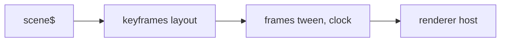

# @hafley66/scene

Canonical graph animation geometry, diffs, tweens, and renderer resources as RxJS operators.
Graph topology comes from `@hafley66/grapht-model`.

## Pipeline



```ts
import { frames, keyframes, renderer, tween } from "@hafley66/scene"

scene$.pipe(keyframes(layout), frames(tween(easeInOutCubic), raf$), rendererResource(host)).subscribe()
```

## Types

| type | shape | touched |
|---|---|---|
| `Scene` | alias of the canonical flat `Graph` record | per step |
| `Geometry` | `ids: Id[]`, `pos: Float32Array` as `x, y` pairs, optional `size`, `routes` | per layout |
| `Diff` | `keep`, `enter`, `exit` id lists | per transition |
| `Layout` | `(scene, prev?) => Geometry \| Promise<Geometry>` | per step |
| `Tween` | `(from, to, diff, t, out?) => Geometry` | per frame, zero allocations with `out` |
| `Frame` | `{ scene, geometry, diff }` | per frame |
| `Renderer` | `(host) => MonoTypeOperatorFunction<Frame>` | subscribe = mount, render = draw, unsubscribe = unmount |

## Renderer contract

```ts
const rendererResource = renderer(host => {
  const views = new Map<string, HTMLElement>()
  return {
    render({ geometry, diff }) {
      // enter, update, and exit keyed views
    },
    unsubscribe() {
      for (const view of views.values()) view.remove()
    },
  }
})
```

Frames pass through, so renderers chain and each one sees the same `Frame`.

Concrete graph renderers live in Grapht adapter packages. Cytoscape and Pixi consume the same
`GraphFrame` contract.

## Scripts

`pnpm test`, `pnpm typecheck`, `pnpm build`.
