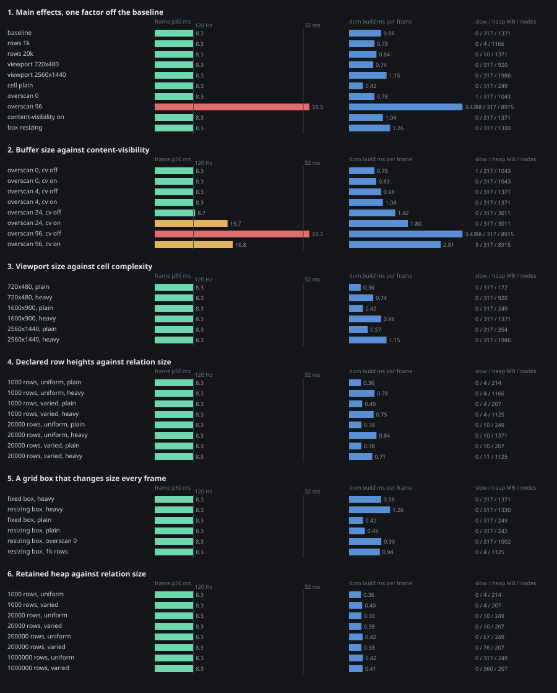

# signal-grid benchmarks

Numbers from a run that actually happened, on the machine this file records, including the two
places signal-grid loses.

## contents

| section | question it answers |
| --- | --- |
| [how to run](#how-to-run) | the two commands |
| [method](#method) | warmup, statistics, what stops dead-code elimination |
| [machine](#machine) | what the numbers were measured on |
| [data](#data) | the seeded generators and their checksums |
| [kernel operators](#kernel-operators) | cost of the operators in isolation, 1k to 1M |
| [head to head](#head-to-head-with-tanstacktable-core-910) | the same operations on both libraries |
| [not compared, and why](#not-compared-and-why) | operations only one library performs |
| [where TanStack wins](#where-tanstack-wins) | the two losses, with the reason for each |
| [reading the incremental rows](#reading-the-incremental-rows) | why the two sides are not doing equal work |
| [reactive derivation](#reactive-derivation) | which write reaches which memo |
| [allocation](#allocation) | retained bytes per row after a forced gc |
| [complexity claims checked](#complexity-claims-checked-against-the-numbers) | where a comment understates |
| [scrolling in a browser](#scrolling-in-a-browser-the-factor-matrix) | which factor costs a frame, and what a row costs in memory |
| [where the retained bytes go](#where-the-retained-bytes-go) | the 125 bytes a row that are the grid, and the rest that are your data |
| [the live pages](#the-live-pages) | the knob sweep and the ten-grid gallery, both on the site |
| [known gaps](#known-gaps) | what is not measured |

## how to run

```
cd packages/signal-grid
npx vitest bench -c bench/vitest.bench.config.ts
NODE_OPTIONS=--expose-gc npx vite-node -c bench/vitest.bench.config.ts bench/4_report.ts
npx tsc --noEmit -p bench/tsconfig.json
pnpm bench:scroll
pnpm bench:knobs
pnpm bench:gallery
pnpm bench:memory 1000000
```

`bench/vitest.bench.config.ts` sets `outputJson: "bench/results.json"`, so the first command drops a
generated file in this directory. It is regenerated on every run and belongs in `.gitignore`.

The first command is the interactive runner. The second prints every table in this file. Both read
the same case lists, so neither can drift from the other: `bench/_cases.ts` exports `register`,
which hands a case to vitest's `bench`, and `measure`, which runs the same closure through a
median/p95 loop.

`vitest bench` is the primary runner and is not sufficient on its own. tinybench 2.9 reports p75 and
p99 but no p95, and vitest 4.1.10 drops `benchmark.includeSamples` on the way to the worker, so
`bench/results.json` comes back with `samples: []` and p95 cannot be recovered from it. That is why
`bench/4_report.ts` exists and why every table in this file comes from it, not from the vitest table.

`pnpm bench:scroll` is the browser matrix and runs on its own: it builds `bench/scroll/`, drives
chromium through `scripts/browser-queue.mjs`, writes `bench/scroll.json` and `bench/scroll.svg`,
and prints the section this file carries under
[scrolling in a browser](#scrolling-in-a-browser-the-factor-matrix). `pnpm bench:gallery` opens
the same factor levels as ten live grids sharing one animation frame.

One consequence, stated up front: `4_report.ts` runs all three case lists in a single process, so
every measurement carries the GC pressure of roughly a gigabyte of live fixtures. `vitest bench`
isolates per file and reads faster on identical cases: `vitest bench` reported a 190.3 ms mean and a
121.6 ms minimum for `sortAxis 1 key 100000`, and the same case in the kernel table has a 139.9 ms
median and a 127.8 ms minimum. Ratios between two rows of one table are sound; the absolute numbers
are the pessimistic end.

## method

- Warmup iterations run and are discarded. Every case pins `warmup` and `iterations`, so the sample
  count is exact rather than time-derived.
- Median and p95 are computed from the raw samples. `ops/s` is `1000 / mean`.
- Cases with 5 to 7 samples have a p95 that is just the largest sample. Read those as a worst
  observed case, not as a percentile.
- Sub-microsecond cases carry an `inner` batch count, printed as `n x inner`. One sample is the mean
  of `inner` consecutive calls.
- Every result is passed to `consume` in `bench/0_data.ts`, which folds it into a module-level word.
  No measured result in this suite is dead.
- Every case carries a null hypothesis in the comment attached to it: the result that would prove
  the design wrong.
- `bench/0_data.ts` is seeded xorshift32 with no clock, no environment and no filesystem read. The
  FNV-1a checksums in the data table are asserted at fixture load, so a generator edit fails the run
  rather than quietly invalidating the numbers.

## machine

- node v24.15.0, darwin arm64
- 12 x Apple M2 Pro
- 16 GiB RAM
- commit df52c00
- run 2026-09-10

Every table in this file was measured on the machine and commit above, in one run of
`bench/4_report.ts`.

## data

| set | rows | FNV-1a |
| --- | ---: | --- |
| flatRows(1000) | 1000 | 0xf41b6e57 |
| flatRows(10000) | 10000 | 0x461b92fe |
| flatRows(100000) | 100000 | 0xc750ffbf |
| treeRows(100000, 4, 5) | 124800 nodes, 100000 leaves | structural |

## kernel operators

### axisOf, flat relation

| benchmark | ops/s | median ms | p95 ms | min ms | n | what the number means |
| --- | ---: | ---: | ---: | ---: | ---: | --- |
| axisOf 1000 | 16,709 | 0.05800 | 0.06508 | 0.05488 | 200 | build the forest for 1000 flat rows: 2 passes, 4 maps, no parent edges |
| axisOf 10000 | 1,293 | 0.69137 | 0.83092 | 0.64375 | 60 | build the forest for 10000 flat rows: 2 passes, 4 maps, no parent edges |
| axisOf 100000 | 118 | 7.706 | 10.913 | 7.248 | 20 | build the forest for 100000 flat rows: 2 passes, 4 maps, no parent edges |
| axisOf 1000000 | 3.30 | 253.9 | 577.9 | 241.0 | 7 | build the forest for 1000000 flat rows: 2 passes, 4 maps, no parent edges |

### axisOf, one chain of depth n

| benchmark | ops/s | median ms | p95 ms | min ms | n | what the number means |
| --- | ---: | ---: | ---: | ---: | ---: | --- |
| axisOf chain 500 | 127 | 8.385 | 8.552 | 7.039 | 5 | 500 nodes where every node's parent is the node before it |
| axisOf chain 1000 | 35 | 27.758 | 33.035 | 27.442 | 5 | 1000 nodes where every node's parent is the node before it |
| axisOf chain 2000 | 8.67 | 115.2 | 116.5 | 114.3 | 5 | 2000 nodes where every node's parent is the node before it |
| axisOf chain 4000 | 2.40 | 417.0 | 423.7 | 414.0 | 5 | 4000 nodes where every node's parent is the node before it |

### sortAxis, one key

| benchmark | ops/s | median ms | p95 ms | min ms | n | what the number means |
| --- | ---: | ---: | ---: | ---: | ---: | --- |
| sortAxis 1 key 1000 | 1,725 | 0.55517 | 0.66125 | 0.52621 | 200 | re-sort 1000 roots on a numeric key, seats + Map.get per comparison |
| sortAxis 1 key 10000 | 134 | 7.333 | 8.222 | 7.099 | 60 | re-sort 10000 roots on a numeric key, seats + Map.get per comparison |
| sortAxis 1 key 100000 | 7.01 | 139.9 | 155.4 | 127.8 | 20 | re-sort 100000 roots on a numeric key, seats + Map.get per comparison |
| sortAxis 1 key 1000000 | 0.23 | 4299.4 | 4791.4 | 3924.6 | 7 | re-sort 1000000 roots on a numeric key, seats + Map.get per comparison |

### sortAxis, three keys

| benchmark | ops/s | median ms | p95 ms | min ms | n | what the number means |
| --- | ---: | ---: | ---: | ---: | ---: | --- |
| sortAxis 3 keys 1000 | 1,037 | 0.94183 | 1.019 | 0.88804 | 200 | same 1000 roots, comparator falls through string, number, string |
| sortAxis 3 keys 10000 | 73 | 13.399 | 14.636 | 12.600 | 60 | same 10000 roots, comparator falls through string, number, string |
| sortAxis 3 keys 100000 | 4.35 | 226.5 | 248.1 | 205.9 | 20 | same 100000 roots, comparator falls through string, number, string |
| sortAxis 3 keys 1000000 | 0.16 | 6099.6 | 7402.6 | 5596.9 | 7 | same 1000000 roots, comparator falls through string, number, string |

### groupAxis, one level

| benchmark | ops/s | median ms | p95 ms | min ms | n | what the number means |
| --- | ---: | ---: | ---: | ---: | ---: | --- |
| groupAxis dept 1000 | 2,892 | 0.28458 | 0.49846 | 0.25500 | 200 | 1000 rows into 8 dept groups, forest rebuilt above the data edges |
| groupAxis dept 10000 | 251 | 3.244 | 6.585 | 3.000 | 60 | 10000 rows into 8 dept groups, forest rebuilt above the data edges |
| groupAxis dept 100000 | 14 | 42.193 | 58.453 | 33.903 | 20 | 100000 rows into 8 dept groups, forest rebuilt above the data edges |

### groupAxis, two levels

| benchmark | ops/s | median ms | p95 ms | min ms | n | what the number means |
| --- | ---: | ---: | ---: | ---: | ---: | --- |
| groupAxis dept+tier 1000 | 1,958 | 0.49188 | 0.52554 | 0.46621 | 200 | 1000 rows into 8 x 4 groups, two JSON group keys minted per row |
| groupAxis dept+tier 10000 | 179 | 5.361 | 7.776 | 5.080 | 60 | 10000 rows into 8 x 4 groups, two JSON group keys minted per row |
| groupAxis dept+tier 100000 | 17 | 58.405 | 66.375 | 55.231 | 20 | 100000 rows into 8 x 4 groups, two JSON group keys minted per row |

### flattenAxis, tree

| benchmark | ops/s | median ms | p95 ms | min ms | n | what the number means |
| --- | ---: | ---: | ---: | ---: | ---: | --- |
| flattenAxis all open, 124800 nodes | 46 | 19.820 | 27.869 | 17.218 | 20 | emit every node of a 124800-node, depth-4 forest |
| flattenAxis 10% open, 124800 nodes | 3,888 | 0.20692 | 0.41971 | 0.18379 | 200 | same forest, 2480 of 24800 internal nodes open |

### renderPlan, end to end

| benchmark | ops/s | median ms | p95 ms | min ms | n | what the number means |
| --- | ---: | ---: | ---: | ---: | ---: | --- |
| renderPlan uniform 100000 | 478 | 1.925 | 3.783 | 1.790 | 40 | partition + paginate + window over 100000 keys, O(1) sizer |
| renderPlan measured 100000 | 272 | 3.480 | 5.670 | 3.297 | 40 | same plan, sizer builds a 100001-entry prefix array every call |

### windowOf, 1M rows

| benchmark | ops/s | median ms | p95 ms | min ms | n | what the number means |
| --- | ---: | ---: | ---: | ---: | ---: | --- |
| windowOf measuredSizer 1M | 2,690,004 | 3.56e-4 | 4.69e-4 | 3.35e-4 | 200x500 | two binary searches over a 1,000,001-entry prefix array, random scroll offset |
| windowOf uniformSizer 1M | 33,838,188 | 2.89e-5 | 3.03e-5 | 2.82e-5 | 200x500 | the same window through two divisions, the uniform-sizer control |
| measuredSizer construction 1M | 52 | 18.732 | 22.563 | 18.372 | 10 | the one-time O(n) prefix pass that the binary search reads |


## head to head with @tanstack/table-core 9.1.0

### sort 100k, one numeric key

| benchmark | ops/s | median ms | p95 ms | min ms | n | what the number means |
| --- | ---: | ---: | ---: | ---: | ---: | --- |
| ours: sortAxis | 6.14 | 161.5 | 181.6 | 144.6 | 20 | sort 100k RowIds, seat index for stability, Map.get per value read |
| tanstack: getSortedRowModel | 5.13 | 188.6 | 231.0 | 166.8 | 20 | sort 100k Row instances, row.index for stability, values already cached |

### group 100k, one level on dept

| benchmark | ops/s | median ms | p95 ms | min ms | n | what the number means |
| --- | ---: | ---: | ---: | ---: | ---: | --- |
| ours: groupAxis | 23 | 44.997 | 49.422 | 35.331 | 20 | 8 synthetic group keys, forest rebuilt, 100k rows re-parented |
| tanstack: getGroupedRowModel | 29 | 32.940 | 44.406 | 27.759 | 20 | 8 group Rows constructed, 100k leaf rows distributed into subRows |

### expand 124800-node tree, 10% of internal nodes open

| benchmark | ops/s | median ms | p95 ms | min ms | n | what the number means |
| --- | ---: | ---: | ---: | ---: | ---: | --- |
| ours: flattenAxis | 3,269 | 0.21429 | 0.74042 | 0.17408 | 100 | walk the open frontier, allocate one FlatNode per visible row |
| tanstack: getExpandedRowModel | 1,248 | 0.65054 | 0.78067 | 0.61646 | 100 | same frontier, push existing Row references into a new array |

### incremental, change the sort key and re-derive

| benchmark | ops/s | median ms | p95 ms | min ms | n | what the number means |
| --- | ---: | ---: | ---: | ---: | ---: | --- |
| ours: state.sort write + view.flat read | 4.44 | 218.1 | 358.7 | 164.0 | 15 | sortAxis over 100k plus flattenAxis allocating 100k FlatNodes |
| tanstack: sorting set + getRowModel | 4.35 | 227.9 | 355.9 | 179.5 | 15 | sorted stage reruns over 100k Rows, expanded and paginated stages hit cache |

### incremental, change a key the row pipeline does not read

| benchmark | ops/s | median ms | p95 ms | min ms | n | what the number means |
| --- | ---: | ---: | ---: | ---: | ---: | --- |
| ours: state.colWidth write + view.flat read | 54,298 | 0.01258 | 0.06542 | 0.00804 | 15 | one column width changes, then the flat row list is read back |
| tanstack: columnSizing set + getRowModel | 502,196 | 0.00181 | 0.00446 | 8.87e-4 | 15x20 | same edit, no row-model memo dep moved, so every stage answers from cache |

### incremental, no write, read the derived list

| benchmark | ops/s | median ms | p95 ms | min ms | n | what the number means |
| --- | ---: | ---: | ---: | ---: | ---: | --- |
| ours: view.flat read | 7,173,291 | 1.37e-4 | 1.74e-4 | 8.73e-5 | 200x200 | a clean memo answers from its stored value |
| tanstack: getRowModel | 2,109,139 | 4.54e-4 | 5.65e-4 | 4.27e-4 | 200x200 | the dep tuple is unchanged at every stage, so the cached model is returned |


### not compared, and why

- renderPlan: TanStack leaves pinning geometry and virtualization to the adapter (@tanstack/react-virtual), so there is no core-side pipeline to time against it.
- axisOf vs constructTable: TanStack builds a Row instance with per-cell value caches; axisOf builds four maps over the caller's own objects. The one-time costs are reported side by side in the allocation table and labelled, not ranked.
- windowOf: no table-core equivalent. The nearest thing lives in a different package with a different data model.

## where TanStack wins

Two rows in the head to head go against signal-grid.

### grouping 100k rows on one key

TanStack is 1.37x faster: 32.9 ms against 45.0 ms at the median. `groupAxis` makes three full passes
over the axis before it places a single row. One collects the units, one copies `by` while dropping
old group keys, one copies `parent` and `children` while dropping group edges. Then it walks the
units and calls `JSON.stringify` on the path once per row per level to mint the group key.
TanStack's grouped model buckets rows into arrays keyed by the raw value, constructs 8 group `Row`
instances and leaves the leaf rows alone. It never stringifies and it never rebuilds a parent map.

The difference is bought, not lost. `groupAxis` is total over tree data and idempotent, so a unit
travels with its own subtree and the forest above it has to be rebuilt; TanStack's grouped model
does not carry that property. The price of the guarantee is about 12 ms per 100k rows here. The
cheapest way to get most of it back without giving the guarantee up is to replace `groupKeyOf`'s
`JSON.stringify` with a delimiter join over the level values, which is the same 8-group key space
without a JSON encoder in the inner loop.

### changing a state key the row pipeline does not read

TanStack is 6.95x faster: 0.00181 ms against 0.01258 ms at the median. The write lands in
`state.colWidth`, which no stage of the row pipeline reads, so the only work is the memo bookkeeping
that still runs on every state write. This row used to be the headline: before the
`distinctUntilChanged` fix described in `.changeset/signals-distinct.md`, one width write re-sorted
100k rows and cost 190.1 ms. The fix landed and the write now costs 0.01258 ms.

### everything else

signal-grid takes the other four rows, on median and on p95 alike. The whole head to head in one
table, losses included:

| operation | signal-grid median | table-core median | ratio |
| --- | ---: | ---: | ---: |
| sort 100k, one numeric key | 161.5 ms | 188.6 ms | 1.17x ours |
| expand a 124,800-node tree, 10 percent open | 0.214 ms | 0.651 ms | 3.04x ours |
| change the sort key and re-derive | 218.1 ms | 227.9 ms | 1.04x ours |
| no write, read the derived list | 0.000137 ms | 0.000454 ms | 3.31x ours |
| change a width and re-derive | 0.0126 ms | 0.00181 ms | 6.95x theirs |
| group 100k on one key | 45.0 ms | 32.9 ms | 1.37x theirs |

Retained memory is the other margin: `axisOf` over 100k rows holds 46 bytes per row on top of the
caller's own objects, against 786 bytes per row for `constructTable` plus its core row model, a 17x
gap. TanStack buys per-cell value caches with those bytes, which is what makes its re-sort
comparator cheap.

The two runners disagree on magnitude and agree on direction, which is the check that matters. The
same six rows as `vitest bench` reports them, per-file isolated rather than one process:

| operation | vitest bench ratio | `4_report.ts` ratio |
| --- | --- | --- |
| sort 100k, one numeric key | 1.72x ours | 1.17x ours |
| expand a 124,800-node tree, 10 percent open | 3.69x ours | 3.04x ours |
| change the sort key and re-derive | 1.42x ours | 1.04x ours |
| no write, read the derived list | 3.55x ours | 3.31x ours |
| change a width and re-derive | 7.15x theirs | 6.95x theirs |
| group 100k on one key | 1.20x theirs | 1.37x theirs |

## reading the incremental rows

The two sides do not do the same amount of work on a sort change, and the asymmetry favours
TanStack, so the win has to be read with that in hand.

| side | what runs on a `sort` change | what it produces |
| --- | --- | --- |
| signal-grid | `grouped` (early return, no group keys set), `sortAxis` over 100k, `flattenAxis` over 100k | a `FlatNode[]` with depth, parent, index and hasChildren per row, ready for the virtualizer |
| table-core | `sortedRowModel` over 100k `Row` instances; `expandedRowModel` and `paginatedRowModel` return their input unchanged because the table is flat and nothing is expanded | the sorted `Row[]` |

signal-grid allocates 100k `FlatNode` objects that TanStack never allocates, and still finishes
first. On the no-write read both sides are pure cache reads, and the gap is the cost of the lookup
itself: one dirty flag against a dependency-tuple comparison at every stage of a six-stage pipeline.

## reactive derivation

### reactive, 1k rows

| benchmark | ops/s | median ms | p95 ms | min ms | n | what the number means |
| --- | ---: | ---: | ---: | ---: | ---: | --- |
| read view.flat, no write (1k rows) | 9,219,150 | 1.06e-4 | 1.29e-4 | 9.27e-5 | 200x200 | the clean-memo floor: one dirty check and a stored array |
| state.sort write then view.flat read (1k rows) | 1,206 | 0.80463 | 0.88608 | 0.75367 | 60 | sortAxis plus flattenAxis, the work a sort change owes |
| state.colWidth write then view.flat read (1k rows) | 144,825 | 0.00617 | 0.00846 | 0.00596 | 60 | a write no row-pipeline stage reads, then the flat list is read back |
| 1000 sequential colWidth writes, nothing subscribed (1k rows) | 296 | 3.268 | 4.029 | 3.110 | 5 | 1000 pointermove-sized writes with no read between them |
| 1000 sequential colWidth writes, view.plan subscribed (1k rows) | 285 | 3.374 | 4.198 | 3.164 | 5 | the same burst on a grid that is rendering, so every stage has an observer |

### reactive, 100k rows

| benchmark | ops/s | median ms | p95 ms | min ms | n | what the number means |
| --- | ---: | ---: | ---: | ---: | ---: | --- |
| read view.flat, no write (100k rows) | 10,405,944 | 9.19e-5 | 1.12e-4 | 9.08e-5 | 200x200 | the clean-memo floor: one dirty check and a stored array |
| state.sort write then view.flat read (100k rows) | 4.31 | 222.0 | 360.7 | 183.6 | 12 | sortAxis plus flattenAxis, the work a sort change owes |
| state.colWidth write then view.flat read (100k rows) | 116,412 | 0.00379 | 0.05012 | 0.00354 | 12 | a write no row-pipeline stage reads, then the flat list is read back |
| 20 sequential colWidth writes, nothing subscribed (100k rows) | 11,255 | 0.08571 | 0.12496 | 0.06158 | 5 | 20 pointermove-sized writes with no read between them |
| 20 sequential colWidth writes, view.plan subscribed (100k rows) | 10,870 | 0.08933 | 0.12233 | 0.06954 | 5 | the same burst on a grid that is rendering, so every stage has an observer |

## allocation

| structure | retained after gc | bytes per unit |
| --- | ---: | ---: |
| flatRows(100000), the source data | 13.7 MiB | 144 B |
| axisOf over 100k rows | 4.4 MiB | 46 B |
| sortAxis result, 100k | 0.8 MiB | 8 B |
| groupAxis result, 100k into 8 | 10.8 MiB | 113 B |
| flattenAxis, 124,800 nodes all open | 8.9 MiB | 75 B |
| measuredSizer prefix array, 1M | 7.6 MiB | 8 B |
| TanStack constructTable + core model, 100k | 74.9 MiB | 786 B |

## complexity claims checked against the numbers

| operator | comment claims | measured | verdict |
| --- | --- | --- | --- |
| `axisOf`, no `parentOf` | "two passes" | 11.9x, 11.1x, then 32.9x per decade | claim holds, see note |
| `axisOf`, with `parentOf` | "two passes" | 3.3x, 4.2x, then 3.6x per doubling of a chain | **claim understates** |
| `sortAxis` | stability via a seat index | 13.2x, 19.1x, then 30.7x per decade | claim holds, see note |
| `groupAxis` | one level per key function | a second level adds 38 to 73 percent, not 100 | claim holds |
| `flattenAxis` | "skipping the subtree of a closed node" | 10 percent open is 96x cheaper than all open | claim holds |
| `uniformSizer` | "every method O(1), no allocation" | 29 ns per `windowOf` at 1M rows | claim holds |
| `measuredSizer` | "O(n) once", "O(log n) binary search" | construction 18.7 ms at 1M, `windowOf` 12.3x the uniform path | claim holds |
| `renderPlan` | no complexity claim | O(total rows) per call, virtualized or not | not a violated claim, see note |

### `axisOf` with `parentOf` is not two passes

The second loop calls `returnsToSelf(key, raw)` for every key that names a known parent, and
`returnsToSelf` allocates a `Set` and walks the whole ancestor chain. That is O(n * depth), which is
O(n^2) on a path-shaped relation. Measured on a single chain where every node's parent is the node
before it: 500 nodes 8.4 ms, 1000 nodes 27.8 ms, 2000 nodes 115.2 ms, 4000 nodes 417.0 ms. Each
doubling costs 3.3x, 4.2x, then 3.6x, which is the signature of a quadratic.

A flat relation never reaches the walk, because `parentOf` is absent and `raw` stays empty, so
`grid({ rows })` is unaffected. `grid({ rows, subRows })` goes through `fromTree` and is also
unaffected. The caller who pays is the one building an axis from explicit parent ids, which is the
whole reason `axisOf(entries, parentOf)` takes a second argument.

The fix is one colour-marking pass over `raw`, hoisted above the loop, replacing the per-key walk:

```ts
/** Every key standing on a parent cycle, found in one pass rather than one ancestor walk per key. */
const cycleMembers = <K extends string>(raw: ReadonlyMap<K, K>): ReadonlySet<K> => {
  const onCycle = new Set<K>()
  const done = new Set<K>()
  for (const start of raw.keys()) {
    if (done.has(start)) continue
    const path: K[] = []
    const seen = new Map<K, number>()
    let at: K | undefined = start
    while (at !== undefined && !done.has(at) && !seen.has(at)) {
      seen.set(at, path.length)
      path.push(at)
      at = raw.get(at)
    }
    const from = at === undefined ? -1 : (seen.get(at) ?? -1)
    if (from >= 0) for (let i = from; i < path.length; i++) onCycle.add(path[i] as K)
    for (const key of path) done.add(key)
  }
  return onCycle
}
```

Then `returnsToSelf(key, raw)` in the second loop becomes `onCycle.has(key)`, with
`const onCycle = cycleMembers(raw)` hoisted out of it. Same semantics: `returnsToSelf` is true
exactly when the key stands on a cycle, which is what the colour pass marks. Checked against the
current implementation on 3000 random parent maps of 2 to 15 nodes with self-edges excluded: every
key agrees.

### the 100k to 1M step

Both `axisOf` and `sortAxis` cost about 11 to 19x per decade up to 100k and about 31 to 33x for the
last one. That is not an extra algorithmic pass; it is a `Map` with a million entries falling out of
cache, plus the rehash growth on the way there. The comments do not claim otherwise. `sortAxis`
could take most of it back by reading each key's sort value once into the seat instead of doing a
`Map.get` per comparison, which turns O(n log n) map lookups into O(n).

### `renderPlan` is linear per scroll tick

`partition` buckets the entire flat key list into three arrays on every call, and `8_grid.ts` maps
`FlatNode[]` to a key array before calling it. Both are O(total rows), so a scroll event at 100k
rows costs a full pass whether or not `virtualize` is on: 1.93 ms with a uniform sizer, 3.48 ms with
a measured one. Nothing in the comments claims O(1), so this is a note rather than a violated claim,
but it is the ceiling on how large a virtualized grid can get before scrolling drops frames.

## scrolling in a browser: the factor matrix

The kernel tables above are node only. This one is chromium, one page per cell, every factor on a
query string, one measured burst per cell. `bench/scroll/0_bench.ts` mounts a grid from a factor
object, `bench/scroll.mjs` walks the matrix, and `bench/scroll/gallery.html` runs every level at
once on screen.

| factor | levels | why it is a factor |
| --- | --- | --- |
| rows | 1k, 20k, 200k, 1M | the relation the window is cut from |
| viewport | 720x480, 1600x900, 2560x1440 | with the row height, how many rows are held |
| cell | plain, heavy | one text node against a stack with a meter and a 16-rect sparkline |
| extent | uniform, varied | whether the consumer declares a height per row |
| overscan | 0, 4, 24, 96 | rows held beyond the viewport on each side |
| content-visibility | off, on | `content-visibility: auto` plus `contain-intrinsic-size` on each row |
| resize | off, on | the grid box itself changing size every frame, not only its contents |

Baseline: 1,000,000 rows, 1600x900, heavy cells, uniform heights, overscan 4, content-visibility
off, fixed box. Every cell is 40 warm-up frames discarded then 120 measured, scrolling 240 px per
frame.

Measured 2026-09-12 on the machine under [machine](#machine), chromium headless with
`--enable-precise-memory-info`, through `scripts/browser-queue.mjs` so nothing else held the CPU.



Four columns deserve a warning before the tables.

- `p50 ms` is a `requestAnimationFrame` gap on a 120 Hz display, so it reads 8.3 whenever the work
  fits in the frame. It separates cells only once a cell stops fitting.
- The stage columns are the package's own LogTape timers, divided by the measured frame count. They
  are what separates two cells that both read 8.3. `base` is the half of the plan the scroll
  position does not reach; it reads 0.00 in every cell because the memo split means it does not run
  during a scroll at all.
- `layout ms/f` and `style ms/f` come from CDP `Performance.getMetrics`, taken either side of the
  measured burst. They are the browser's work, not the package's, and at the breaking point they are
  four times larger than everything the package does.
- `heap kB/run` is the retained heap delta across 120 frames with a forced collection on each side.
  It swings either way by about 150 kB with no trend against any factor, which is what a run that
  hands its rows back looks like. `heap MB` is the absolute number and does have a trend.

### what the matrix says

| reading | evidence |
| --- | --- |
| Relation size is free per frame | 1k to 1M is 0.36 to 0.42 dom ms/f plain, and `base` never runs |
| Relation size is not free in memory | 3.5 MB at 1k, 317 MB at 1M: about 318 bytes retained per row |
| A declared per-row height adds about 43 bytes a row | 1M uniform 317 MB against 1M varied 360 MB |
| Viewport size costs rows, linearly | 22, 33, 48 rows held; 0.36, 0.42, 0.60 dom ms/f plain |
| A heavy cell costs about 2.3x the dom stage and 5.5x the nodes | 0.42 to 0.98 ms/f, 249 to 1371 nodes |
| Buffer size is the only factor that breaks the frame | overscan 96: 217 rows, 8915 nodes, 104 of 120 frames over 32 ms |
| At the breaking point the browser is the cost, not the package | 10.64 layout plus 8.27 style against 3.89 dom ms/f |
| `content-visibility` pays only under an oversized buffer | no change at overscan 0 or 4; at 96 it halves p50 and cuts layout 10.64 to 5.29 |
| Even rescued, an oversized buffer loses to a small one | overscan 96 with it on is 16.7 p50 against 8.3 at overscan 4 |
| Resizing the grid box every frame costs a third of the dom stage and a worse tail | 0.98 to 1.26 ms/f, worst frame 17.5 to 25.1, no frame dropped |

### 1. Main effects, one factor off the baseline

Asks: which factor moves the frame at all.

| case | p50 ms | p95 ms | worst ms | slow | rows held | nodes | style B | heap MB | heap kB/run | layout ms/f | style ms/f | base ms/f | plan ms/f | frame ms/f | dom ms/f | vars ms/f |
| --- | --- | --- | --- | --- | --- | --- | --- | --- | --- | --- | --- | --- | --- | --- | --- | --- |
| baseline | 8.3 | 9.2 | 17.5 | 0 | 33 | 1371 | 177 | 317.1 | 84.3 | 1.67 | 1.32 | 0.00 | 0.00 | 0.03 | 0.98 | 0.01 |
| rows 1k | 8.3 | 9.1 | 9.3 | 0 | 28 | 1166 | 174 | 3.6 | 12.5 | 1.32 | 1.06 | 0.00 | 0.00 | 0.03 | 0.78 | 0.00 |
| rows 20k | 8.3 | 9.2 | 9.4 | 0 | 33 | 1371 | 175 | 9.9 | 56.3 | 1.47 | 1.15 | 0.00 | 0.00 | 0.03 | 0.84 | 0.00 |
| viewport 720x480 | 8.3 | 9.1 | 9.4 | 0 | 22 | 920 | 176 | 317.1 | 39.5 | 1.07 | 0.87 | 0.00 | 0.00 | 0.02 | 0.74 | 0.01 |
| viewport 2560x1440 | 8.3 | 9.4 | 25.9 | 0 | 48 | 1986 | 178 | 317.1 | 41.0 | 2.35 | 1.83 | 0.00 | 0.00 | 0.03 | 1.15 | 0.01 |
| cell plain | 8.3 | 9.3 | 9.4 | 0 | 33 | 249 | 177 | 317.1 | 50.6 | 1.14 | 0.37 | 0.00 | 0.00 | 0.03 | 0.42 | 0.00 |
| overscan 0 | 8.3 | 9.1 | 41.7 | 1 | 25 | 1043 | 177 | 317.2 | 92.6 | 1.21 | 0.97 | 0.00 | 0.00 | 0.02 | 0.78 | 0.01 |
| overscan 96 | 33.3 | 41.7 | 108.3 | 88 | 217 | 8915 | 177 | 317.2 | -43.4 | 10.43 | 7.17 | 0.00 | 0.00 | 0.04 | 3.47 | 0.01 |
| content-visibility on | 8.3 | 9.3 | 17.4 | 0 | 33 | 1371 | 177 | 317.1 | -45.0 | 1.72 | 1.49 | 0.00 | 0.01 | 0.03 | 1.04 | 0.00 |
| box resizing | 8.3 | 9.2 | 25.1 | 0 | 32 | 1330 | 177 | 317.1 | -32.6 | 1.72 | 1.34 | 0.00 | 0.01 | 0.04 | 1.26 | 0.00 |

### 2. Buffer size against content-visibility

Asks: does an oversized buffer plus content-visibility beat a small buffer.

| case | p50 ms | p95 ms | worst ms | slow | rows held | nodes | style B | heap MB | heap kB/run | layout ms/f | style ms/f | base ms/f | plan ms/f | frame ms/f | dom ms/f | vars ms/f |
| --- | --- | --- | --- | --- | --- | --- | --- | --- | --- | --- | --- | --- | --- | --- | --- | --- |
| overscan 0, cv off | 8.3 | 9.1 | 41.7 | 1 | 25 | 1043 | 177 | 317.2 | 92.6 | 1.21 | 0.97 | 0.00 | 0.00 | 0.02 | 0.78 | 0.01 |
| overscan 0, cv on | 8.3 | 9.3 | 16.7 | 0 | 25 | 1043 | 177 | 317.1 | 67.1 | 1.27 | 1.08 | 0.00 | 0.01 | 0.03 | 0.83 | 0.01 |
| overscan 4, cv off | 8.3 | 9.2 | 17.5 | 0 | 33 | 1371 | 177 | 317.1 | 84.3 | 1.67 | 1.32 | 0.00 | 0.00 | 0.03 | 0.98 | 0.01 |
| overscan 4, cv on | 8.3 | 9.3 | 17.4 | 0 | 33 | 1371 | 177 | 317.1 | -45.0 | 1.72 | 1.49 | 0.00 | 0.01 | 0.03 | 1.04 | 0.00 |
| overscan 24, cv off | 8.7 | 17.3 | 24.2 | 0 | 73 | 3011 | 177 | 317.1 | 55.1 | 3.42 | 2.68 | 0.00 | 0.00 | 0.03 | 1.42 | 0.00 |
| overscan 24, cv on | 15.7 | 17.6 | 25.0 | 0 | 73 | 3011 | 177 | 317.1 | 57.6 | 3.67 | 2.88 | 0.00 | 0.00 | 0.03 | 1.80 | 0.01 |
| overscan 96, cv off | 33.3 | 41.7 | 108.3 | 88 | 217 | 8915 | 177 | 317.2 | -43.4 | 10.43 | 7.17 | 0.00 | 0.00 | 0.04 | 3.47 | 0.01 |
| overscan 96, cv on | 16.8 | 25.7 | 84.2 | 3 | 217 | 8915 | 177 | 317.2 | -37.7 | 5.55 | 4.77 | 0.00 | 0.00 | 0.03 | 2.81 | 0.01 |

### 3. Viewport size against cell complexity

Asks: does a bigger screen cost rows or cost nodes.

| case | p50 ms | p95 ms | worst ms | slow | rows held | nodes | style B | heap MB | heap kB/run | layout ms/f | style ms/f | base ms/f | plan ms/f | frame ms/f | dom ms/f | vars ms/f |
| --- | --- | --- | --- | --- | --- | --- | --- | --- | --- | --- | --- | --- | --- | --- | --- | --- |
| 720x480, plain | 8.3 | 9.3 | 16.2 | 0 | 22 | 172 | 176 | 317.1 | 59.8 | 0.82 | 0.30 | 0.00 | 0.00 | 0.03 | 0.36 | 0.01 |
| 720x480, heavy | 8.3 | 9.1 | 9.4 | 0 | 22 | 920 | 176 | 317.1 | 39.5 | 1.07 | 0.87 | 0.00 | 0.00 | 0.02 | 0.74 | 0.01 |
| 1600x900, plain | 8.3 | 9.3 | 9.4 | 0 | 33 | 249 | 177 | 317.1 | 50.6 | 1.14 | 0.37 | 0.00 | 0.00 | 0.03 | 0.42 | 0.00 |
| 1600x900, heavy | 8.3 | 9.2 | 17.5 | 0 | 33 | 1371 | 177 | 317.1 | 84.3 | 1.67 | 1.32 | 0.00 | 0.00 | 0.03 | 0.98 | 0.01 |
| 2560x1440, plain | 8.3 | 9.2 | 16.7 | 0 | 48 | 354 | 178 | 317.0 | -31.1 | 1.63 | 0.51 | 0.00 | 0.00 | 0.04 | 0.57 | 0.01 |
| 2560x1440, heavy | 8.3 | 9.4 | 25.9 | 0 | 48 | 1986 | 178 | 317.1 | 41.0 | 2.35 | 1.83 | 0.00 | 0.00 | 0.03 | 1.15 | 0.01 |

### 4. Declared row heights against relation size

Asks: what a per-row height costs the write pass.

| case | p50 ms | p95 ms | worst ms | slow | rows held | nodes | style B | heap MB | heap kB/run | layout ms/f | style ms/f | base ms/f | plan ms/f | frame ms/f | dom ms/f | vars ms/f |
| --- | --- | --- | --- | --- | --- | --- | --- | --- | --- | --- | --- | --- | --- | --- | --- | --- |
| 1000 rows, uniform, plain | 8.3 | 9.1 | 9.3 | 0 | 28 | 214 | 174 | 3.5 | -55.8 | 0.89 | 0.32 | 0.00 | 0.00 | 0.02 | 0.36 | 0.01 |
| 1000 rows, uniform, heavy | 8.3 | 9.1 | 9.3 | 0 | 28 | 1166 | 174 | 3.6 | 12.5 | 1.32 | 1.06 | 0.00 | 0.00 | 0.03 | 0.78 | 0.00 |
| 1000 rows, varied, plain | 8.3 | 8.8 | 9.3 | 0 | 27 | 207 | 741 | 3.8 | 101.5 | 0.87 | 0.45 | 0.00 | 0.00 | 0.03 | 0.40 | 0.02 |
| 1000 rows, varied, heavy | 8.3 | 9.1 | 9.4 | 0 | 27 | 1125 | 741 | 3.8 | 92.3 | 1.27 | 1.16 | 0.00 | 0.01 | 0.03 | 0.75 | 0.02 |
| 20000 rows, uniform, plain | 8.3 | 9.3 | 9.5 | 0 | 33 | 249 | 175 | 9.9 | 31.3 | 0.96 | 0.35 | 0.00 | 0.00 | 0.03 | 0.38 | 0.00 |
| 20000 rows, uniform, heavy | 8.3 | 9.2 | 9.4 | 0 | 33 | 1371 | 175 | 9.9 | 56.3 | 1.47 | 1.15 | 0.00 | 0.00 | 0.03 | 0.84 | 0.00 |
| 20000 rows, varied, plain | 8.3 | 9.2 | 9.3 | 0 | 27 | 207 | 742 | 10.5 | 72.1 | 0.84 | 0.44 | 0.00 | 0.00 | 0.03 | 0.38 | 0.02 |
| 20000 rows, varied, heavy | 8.3 | 8.8 | 9.3 | 0 | 27 | 1125 | 742 | 10.5 | 93.5 | 1.20 | 1.12 | 0.00 | 0.01 | 0.03 | 0.71 | 0.02 |

### 5. A grid box that changes size every frame

Asks: what a live resize costs on top of a scroll.

| case | p50 ms | p95 ms | worst ms | slow | rows held | nodes | style B | heap MB | heap kB/run | layout ms/f | style ms/f | base ms/f | plan ms/f | frame ms/f | dom ms/f | vars ms/f |
| --- | --- | --- | --- | --- | --- | --- | --- | --- | --- | --- | --- | --- | --- | --- | --- | --- |
| fixed box, heavy | 8.3 | 9.2 | 17.5 | 0 | 33 | 1371 | 177 | 317.1 | 84.3 | 1.67 | 1.32 | 0.00 | 0.00 | 0.03 | 0.98 | 0.01 |
| resizing box, heavy | 8.3 | 9.2 | 25.1 | 0 | 32 | 1330 | 177 | 317.1 | -32.6 | 1.72 | 1.34 | 0.00 | 0.01 | 0.04 | 1.26 | 0.00 |
| fixed box, plain | 8.3 | 9.3 | 9.4 | 0 | 33 | 249 | 177 | 317.1 | 50.6 | 1.14 | 0.37 | 0.00 | 0.00 | 0.03 | 0.42 | 0.00 |
| resizing box, plain | 8.3 | 9.1 | 16.7 | 0 | 32 | 242 | 177 | 317.1 | 28.4 | 1.18 | 0.39 | 0.00 | 0.00 | 0.03 | 0.49 | 0.00 |
| resizing box, overscan 0 | 8.3 | 9.2 | 16.7 | 0 | 24 | 1002 | 177 | 317.2 | 90.0 | 1.32 | 1.06 | 0.00 | 0.00 | 0.04 | 0.99 | 0.01 |
| resizing box, 1k rows | 8.3 | 9.2 | 17.3 | 0 | 27 | 1125 | 174 | 3.7 | 48.7 | 1.57 | 1.26 | 0.00 | 0.00 | 0.04 | 0.94 | 0.00 |

### 6. Retained heap against relation size

Asks: what a row costs in memory before anyone scrolls.

| case | p50 ms | p95 ms | worst ms | slow | rows held | nodes | style B | heap MB | heap kB/run | layout ms/f | style ms/f | base ms/f | plan ms/f | frame ms/f | dom ms/f | vars ms/f |
| --- | --- | --- | --- | --- | --- | --- | --- | --- | --- | --- | --- | --- | --- | --- | --- | --- |
| 1000 rows, uniform | 8.3 | 9.1 | 9.3 | 0 | 28 | 214 | 174 | 3.5 | -55.8 | 0.89 | 0.32 | 0.00 | 0.00 | 0.02 | 0.36 | 0.01 |
| 1000 rows, varied | 8.3 | 8.8 | 9.3 | 0 | 27 | 207 | 741 | 3.8 | 101.5 | 0.87 | 0.45 | 0.00 | 0.00 | 0.03 | 0.40 | 0.02 |
| 20000 rows, uniform | 8.3 | 9.3 | 9.5 | 0 | 33 | 249 | 175 | 9.9 | 31.3 | 0.96 | 0.35 | 0.00 | 0.00 | 0.03 | 0.38 | 0.00 |
| 20000 rows, varied | 8.3 | 9.2 | 9.3 | 0 | 27 | 207 | 742 | 10.5 | 72.1 | 0.84 | 0.44 | 0.00 | 0.00 | 0.03 | 0.38 | 0.02 |
| 200000 rows, uniform | 8.3 | 9.3 | 9.4 | 0 | 33 | 249 | 176 | 67.5 | 187.3 | 1.16 | 0.39 | 0.00 | 0.00 | 0.03 | 0.42 | 0.01 |
| 200000 rows, varied | 8.3 | 9.3 | 9.4 | 0 | 27 | 207 | 743 | 76.3 | 27.6 | 0.92 | 0.47 | 0.00 | 0.00 | 0.03 | 0.38 | 0.02 |
| 1000000 rows, uniform | 8.3 | 9.3 | 9.4 | 0 | 33 | 249 | 177 | 317.1 | 50.6 | 1.14 | 0.37 | 0.00 | 0.00 | 0.03 | 0.42 | 0.00 |
| 1000000 rows, varied | 8.3 | 9.3 | 9.4 | 0 | 27 | 207 | 744 | 359.8 | 90.7 | 0.92 | 0.47 | 0.00 | 0.00 | 0.02 | 0.41 | 0.04 |
### where the retained bytes go

`heap MB` above rises with the row count, which does not say whose bytes they are. `bench/6_memory.ts`
splits it: the same grid over a fat row and a slim one, with a forced collection either side of every
stage, so the consumer's data and the kernel's structures come apart by subtraction.

```
cd packages/signal-grid
pnpm bench:memory 1000000
```

| stage | MB at 1M | B/row | what is retained |
| --- | --- | --- | --- |
| slim rows, array only | 76.3 | 80 | `{ id, at, size }` per row, id string included |
| fat rows, array only | 312.7 | 328 | the bench row, whose 16-number sparkline is most of it |
| key strings only | 30.5 | 32 | one `r<n>` string per row |
| `axisOfEntries` over slim | 106.6 | 112 | the rows plus the order array and the `by` map |
| `flattenAxis` over slim | 93.9 | 98 | one `FlatNode` and one array slot per row |
| grid over the slim proxy | 195.7 | 205 | everything a mounted grid holds |
| grid over the fat proxy | 431.9 | 453 | the same, over a row 4x the size |

The two grid rows are the answer. 205 minus 80 is 125. 453 minus 328 is 125. **The kernel costs 125
bytes a row whatever the row is, and every byte past that is the consumer's own data.** For the
bench row that is 72% data and 28% grid.

The 125 divides as:

| structure | B/row |
| --- | --- |
| `FlatNode` object plus its array slot | 66 |
| the `by` map entry plus the order array slot | 32 |
| the plan's key arrays and the sizer's offsets | 27 |

Three of those are a second, third and fourth array of the same 1M keys: `verticalLeaves`, the
partitioned center run, and the paged run. They are pointer arrays, 8 bytes each, and collapsing
them into index ranges over one array would take about 24 B/row back. `FlatNode` is the larger
target: five fields per row where `depth`, `index` and `hasChildren` are derivable from the axis.

### the live pages

Two, both built into `site/dist/bench/` by `scripts/ship.mjs` the same way the demo is:

| page | what it is |
| --- | --- |
| [knobs](https://hafley66.github.io/hafley-rxjs/signal-grid/bench/knobs.html) | one grid, a slider per factor, the frame cost plotted while a knob moves |
| [gallery](https://hafley66.github.io/hafley-rxjs/signal-grid/bench/gallery.html) | ten grids at ten factor levels, sharing one animation frame |

```
cd packages/signal-grid
pnpm bench:knobs
pnpm bench:gallery
```

**knobs** separates the factors that move from the two that cannot. `overscan`, the box size, the
scroll speed, `content-visibility` and the declared row heights all change on a mounted grid: the
window memo reads `config.overscan` on every recompute and a scroll recomputes it each frame, the
ResizeObserver writes the viewport, and `state.rowHeight` is a signal. The relation and the cell
slot are fixed when `grid()` is called, so those two sliders rebuild, and the readout counts the
rebuilds so you can watch it happen.

Press `sweep` on a knob and it eases floor to ceiling and back over 240 frames, recording one point
per frame. The lower chart is that factor's cost curve: overscan runs green to red across its range,
box scale barely moves.

**gallery** is ten tiles, every factor level from the tables, all scrolling in one animation frame.
It loads paused; press run. The bar in each tile is that grid's share of the frame, folded per grid
id off the same LogTape records the matrix reads. The toolbar carries frames per second, the worst
frame of the last second, the used heap against the engine's limit, and the node count of the whole
page.

Sharing one frame is the point: ten grids is what an application looks like, and a tile's cost has
to be read against the others rather than alone.

### one measurement bug this matrix found

Block 4 first reported 1.55 vars ms/f at 20,000 declared heights and 0.02 at 1,000. The write pass
walks the drawn run, so the count could not be the cause. It was the timer: `9_css.ts` built its
log fields with `declared: Object.keys(next.extent).length` ahead of `durationMs`, and object
properties evaluate in order, so a 20,000-key walk landed inside the measured span. The count is now
cached per extent object and the duration is taken before the fields are built. The column reads
0.02 at both sizes.

## known gaps

- Event dispatch is not measured. The browser matrix covers a scroll and the work it wakes; a
  click, a drag and a resize gesture are covered by the e2e suites rather than by a number here.
- The browser matrix is chromium only, and `content-visibility` support in firefox and safari is
  unverified. Its one winning cell is a design this package does not ship.
- The node tables and the browser matrix are separate runs on the same machine, not one run.
- `filterAxis` and `flexWidths` are not benchmarked. `flexWidths` runs one pass per clamped column,
  so it is O(columns^2) in the worst case; its comment discloses that, and it is bounded by a column
  count rather than a row count.
- TanStack is measured through `@tanstack/table-core` only. `@tanstack/react-table` adds React work
  that is not in these numbers, and neither is `@tanstack/react-virtual`.
- GC pauses land inside samples. The allocation table is the separate, forced-gc measurement.
- The p95 column on 5-sample and 7-sample cases is the maximum sample.
