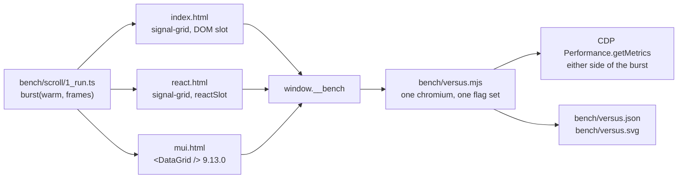

# Head to head with MUI X Data Grid

Measured. Both grids are mounted over the same rows, the same five columns at the same pixel
widths, the same 36 px row height and the same cell content, then scrolled by the same harness in
the same chromium, and read through the same CDP counters.

`docs/1_parity.md` answers which features each one has. This answers what a scroll costs, including
the two columns where MUI X is faster.

## Contents

1. [What was run](#1-what-was-run)
2. [The structural result: the MIT tier stops at 100 rows](#2-the-structural-result-the-mit-tier-stops-at-100-rows)
3. [The matrix](#3-the-matrix)
4. [Where MUI X wins](#4-where-mui-x-wins)
5. [Where signal-grid wins](#5-where-signal-grid-wins)
6. [Row-count ceiling](#6-row-count-ceiling)
7. [What a `reactSlot` cell costs](#7-what-a-reactslot-cell-costs)
8. [What this does not measure](#8-what-this-does-not-measure)
9. [Reproducing it](#9-reproducing-it)

## 1. What was run



Every page exports the same `window.__bench(warm, frames)` and the same `window.__firstRow`, both
built in `bench/scroll/1_run.ts`, so the runner never branches on which engine it is driving.

| held equal | value |
| --- | --- |
| rows | one materialised array per cell, identical generator (`rowAt` in `bench/scroll/0_bench.ts`) |
| columns | Name 220, Size 120, Share 160, Trend 100, Index 100 |
| heavy cell | the same 9-element stack, including a 16-`rect` sparkline, from `bench/scroll/2_heavy.tsx` |
| row height | 36 px, declared, both sides |
| warmup | 40 frames as their own burst, discarded, so the CDP deltas cover only measured frames |
| measured | 120 frames at 240 px each, reversing at either end of the scroller |
| browser | one headless chromium, `--enable-precise-memory-info`, through `scripts/browser-queue.mjs` |
| heap | `HeapProfiler.collectGarbage` before every read |

Varied: relation size (101, 1,000, 100,000), cell weight (plain, heavy), viewport box (720x480,
1600x900, 2560x1440), and buffer (overscan 4, overscan 32).

Two equalisations are worth naming. MUI X's buffer is `rowBufferPx` and its floor is
`averageRowHeight * 15`, so it holds a minimum of 15 buffered rows whatever is asked for; the
`rows held` column reports what each engine actually kept. And the scroll reverses at the bottom
stop instead of stopping, because MUI X's scroller runs out of travel after 3,600 px.

## 2. The structural result: the MIT tier stops at 100 rows

`<DataGrid />` forces `pagination: true` in
`node_modules/@mui/x-data-grid/DataGrid/useDataGridProps.mjs`, and `pageSize` throws above 100 in
`node_modules/@mui/x-data-grid/hooks/features/pagination/gridPaginationUtils.mjs`:

> MUI X: `pageSize` cannot exceed 100 in the MIT version of the DataGrid. You need to upgrade to
> DataGridPro or DataGridPremium component to unlock this feature.

So the scroller is 3,600 px deep whatever the `rows` prop carries. Handed 100,000 rows, MUI X
renders a 100-row page and a pager; the `scroll rows` column below reads 101 on every MUI row of the
matrix and 100,001 on every signal-grid row of it. Nothing on the page can lift that, and no bench
harness can measure a million-row scroll on a grid that will not perform one.

The rest of the numbers are therefore read two ways. Per frame the comparison is fair, because both
engines move 240 px and recycle the same number of rows across the viewport edge. Per relation it is
not, and the `101 rows` case exists for exactly that reason: it gives signal-grid the same scroll
depth MUI X is capped at, so the per-frame columns can be read without the relation size in them.

## 3. The matrix

Ratios in this page are stated so that a number above 1 means signal-grid is cheaper.

| case | engine | p50 ms | p95 ms | worst ms | slow | rows held | scroll rows | nodes | settled nodes | layout ms/f | style ms/f | script ms/f | heap MB | first row ms |
| --- | --- | --- | --- | --- | --- | --- | --- | --- | --- | --- | --- | --- | --- | --- |
| 101 rows, heavy, 1600x900 | signal-grid | 8.3 | 9.4 | 10.8 | 0 | 34 | 102 | 1412 | 1914 | 0.98 | 1.23 | 0.94 | 3.5 | 94.1 |
| 101 rows, heavy, 1600x900 | signal-grid + reactSlot | 8.2 | 9.2 | 10.0 | 0 | 34 | 102 | 1344 | 1603 | 1.06 | 1.32 | 2.16 | 5.8 | 45.4 |
| 101 rows, heavy, 1600x900 | MUI X 9.13.0 | 8.3 | 9.2 | 16.7 | 0 | 41 | 101 | 1798 | 2186 | 0.28 | 0.30 | 1.99 | 9.4 | 150.0 |
| 1k rows, heavy, 1600x900 | signal-grid | 8.3 | 9.2 | 9.4 | 0 | 34 | 1001 | 1412 | 2072 | 1.45 | 1.26 | 1.07 | 3.8 | 38.1 |
| 1k rows, heavy, 1600x900 | signal-grid + reactSlot | 8.3 | 9.4 | 11.2 | 0 | 34 | 1001 | 1378 | 1873 | 1.57 | 1.40 | 2.52 | 6.1 | 46.7 |
| 1k rows, heavy, 1600x900 | MUI X 9.13.0 | 8.3 | 9.2 | 9.3 | 0 | 41 | 101 | 1798 | 2186 | 0.28 | 0.29 | 1.99 | 9.8 | 140.3 |
| 100k rows, heavy, 1600x900 | signal-grid | 8.2 | 9.7 | 33.2 | 1 | 33 | 100001 | 1371 | 1736 | 2.03 | 1.47 | 1.53 | 35.6 | 162.7 |
| 100k rows, heavy, 1600x900 | signal-grid + reactSlot | 8.3 | 10.5 | 17.3 | 0 | 33 | 100001 | 1294 | 1873 | 1.78 | 1.44 | 3.06 | 38.3 | 212.1 |
| 100k rows, heavy, 1600x900 | MUI X 9.13.0 | 8.3 | 9.3 | 9.4 | 0 | 41 | 101 | 1798 | 2529 | 0.30 | 0.31 | 2.19 | 45.8 | 241.1 |
| 100k rows, plain, 1600x900 | signal-grid | 8.3 | 9.3 | 10.1 | 0 | 33 | 100001 | 249 | 476 | 1.18 | 0.45 | 0.74 | 35.5 | 178.0 |
| 100k rows, plain, 1600x900 | signal-grid + reactSlot | 8.3 | 9.3 | 9.4 | 0 | 33 | 100001 | 414 | 649 | 1.28 | 0.53 | 1.95 | 37.8 | 200.7 |
| 100k rows, plain, 1600x900 | MUI X 9.13.0 | 8.3 | 9.3 | 9.4 | 0 | 41 | 101 | 404 | 674 | 0.32 | 0.13 | 2.19 | 44.9 | 268.3 |
| 100k rows, heavy, 720x480 | signal-grid | 8.3 | 9.3 | 16.3 | 0 | 22 | 100001 | 920 | 1160 | 1.33 | 1.24 | 1.33 | 35.6 | 199.4 |
| 100k rows, heavy, 720x480 | signal-grid + reactSlot | 8.3 | 9.3 | 16.9 | 0 | 22 | 100001 | 792 | 1237 | 1.33 | 1.11 | 2.89 | 37.7 | 182.1 |
| 100k rows, heavy, 720x480 | MUI X 9.13.0 | 8.3 | 9.3 | 9.6 | 0 | 29 | 101 | 1294 | 1598 | 0.34 | 0.36 | 2.56 | 44.8 | 348.5 |
| 100k rows, plain, 720x480 | signal-grid | 8.3 | 9.2 | 9.3 | 0 | 22 | 100001 | 172 | 332 | 0.89 | 0.38 | 0.76 | 35.5 | 183.7 |
| 100k rows, plain, 720x480 | signal-grid + reactSlot | 8.3 | 9.3 | 33.1 | 1 | 22 | 100001 | 282 | 445 | 1.10 | 0.45 | 2.55 | 37.2 | 229.9 |
| 100k rows, plain, 720x480 | MUI X 9.13.0 | 8.3 | 9.3 | 9.3 | 0 | 29 | 101 | 308 | 518 | 0.29 | 0.12 | 2.11 | 44.4 | 302.3 |
| 100k rows, heavy, 2560x1440 | signal-grid | 8.9 | 17.5 | 25.9 | 0 | 48 | 100001 | 1986 | 2456 | 3.12 | 2.23 | 1.81 | 35.6 | 189.2 |
| 100k rows, heavy, 2560x1440 | signal-grid + reactSlot | 9.2 | 24.3 | 34.1 | 2 | 48 | 100001 | 1898 | 2668 | 2.88 | 2.32 | 4.32 | 38.7 | 225.0 |
| 100k rows, heavy, 2560x1440 | MUI X 9.13.0 | 15.8 | 17.6 | 25.1 | 0 | 41 | 101 | 1798 | 2186 | 0.37 | 0.38 | 3.15 | 45.4 | 315.4 |
| 100k rows, plain, 2560x1440 | signal-grid | 8.5 | 17.4 | 25.7 | 0 | 48 | 100001 | 354 | 656 | 2.02 | 0.66 | 1.04 | 35.5 | 183.7 |
| 100k rows, plain, 2560x1440 | signal-grid + reactSlot | 8.3 | 16.7 | 17.2 | 0 | 48 | 100001 | 594 | 904 | 1.95 | 0.76 | 2.59 | 38.2 | 194.7 |
| 100k rows, plain, 2560x1440 | MUI X 9.13.0 | 9.3 | 24.9 | 26.7 | 0 | 41 | 101 | 404 | 661 | 0.38 | 0.14 | 2.51 | 44.9 | 269.6 |
| 100k rows, heavy, overscan 32 | signal-grid | 16.7 | 33.0 | 41.5 | 6 | 89 | 100001 | 3667 | 4424 | 5.04 | 3.75 | 2.83 | 35.6 | 220.3 |
| 100k rows, heavy, overscan 32 | signal-grid + reactSlot | 8.4 | 16.7 | 34.2 | 1 | 89 | 100001 | 1226 | 4841 | 2.41 | 1.38 | 4.47 | 40.7 | 209.0 |
| 100k rows, heavy, overscan 32 | MUI X 9.13.0 | 8.3 | 17.2 | 20.2 | 0 | 41 | 101 | 1798 | 2186 | 0.34 | 0.38 | 2.86 | 45.2 | 313.0 |

`nodes` is counted on the last measured frame. `settled nodes` is the CDP node count taken after the
burst, so the gap between the two is content that committed outside the scroll frame. Machine:
Apple M2 Pro, 12 cores, 16 GiB, node v24.15.0, run 2026-09-12. Raw: `bench/versus.json`, chart:
`bench/versus.svg`.

## 4. Where MUI X wins

Two columns, on every case in the matrix, and one of them is the largest term in the frame.

| column | signal-grid | MUI X | MUI X is faster by |
| --- | --- | --- | --- |
| layout ms per frame, 101 rows | 0.98 | 0.28 | 3.5x |
| style recalc ms per frame, 101 rows | 1.23 | 0.30 | 4.1x |
| layout ms per frame, 100k heavy | 2.03 | 0.30 | 6.8x |
| style recalc ms per frame, 100k heavy | 1.47 | 0.31 | 4.7x |
| layout ms per frame, overscan 32 | 5.04 | 0.34 | 14.8x |
| style recalc ms per frame, overscan 32 | 3.75 | 0.38 | 9.9x |
| layout + style + script, 101 rows | 3.15 | 2.57 | 1.23x |

Read the last row carefully, because it is the one that decides the claim. At the only scroll depth
both engines support, MUI X spends less total measured work per frame than signal-grid does. The
package wins the script column and loses the two browser columns, and the browser columns are
bigger.

The gap widens with the buffer. At overscan 32 signal-grid holds 89 rows against MUI X's 41 and
spends 8.79 ms per frame in layout and style against 0.72, which is 6 measured frames over 32 ms
against none. Buffer size was already the one factor that broke the frame in the single-engine
matrix (`bench/README.md`); this says the browser cost of the rows a buffer adds is where the
package is furthest from the ceiling it is aiming at.

What the difference is made of is not established by these numbers. Both engines move their
rendered run with a `transform`, so translation is not it, and the `101 rows` case shows relation
size accounts for about half of signal-grid's layout time and none of the remainder. Attributing the
rest needs a trace, which is listed under [what this does not measure](#8-what-this-does-not-measure).

## 5. Where signal-grid wins

| column | signal-grid | MUI X | signal-grid is faster by |
| --- | --- | --- | --- |
| rows the scroller will travel | 100,001 | 101 | 990x |
| script ms per frame, 100k heavy | 1.53 | 2.19 | 1.43x |
| script ms per frame, 100k plain | 0.74 | 2.19 | 2.95x |
| frame p50, 2560x1440 heavy | 8.9 | 15.8 | 1.78x |
| time to first row, 100k heavy | 162.7 ms | 241.1 ms | 1.48x |
| time to first row, 1k heavy | 38.1 ms | 140.3 ms | 3.68x |
| retained heap, 1k rows | 3.8 MB | 9.8 MB | 2.58x |
| retained heap, 100k rows | 35.6 MB | 45.8 MB | 1.29x |

The 2560x1440 row is the one a user would feel: MUI X lands on the second vsync tick and holds
15.8 ms at p50 while signal-grid holds 8.9, even though MUI X's own layout, style and script
counters add to 3.90 against signal-grid's 7.16. A frame is longer than the counters that name it,
and `ScriptDuration` does not carry React work scheduled outside the animation frame.

The heap column is the flat part. MUI X holds about 6 MB more than signal-grid before a row is
scrolled, and that difference is nearly constant from 1,000 rows to 100,000, so it is fixed grid
state rather than per-row overhead.

## 6. Row-count ceiling

Both engines reach a million rows in the `rows` prop on this machine. Only one of them will scroll
through them.

| engine | rows | first row reached | mount ms | heap MB |
| --- | --- | --- | --- | --- |
| signal-grid | 100,000 | yes | 287 | 35.1 |
| signal-grid | 250,000 | yes | 563 | 81.5 |
| signal-grid | 500,000 | yes | 1320 | 160.8 |
| signal-grid | 1,000,000 | yes | 2599 | 320.4 |
| MUI X 9.13.0 | 100,000 | yes | 316 | 43.5 |
| MUI X 9.13.0 | 250,000 | yes | 519 | 94.1 |
| MUI X 9.13.0 | 500,000 | yes | 870 | 181.0 |
| MUI X 9.13.0 | 1,000,000 | yes | 2002 | 355.5 |

Those rows are a real array on both sides, which is the equalisation this page needed. signal-grid
also accepts a lazy relation: `bench/scroll/0_bench.ts` hands it a `Proxy` over an empty array that
mints a row on index access, and the single-engine matrix runs a million rows that way with nothing
materialised. MUI X copies `rows` into its own id lookup on mount, so the same `Proxy` buys it
nothing.

## 7. What a `reactSlot` cell costs

`@hafley66/signal-grid/react` is deliberately small. `GridView` mounts the box with
`useEffect(() => render(grid, el).stop, [grid])` and nothing else; the grid owns every node inside
it, and cell content never passes through React reconciliation. A consumer opts back in per slot
with `reactSlot`, which wraps the returned JSX in its own root and hands back the
`{ content, unsubscribe }` shape the slot contract already carries.

The `signal-grid + reactSlot` rows of the matrix are that opt-in applied to every cell, which is the
worst case a consumer can build.

| what it costs | plain DOM slot | every cell a `reactSlot` | change |
| --- | --- | --- | --- |
| script ms per frame, 100k heavy | 1.53 | 3.06 | 2.00x |
| script ms per frame, 100k plain | 0.74 | 1.95 | 2.63x |
| script ms per frame, 101 rows heavy | 0.94 | 2.16 | 2.31x |
| layout + style ms per frame, 100k heavy | 3.50 | 3.22 | 0.92x |
| retained heap, 1k rows | 3.8 MB | 6.1 MB | +2.3 MB |
| retained heap, 100k rows | 35.6 MB | 38.3 MB | +2.6 MB |
| retained heap, overscan 32 | 35.6 MB | 40.7 MB | +5.1 MB |
| DOM elements | one per cell content | one extra `div.sg-react` wrapper per cell | +1 per cell |

Roughly double the script time per frame, a constant two to three megabytes of roots, and one extra
element per cell. Layout and style stay where they were, because the nodes React commits are the
same nodes the DOM slot would have written.

One number on that table needs reading before it is believed. At overscan 32 the `reactSlot` page
reports a better p50 than the plain DOM slot, 8.4 against 16.7, and it is not faster. It counted
1,226 elements on the last measured frame and 4,841 once the burst finished, against 3,667 and 4,424
for the DOM slot. React's concurrent root commits the cell bodies after the animation frame ends, so
the scroll frame carries the row scaffolding and the cells arrive late. The work did not shrink; it
moved off the frame the harness was timing, and a user sees empty cells for it.

Use `GridView` for the box. Reach for `reactSlot` on the cells that need a React component in them,
and expect to pay about twice the per-frame script time on the cells that use it.

## 8. What this does not measure

- Why the layout and style columns differ by four to seven times. The counters say they do; a trace
  would say what of.
- `DataGridPro` and `DataGridPremium`. The MIT package is what is installed here, and the page cap
  in section 2 is a property of that tier, not of the codebase behind it.
- Sorting, filtering, grouping or editing under load. This is a scroll.
- Firefox and safari. Chromium only, same as the single-engine matrix.
- Paint and compositing. `LayoutDuration`, `RecalcStyleDuration` and `ScriptDuration` do not add up
  to a frame, and the `2560x1440` case is where that gap is widest.
- A MUI X scroll deeper than 100 rows, which the MIT tier will not perform.

## 9. Reproducing it

```
cd packages/signal-grid
node ../../scripts/browser-queue.mjs node bench/versus.mjs
```

Writes `bench/versus.json` and `bench/versus.svg` and prints the matrix above.
`node bench/versus.mjs --no-build` reuses `bench/scroll/dist`, and `--no-ceiling` skips section 6.
The three pages can also be opened by hand with `pnpm bench:knobs` running:
`bench/scroll/index.html`, `bench/scroll/react.html` and `bench/scroll/mui.html` all take the same
query string.
