# signal-grid: what MUI X and TanStack v9 actually are

Hand-written. Sources are the MUI X Data Grid docs (fetched 2026-09-10, every page under
`https://mui.com/x/react-data-grid/`) and the installed TanStack Table v9 types at
`node_modules/.pnpm/@tanstack+table-core@9.1.0/node_modules/@tanstack/table-core/dist`. Where the
TanStack docs and the installed `.d.ts` disagree, the `.d.ts` wins and the note says so.

Machine-readable companions: `docs/parity.mui.json`, `docs/parity.tanstack.json`. The generated
matrix is `docs/1_parity.md`.

## Contents

1. [What each competitor is](#1-what-each-competitor-is)
2. [Concepts `src/features.ts` does not model](#2-concepts-srcfeaturests-does-not-model)
3. [Where our vocabulary is coarser or finer](#3-where-our-vocabulary-is-coarser-or-finer)
4. [Architecturally out of reach](#4-architecturally-out-of-reach)
5. [The four one-operator bets](#5-the-four-one-operator-bets)
6. [Tier and citation corrections applied](#6-tier-and-citation-corrections-applied)

## 1. What each competitor is

```mermaid
flowchart LR
  subgraph MUI["MUI X Data Grid"]
    M1["&lt;DataGrid /&gt; props"] --> M2["internal reducer + apiRef&#58; GridApi"]
    M2 --> M3["selector catalog"]
    M3 --> M4["React tree it owns"]
  end
  subgraph TS["TanStack Table v9"]
    T1["constructTable(options)"] --> T2["features&#58; TableFeatures registry"]
    T2 --> T3["cached row models&#58; core -&gt; filtered -&gt; grouped -&gt; sorted -&gt; expanded -&gt; paginated"]
    T3 --> T4["atoms&#58; ReadonlyAtom per state key"]
    T4 --> T5["your markup"]
  end
  subgraph SG["signal-grid"]
    S1["grid(config)"] --> S2["one GridState signal"]
    S2 --> S3["Axis&lt;K,T&gt; chain, both axes, same five operators"]
    S3 --> S4["RenderPlan"]
  end
```

| | MUI X Data Grid | TanStack Table v9 (9.1.0) |
| --- | --- | --- |
| what it is | A React component that owns its markup, its styling, and its state, sold in three tiers (MIT, Pro, Premium). | A framework-agnostic core that owns state and derivation and renders nothing. |
| entry point | `<DataGrid />`, `<DataGridPro />`, `<DataGridPremium />`, plus `useGridApiRef()` for the imperative handle ([api-object](https://mui.com/x/react-data-grid/api-object/)) | `constructTable(options)` with `options.features` supplied by `tableFeatures({...})` ([guide/tables](https://tanstack.com/table/latest/docs/guide/tables)) |
| central types | `GridColDef`, `GridApi`, `GridRowId`, one model object per feature (`sortModel`, `filterModel`, `rowSelectionModel`, `pivotModel`, `aggregationModel`) | `Table`, `Column`, `Row`, `Cell`, `Header`, `TableState`, `TableOptions`, `TableFeature`, `RowModel` |
| how a stage is added | Every stage is compiled in; the tier decides whether it runs. | `TableFeature` objects registered in `options.features`; `TableState` and `TableOptions` are computed from the registry through `ExtractFeatureMapTypes`, so an unregistered feature has no state key ([TableState](https://tanstack.com/table/latest/docs/reference/index/type-aliases/TableState)) |
| derivation shape | A single ordered internal pipeline behind `apiRef`, read through selectors like `gridFilteredSortedRowIdsSelector` ([state](https://mui.com/x/react-data-grid/state/)) | Explicit named row models the consumer wires: `createFilteredRowModel`, `createGroupedRowModel`, `createSortedRowModel`, `createExpandedRowModel`, `createPaginatedRowModel` ([guide/row-models](https://tanstack.com/table/latest/docs/guide/row-models)) |
| reactivity | React state plus `apiRef.current.subscribeEvent()` ([events](https://mui.com/x/react-data-grid/events/)) | `Table.atoms: { [K in keyof TableState]: ReadonlyAtom<...> }` and `Table.store: ReadonlyStore<TableState>`, with `options.atoms` letting the consumer supply the atom implementation |
| tree axis | One axis. Columns are a flat `GridColDef[]` with a separate `columnGroupingModel` for header bands. | One axis. Rows carry `subRows` and `depth`; header nesting is a separate `buildHeaderGroups()` pass. |

Both are one-axis systems with a bolt-on for the other. Neither expresses "column ordering" and
"row sorting" as the same operator. signal-grid's `Axis<K, T>` (`src/0_types.ts`) is the same
container for rows and columns, and `filterAxis`, `sortAxis`, `groupAxis`, `flattenAxis` in
`src/1_axis.ts` each take an `Axis<K, T>` without knowing which axis it is. That is the whole
architectural difference: they have a row pipeline and a column list; this has one pipeline applied
twice.

The cost of that symmetry: MUI and TanStack both hand back richly-typed per-row and per-column
handles (`Row.getIsSelected()`, `Column.getCanPin()`, `Cell.getColSpan()`), and a key-and-map
container gives you `ReadonlyMap` lookups instead.

## 2. Concepts `src/features.ts` does not model

**25 concepts.** The `fit` column says whether the existing kernel absorbs it or a new operator is
needed. "New operator" means no composition of `filterAxis`, `sortAxis`, `groupAxis`, `flattenAxis`,
`partition`, `paginate`, `windowOf`, `trackList` produces it.

### Needs a new operator (9)

| # | concept | who | what it is | why the kernel cannot compose it |
| --- | --- | --- | --- | --- |
| 1 | Off-main-thread row models | TanStack | `createTableWorker({ createWorker })`, `createWorkerRowModel(worker, stage)`, `tableWorkerPipeline = ['filtered','grouped','sorted','expanded']`, `TableState_WorkerRowModels { version, isPending, lastComputeMs, lastRoundTripMs }` ([guide/worker-row-models](https://tanstack.com/table/latest/docs/guide/worker-row-models)) | Our equivalent chain is five synchronous computed signals inside `grid()` (`src/8_grid.ts`): `base -> grouped -> sorted -> flat -> plan`. A worker makes four of those stages a request/response with a `dataVersion` and an `isPending` flag. Every downstream reader would need a stale-value contract the `Signal` chain does not have. |
| 2 | Complement-form selection | MUI | `rowSelectionModel: { type: 'include' \| 'exclude'; ids: Set<GridRowId> }` ([row-selection](https://mui.com/x/react-data-grid/row-selection/)) | `GridState.rowSelection` is `Readonly<Record<RowId, boolean>>` (`src/0_types.ts`), so "everything except these three, over a server relation of unknown size" cannot be written down. |
| 3 | Selection propagation | MUI + TanStack | `rowSelectionPropagation: { descendants, parents }` and `apiRef.current.getPropagatedRowSelectionModel()`; TanStack `row.toggleSelected(v, { selectChildren, deselectParents })` and `enableSubRowSelection` | Selecting a parent must write every descendant, and selecting the last descendant must write the parent. That is a fixpoint over `Axis.children` and `Axis.parent`, run on write. Nothing in `1_axis.ts` writes. |
| 4 | Incremental row updates | MUI | `apiRef.current.updateRows([{ id, _action: 'delete' \| 'replace' }])`, `throttleRowsMs` ([row-updates](https://mui.com/x/react-data-grid/row-updates/)) | `rows` is `GridSource<readonly TRow[]>`; every change is a whole-array identity change, which re-runs `axisOfEntries`/`axisOfTree` over the full relation. Upsert, delete, and replace need a delta operator on `Axis`. |
| 5 | Reset policy on data change | TanStack | `autoResetAll`, `autoResetSorting`, `autoResetPageIndex`, `autoResetExpanded`, `autoResetCellSelection`, `table_autoResetPageIndex` | When rows are replaced, page 40 may not exist and an expanded id may be gone. signal-grid keeps whatever `GridState` held. There is no hook that fires on a `rows` change. |
| 6 | Drag to fill | MUI | `cellSelectionFillHandle`, Ctrl+D fill down, Ctrl+R fill right ([clipboard](https://mui.com/x/react-data-grid/clipboard/)); for formula columns the references shift per target cell ([formulas](https://mui.com/x/react-data-grid/formulas/)) | Copy plus a per-target transform keyed on the 2-D displacement from the source cell. There is no cell-coordinate arithmetic anywhere in `src/`. |
| 7 | Runtime formula expressions | MUI | `GridColDef.allowFormulas`, `featureDependencies={{ formula: formulaFeature }}`, `formulaA1Notation`, `GRID_FORMULA_FUNCTIONS`, `FormulaBar` | A parsed expression with A1 references makes cells depend on other cells, so the dependency graph is per cell, not per column. `ColumnDef.formula: (row, api) => V` (`src/0_types.ts`) is a closure over one row and cannot reference another row. |
| 8 | Remote relation with a cache | MUI | `dataSource: { getRows, updateRow, getGroupKey, getChildrenCount, getAggregatedValue }`, `dataSourceCache`, `GridDataSourceCacheDefault` (5 minute TTL), `dataSourceRevalidateMs`, `dataSourceKeepPreviousData`, `onDataSourceError` ([server-side-data](https://mui.com/x/react-data-grid/server-side-data/)) | `page.server` publishes a `QueryDescriptor` and stops. Chunk keying, TTL, revalidation, keep-previous-data, and error routing are a fetch layer, not a relational stage. |
| 9 | Undo and redo as a transaction log | MUI | `historyStackSize` (default 30), `historyEventHandlers` with `store`/`undo`/`redo`/`validate`, `historyValidationEvents` defaulting to `paginationModelChange, columnsChange, sortedRowsSet, filteredRowsSet, rowsSet` ([undo-redo](https://mui.com/x/react-data-grid/undo-redo/)) | `data.undo` has an id and no design. The interesting part is not the stack, it is invalidating entries when a structural event makes an older entry unreplayable. |

### Fits the existing kernel (16)

| # | concept | who | what it is | where it lands |
| --- | --- | --- | --- | --- |
| 10 | Header filter row | MUI | `headerFilters` (Pro), `renderHeaderFilter()`, `slots.headerFilterCell`, `headerFilterHeight` ([header-filters](https://mui.com/x/react-data-grid/filtering/header-filters/)) | One more render surface over the existing `FilterModel` (`src/0_types.ts`), plus a `Slots` key. |
| 11 | Row range selection | MUI + TanStack | `apiRef.current.selectRowRange({ startId, endId })`; TanStack `enableRowRangeSelection`, `isRowRangeSelectionEvent`, `Table._lastSelectedRowId` | A slice of the flattened display order. `FlatNode[]` already gives it. |
| 12 | Tree filter and sort depth | MUI + TanStack | MUI `disableChildrenFiltering`, `disableChildrenSorting`; TanStack `filterFromLeafRows`, `maxLeafRowFilterDepth` | `FilterMode` (`src/0_types.ts`) already has three answers where MUI has two. Sorting depth has no equivalent yet. |
| 13 | Sort order cycle | MUI + TanStack | MUI `sortingOrder` (default `['asc','desc',null]`); TanStack `sortDescFirst`, `sortUndefined: false \| -1 \| 1 \| 'first' \| 'last'`, `invertSorting`, `column.getNextSortingOrder()` | A per-column policy read when a header click builds the next `SortModel`. No operator change. |
| 14 | Grouped-column disposition | TanStack + MUI | TanStack `groupedColumnMode: false \| 'reorder' \| 'remove'`; MUI `useKeepGroupedColumnsHidden()` | Grouping on the row axis has to decide what happens to the grouped column on the column axis. A cross-axis rule the id set does not name. |
| 15 | Aggregation merge over subtrees | TanStack | `AggregationFnDef { aggregate, merge }`, `maxAggregationDepth` | `row.aggregate` is cut anyway, but `merge` is the reason a deep tree does not rescan its leaves per level. |
| 16 | Aggregation placement | MUI | `getAggregationPosition(groupNode) => 'footer' \| 'inline' \| null`, `aggregationRowsScope: 'filtered' \| 'all'` | A total is either a synthetic row or a value inside the group header. That choice belongs beside `groupAxis`. |
| 17 | Column menu | MUI | `columnMenu` slot, `disableColumnMenu`, per-item `displayOrder`, `slots.columnMenuFilterItem` etc. ([column-menu](https://mui.com/x/react-data-grid/column-menu/)) | A `Slots` key plus an open-menu state key. |
| 18 | Collapsible column groups | MUI | `renderHeaderGroup` recipe today; `#manage-group-visibility` and `#column-group-ordering` are marked not yet shipped ([column-groups](https://mui.com/x/react-data-grid/column-groups/)) | `col.group` names nesting only. Collapsing a band is `flattenAxis` on the column axis with an `isOpen`, which already exists and is called with `() => true` for the `cols` signal in `grid()`, `src/8_grid.ts`. |
| 19 | Value formatter | MUI | precedence `renderCell()` > `valueFormatter()` > `valueGetter()` > `row[field]` ([column-definition](https://mui.com/x/react-data-grid/column-definition/)) | `ColumnDef` has `value` and `formula` but no display-only step, so sorting and display share one function. |
| 20 | Editing pending-value overlay | MUI | `preProcessEditCellProps` (may be async, sets `props.error` to block), `valueParser`, `valueSetter`, `processRowUpdate`, `onProcessRowUpdateError` ([editing](https://mui.com/x/react-data-grid/editing/)) | `GridState.editing: CellId \| null` names which cell, never the uncommitted value or its validation state. |
| 21 | Cursor paging and unknown totals | MUI | `paginationMeta.hasNextPage`, `estimatedRowCount`, `apiRef.current.setPaginationMeta()` | `Page.total: number \| null` (`src/0_types.ts`) is index-based. `hasNextPage` is a third answer between a number and null. |
| 22 | Auto page size | MUI | `autoPageSize`, incompatible with `autoHeight` | `Page.size` from `viewport.height / rowHeight`. One derived signal. |
| 23 | Overlays as a named set | MUI | `noRowsOverlay`, `noResultsOverlay`, `noColumnsOverlay`, `loadingOverlay`, `emptyPivotOverlay` ([overlays](https://mui.com/x/react-data-grid/overlays/)) | `Slots` has `empty` and `loading` (`src/0_types.ts`). "No rows at all" and "no rows after filtering" are different messages. |
| 24 | Grid layout modes | MUI | `autoHeight`, flex parent with `maxHeight`, `--DataGrid-overlayHeight` ([layout](https://mui.com/x/react-data-grid/layout/)) | How the grid sizes itself is not a `FeatureId`, and `view.virtualize.row` silently assumes a bounded viewport. |
| 25 | Feature registration | TanStack | `options.features: TFeatures & ValidateFeatureSlots<TFeatures>`, `tableFeatures()`, `TableState` derived from the registry, `Plugins` for third-party features | `grid()` compiles every stage in. Nothing is a `FeatureId` here because the whole packaging axis is absent. |

## 3. Where our vocabulary is coarser or finer

| ours | theirs | the split | who is right |
| --- | --- | --- | --- |
| `col.resize` | TanStack `columnResizingFeature` + `columnSizingFeature` | They separate the in-flight gesture (`columnSizingStart`, `deltaOffset`, `deltaPercentage`, `isResizingColumn`, `startOffset`, `startSize`, plus `columnResizeMode: 'onChange' \| 'onEnd'`) from the resolved width (`ColumnSizingState = Record<string, number>`). We have `col.resize` and `col.size` as two ids but tag `col.resize` on `GridState.colWidth` (`src/0_types.ts`), so the id names the gesture and the state holds the result. | Theirs. The mapping is currently wrong on its own terms. |
| `cell.span` | MUI `colSpan` + `rowSpanning`; TanStack `spanColumns` + `spanRows` | Both split the two axes. Column spanning is declared per cell; row spanning is a comparison against the previous row that collapses a run. TanStack's `spanRows` is a predicate over `(row, previousRow, anchorRow, value, anchorValue)`; our `ColumnDef.span` returns `{ rows?, cols? }` from `(row, index)` and cannot see the previous row. | Theirs. Our signature cannot express run collapsing at all. |
| `row.expand` | TanStack `rowExpandingFeature` alone; MUI splits tree expansion, group expansion, and detail panels | We split `row.tree`, `row.expand`, `row.detail`, which is finer than TanStack (one `expanded` key covers all three) and matches MUI. `scripts/parity.mjs` maps `row-expanding` to all three ids, which credits TanStack with a detail panel it does not have. | Ours, and the script overstates theirs. |
| `cell.select` | TanStack `CellSelectionState = Array<CellSelectionRange>` with `operation: 'include' \| 'exclude'` | Ours is `RangeSelection = { anchor, head }` (`src/0_types.ts`), one rectangle. Theirs is a list of rectangles with set algebra, so ctrl-drag adds a region and a hole is one more rectangle. They also expose `getSelectedCellCount()` computed by rectangle arithmetic without enumerating. | Theirs. One anchor/head pair cannot hold a disjoint selection. |
| `view.a11y` | MUI splits roles (`GridColDef.rowHeader`), tab policy (`tabNavigation: 'none' \| 'content' \| 'header' \| 'all'`), and the key map | One id covers three independent decisions, and `tabNavigation` defaults to `'none'` for a reason we have not thought about. | Theirs. |
| `page.server` | MUI `dataSource` (one object) vs TanStack `manualFiltering`/`manualSorting`/`manualGrouping`/`manualExpanding`/`manualPagination`/`manualAggregation` (six flags) | We are all-or-nothing: `mode: 'client' \| 'server'` short-circuits grouping and sorting together (the two `mode === "server"` early returns in `grid()`, `src/8_grid.ts`). TanStack lets a table sort on the server and group on the client. | Theirs is finer, and the per-stage split is cheap: replace one `GridMode` with a per-stage flag set. |
| `data.export` | MUI `csvOptions` / `printOptions` / `excelOptions`, three formats at two tiers | One id, three writers with different escaping (`escapeFormulas` defaults to true on CSV and Excel) and one of which runs in a worker. | Theirs, mildly. |
| `col.type` | MUI 9 declared types with editors, operators, comparators, and formatters attached; TanStack `'auto'` inference on `filterFn` and `sortFn` | Two opposite answers to the same problem: declare the type, or sniff the value. We cut the id and take a comparator plus a value reader, which is TanStack's position without the `'auto'` fallback. | Ours matches TanStack. MUI's is the one that gives a filter panel enough to render an input. |
| `Side` | MUI `left`/`right`; TanStack `start`/`end` | `Side = 'start' \| 'center' \| 'end'` (`src/0_types.ts`) matches TanStack. MUI's `pinnedColumns: { left, right }` bakes in a writing direction that RTL then has to undo. | Ours and TanStack's. |
| `FilterMode` | MUI `disableChildrenFiltering` (two answers); TanStack `filterFromLeafRows` + `maxLeafRowFilterDepth` (two answers plus a depth cap) | `FilterMode = 'prune' \| 'ancestors' \| 'subtree'` (`src/0_types.ts`) names three propagation rules where both competitors name two. | Ours. This is the one place the vocabulary is strictly richer than both. |

## 4. Architecturally out of reach

Three, and only the first is fundamental.

| # | what | why |
| --- | --- | --- |
| 1 | TanStack's worker row models | `tableWorkerPipeline` moves `filtered`, `grouped`, `sorted`, and `expanded` across a `postMessage` boundary, returning `Uint32Array` index payloads and a tree-of-group-nodes payload. Our four equivalent stages are `Signal<Axis<...>>` bodies in `src/8_grid.ts` that read `state.group.$()` and `state.sort.$()` and return an `Axis` synchronously, and `Axis.by` is a `ReadonlyMap<K, T>` holding the row objects themselves. Turning that async is not a wiring change: every reader would have to accept a previous value while `isPending`, and `Axis` would have to become index-based so it can cross a structured clone. The value in the pipeline is the row, and rows do not cross cheaply. |
| 2 | MUI's runtime formulas at full fidelity | A cell that reads another cell inverts the dependency direction the whole design assumes. `Axis<K, T>` maps a key to a row; a formula cell depends on a coordinate, which may be a row the current filter removed. MUI itself excludes formulas under the server data source and under pivoting for the same reason. A per-column accessor is reachable; A1 references are not without a second graph. |
| 3 | MUI's `event.defaultMuiPrevented` | A handler cancelling the grid's own default for one event. Our grammar is intent then change then effect through `createSlice`, and by the time an intent is observable the reducer has already been given its chance. There is no place to stand between "the DOM saw it" and "the kernel decided". A veto phase would have to be added to the `GridIntent`/`GridChange`/`GridEffect` grammar in `src/0_types.ts`. |

Everything else in section 2 is reachable. Items 2 through 9 there are new operators, not
impossibilities.

## 5. The four one-operator bets

### 5.1 Filtering as a predicate

| | shape | tree behaviour | filter panel |
| --- | --- | --- | --- |
| signal-grid | `filterAxis(axis, keep: (key, value) => boolean, mode: FilterMode)` in `src/1_axis.ts`; returns the same `Axis` by reference when nothing is dropped | Three rules: `prune`, `ancestors`, `subtree`, one walk each | none; `FilterModel` exists and nothing reads it |
| MUI | `filterModel: { items: [{ field, operator, value, id }], logicOperator, quickFilterValues }`; operators come from the column type via `GridFilterOperator.getApplyFilterFn()` | `disableChildrenFiltering` toggles between "every level" and "top level only" | full panel, header filters, quick filter, `ignoreDiacritics` |
| TanStack | `ColumnFiltersState = Array<{ id, value }>` plus a `FilterFn` per column, 22 built-ins | `filterFromLeafRows`, `maxLeafRowFilterDepth` | none |

Better: MUI, for one reason. `or` exists there and nowhere else. TanStack's array conjoins
implicitly with no `logicOperator` field anywhere in the installed `.d.ts`, so `or` costs a custom
`filterFn`. Our `FilterModel` has a `logic` field and no consumer, which is the same gap with better
vocabulary. Our `FilterMode` is the richer half: three propagation rules against their two.

Where the predicate shape wins: `filterAxis` returns `axis` by reference when `alive.size ===
axis.by.size` (the identity return in `filterAxis`, `src/1_axis.ts`), so a no-op filter costs one set build and the downstream stages
skip on `===`. Neither competitor can do that, because both return a new row model object per pass.

### 5.2 Windowing

signal-grid has one `windowOf(sizer, viewport, overscan) => IndexRange` (`src/4_slice.ts`) and one
`Sizer` interface with a uniform O(1) implementation and a measured prefix-sum-plus-binary-search
implementation. Pagination is the same idea one level up: `paginate` produces an `IndexRange`, `windowOf`
produces an `IndexRange`, `sliceKeys` applies either.

| | row virtualization | column virtualization | variable height |
| --- | --- | --- | --- |
| signal-grid | `windowOf` + `Sizer`, `overscan` at the viewport-to-`IndexRange` edge only | same operator, other axis, not yet wired | `measuredSizer`, prefix sum |
| MUI | on by default, Pro tier, `rowBufferPx`, `disableVirtualization`, `experimentalFeatures.virtualizerLayoutMode: 'controlled'` | MIT tier, `columnBufferPx` default 150px, `unstable_setColumnVirtualization()` | `getRowHeight` returning `"auto"` measures lazily, and turns column virtualization off unless `virtualizeColumnsWithAutoRowHeight` is set |
| TanStack | none in `table-core`; `table.getColumnOffsets()` gives cumulative starts and afters for someone else's virtualizer | none | none |

Better: ours, on the interface. MUI's buffers are in pixels on one axis and its docs say the value
"may not be respected" during fast scrolling; ours is a count clamped into `[0, n]` at exactly one
place. MUI's is better on the hard case: `"auto"` height measured lazily as rows render, with
`getEstimatedRowHeight` covering the unmeasured tail. `measuredSizer` needs the heights up front.

MUI's interaction is worth copying as a rule rather than as code: auto height and column
virtualization are mutually exclusive by default, because an unrendered column changes the
measurement. Our `sizerFor` (`src/8_grid.ts`) reads `state.rowHeight` and would hit the same
problem the moment column virtualization ships.

### 5.3 Tree flattening

| | operator | closed subtree |
| --- | --- | --- |
| signal-grid | `flattenAxis(axis, isOpen) => FlatNode[]` (`src/1_axis.ts`), depth-first, skips a closed node's subtree | never enumerated, so it never reaches the row count the virtualizer sees |
| MUI | internal, driven by `defaultGroupingExpansionDepth`, `isGroupExpandedByDefault()`, `apiRef.current.setRowChildrenExpansion()` | not inspectable |
| TanStack | `createExpandedRowModel()`, `expandRows()`, `ExpandedState = true \| Record<string, boolean>` | `paginateExpandedRows` decides whether children count against the page |

Better: ours on the shape, TanStack on two details.

`flattenAxis` is called with `() => true` by the `cols` signal and with the real `expanded`
predicate by the `flat` signal, both inside `grid()` (`src/8_grid.ts`). That is the payoff of one
operator over two axes. Neither competitor flattens columns through the same function that flattens rows.

TanStack's `ExpandedState = true | Record<string, boolean>` makes expand-all a single literal;
`GridState.expanded` is `Readonly<Record<RowId, boolean>>`, so expand-all writes one entry per row
and a subsequent data load leaves them stale. TanStack's `paginateExpandedRows` is a real question
we have answered by omission: `renderPlan` paginates the already-flattened list
(the `plan` signal in `grid()`, `src/8_grid.ts`), so opening a parent pushes rows off the page. That may be right, but it
is not a decision anyone wrote down.

### 5.4 Pinning

`partition(flat, side) => { start, center, end }` (`src/4_slice.ts`) is one pass with one bucket
per key, used for rows inside `renderPlan` (`src/4_slice.ts`) and for columns in the `frame` signal (`src/10_render.ts`).

| | rows | columns | pinned row identity |
| --- | --- | --- | --- |
| signal-grid | `GridState.rowPinning: Record<RowId, Side>` | `GridState.colPinning: Record<ColId, Side>` | a key in the same relation |
| MUI | `pinnedRows: { top, bottom }` holding row objects, Pro | `pinnedColumns: { left, right }` holding field names, Pro | outside the relation: not sorted, not filtered, not paginated, and unavailable to selection, grouping, tree data, reordering, or detail panels |
| TanStack | `RowPinningState { top: string[], bottom: string[] }`, `row.pin(pos, includeLeafRows, includeParentRows)`, `keepPinnedRows` | `ColumnPinningState { start: string[], end: string[] }` | ids into the same relation, with `keepPinnedRows` deciding whether a pinned row survives leaving the filtered set |

Better: ours on symmetry, theirs on ordering and on the escape hatch.

One operator serving both axes with `Side = 'start' \| 'center' \| 'end'` is strictly better than
MUI's two mechanisms with two different vocabularies, one of which (`left`/`right`) has to be
undone for RTL. Ordering is the gap: their state is an ordered array per side, so a user can rank
pinned rows; ours is a `Record<Key, Side>`, so pinned order is whatever `flat` order says. TanStack's
`keepPinnedRows` names a question we have not asked, which is what a pinned row does when the filter
that would remove it is applied.

MUI's answer, keeping pinned rows out of the relation entirely, buys a simpler invariant and pays
for it with a long incompatibility list on its own docs page. Ours is the better trade as long as
`partition` runs after filtering and before paging, which the `renderPlan` doc comment in `src/4_slice.ts` states as the
pipeline order and the `plan` signal in `src/8_grid.ts` implements.

## 6. Tier and citation corrections applied

Every base URL in `docs/parity.mui.json` was checked for a 200 (39 distinct pages, counted with
`grep -o '"url": "[^"]*"' docs/parity.mui.json | sed 's/#.*//' | sort -u | wc -l`, all 200) and
every fragment was checked against the heading ids on the fetched page.

| id | was | now | evidence |
| --- | --- | --- | --- |
| `row.expand` | url `tree-data/#expand-all-rows` | url `tree-data/#group-expansion-with-tree-data` | the `#expand-all-rows` anchor does not exist on that page; the page's expansion heading is `#group-expansion-with-tree-data` |
| `col.autosize` | tier `pro` | tier `mit` | no plan badge on the `column-dimensions` page or the `#autosizing` heading; only the `includeHeaderFilters` sub-option carries the Pro badge |
| `view.virtualize.row` | tier `mit` | tier `pro` | the `#row-virtualization` heading carries a `plan-pro` badge; `#column-virtualization` does not, so the two axes sit at different tiers |
| `row.select` | tier `mit` | tier `pro` | the `#multiple-row-selection` heading carries a `plan-pro` badge; single selection and `checkboxSelection` stay MIT |
| `data.state` | tier `pro` | tier `mit` | no plan badge anywhere in the `state` page body; `exportState` and `restoreState` are not gated |
| `page.server` | tier `pro` | tier `mit` | no badge on the `server-side-data` page; the Pro and Premium gates are on the lazy loading, tree data, row grouping, and aggregation extensions of the Data Source, not on `dataSource` itself |

`docs/parity.tanstack.json` holds 30 http strings (counted with
`grep -o '"url": "[^"]*"' docs/parity.tanstack.json | sort -u | wc -l`); no script checks them for a
200.
