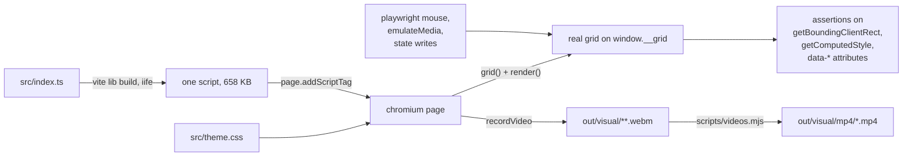

# Recorded proof

Five scenarios, filmed in real chromium, each one asserted on measured geometry and real DOM before
and after every step. The video is the evidence a person can watch; the assertions are the gate that
fails the build when the evidence stops being true.

| | |
| --- | --- |
| suite | `tests/2_visual.e2e.test.ts` |
| config | `vitest.visual.config.ts` (video `on`, trace `on`, 1400x900, `contextScope: "test"`) |
| run | `npx vitest run -c vitest.visual.config.ts` then `node scripts/videos.mjs` |
| result | 5 passed, 0 failed, 20.56 s |
| clips | `out/visual/mp4/*.mp4`, index at `out/visual/index.md` |

## TOC

1. [What the page under test is](#1-what-the-page-under-test-is)
2. [Scenario 1: CSS customization](#2-scenario-1-css-customization)
3. [Scenario 2: column resize by dragging](#3-scenario-2-column-resize-by-dragging)
4. [Scenario 3: virtualization](#4-scenario-3-virtualization)
5. [Scenario 4: column order model](#5-scenario-4-column-order-model)
6. [Scenario 5: column visibility](#6-scenario-5-column-visibility)
7. [Clip inventory](#7-clip-inventory)

## 1. What the page under test is

`fixtures/main.ts` builds a fixed receipt page by calling `grid()` and `render()`
(`fixtures/main.ts:107,126`). The visual suite builds its own page instead, from `src/index.ts` with
a vite lib build in `beforeAll`, so it can inject `src/theme.css` unmodified and mount a live grid
per test. Nothing between the assertions and the library is a test double.

`render()` installs the scroll and resize listeners that feed the viewport
(`src/10_render.ts:583-604`), so the viewport needs no consumer wiring. The resize drag in the
injected bootstrap is assembled from parts the package already exports: the delegated
`gridDom(id).headerResize.route.pointerdown` stream, `drag()` from `src/6_gestures.ts`, and one
`{ phase: "change", type: "colWidth" }` dispatch per move.

## 2. Scenario 1: CSS customization

`out/visual/mp4/tests-2-visual-e2e-test__css-custom-properties-on-the-grid-root-retheme-live-rows-and-light-dark-flips-wi.mp4` (5.64 s, 53 KB)

Proves the theme is data: a consumer retheme is a custom property write on the grid root, and the
`light-dark()` pairs in `src/theme.css` re-resolve from the real color scheme with no re-render.

Grid: tree data, 3 folders x 4 leaves, `expanded: { p0: true }`, columns Name / Size / Kind.

| step | measured | assertion |
| --- | --- | --- |
| baseline | row 36 px, depth-1 indent 16 px | `boxOf(row).height === 36`, `margin-inline-start === "16px"` |
| `--sg-row-h: 52px`, `--sg-indent: 40px` | row 52 px, indent 40 px | same two reads, new values |
| `--sg-selected-bg: rgb(255, 64, 129)` + `rowSelection = { p0: true }` | selected row `rgb(255, 64, 129)`, sibling `rgb(255, 255, 255)` | `data-selected="true"` and computed `background-color` on both rows |
| `emulateMedia({ colorScheme: "dark" })` | bg `rgb(20, 22, 26)`, fg `rgb(230, 232, 234)` | grid root and an unselected row both flip |
| `emulateMedia({ colorScheme: "light" })` | bg `rgb(255, 255, 255)`, fg `rgb(26, 28, 31)` | the same declarations resolve to the other pair |
| `state.density = "compact"` | row 28 px, `--sg-row-h` reads `28px` | the renderer reclaims the property from the override |

`--sg-row-h` has two writers: the default in `src/theme.css` and `writeGridVars` in `src/9_css.ts`,
which writes it inline from `ROW_HEIGHT[density]` on every geometry frame. A run-time override on the
grid root therefore holds until the next geometry frame, and the density step is what takes it back.
The scenario asserts both halves so the ownership is recorded rather than discovered later.

## 3. Scenario 2: column resize by dragging

`out/visual/mp4/tests-2-visual-e2e-test__dragging-the-resize-handle-with-a-real-pointer-widens-one-column-and-leaves-its-.mp4` (2.96 s, 76 KB)

Proves a resize is one state write that both bands read, and that it touches exactly one column.

Grid: 40 flat rows, columns Name 220 / Size 120 / Kind 140 / Owner 160, all `resizable`.

Gesture path, not state path. `page.mouse.move` to the centre of
`[data-route="h"][data-col-id="size"] [data-route="resize"]`, `mouse.down`, six `mouse.move` calls of
+20 px each with a dwell between, `mouse.up`.

| move | measured cell width |
| --- | --- |
| +20 | 140 px |
| +40 | 160 px |
| +60 | 180 px |
| +80 | 200 px |
| +100 | 220 px |
| +120 | 240 px |

Assertions after release:

- `boxOf(row r0, col size).width === 240`
- `boxOf(header size).width === 240`, so one write moved the header band and the row band
- `__grid.widths().size === 240`, the model agrees with the document
- `getComputedStyle(root).getPropertyValue("--sg-h-w-size") === "240px"`
- neighbour Name: width 220 px and x unchanged across the whole drag
- neighbour Kind: width 140 px unchanged (its offset moves, its size does not)

## 4. Scenario 3: virtualization

`out/visual/mp4/tests-2-visual-e2e-test__5000-rows-recycle-through-a-bounded-dom-and-turning-virtualization-off-renders-t.mp4` (9.32 s, 168 KB)

Proves rows recycle: the model holds 5000, the document holds around 25, and the two stay in
agreement while the list scrolls.

Grid: 5000 flat rows, columns Name / Size / Kind, scroll box 620 px tall, `overscan` 4.

| step | input | DOM `[data-route="r"]` | first row key |
| --- | --- | --- | --- |
| mounted | none | 22 | `r0` |
| wheel 1 of 3 | 6 x `mouse.wheel(0, 340)` | 26 | `r52` |
| wheel 2 of 3 | 6 x `mouse.wheel(0, 340)` | 26 | `r109` |
| wheel 3 of 3 | 6 x `mouse.wheel(0, 340)` | 26 | `r166` |
| jump to the end | `scrollTop = 1e6`, clamped | 21 | `r4979` |
| `state.virtualize.vertical = false` | none | **5000** | `r0` |
| `state.virtualize.vertical = true` | none | 21 | `r4979` |

Assertions: `__grid.flat() === 5000` throughout; every windowed count under 60; every first key
distinct across the five scroll steps, which is the recycling claim; `plan.center.length` equal to
the DOM count at each step, so the model and the document never disagree; the clamped end contains
`r4999`; and `virtualize.vertical: false` puts all 5000 rows in the document and in `plan.center`.

Peak ratio: 5000 model rows to 26 DOM rows, 192 to 1.

## 5. Scenario 4: column order model

`out/visual/mp4/tests-2-visual-e2e-test__state-colorder-drives-the-header-band-and-every-row-band-from-one-model.mp4` (3.16 s, 64 KB)

Proves one array orders both bands. A header-only reorder would pass a header assertion and fail
this one, because every one of the 12 rows is read.

Grid: 12 flat rows, columns Name / Size / Kind / Owner.

| write | header sequence | cell sequence, all 12 rows |
| --- | --- | --- |
| mount, `colOrder = ["name","size","kind","owner"]` | name, size, kind, owner | identical |
| `colOrder = ["kind","owner","name","size"]` | kind, owner, name, size | identical |
| `colOrder = ["owner","name","size","kind"]` | owner, name, size, kind | identical |

The third write moves the previous first column (`kind`) to last. `__grid.order()`, read straight
off `g.view.cols`, matches the document in the same tick.

## 6. Scenario 5: column visibility

`out/visual/mp4/tests-2-visual-e2e-test__hiding-a-column-removes-it-from-both-bands-and-reflows-the-rest-and-unhiding-ret.mp4` (3.12 s, 61 KB)

Proves hiding is a model operation, not a `display: none`: the cells leave the document, the
remaining flex columns take the freed width, and unhiding restores rank rather than appending.

Grid: 12 flat rows, columns Name `flex 2 minWidth 120`, Size / Kind / Owner `flex 1 minWidth 80`,
`colOrder = ["name","size","kind","owner"]`, available width 1344 px.

| state | header sequence | `[data-col-id="kind"]` cells | Name px | Size px |
| --- | --- | --- | --- | --- |
| all visible | name, size, kind, owner | 12 | 536.80 | 268.39 |
| `colHidden = { kind: true }` | name, size, owner | 0 | 671.00 | 335.50 |
| `colHidden = {}` | name, size, kind, owner | 12 | 536.80 | 268.40 |

Assertions: `toHaveCount(0)` for both the hidden header cell and its row cells; every row's cell
sequence equal to `["name","size","owner"]` while hidden; both remaining widths strictly greater than
before; `round(name / size) === 2`, so the 2:1:1 flex ratio survived the reflow; and on unhide,
`headerOrder().indexOf("kind") === 2`, its rank in `colOrder`, not the end.

## 7. Clip inventory

| scenario | mp4 | seconds | KB |
| --- | --- | --- | --- |
| 1 CSS customization | `…__css-custom-properties-on-the-grid-root-retheme-live-rows-and-light-dark-flips-wi.mp4` | 5.64 | 53 |
| 2 column resize | `…__dragging-the-resize-handle-with-a-real-pointer-widens-one-column-and-leaves-its-.mp4` | 2.96 | 76 |
| 3 virtualization | `…__5000-rows-recycle-through-a-bounded-dom-and-turning-virtualization-off-renders-t.mp4` | 9.32 | 168 |
| 4 column order | `…__state-colorder-drives-the-header-band-and-every-row-band-from-one-model.mp4` | 3.16 | 64 |
| 5 column visibility | `…__hiding-a-column-removes-it-from-both-bands-and-reflows-the-rest-and-unhiding-ret.mp4` | 3.12 | 61 |

Byte sizes come from the run of 2026-09-10 08:56 and move a few KB between runs, because vp8
encoding is not bit-identical; `scripts/videos.mjs` rewrites `out/visual/index.md` with the current
numbers every time it runs. Durations are stable.

All five sit under `out/visual/mp4/`, prefixed `tests-2-visual-e2e-test__`. The source `.webm`, the
playwright trace, and a failure screenshot when there is one stay in the attempt directory beside
them, under `out/visual/tests-2-visual-e2e-test/<test-slug>.<task id>.r<retry>.p<repeat>/`.

Each clip narrates itself: `tests/helpers/record.ts` paints a caption band naming the action about to
happen and a drawn cursor tracking the real pointer, both outside the grid root and both
`pointer-events: none`, so playwright's actionability hit test still lands on the cell underneath and
no assertion can see either element.
