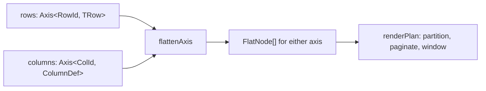

# Why two axes

The design argument, with a receipt on every line. A claim that could not be sourced to a file
line, a passing test, or a command that printed a number was cut rather than softened.

## Contents

1. [The decision in one table](#1-the-decision-in-one-table)
2. [What one container buys](#2-what-one-container-buys)
3. [The transpose, which is the payoff](#3-the-transpose-which-is-the-payoff)
4. [What it costs](#4-what-it-costs)
5. [Three alternatives, rejected](#5-three-alternatives-rejected)
6. [Still unwired](#6-still-unwired)
7. [How to check any line of this page](#7-how-to-check-any-line-of-this-page)

## 1. The decision in one table

| | the usual shape | this package |
| --- | --- | --- |
| rows | a pipeline of row models | `Axis<RowId, TRow>` (`src/0_types.ts:40`) |
| columns | an array plus a grouping model | `Axis<ColId, ColumnDef>`, the same interface |
| the operators | one set per axis | `axisOfEntries` `src/1_axis.ts:50`, `filterAxis` `:225`, `sortAxis` `:245`, `groupAxis` `:284`, `flattenAxis` `:361`, `mapAxis` `:430` |
| which axis scrolls | fixed when the library was written | `state.orientation` (`src/0_types.ts:345`), read through two lookup tables |

`docs/3_competitors.md` states the comparison it is drawn against: MUI X and TanStack v9 are both
one-axis systems with a bolt-on for the other, and neither expresses column ordering and row
sorting as the same operator.



## 2. What one container buys

| what | receipt |
| --- | --- |
| One flatten serves tree rows and header groups. `flattenAxis` is called with the real `expanded` predicate for rows and with `() => true` for columns. | `src/8_grid.ts:327` and `src/8_grid.ts:370` |
| One partition serves row pinning and column pinning. `Side` is `start`, `center`, `end` on both. | `partition` at `src/4_slice.ts:23`; the matrix credits `row.pin` and `col.pin` to the same line, `docs/1_parity.md` |
| A flat list and a tree run the same path, because a flat grid is the case where every key is a root. | `axisOfEntries` `src/1_axis.ts:50`, `axisOfTree` `src/1_axis.ts:90` |
| A cyclic parent map does not throw. A node standing on a cycle becomes a root. | `src/1_axis.ts:50`, and `src/1_axis.test.ts` covers cycles among its 38 cases |
| Identity by reference is the skip condition. `filterAxis` returns its input when nothing was dropped, so downstream stages skip on `===`. | `src/1_axis.ts:225`; the same convention in `collapseToOneEntry`, `src/12_transpose.ts:88` |
| A no-write read of the derived list costs 0.000137 ms against 0.000454 ms for `getRowModel`. | `bench/README.md:256` |
| Expanding a 124,800-node tree at 10 percent open costs 0.214 ms against 0.651 ms. | `bench/README.md:254` |

## 3. The transpose, which is the payoff

`state.orientation` decides which axis scrolls, pages, and pins into sticky runs. Past the boundary
the kernel speaks of a vertical seat and a horizontal seat and never asks which one holds a row
(`src/12_transpose.ts:1`).

| receipt | what it shows |
| --- | --- |
| `grep -rnE "if *\(.*orientation\|orientation *===\|orientation *!==" src/` prints nothing and exits 1 | no branch on orientation anywhere in `src/`, tests included |
| `src/12_transpose.ts:28` `SEATS`, `src/12_transpose.ts:33` `FLIPPED` | the two tables that carry it. A third orientation is a third row and no other edit |
| `src/12_transpose.ts:36` `transpose` | its own inverse, which is what a round trip rests on |
| `src/12_transpose.test.ts:190` "a span of 2 vertical and 3 horizontal, transposed, is 3 vertical and 2 horizontal" | the acceptance test. `:194` asserts the relation, `:203` asserts that transposing by hand lands on the relation the transposed grid built, `:212` asserts the covered set swaps with it |
| `src/12_transpose.test.ts:115` "a transpose twice returns the original plan" | the round trip |
| `src/8_grid.ts:307`, `:368`, `:391`, `:456` | the four reads of `state.orientation` in the grid constructor, every one an index into the seat table |

List view is the same lever one notch further: the horizontal axis keeps one entry, so every
vertical entry renders as a single cell (`collapseToOneEntry`, `src/12_transpose.ts:88`). It is not a second
rendering mode.

## 4. What it costs

| cost | receipt |
| --- | --- |
| No per-row and per-column handles. A key-and-map container answers with `ReadonlyMap` lookups where MUI and TanStack hand back `Row.getIsSelected()` and `Column.getCanPin()`. | `docs/3_competitors.md`, section 1, closing paragraph |
| Grouping is slower. `groupAxis` rebuilds the forest above the data edges so a unit travels with its own subtree, and pays 45.0 ms against 32.9 ms at 100k rows, 1.37x. | `bench/README.md:258`, reason at `:222` |
| `axisOfEntries(entries, parentOf)` is quadratic on a path-shaped relation: 500 nodes 8.4 ms, 4000 nodes 417.0 ms, 3.3x to 4.2x per doubling. A flat relation and `axisOfTree` never reach that walk. | `bench/README.md:338` |
| Two vocabularies meet at one file, and a `ColumnDef.span` returning `{ rows, cols }` has to be crossed into neutral counts. | `neutralSpan`, `src/12_transpose.ts:127` |
| `renderPlan` is O(total rows) per scroll tick, virtualized or not: 1.93 ms at 100k with a uniform sizer. | `bench/README.md:390` |

## 5. Three alternatives, rejected

### 5.1 A row pipeline plus a flat column list

The shape both competitors take. Rejected because the transpose becomes a second code path: every
stage that reads a row would need a column twin, and the `if (orientation === ...)` that section 3's grep
returns nothing for would appear once per stage. The one-axis shape also forces header nesting into
a separate pass, `buildHeaderGroups()` in TanStack and `columnGroupingModel` in MUI
(`docs/3_competitors.md`, section 1 table, "tree axis" row).

Kept from the rejected option: nothing. Section 4 is the whole bill.

### 5.2 A pixel width solver in the package

`flexWidths` resolved declared width, min, max, and flex into pixels against the viewport width. It
is deleted (`docs/5_tests.md:246`). `trackList` (`src/4_slice.ts:267`) emits one
`grid-template-columns` value using `fr` and `minmax()`, and the browser distributes.
`view.widths` now reports declared widths and says so in its own comment (`src/8_grid.ts:520`).

The measured reason to keep width arithmetic out of the reactive chain, from this repo's own
benchmark: a resize drag writes `state.colWidth` once per pointermove, and each write used to
re-sort the whole row pipeline. The fix landed and one `colWidth` write at 100,000 rows now costs
0.0126 ms (`bench/README.md:238`). Two causes, both in `@hafley66/signals` and neither in this
package (`.changeset/signals-distinct.md:7`, held by `packages/signals/src/4_assumptions.test.ts:19`).

Cost of the trade: nothing in the package can know what a flex column ends up occupying without
measuring the DOM, so a caller wanting the painted width reads the element (`src/8_grid.ts:426`).

### 5.3 Filtering inside the kernel

`filterAxis` is written, tested, and called by nothing (`src/1_axis.ts:225`; `README.md` names it
as having no call site). The reason is recorded in the generator rather than in prose, so the
matrix cannot disagree with it: "The operators exist in 2_operators.ts; the view chain never
applies them, so a filter model would be state nothing reads" (`scripts/parity.mjs:91`). Tagging
`row.filter` as implemented fails the parity run (`scripts/parity.mjs:240`).

Three more are cut on the same page and by the same mechanism: `row.aggregate`, `cell.edit`,
`col.type`, each with its reason at `scripts/parity.mjs:90`.

## 6. Still unwired

| gap | receipt |
| --- | --- |
| `filterAxis`, `mapAxis`, and `buildRowPredicate` have no call site. | `src/1_axis.ts:225`, `:430`; `README.md`, "The one idea" table |
| `view.cols` carries the header group node and `src/10_render.ts` drops it before the header band is built, so `col.group` is a type only. | `docs/1_parity.md:62`, `README.md`, "Not built" |
| `col.order`, `col.resize`, `col.group`, `col.formula`, `cell.focus`, `page.server`, `view.density`, `view.slots`, `data.state` are declared and not run. Nine ids in all, against 21 implemented. | `node scripts/parity.mjs` prints the split; the rows are the "declared only" cells of `docs/1_parity.md` |
| Column virtualization is the same `windowOf` on the other axis and is not wired. | `docs/3_competitors.md`, section 5.2 table |
| `grid()` subscribes to no producer for `viewport`, and ships no epic turning a header pointerdown into a `colWidth` change. The visual suite supplies 8 and 12 lines of consumer glue for those two. | `docs/4_proof.md`, section 1 table |
| Row reconciliation by key has no unit test. `grep -c "toBe(row\|toBe(first\|toBe(el" src/10_render.test.ts` answers 0. | `docs/5_tests.md`, section 4, rank 1 |
| Tags in `src/12_transpose.ts` and later files are not collected: `TAGGED_FILES` stops at `11_detail.ts`, so the transpose lane's work is absent from the matrix. | `scripts/parity.mjs:16` |
| The transpose reaches the model and not the rendered cells. Under `orientation: "columns"` the renderer builds the frame and `slots.cell` is never called. | measured, "The transpose reaches the model and not the rendered cells" |

### The transpose reaches the model and not yet the rendered cells

`src/12_transpose.test.ts` asserts the model and constructs one grid per orientation
(`src/12_transpose.test.ts:56`), so no case in the suite renders a transposed grid or writes the key
after a render. The visual suite covers the default orientation only (`docs/4_proof.md`, section 7).
Two gaps sit in that hole. Both were reproduced on 2026-09-10 against a `vite build --lib` bundle of
`src/index.ts` mounted in jsdom, over two rows and two columns holding the values 1, 2, 3, 4.

| case | `view.plan.$().center` | `[data-route="r"]` | `[data-route="c"]` text |
| --- | --- | ---: | --- |
| constructed at `"rows"`, then `render` | `["a","b"]` | 2 | `1`, `2`, `3`, `4` |
| constructed at `"columns"`, then `render` | `["x","y"]` | 2 | four cells, every one empty |
| mounted at `"rows"`, then `state.orientation.$("columns")` | unchanged | 0 | header band moves, row band empties |
| the same write with no renderer attached | `["x","y"]` | not rendered | not rendered |

Row 2: `slots.cell` is never called under the transpose, so the renderer builds the frame and writes
no values into it. Row 3: an orientation write after `render()` moves the header band and leaves
`view.plan` on the previous axis, which row 4 shows is the renderer's subscription and not the memo.
`site/pitch.ts` therefore mounts one grid and states the transpose from the test rather than
demonstrating it.

## 7. How to check any line of this page

```sh
cd packages/signal-grid
npx vitest run                              # 465 tests, 17 files, 0 failed
npx vitest run -c vitest.e2e.config.ts      # 15 tests, 2 files, 0 failed
node scripts/parity.mjs                     # 47 features, 43 tags, signal-grid 21
grep -rnE "if *\(.*orientation|orientation *===|orientation *!==" src/   # no output, exit 1
```

Numbers on this page were produced by those four commands on 2026-09-10, plus `bench/README.md`,
which records its own machine at `bench/README.md:70` and its method at `:53`.
