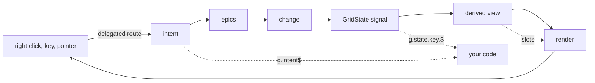

# Extending signal-grid

Seven doors out of the kernel, and one worked example that walks through four of them at once.
Every example is lifted from a test or from a file in `src/`, and each section names the
`file:line` that makes the door work.

## Table of contents

| # | Door | You supply | The kernel supplies |
|---|---|---|---|
| [1](#1-slots) | Slots | a function returning a node, or a signal of one | the ctx, the mount, the teardown |
| [2](#2-epics) | Epics | `(actions$, state, ctx) => Observable<GridAction>` | the action bus and the reducer |
| [3](#3-raw-intents) | Raw intents | an rxjs subscription on `g.intent$` | delegated listeners for the whole page |
| [4](#4-state-writes) | State writes | `g.state.<key>.$(value)` | derivation, render, url sync |
| [5](#5-columns) | Columns | a `ColumnDef`, or one of six built-ins | schema, forest, spans, widths |
| [6](#6-your-own-delegated-event) | Delegated events | `Dom(template).route.<event>` | the `data-route` chain already stamped |
| [7](#7-css) | CSS | a rule, or a `--sg-*` value | the layout and the property namespace |
| [8](#8-context-menus-the-worked-example) | Context menus | the menu itself | the target, the anchor, the intent |

Closing table: [what cannot be extended today](#what-cannot-be-extended-today).



---

## 1. Slots

A slot is one function. It takes a ctx and returns anything `Renderable`, or a signal of one
(`src/0_types.ts:143`). Thirteen of them are declared on `Slots<TRow>` (`src/0_types.ts:189`).

### A slot that returns a signal

Returning a signal is how a single cell gets live content without the grid minting a signal per
cell. The renderer subscribes that one node into the row's `Subscription`, inserts at a comment
anchor, and replaces only what the previous emission inserted, so the resize handle appended after
it survives (`src/10_render.ts:669`).

```ts
// src/10_render.test.ts, "a slot returning a signal subscribes one node"
const ticking = Signal("first")
const slots: Slots<Row> = { cell: () => ticking }
render(grid({ id: "g", rows: ROWS, columns, rowId: (row) => row.id, slots }), root)
ticking.$("second")   // one text node rewritten; the row never re-renders
```

The subscription is owned by the row record, so a recycled row cannot keep writing into a node that
now belongs to another row.

### A per-column slot beating the schema-wide one

`ColumnDef.cell` (`src/0_types.ts:227`) is the per-column body slot and `Slots.cell` is the
schema-wide default. The pick order is one line, `src/10_render.ts:328`:

```ts
const slot = (editing ? g.slots.editor : undefined) ?? def?.cell ?? g.slots.cell
```

Read it as three rules: an editor wins while the cell is editing, the column beats the schema, and
absent means the built-in text path. Headers follow the same shape at `src/10_render.ts:238`, where
`ColumnDef.headerCell` beats `Slots.header` and `ColumnDef.header` is only the plain-text label.

```ts
const columns: readonly ColumnDef<Row>[] = [
  { id: "name", header: "Name" },                          // schema-wide Slots.cell renders it
  { id: "size", cell: (ctx) => `${ctx.value} KB` },         // this one wins for size only
]
```

| Ctx | Fields | Declared at |
|---|---|---|
| `CellCtx` | `row, col, data, value, node, editing` | `src/0_types.ts:157` |
| `HeaderCtx` | `col, node, sort, pinned` | `src/0_types.ts:172` |
| `RowCtx` | `row, data, node, selected, open` | `src/0_types.ts:180` |

---

## 2. Epics

An epic is `(actions$, state, ctx) => Observable<GridAction>` (`src/7_epics.ts:47`). It reads the
state signal and the derived view through `GridEpicCtx` (`src/7_epics.ts:38`), touches no DOM, and
is never async. `config.epics` (`src/8_grid.ts:139`) replaces the whole list; absent installs
`defaultEpics()` (`src/8_grid.ts:262`).

Twelve ship today, `src/7_epics.ts:574`:

| Epic | Reads | Writes |
|---|---|---|
| `sortOnHeaderClick` | `header.click` | `sort` |
| `expandOnExpanderClick` | `expander.click` | `expanded` |
| `selectRowsOnCheckboxClick` | `checkbox.click` | `rowSelection` |
| `activateOnCellClick` | `cell.click` | effect `activate`, `focus`, `editing` |
| `resizeOnHeaderDrag` | `header.pointerdown` part `resize` | `colWidth` |
| `moveColumnOnHeaderDrag` | `header.pointerdown` part `move` | `colOrder` |
| `moveRowOnRowDrag` | `row.pointerdown` | effect `reorderRow` |
| `keyboardNav` | `key` | `focus`, `editing`, `expanded` |
| `pageOnScrollNearEnd` | `viewport.scroll` | `page` |
| `selectCellsOnDrag` | `cell.pointerdown` | `selection` |
| `selectRowsOnDrag` | `header.pointerdown` part `select` on the gutter | `selection` |
| `selectColumnsOnDrag` | `header.pointerdown` part `select` | `selection` |

### Replacing one

Spread the defaults, drop the one being replaced, append yours. Nothing registers by name, so the
filter is by identity:

```ts
import { defaultEpics, sortOnHeaderClick } from "@hafley66/signal-grid"

const singleColumnSort: GridEpic<Row> = (actions$, state) =>
  actions$.pipe(
    filter((action) => action.phase === "intent" && action.type === "header.click"),
    map((action) => ({ phase: "change", type: "sort", sort: [{ field: action.col, sort: "asc" }] })),
  )

const base = defaultEpics<Row>().filter((epic) => epic !== sortOnHeaderClick)
grid<Row>({ ..., epics: [...base, singleColumnSort] })
```

`sortOnHeaderClick()` returns a fresh closure on every call, so compare against the array you built
rather than against a fresh invocation.

### Dropping one

A grid that must never sort by a header click ships the list without it:

```ts
const noSort = defaultEpics<Row>().slice(1)      // sortOnHeaderClick is index 0
grid<Row>({ ..., epics: noSort })
```

### Adding an opt-in epic

`detailOnCellClick` (`src/11_detail.ts:14`) is written to be appended rather than installed:

```ts
grid<Row>({ ..., epics: [...defaultEpics<Row>(), detailOnCellClick({ columns: ["__detail"] })] })
```

---

## 3. Raw intents

`g.intent$` (`src/8_grid.ts:185`) is every intent the DOM raised, after the gridId and root filter
and before any epic ran. Subscribing to it is the door for behavior the kernel has no opinion about,
and it needs no epic and no state key.

Lazy tree loading, the example written at the top of `src/11_detail.ts:17-28`, against a source
signal the consumer owns:

```ts
const source = Signal<readonly Row[]>(ROWS)
const g = grid<Row>({ id: "tree", rows: source, columns, rowId: (row) => row.id, subRows })
const loaded = new Set<RowId>()

g.intent$
  .pipe(
    filter((intent) => intent.type === "cell.click" && intent.col === "name"),
    filter((intent) => loaded.has(intent.row) === false),
    mergeMap((intent) => fetchChildren(intent.row).then((kids) => ({ row: intent.row, kids }))),
  )
  .subscribe(({ row, kids }) => {
    loaded.add(row)
    source.$(withChildren(source.$(), row, kids))
    g.state.expanded.$({ ...g.state.expanded.$(), [row]: true })
  })
```

`withChildren` is yours: `axisOfTree` (`src/1_axis.ts:90`) re-derives the whole forest from the array,
so grafting children is an edit to your own data and never a call into the grid.

The intent grammar is closed and exhaustive at `src/0_types.ts:364`. Filter on `type`, and a rename
of a member breaks your filter at compile time rather than silently unsubscribing it.

---

## 4. State writes

`g.state` is a `Signal<GridState>` with a recursive proxy: every key, and every key of a nested
record, is a signal you can read with `.$()` and write with `.$(value)`.

```ts
// src/8_grid.test.ts:72, "there are no onChange pairs: writing the signal is the whole api"
g.state.colHidden.size.$(true)
g.view.cols.$().map((node) => node.key)      // ["name"]
```

The write reaches the derived chain, the renderer, and the url sync in the same tick. No callback is
registered and none is offered.

### Why there is no onChange

A `value` plus `onChange` pair is one state cell split across two props, which forces every consumer
to re-join them and forces the library to pick a default for the join. A signal is both halves in
one object (`src/0_types.ts:141`), so `controlled` and `uncontrolled` stop being different things:
you hold the same signal the grid holds.

| You want | You do |
|---|---|
| the current value | `g.state.sort.$()` |
| to write it | `g.state.sort.$([{ field: "name", sort: "asc" }])` |
| to observe it | `g.state.sort.$.subscribe(...)` |
| to own it entirely | pass your own signal or observable as `config.state` (`src/8_grid.ts:119`) |
| to persist it | `sync: true`, which round-trips through the url (`src/8_grid.ts:236`) |

The store is one signal, chosen at `src/8_grid.ts:237`: a `storageSignal(urlAdapter(key), seed)`
when `sync` is set, a plain `Signal(seed)` otherwise. Both are written the same way.

---

## 5. Columns

`ColumnDef<TRow, V>` (`src/0_types.ts:193`) carries reading (`value`, `formula`), sizing (`width`,
`minWidth`, `maxWidth`, `flex`), capability flags, sorting and filtering hooks, header-group
membership, spanning, and the two slots from section 1.

```ts
const columns: readonly ColumnDef<Row>[] = [
  { id: "name", header: "Name", width: 160, sortable: true, editable: true },
  { id: "size", header: "Size", type: "number", flex: 1 },
  { id: "ratio", header: "Ratio", formula: (row, api) => Number(api.get(row, "size")) / 100 },
]
```

Six built-ins are functions returning a `ColumnDef` with a `builtIn` tag (`src/5_columns.ts:16`):

| Built-in | Factory | Id | Carries its own route |
|---|---|---|---|
| checkbox | `checkboxColumn()` | `__check` | yes, `g/r/check` |
| radio | `radioColumn()` | `__radio` | yes, `g/r/check` |
| expander | `expandColumn()` | `__expand` | yes, `g/r/expand` |
| drag handle | `dragColumn()` | `__drag` | yes, `g/r/move` |
| detail toggle | `detailColumn()` | `__detail` | no, the cell keeps `g/r/c` |
| row number | `rowNumberColumn()` | `__rowNumber` | no, the cell keeps `g/r/c` |

Factories at `src/5_columns.ts:181, 202, 219, 235, 249, 263`. The four that carry a row-level route
render a routeless cell, because a cell contributes a `c` segment and `g/r/c/check` is a chain no
template declares (`src/10_render.ts:58`). That fact is what makes the routeless part of an expander
cell one of the three gestures that reach `row.contextmenu` in section 8.

A built-in is an ordinary `ColumnDef`, so it is pinned, hidden, reordered, and resized by the same
state keys as any other column.

---

## 6. Your own delegated event

The renderer stamps a `data-route` skeleton plus one `data-*` per path param onto every part
(`src/3_paths.ts:14` for the segments, `src/3_paths.ts:36` for the composed templates). `Dom(template)`
gives back a `route` proxy whose properties are observables of any DOM event name, resolved by
composing the `data-route` chain up the ancestors (`packages/xdom/src/1_domTemplate.ts:76`).

The match is **equality against the whole composed chain**, not a prefix test. A pointer over a cell
composes `g/r/c` and matches the cell template alone, so two templates never both fire for one event.

```ts
import { Dom } from "@hafley66/xdom"
import { PATHS, TEMPLATES } from "@hafley66/signal-grid"

// Middle-click a cell to open it in a new tab. No epic, no state, no listener per row.
Dom(TEMPLATES.cell).route.auxclick
  .pipe(filter((event) => event.params.gridId === g.id.$() && event.button === 1))
  .subscribe((event) => open(`/rows/${event.params.rowId}`))
```

`event.params` is typed from the template, so `rowId`, `colId`, and `gridId` are `string` and a
missing param is a compile error. `Dom` caches per template string, so this adds one delegated
listener for the page whatever the row count.

The chains available today:

| Chain | Element | Params |
|---|---|---|
| `g` | the grid root | `gridId` |
| `g/vp` | the viewport box | `gridId` |
| `g/h` | a header cell | `gridId, colId` |
| `g/h/move` | the header label, when the column is movable | `gridId, colId` |
| `g/h/resize` | the resize handle | `gridId, colId` |
| `g/r` | a row, a routeless glyph cell, an open detail panel | `gridId, rowId` |
| `g/r/expand` | the expander glyph | `gridId, rowId` |
| `g/r/check` | the checkbox or radio glyph | `gridId, rowId` |
| `g/r/move` | the row drag handle | `gridId, rowId` |
| `g/r/c` | a data cell | `gridId, rowId, colId` |

`selectorFor(part, values)` (`src/3_paths.ts:177`) builds the CSS selector from the same
`routeAttrs` the renderer stamps, so a selector cannot describe an element the renderer never
produces. Use it in tests and in any `querySelector` you write.

---

## 7. CSS

Two knobs: rewrite a custom property, or write a rule.

### Custom properties

Declared with defaults at `src/theme.css:44-61`, scoped to `[data-route="g"]`, which is the same
attribute delegation matches on, so two grids on a page have two independent property scopes and no
id appears in a selector.

| Property | Default | Written by |
|---|---|---|
| `--sg-row-h` | `36px` | `src/theme.css:45` and `writeGridVars` (`src/9_css.ts:36`) from density |
| `--sg-total-h` | `0px` | `src/9_css.ts:12`, the scroll spacer height |
| `--sg-offset-y` | `0px` | `src/9_css.ts:14`, the virtualization translate |
| `--sg-inline-tracks` | unset | `src/9_css.ts:17`, the `grid-template-columns` track list |
| `--sg-h` | unset | `src/10_render.ts`, per-row alias of that row's height property |
| `--sg-depth` | `0` | per row, feeds the tree indent calc |
| `--sg-indent` | `16px` | you |
| `--sg-glyph` | `16px` | you |
| `--sg-col-w` | `100px` | you |
| `--sg-pad` | `8px` | you |
| `--sg-line`, `--sg-bg`, `--sg-fg` | `light-dark(...)` | you |
| `--sg-head-bg`, `--sg-hover-bg`, `--sg-selected-bg` | `light-dark(...)` | you |
| `--sg-focus`, `--sg-range-bg`, `--sg-range-edge` | `light-dark(...)` | you |

Per-entry sizes are properties named after the id, encoded to a valid ident by `encodeVarId`
(`src/3_paths.ts:378`): `colWidthVar`, `rowHeightVar` (`src/3_paths.ts:366-367`). No stylesheet
selector can spell those names, which is why the generic rules read an alias (`--sg-h`, `--sg-x`)
written inline on the element that holds the value.

```css
.my-grid { --sg-row-h: 28px; --sg-indent: 24px; --sg-accent: oklch(0.7 0.15 250); }
```

Five are registered with `@property` (`src/theme.css:9-33`), so `--sg-depth` feeds a continuous
`calc()` rather than a discrete one and an invalid value falls back to the initial rather than
poisoning the declaration.

### Why an unlayered consumer rule wins

`src/theme.css:4` declares `@layer signal-grid.theme, signal-grid.structure;`. A cascade layer is
beaten by any unlayered rule regardless of specificity, so the intent of that line is that a
consumer rule needs no `!important` and no specificity fight.

**Accuracy note, verified 2026-09-10:** the layer *order* is declared and no rule in the file is
ever placed inside either layer. Every rule from `src/theme.css:44` onward is unlayered today, so a
consumer rule wins by ordinary source order and specificity; the layer declaration
contributes nothing until the rules move inside a layer. Import
`theme.css` before your own stylesheet and match its specificity (`[data-route="g"] .sg-cell` is
one attribute plus one class), or wrap the file in `@layer signal-grid.structure { ... }` to make
the header comment true.

### Rules you are expected to write

`.sg-cell`, `.sg-head-cell`, `.sg-row`, `.sg-run`, `.sg-expander`, `.sg-detail-panel` are the class
surface. State reads as attributes rather than classes, so a rule matches the same thing an
assertion does:

| Attribute | On | Meaning |
|---|---|---|
| `data-selected` | row (`"true"`/`"false"`), cell (presence) | row selection, range membership |
| `data-edge~="top\|bottom\|start\|end"` | cell | which sides of the range block it sits on |
| `data-editing="true"` | cell | the editor is mounted in it |
| `data-open`, `aria-expanded` | row | tree expansion |
| `data-detail="true"` | row | it is a panel, not a data row |
| `data-span="true"` | cell | it spans, with `--sg-span-vertical` / `--sg-span-horizontal` |
| `data-side` | run | `start`, `center`, `end` pinning run |
| `data-sort`, `aria-sort` | header cell | `asc` / `desc` |
| `data-leaf` | expander | no children |

---

## 8. Context menus, the worked example

A menu is UI every app wants to own, so the library ships what only the library can know: which
cell, row, or column was targeted, and where to anchor to. It ships no list, no items, and no
keyboard handling for a popup. `src/16_menu.ts` is the whole of it, and it uses four of the doors
above: [3](#3-raw-intents) for the intent, [6](#6-your-own-delegated-event) for the route that
raised it, [1](#1-slots) for what the menu acts on, and [7](#7-css) for the tether.

### The three intents

| Intent | Raised by a right click on | Fields |
|---|---|---|
| `cell.contextmenu` | a data cell, chain `g/r/c` | `row, col, x, y, mods` |
| `header.contextmenu` | a header cell, its label, or its resize handle | `col, x, y, mods` |
| `row.contextmenu` | a row, a routeless glyph cell, an open detail panel | `row, x, y, mods` |

Which one fires is decided by where the pointer landed, not by three listeners racing:
`fromDelegatedRoute` compares the composed chain for equality, so a cell right click composes
`g/r/c` and the row template never sees it (`packages/xdom/src/1_domTemplate.ts:100`, asserted at
`src/16_menu.test.ts`).

`x` and `y` are client coordinates, because a consumer positioning by hand needs them and a consumer
using anchor positioning ignores them.

The native browser menu is suppressed only where an intent was produced. A right click on the
scroll bar, on the header strip beside the last column, or on the grid box below the last row
composes a chain no menu template declares, so the native menu opens as usual.

### The target

```ts
menuTargetOf(intent: GridIntent, root: HTMLElement, orientation: Orientation): MenuTarget | null
anchorTo(target: MenuTarget, popover: HTMLElement): () => void
```

`menuTargetOf` resolves the element through `selectorFor` and crosses through `conventionalParts`
(`src/12_transpose.ts:149`), so `target.row` and `target.col` are conventional under either
orientation. Two of the three need the crossing, because the renderer stamps different seats on
different parts:

| Part | `data-row-id` / `data-col-id` holds | Crossed by `menuTargetOf` |
|---|---|---|
| cell | the conventional pair, stamped on the cell itself (`src/10_render.ts:282-286`) | no, only the ancestor-row half of the selector |
| row | the vertical key, a column under `orientation: "columns"` | yes |
| header cell | the horizontal key, a data row under `orientation: "columns"` | yes |

Under the transpose a row holds one cell per data row, all carrying the same `data-col-id`, so the
cell's own `data-row-id` picks between them exactly as delegation does: the closest ancestor
carrying a param wins. A target whose element has left the DOM is `null`, which is a menu that does
not open rather than a menu that opens at the origin.

`anchorTo` writes `anchor-name` on the target and `position-anchor`, `position-area`, and
`position-try-fallbacks` on the popover, and returns the teardown that removes both. Anchor
positioning is Chrome and Safari full, Firefox partial, so the branch is real: `supportsAnchorPositioning()`
asks `CSS.supports` for `anchor-name` and `position-anchor` (never a browser check), and where the
answer is no, or the target carries no element, the popover is placed at `target.at` with
`position: fixed` instead. Both paths write `margin: 0`, because the UA sheet gives `[popover]` a
margin and `position-area` measures from the margin box.

### The shortest consumer example that opens a real menu

```ts
import { anchorTo, isMenuIntent, menuTargetOf } from "@hafley66/signal-grid"

const menu = document.createElement("div")
menu.popover = "auto"                                  // Popover API: top layer, light dismiss free
menu.className = "my-menu"
document.body.append(menu)

let release = () => {}

g.intent$.pipe(filter(isMenuIntent)).subscribe((intent) => {
  const target = menuTargetOf(intent, root, g.state.orientation.$())
  if (target === null) return
  menu.replaceChildren(...itemsFor(target).map(button))  // your items, your labels, your icons
  release()
  release = anchorTo(target, menu)
  menu.showPopover()
})

menu.addEventListener("toggle", (event) => {
  if ((event as ToggleEvent).newState === "closed") release()
})
```

Twenty lines, and none of them is a menu widget. `itemsFor(target)` is where an app decides that a
header target offers "Sort ascending" and a cell target offers "Copy", reading `target.kind`,
`target.row`, and `target.col`.

### Keeping the native menu inside a detail panel

An open detail panel composes `g/r`, so a right click inside it raises `row.contextmenu` and the
native menu is suppressed. A panel holding text a user should be able to copy through the native
menu attaches its own listener and stops the event before it reaches the delegated one on
`document`:

```ts
const slots: Slots<Row> = {
  detail: (ctx) => {
    const panel = document.createElement("div")
    panel.addEventListener("contextmenu", (event) => event.stopPropagation())
    panel.textContent = ctx.data.notes
    return panel
  },
}
```

### A right click never disturbs a live range

`rangeDrag` gates every gesture on `button === 0` (`src/7_epics.ts:437`), so a right click inside a
selected block raises the menu intent and leaves `selection` untouched. A menu acting on the
selection reads `g.state.selection.$()` and gets the block the user could still see.

---

## What cannot be extended today

| Not extensible | Why | The nearest door |
|---|---|---|
| The intent grammar | `GridIntent` is a closed union in `src/0_types.ts:389`, and `intentOf` (`src/3_paths.ts:210`) is keyed by the member name so a rename breaks the key rather than orphaning a handler | add a member and a `bindRoot` line, which is a library patch, or use `Dom(template).route.<event>` from section 6 for anything the kernel need not reduce |
| The route templates | `PATHS` is frozen (`src/3_paths.ts:36`), because a mutated route map is a silently mis-delegating grid | compose your own template with `slash()` over your own attributes on your own slot content |
| The reducer | `reduce` (`src/8_grid.ts:211`) writes exactly one `GridState` key per change and nothing else, so no consumer hook can widen a change into two | dispatch two changes, or write the second key directly through `g.state` |
| `GridState` keys | the type is the url contract; a consumer key would not round-trip through `urlAdapter` | hold your own signal beside the grid and derive from `g.state` |
| Slot ctx fields | `CellCtx`, `RowCtx`, `HeaderCtx` are fixed shapes; a slot cannot ask for more | close over what you need, since a slot is an ordinary function in your own scope |
| The three pinning runs | `Side` is `"start" \| "center" \| "end"` and the renderer builds exactly three run boxes (`src/10_render.ts:149`) | none |
| Orientation beyond two | `SEATS` (`src/12_transpose.ts:28`) is a two-row table; a third orientation is a third row there and no other edit | patch the table |
| Async epics | epics are documented synchronous, and the slice reduces in the same tick | subscribe `g.intent$` yourself and dispatch the result when it arrives, as section 3 does |
| The menu widget | deliberate: the library ships the target and the anchor, never the list | section 8 |
```
