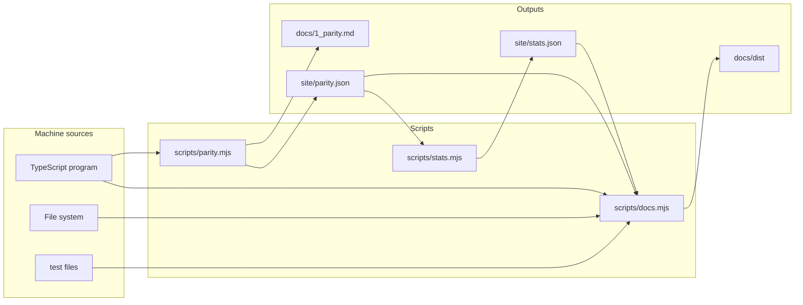

# Receipts: the machinery that keeps these documents true

Four documents once gave four different unit-test counts. Two scripts now answer every countable
claim from a machine source, and a third gate refuses the tree when a document and the repository
disagree.

## Contents

1. [The three programs](#the-three-programs)
2. [What the lint checks](#what-the-lint-checks)
3. [Repointing a stale citation](#repointing-a-stale-citation)
4. [The ledger walks the program](#the-ledger-walks-the-program)
5. [Transclusion](#transclusion)
6. [Commands](#commands)
7. [What is still hand-written](#what-is-still-hand-written)

## The three programs



| script | answers | gate |
| --- | --- | --- |
| `scripts/parity.mjs` | which features exist, and where each one is implemented | exits non-zero on an untagged module |
| `scripts/stats.mjs` | every number the package prints about itself | never gates, records a `reason` beside each null |
| `scripts/docs.mjs` | whether a document agrees with the repository | exits non-zero on any violation |

## What the lint checks

Six checks, one line of output each, naming the file, the line, and the fix.

| check | fires when |
| --- | --- |
| stale citation | the cited line does not hold the symbol named beside it |
| missing file | a backticked path resolves nowhere |
| unknown symbol | a name sits beside a source path that neither exports nor mentions it |
| hard-coded number | a bare digit sits within three tokens of a countable noun |
| unknown key | a placeholder resolves in no data source |
| unknown test | a quoted sentence matches no declared test name |

One line per violation, in that order:

```text
docs/0_api.md:113 cites src/10_render.ts:348 but "bind" is at :580
README.md:44 names src/fromTree.ts which does not exist
README.md:48 names axisOf, not exported from src/1_axis.ts (exports: axisOfEntries, axisOfTree)
PITCH.md:22 hard-codes "418 unit tests"; use {{stats.tests.unit}}
docs/6_why.md:41 references {{bench.expand.median}}, no such key
docs/2_guide.md:59 quotes "clamps to the column minimum width"; no test has that name
```

Exported names come from the TypeScript compiler API, through the same `typescript/unstable/sync`
loader the parity script drives. A citation and a name are paired only inside one clause, so a
competitor table naming another library's API in one cell and a source path in the next stays quiet.

### Deliberate silences

| situation | why the lint says nothing |
| --- | --- |
| the name beside a citation is absent from the cited file | the pairing was prose, not a claim about that file |
| the name occurs on more than six lines of the cited file | no single line can be the one meant |
| a bare digit inside a fenced code block | a code sample counts what it likes |
| a digit and a noun separated by a table cell wall | one column never counts the noun in the next |
| a quoted fragment shorter than three words | a test name is a sentence a person wrote |

## Repointing a stale citation

`--fix` rewrites the line number of a citation whose symbol it can locate elsewhere in the same
file. A citation with no name beside it is left alone and printed instead, because the script has
nothing to search for and a guess would be worse than the drift.

```sh
node scripts/docs.mjs --fix
```

## The ledger walks the program

Every module the TypeScript program compiles under `src/` is a tagging surface. A module either
carries at least one `@feature` or `@feature-declared` tag, or it opts out in its own first line.

```ts
// @no-features: pure layout arithmetic, every caller is already tagged
```

`index.ts` and `features.ts` never carry a claim, and `src/test/` is a fixture kit. Everything else
is checked, so adding a module is what reminds the author to place its tag.

### The last-caller warning

For every tagged declaration the checker is asked who references it. A declaration with exactly one
reference is its own only mention, and the matrix is promising behaviour that no library code
reaches. It prints as a warning rather than a failure: `tsconfig.json` excludes the test files, and
`demo/`, `site/`, `bench/`, and `tests/` are separate projects, so an export whose only callers live
in a test or the demo is correct code that this program cannot see.

## Transclusion

`--render` expands placeholders into `docs/dist/`, one file per document, leaving the sources
readable on their own.

| prefix | source | a key under it |
| --- | --- | --- |
| `stats` | `site/stats.json` | `stats.tests.unit` |
| `bench` | `bench/results.json`, keyed by a slug of each benchmark name | `bench.read_view_flat_no_write_1k_rows.median` |
| `parity` | `site/parity.json` | `parity.implemented` |

A key is written in double braces and walks the JSON by its dots:

```text
{{stats.tests.unit}}
```

A key landing on an array yields its length. A key landing on a group carrying a headline number
under `tests`, `count`, `total`, or `value` collapses to that number, which is why the key above
prints a count rather than an object.

Values as this file was last rendered:

| key | value |
| --- | --- |
| `stats.tests.unit` | {{stats.tests.unit}} |
| `stats.source.testFiles` | {{stats.source.testFiles}} |
| `stats.epics.count` | {{stats.epics.count}} |
| `stats.source.sourceLines` | {{stats.source.sourceLines}} |
| `stats.bundle.library.totalGzipBytes` | {{stats.bundle.library.totalGzipBytes}} |
| `parity.features` | {{parity.features}} |
| `parity.implemented` | {{parity.implemented}} |
| `parity.declaredOnly` | {{parity.declaredOnly}} |
| `parity.untagged` | {{parity.untagged}} |
| `parity.unread` | {{parity.unread}} |

## Commands

| command | effect |
| --- | --- |
| `pnpm parity` | rewrites `docs/1_parity.md` and `site/parity.json`, gates on untagged modules |
| `pnpm docs` | lints, prints one line per violation, exits non-zero |
| `pnpm docs:fix` | repoints the citations it can, reports the ones it refuses |
| `pnpm docs:render` | writes `docs/dist/`, never gates |
| `pnpm receipts` | typecheck, tests, build, then the lint |

## What is still hand-written

| claim | who checks it |
| --- | --- |
| prose describing behaviour | nobody, read it |
| a competitor's API name or bundle size | nobody, `docs/parity.mui.json` carries a citation URL per row |
| a benchmark narrative | the numbers come from `bench/README.md`, the reading of them does not |
