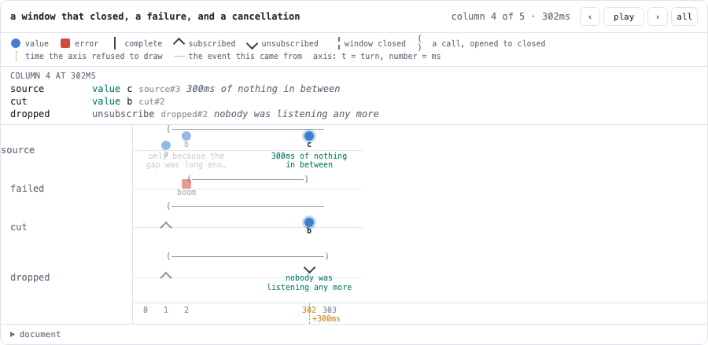

# @hafley66/signal-marbles

A marble diagram as a document, two ways to make one, and one playhead they both run off.

> **Authorship attestation:** This README was written by Claude (AI). The examples were run, and the
> screenshot at the bottom is produced by `src/6_marbleDiagram.browser.test.tsx`, but the prose has
> not been checked by a human.

## The one idea

A marble diagram is not a picture. It is a table — lanes × frames — and everything else is a view of
it.

```
notation  ─┐
           ├─→  MarbleDoc  ─→  player (signals)  ─→  renderMarbles / <MarbleDiagram>
RxJS demo ─┘
```

- **Two producers.** `readMarbles` reads the notation; `runMarbleDemo` runs real RxJS on a virtual
  clock. Neither knows the other exists.
- **One document.** `MarbleDoc` is lanes of notifications on one integer clock. It is JSON, zod
  validates it at the boundary, and normalization derives the extent from the content.
- **One playhead.** A player is a handful of signals plus a clock `Observable`. A surface reads the
  playhead and connects it; nothing else in the package subscribes.

## Install

```sh
pnpm add @hafley66/signal-marbles @hafley66/signals rxjs
```

```ts
import { createMarblePlayer, readMarbles, renderMarbles } from "@hafley66/signal-marbles"
import "@hafley66/signal-marbles/marbles.css"

const doc = readMarbles(`
@title a debounce against a switch
@legend k=key r=request

keys      : -k-k-k-------|
  mapped    : -r-r-r-------|
  debounced : -------r-----|
`)

const host = document.querySelector("#host")
if (host instanceof HTMLElement) renderMarbles(createMarblePlayer(doc), host)
```

## Write it as notation

One lane per line, `label : marbles`. Leading spaces make a lane a child of the nearest earlier lane
with less indentation, which is the whole of the derivation syntax. `#` starts a comment.

```
@title a key emitted before the subscription, and the frame it stopped listening on
@legend k=key r=request

keys : -k-k-k-|
hot  : -k-^--k--!
```

| in a lane | means |
| --- | --- |
| `-` | one frame |
| `a` | a value on this frame, then the next frame |
| `(ab)` | both on this frame; the group costs one frame, not one per symbol |
| `10ms`, `2s`, `1m` | jump that far, when the digit does not continue a word |
| `\|` | complete |
| `#` | error |
| `^` | subscribed here |
| `!` | unsubscribed here, without spending a frame |

`^` and `!` are the reason this is not a sequence diagram: a lane is unidirectional, so it can say
what arrived *before* anyone listened and when listening stopped. A surface dims everything outside
that window instead of hiding it.

The notation is RxJS's own conventional marble syntax with two deliberate changes: a group costs one
frame rather than one frame per character inside it, because in a drawing the parens are a shape and
not a clock, and a jump is spaced (` 250ms `) so a digit can never be mistaken for a value.

`printMarbles` is the inverse, and `readMarbles(printMarbles(doc))` equals `doc` for anything the
notation can hold. `parseMarbles` returns `{ doc, diagnostics }` with the line each problem was on;
`readMarbles` throws them instead.

## Write it as RxJS

The second producer takes a plain object of observables and nothing else, so what an author writes is
what RxJS would run.

```ts
import { interval, mergeMap, switchMap, take } from "rxjs"
import { runMarbleDemo } from "@hafley66/signal-marbles"

const outer = interval(12).pipe(take(3))
const inner = interval(4).pipe(take(3))

const doc = runMarbleDemo(
  { outer, switched: outer.pipe(switchMap(() => inner)), merged: outer.pipe(mergeMap(() => inner)) },
  { frames: 60, parents: { switched: "outer", merged: "outer" }, title: "switchMap drops the inner request" },
)
```

Inside `TestScheduler.run` the async, interval, timeout, and animation-frame schedulers are all
delegated to the virtual clock, so `interval(1000)` written at module scope ticks in virtual
milliseconds and no wall time passes. Ten virtual seconds of `interval(1)` costs about 1 ms of the
test run.

- `frames` is a safety bound, not a length. A lane still running at the edge is cut and marked
  `unsubscribe`, so an unbounded source says so on the diagram instead of hanging the process.
- A completion that the source did not produce is never recorded: the cut is an unsubscribe.
- `defaultFormat` prints the value; `Error` prints its message rather than `{}`.

## Play it

```ts
const player = createMarblePlayer(doc)

player.play()            // writes `playing`
player.pause()           // saves the fractional playhead as the resume point, then stops
player.seek(12)          // writes `position`; playback restarts from there
player.step(1)           // the next frame that has anything on it
player.speed.$(2)        // multiplies the rate the diagram plays at
player.load(nextDoc)     // swap the document and rewind
```

`frame`, `playing`, `position`, `rate`, `speed`, `loop`, `duration`, `laneViews`, `selected`, and
`hovered` are signals; the surface reads them and writes intent back with the same signals. `rate` is
derived: the base rate plays the whole diagram in `PLAY_SECONDS`, and `speed` multiplies it.

The clock is `marbleClock`, an `Observable` of frames with `playing`, `rate`, `position`, `duration`,
and `loop` as its inputs. It is handed to `Signal(observable, 0)`, so the playhead connects when
something reads it and is released when nothing does — a player nobody mounted does no work.

## The surface

`renderMarbles(player, host)` returns `{ stop }`: it decorates the element and releases it, which is
exactly an effect's contract. The React adapter is therefore the effect and nothing else.

```tsx
import { MarbleDiagram, useMarblePlayer } from "@hafley66/signal-marbles/react"

function Diagram({ doc }: { doc: MarbleDoc }) {
  return <MarbleDiagram player={useMarblePlayer(doc)} />
}
```

The renderer draws a lane per lane, indents derived lanes, stacks marbles that share a frame, marks
what the playhead has reached, dims what a subscription missed, and gives every lane an
`aria-label` — `"mapped: request at 1, request at 3, complete at 7"` — so a diagram is readable
without seeing it. The notation it read is in a `<details>` at the bottom.

Subscriptions live in `5_render.ts` and nowhere else in the package: a renderer is a boundary,
because it owns nodes and has to release them. `stop()` is that release.

## Theming

`--mb-*` variables, two cascade layers, no `!important`. Every layout number is a variable and the
renderer writes `--mb-gutter` from the same constant it measures with, so a host that overrides it
moves the strips, the axis, and the playhead together.

## Run

```sh
just dev                                        # http://127.0.0.1:5391/demo.html
pnpm --filter @hafley66/signal-marbles dev      # same thing, from the repository root
pnpm --filter @hafley66/signal-marbles test
pnpm --filter @hafley66/signal-marbles test:browser
```

`src/9_demo.tsx` renders the same teaching case twice: once from real RxJS on the virtual clock, once
from notation nobody ran.

## Screenshot

Generated and verified by `src/6_marbleDiagram.browser.test.tsx`.



## Source

- `src/0_types.ts`: the document, its zod schema, and the derivations a surface needs
- `src/1_notation.ts`: the reader and the printer
- `src/2_run.ts`: the virtual-clock runner
- `src/3_clock.ts`: the playhead producer
- `src/4_player.ts`: the signals a surface reads
- `src/5_render.ts`: the framework-free renderer
- `src/react.tsx`: `MarbleDiagram` and `useMarblePlayer`

## What is not built

| gap | why |
| --- | --- |
| capturing a running application | that is a trace viewer, and `@hafley66/marbler` is one. This package renders what a virtual clock did, or what someone wrote |
| a markdown fence | the hook is `readMarbles`/`runMarbleDemo` and `@hafley66/md` owns fences; nothing here assumes a host |
| editing, folding, zoom | a diagram is a small document; `@hafley66/signal-grid` is the surface for large ones |
| live values on a marble | the document is JSON by design, so a value is the string it prints as |
