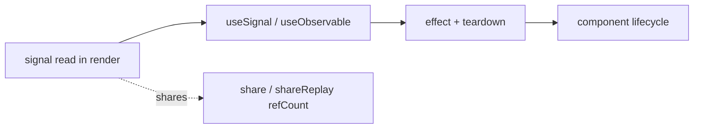

# React binding — design notes

Open design discussion for the signals ↔ React seam. Not implemented unless
marked shipped.

## Contents
- [Through-line](#through-line)
- [Shipped: lazy tree seam](#shipped-lazy-tree-seam)
- [Proposal A: useObservable(factory, deps)](#proposal-a-useobservablefactory-deps)
- [Proposal B: auto-subscribe every render](#proposal-b-auto-subscribe-every-render)
- [Vibe-check findings](#vibe-check-findings)
- [Open forks](#open-forks)

## Through-line

React's effect tree rides the reconciler for free (mount/unmount with the
component). The rxjs sub tree should do the same, and multicast across readers.
Concretely: every subscription either (a) follows a component lifecycle via an
effect that returns teardown, or (b) is shared via `share` / `shareReplay`. A
naked `.subscribe()` at bootstrap is the anti-pattern.



## Shipped: lazy tree seam

`@hafley66/grid` `createLazyTree` proves the "grid emits, rxjs handles" split.

- `grid.expand$` is a hot Subject (shared across all subscribers).
- `grid.visibleRows` is a `createComputedSignal` — refCount-scoped, one upstream
  read of `rows` + `expanded` while anyone reads.
- Both ride React through `useSignal`.

The one remaining naked subscribe is the consumer load cycle:

```ts
tree.expand$.pipe(mergeMap(load)).subscribe(append)
```

Proposal A removes it.

## Proposal A: useObservable(factory, deps)

When passed a **function**, `useObservable(fn, deps)` derives the observable
from React's deps array; the observable lives for the whole component lifecycle
and is rebuilt when deps change.

```ts
function useObservable<T>(
  factory: (deps: readonly unknown[]) => Observable<T>,
  deps: readonly unknown[],
): T
```

Mechanics: an effect keyed on `deps` builds the observable from the factory,
subscribes, feeds the latest value into React state (or `useSyncExternalStore`),
and returns teardown on dep change / unmount. This is `switchMap`-over-deps owned
by the reconciler, not a bootstrap subscribe.

The load cycle becomes:

```ts
useObservable(
  () => tree.expand$.pipe(mergeMap(id => load(id))),
  [tree],
)
// subscribe/teardown owned by the hook; rebuilds only if tree identity changes
```

Open questions:
- Return latest value vs return a subscription (value form mirrors `useSignal`;
  the load cycle wants the side-effect form, no value needed). Possibly two hooks:
  `useObservable<T>(factory, deps): T` and `useSubscription(factory, deps): void`.
- Deps passed into the factory vs read from closure. Closure is more idiomatic
  React; passing deps in avoids stale-closure bugs at the cost of a weirder API.

## Proposal B: auto-subscribe every render

Make signal reads during render auto-subscribe, Solid-style, with no `useSignal`
boilerplate and no compiler.

Approaches:

| approach | how | cost |
| --- | --- | --- |
| read-collector in render | open `dependencyCollectors` during render, collect read signals, commit them as subscriptions in a layout effect | medium; render must stay pure, so commit after |
| babel plugin | wrap render fn to insert the collector + effect automatically | build-time; diverges from stock React |
| custom reconciler | a renderer that treats signals as first-class deps | large; fork risk |

The read-collector path reuses the existing `trackDependencies` stack already
used by `Signal(fn)` memos and `signalMap`. Render opens a collector; every
`signal.$()` read is recorded; a `useLayoutEffect` subscribes to the collected
set and unsubscribes the previous set. This makes `signal.$()` in JSX reactive
with zero call-site boilerplate — the unifying move that lets the whole sub tree
follow React.

Open questions:
- Re-entrancy: React can render children mid-parent-render; the collector stack
  must be per-render (it already is, stack-scoped in `1_SignalCreator`).
- Concurrent mode: torn renders collect a read-set that may be discarded; the
  committed subscription must follow the committed tree, not the render attempt.
- Reads in effects/handlers should NOT be collected (only render reads subscribe).

## Vibe-check findings

`grep -rn "\.subscribe(" src` across both repos:

| repo | src subscribes | verdict |
| --- | --- | --- |
| hafley-rxjs | 12 | all internal machinery (memo deps, operator internals, Observable factories, `useSignal` bridge, `sync` binder). One borderline: `6_Storage.ts` persistence side-effect (could be a `tap`) |
| instant | 35 | ~14 are `store.subscribe(cb, [keys])` — instant's own selective-key store listener, wired at bootstrap in `main.ts`. ~7 real rxjs `.subscribe()`. `share`/`shareReplay` sparse (~6 files) |

instant's `store.subscribe` bootstrap cluster is the anti-pattern these proposals
replace: imperative effects at init instead of a tree that rides the reconciler.

## Open forks

- Implement `useObservable` / `useSubscription` (Proposal A) in `3_react.ts`.
- Prototype the render read-collector (Proposal B) behind a flag; measure
  concurrent-mode safety.
- A lazy-tree render component over `visibleRows` (chevron + trailing `/` +
  indent + spinner on `loading`) + browser screenshot — the lazy tree has no
  visual yet.
- Port `6_Storage.ts` side-effect from `.subscribe` to a `tap` in the chain.
- Decide where the signal/React doctrine lives after the rxjs skill deletion.
