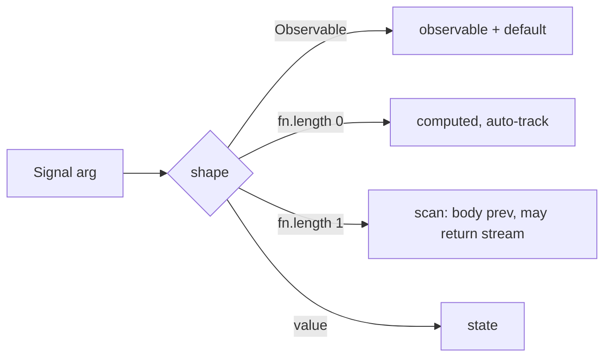

# Signal(fn(prev), initial) lab

1. [What changed](#what-changed)
2. [Dispatch](#dispatch)
3. [Traces](#traces)
4. [Solid 2.0 rc.0 comparison](#solid-20-rc0-comparison)
5. [Open calls](#open-calls)

## What changed

| file | change |
| --- | --- |
| `src/1_SignalCreator.ts` `createComputedSignal(compute, seed?)` | one algorithm: body receives `prev`, stream results feed the value, expand on complete, switch on dep change |
| `src/2_Signal.ts:41,63` | overload `Signal(fn(prev), seed)`; `fn.length >= 1` passes the seed |
| `src/4_Query.ts:37-48,154` | `refetchInterval: number \| false \| (state) => number \| false`, tick dropped mid-flight |
| `src/2_Signal.scan.test.ts` | 9 cases: arity, prev, resubscribe keeps value, expand loop, exhaust poll, settle, switch on dep, promise, unsubscribe |
| `src/4_Query.test.ts` | 3 cases: mid-flight drop, function interval to false, unsubscribe stops |

Receipt: `pnpm --filter @hafley66/signals exec vitest run` 106 passed, `tsc --noEmit` clean after `pnpm --filter @hafley66/path build`.

## Dispatch



`fn.length` counts params before the first default. `(prev = x) =>` reads as arity 0.

## Traces

Sync scan, `Signal((prev) => prev + step.$(), 0)`:

```
subscribe        run: prev=0 step=1 -> emit 1     (seed is prev only; memo semantics, no seed emission)
step.$(1)        prev=1  -> 2                      (same value re-set still invalidates)
step.$(5)        prev=2  -> 7
refcount 0       deps dropped, dirty; value 7 kept as prev for the next subscriber
```

Expand poll, `Signal((prev) => timer(prev ? 3000 : 0).pipe(switchMap(() => execute(args))), undefined)`:

```
t=0s   body -> timer(0) stream, no sync emission -> emit seed (undefined); request #1
t=5s   #1 emits G1 -> emit G1, prev=G1; inner completes after >=1 emission -> body reruns -> timer(3000)
t=8s   request #2                                   (no tick can pile up: next run waits on the inner)
t=13s  #2 emits G2 -> emit G2 -> timer(3000)
unsubscribe: inner cancelled, deps dropped. base case = refcount zero.
```

Rules inside `createComputedSignal`:

| event | action |
| --- | --- |
| dependency changes | cancel inner, rerun body with current prev (switch) |
| inner completes after >=1 emission | rerun body (expand) |
| inner completes with no emission | settle until a dependency changes |
| body throws | last value kept, deps stay watched (existing memo rule) |
| inner errors | forwarded to observers |

## Solid 2.0 rc.0 comparison

Source: `@solidjs/signals@2.0.0-rc.0` `dist/types/signals.d.ts`.

| Solid | ours | delta |
| --- | --- | --- |
| `ComputeFunction<Prev, Next> = (v: Prev) => PromiseLike<Next> \| AsyncIterable<Next> \| Next` | `ScanBody<T> = (prev: T) => T \| Observable<T> \| PromiseLike<T> \| AsyncIterable<T>` | ours adds Observable |
| `createSignal(fn, options)` writable memo, `equals` in options | `Signal(fn, initial)` read-only in this lab | writes not wired |
| `createMemo(fn(prev))` | `Signal(fn(prev), initial)` | Solid's memo prev starts `undefined`; ours takes an explicit seed |
| async memo: read throws NotReadyError to nearest `<Loading>` | value stays at seed/previous until the inner emits | no suspense concept |
| AsyncIterable: each yield is the value, body does not rerun | same, plus rerun on completion after >=1 emission (expand) | expand is ours |
| `createEffect(compute, effect)` split, single-arg form removed | `Signal(fn)` + subscribe | no change |
| writes batched on microtask, `flush()` / `latest()` | synchronous | no change |
| `equals` default `===`, opt out with `false` | no equality on scan emissions | open |

Solid 1.x already had `createMemo((prev) => ...)`; 2.0 moved the same shape onto `createSignal` and made the return async-aware. That is the convergence: one function form, prev in, value-or-stream out.

## Open calls

| call | options |
| --- | --- |
| writable scan | shipped, default on; `{ writable: false }` opts out. `SignalCreatorOptions.write` mirrors `.$(next)` into the memo's value, next run sees it as `prev` |
| equality on scan emissions | add `distinctUntilChanged` with an `equals` option, or leave to consumers |
| dep change mid-inner: switch (current) or exhaust | switch matches computed; exhaust needs a flag |
| `createQuery` over scan | both forms stay: `refetchInterval` option for the query API, `Signal((prev) => timer(..).pipe(switchMap(execute)), seed)` for rxjs-proper polling |
| seed emission | seed surfaces only when the first run returns a stream with no sync emission; sync runs emit the body result like `Signal(fn)` |
