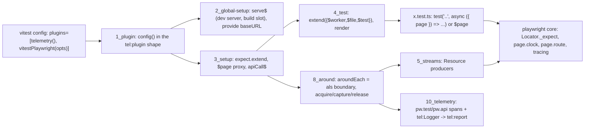

# @hafley66/vitest-playwright: plan v3

One vitest 4 plugin package that folds `@playwright/test`'s runtime value (fixtures, web-first matchers, clock, route, tracing, api-call log) into node-realm vitest, with `@hafley66/signals` + RxJS as the only state, effect, and lifetime mechanism inside the package. Component, integration, and e2e tests share one `test`, one `expect`, one `$page`, one locator vocabulary. Browser mode is untouched.

v2 folded in `REVIEW-2026-09-08-astra.md` (58 rows). v3 folds in `REVIEW-2026-09-08-astra-v2.md` (part 1: 19 resolved / 30 partial / 7 unresolved / 2 regressed; part 2: 41 rows, 34 broken). `r1.N` and `r2.N` below name rows in those files. Source of the numbers: playwright 1.62.1, vitest 4.1.11, vite 8.2.2 as installed in `node_modules/.pnpm`.

## TOC

0. Owner prefixes (glossary)
1. Goal and scope
2. Research receipts: playwright/test internals
3. Research receipts: vitest 4 internals
4. Build-vs-buy
5. Harmonization tables (fixtures, matchers, async, config, control, modes)
6. Signals and RxJS backbone
7. Target shape
8. Type signatures
9. Pseudo-code bodies
10. Instance lifetimes
11. Storage layout, read/write sequence, uniqueness
12. Build steps with gates
13. Test plan
14. Decisions taken (incl. every review row resolved)
15. Out of scope

## 0. Owner prefixes (glossary)

Every named feature carries its owner: `vitest:` (vitest 4.1 runner/config), `pw:` (playwright 1.62 core or `@playwright/test`), `pkg:` (this package), `tel:` (`@hafley66/vitest-telemetry`), `otel:` (OpenTelemetry API), `node:` (node runtime), `rx:` (RxJS), `sig:` (`@hafley66/signals`), `vite:` (vite 8). A bare name in this document is a plain word, never a feature.

| prefixed name | meaning |
|---|---|
| `vitest:aroundEach(fn)` | suite hook; `fn(runTest, ctx)` wraps `vitest:beforeEach` + body + `vitest:afterEach` of one attempt (`chunk-artifact.js:2941`) |
| `vitest:fixture` | `vitest:test.extend` value; function form `(ctx, use)`; scopes `test` / `file` / `worker`; the body runs after all fixtures resolve, outside any fixture's continuation (`:364, :421`) |
| `vitest:ctx` | test context passed to bodies, hooks, fixtures: `task`, `signal`, `expect`, `skip`, `annotate`, `onTestFailed`, `onTestFinished` |
| `vitest:ctx.expect` | per-test `expect`, concurrent-safe |
| `vitest:expect` (global) | module-level `expect`, bound through `vitest:getCurrentTest()` (one variable) |
| `vitest:ctx.signal` | `AbortSignal` aborted at `vitest:testTimeout` and on run cancel |
| `vitest:describe.concurrent` / `vitest:sequence.concurrent` | tests of one file interleave; `vitest:describe.sequential` opts out |
| `vitest:fileParallelism` | files spread over workers (default on); a file never splits |
| `vitest:pool` / `vitest:maxWorkers` / `vitest:isolate` | process pool (`forks` default), worker count, kill-worker-per-file (default true) |
| `vitest:--shard` / `vitest:--merge-reports` | file-level sharding and report merge |
| `vitest:retry` / `vitest:repeats` | attempt multipliers; both in `pkg:` artifact keys |
| `vitest:globalSetup` / `vitest:provide` / `vitest:inject` | controller-process setup; structured-clone transport into workers |
| `vitest:configureVitest` | vite plugin hook with `{ vitest, project }`; `project.config` mutable |
| `vitest:runner` | config path to a `VitestRunner` subclass; `onCollected(files)` sees `task.concurrent` |
| `vitest:recordArtifact` | attaches `internal:failureScreenshot` etc to a task |
| `vitest:onConsoleLog` | node console interception hook |
| `pw:Locator` / `pw:Locator._expect` | lazy element query; private method that runs the server-side assertion poll (`coreBundle.js:60236`) |
| `pw:Page` / `pw:BrowserContext` / `pw:Browser` | core objects; `pw:page.route`, `pw:context.clock`, `pw:context.tracing` are their methods |
| `pw:_instrumentation` | api-call listener bus on the default `playwright` export (`lib/index.js:86`) |
| `pw:test` / `pw:workers` / `pw:fullyParallel` / `pw:describe.configure` / `pw:webServer` / `pw:test.step` / `pw:test.info()` | `@playwright/test` runner features; none are used, each has a `vitest:` or `pkg:` twin in §5 |
| `pw:customAsyncMatchers` | the 31 web-first matchers in `@playwright/test` (`expect.js:13182`) |
| `pkg:test` / `pkg:it` / `pkg:describe` | `vitest:test.extend` result exported from `./test` |
| `pkg:$page` / `pkg:$context` | `globalThis` proxies resolving through `node:AsyncLocalStorage` to the running attempt |
| `pkg:aroundEach hook` | the one `vitest:aroundEach` registered from `./setup`; owns acquire, run, capture, release |
| `pkg:contextScope` | `'test'` (default) or `'file'`; file scope shares one `pw:Page` per file |
| `pkg:contextOptions` | test fixture carrying `pw:BrowserContextOptions`, overridable per file via `vitest:test.extend` |
| `pkg:serve` | `vitest:globalSetup` slot: `url` / `command` / `vite` kinds |
| `pkg:render` | mounts a module export into the harness page over the `vite:devServer` |
| `pkg:runner` | `vitest:runner` subclass rejecting `vitest:concurrent` tasks under `pkg:contextScope: 'file'` |
| `pkg:matchers` | 29 `vitest:expect.extend` matchers over `pw:Locator._expect` |
| `pkg:toPass` | `rx:` poll with `pw:` polarity and intervals |
| `pkg:Resource<T>` / `pkg:acquire` / `pkg:Handle.release` | `{ value, close(): Promise }` producers; handle whose release awaits every close |
| `sig:Signal` root | `Signal({...})` per lifetime; `.$()` read/write, `.$` observable |
| `rx:` producers | `browser$ context$ page$ request$ apiCall$ pageEvents$ serve$ poll$` |
| `node:AsyncLocalStorage` | async-context store entered inside the `pkg:aroundEach hook` |
| `vite:devServer` / `vite:build` / `vite:preview` | the three vite node APIs the `pkg:serve` slot uses |
| `tel:plugin` (`telemetry()`) | vite plugin whose `config()` returns `define` + `test.setupFiles` + `test.globalSetup` + `experimental.openTelemetry`, and mirrors the define into `process.env` for out-of-pipeline modules (`vitest-telemetry/src/plugin.ts:40-81`); `pkg:plugin` copies this shape |
| `tel:setup` | per-worker setupFile: LogTape `configure` with `contextLocalStorage: new AsyncLocalStorage()`, console/otel/memory/file sinks, `beforeEach`/`afterEach` lifecycle log keyed by `task.id`, `afterAll(dispose)` (`src/setup.ts`) |
| `tel:Logger(import.meta.url)` | LogTape logger, category `[root, ...repo path]` (`src/index.ts:20`) |
| `tel:otel.node` | `otel:NodeSDK` in the controller with `process.pid`, `parent_pid`, `ancestry`, `shard` resource attrs (`src/otel.node.ts`) |
| `tel:timeline` | `out/otlp-*.jsonl` + `pw-debug.log` + junit -> `Event[]` with `kind: span \| log \| metric \| playwright \| verdict \| process`, `pid`, `shard`, `testId`, nesting by time containment (`src/report/timeline.ts`) |
| `tel:report` / `report-shell` | `report.html` built on `@hafley66/report-shell` (nav tree, marbler events panel) that renders `tel:timeline` |
| `vitest:experimental.openTelemetry` | vitest's own spans: `vitest.test_run`, `vitest.worker`, `vitest.runtime.run` (per file), `vitest.runtime.setup`, module/mocker spans; no per-test span |
| `otel:span` `pw.test` / `pw.api` | `pkg:` spans: one per attempt opened in the `pkg:aroundEach hook`, one per `pw:_instrumentation` api call nested inside |

## 1. Goal and scope

| item | value |
|---|---|
| package | `packages/vitest-playwright`, name `@hafley66/vitest-playwright`, sibling of `vitest-telemetry` |
| entry points | `./plugin` (vite plugin + `configureVitest`), `./setup` (setupFile: matchers + `$page` global), `./test` (`test`/`it`/`describe` with fixtures, `render`), `./global-setup` (dev server + serve slot) |
| runtime deps | `playwright` (exact pin), `@hafley66/signals` (workspace), `rxjs`, `@logtape/logtape` + `@opentelemetry/api` (peer, same as `tel:`), `vite` (peer), `vitest` (peer); `@hafley66/vitest-telemetry` optional peer: without it spans and records go to whatever `otel:`/LogTape sinks the host configured |
| out of the graph | `@playwright/test` runner, reporter, config; `@testing-library/*`; `@vitest/browser` |
| consumers after | `gothic/tests/*.e2e.test.ts` (6), `vitest-telemetry/tests` (2) + `fixtures/tests` (2), `boop-adapters/tests/network.e2e.test.ts`; later the 5 `grapht/adapters/*/playwright.config.ts` suites and `react-dock-and-flow/e2e` |
| receipts | the package's own 5 test files against one self-served bootstrap page; then gothic `app.e2e.test.ts` ported as the first consumer |

## 2. Research receipts: playwright/test internals

Read from `node_modules/.pnpm/playwright@1.62.1/node_modules/playwright/lib`.

| file | lines | holds |
|---|---|---|
| `lib/index.js` | 806 | every built-in fixture: `utilityFixtures` (playwright, screenshot, trace, testIdAttribute, `_setupArtifacts` with the instrumentation listener at :86-155, request) and `playwrightFixtures` (browser :219, 22 context options, `_combinedContextOptions` :268, `_contextFactory` :372, `context` :425, `page` :445, `mount` :466) |
| `lib/matchers/expect.js` | 13486 | bundled jest-expect + `customAsyncMatchers` (31 keys, :13182) + `toMatchSnapshot` + `createExpect` (soft/poll/extend/configure :13231) + `invokePollMatcher` (:13391, throws for async matchers) |
| `lib/worker/workerProcessEntry.js` | 1850 | fixture pool, `TestInfoImpl` (`_addStep`, `_deadline`, attachments), per-test tracing chunks |
| `lib/runner/index.js` | 8241 | dispatcher, sharding, `workers`, `fullyParallel`, `webServer` |
| `lib/common/index.js` | 2954 | `TestType` (`extend`, `use`, `step`, `describe.configure`), config loading |
| `lib/transform/*`, `lib/mcp`, `lib/agents` | 82k | babel/esm loader (vite replaces), MCP tooling (ignored) |

### 2.1 How a web-first matcher works (step trace)

`await expect(locator).toBeVisible({ timeout })` from `expect.js:12787`:

```
step 0  callMatcherAsStep         info={isNot,isSoft,poll,timeout}  -> testInfo._addStep({category:'expect'})
step 1  invokeMatcher             ctx={isNot,promise,utils,timeout}  -> toBeVisible.call(ctx, locator, opts)
step 2  toBeTruthy (:12094)       query=(isNot,timeout,signal)       -> locator._expect('to.be.visible', {isNot,timeout,signal})
step 3  Frame._expect (core:60236) channel.expect(params)            -> server polls injected script until match or timeout
step 4  Frame._expect catch       PlaywrightError.details            -> {matches, received, log, timedOut, errorMessage}
                                  AbortError                         -> {matches: isNot, errorMessage: 'Error: ...aborted'} (row 20)
step 5  toBeTruthy                pass === !isNot ?                  -> {pass, message(), actual, log, timeout}
step 6  finalizer                 pass !== isNot -> ExpectError      -> soft: step.complete({softError}) else throw
```

Base case: step 3 returns on the first frame where the injected `expect` matches; the retry loop is server-side. A vitest matcher that calls `locator._expect(...)` inherits it whole.

### 2.2 The 31 async matchers: exact wire payload (rows 1-10)

`expectedText` items are `{ string?, regexSource?, regexFlags?, matchSubstring?, ignoreCase?, normalizeWhiteSpace? }` from `serializeExpectedTextValues` (:12713). `ws` = `normalizeWhiteSpace: true`, `sub` = `matchSubstring: true`, `ic` = `ignoreCase: options.ignoreCase`.

| matcher | receiver | helper | expression | payload beyond `{ isNot, timeout, signal }` | notes |
|---|---|---|---|---|---|
| toBeAttached | Locator | truthy | `to.be.attached` / `to.be.detached` (`attached:false`) | | |
| toBeChecked | Locator | truthy | `to.be.checked` | `expectedValue: { checked, indeterminate }` | `indeterminate` + `checked:false` is a client-side error |
| toBeDisabled | Locator | truthy | `to.be.disabled` | | |
| toBeEditable | Locator | truthy | `to.be.editable` / `to.be.readonly` (`editable:false`) | | |
| toBeEmpty | Locator | truthy | `to.be.empty` | | |
| toBeEnabled | Locator | truthy | `to.be.enabled` / `to.be.disabled` (`enabled:false`) | | |
| toBeFocused | Locator | truthy | `to.be.focused` | | |
| toBeHidden | Locator | truthy | `to.be.hidden` | | |
| toBeVisible | Locator | truthy | `to.be.visible` / `to.be.hidden` (`visible:false`) | | |
| toBeInViewport | Locator | truthy | `to.be.in.viewport` | `expectedNumber: options.ratio` | |
| toContainText (scalar) | Locator | text | `to.have.text` | `expectedText[1]` sub+ws+ic, `useInnerText` | substring flag, same expression as toHaveText |
| toContainText (array) | Locator | equal | `to.contain.text.array` | `expectedText[n]` sub+ws+ic, `useInnerText` | |
| toHaveText (scalar) | Locator | text | `to.have.text` | `expectedText[1]` ws+ic, `useInnerText` | |
| toHaveText (array) | Locator | equal | `to.have.text.array` | `expectedText[n]` ws+ic, `useInnerText` | |
| toHaveAttribute (presence) | Locator | truthy | `to.have.attribute` | `expressionArg: name` | options-only overload: 2nd arg object and not RegExp |
| toHaveAttribute (value) | Locator | text | `to.have.attribute.value` | `expressionArg: name`, `expectedText[1]` ic | |
| toHaveClass (scalar / array) | Locator | text / equal | `to.have.class` / `to.have.class.array` | `expectedText` | |
| toContainClass (scalar / array) | Locator | text / equal | `to.contain.class` / `to.contain.class.array` | `expectedText` | RegExp rejected client-side |
| toHaveCount | Locator | equal | `to.have.count` | `expectedNumber` | 0 elements handled server-side |
| toHaveCSS | Locator | text | `to.have.css` | `expressionArg: name`, `expectedText[1]`, `pseudo: options.pseudo` | |
| toHaveId | Locator | text | `to.have.id` | `expectedText[1]` | |
| toHaveJSProperty | Locator | equal | `to.have.property` | `expressionArg: name`, `expectedValue` (serialized by `Frame._expect`) | server picks main world |
| toHaveRole | Locator | text | `to.have.role` | `expectedText[1]` | string only |
| toHaveValue | Locator | text | `to.have.value` | `expectedText[1]` | |
| toHaveValues | Locator | equal | `to.have.values` | `expectedText[n]` | text array, RegExp allowed |
| toHaveAccessibleName / Description / ErrorMessage | Locator | text | `to.have.accessible.name` / `.description` / `.error.message` | `expectedText[1]` ws+ic | |
| toHaveTitle | Page | text | `to.have.title` via `page.mainFrame()._expect` | `expectedText[1]` ws | no selector, server uses `:root` (row 9) |
| toHaveURL (string / RegExp) | Page | text | `to.have.url` via `mainFrame()._expect` | `expectedText[1]` ic; string resolved against `context._options.baseURL` | |
| toHaveURL (function / URLPattern) | Page | predicate | `mainFrame().waitForURL(pred, { timeout })` | polarity inverted for `.not` | row 10 |
| toBeOK | APIResponse | plain | none | reads `response.ok()`, `_fetchLog()` on failure | |
| toPass | callback | `pollAgainstDeadline` | none | `intervals [100,250,500,1000]`, timeout 0 = test deadline, `.not` passes when callback throws | row 45 |
| toHaveScreenshot | Page or Locator | `SnapshotHelper` + `page._expectScreenshot` | screenshot channel | masks, animations, caret, scale, thresholds | deferred, §15 |
| toMatchAriaSnapshot | Page or Locator | `_expect` | `to.match.aria` | yaml template, baseline modes | deferred, §15 |

### 2.3 Playwright plumbing that vitest lacks

| mechanism | where | plan twin |
|---|---|---|
| `playwright._instrumentation.addListener({ onApiCallBegin(data, channel), onApiCallEnd(data), runBeforeCreateBrowserContext, runAfterCreateBrowserContext, runBeforeCloseBrowserContext })` | `lib/index.js:86-155`, core `createInstrumentation2` :62981; reachable from the CommonJS/default `playwright` object (row 36) | `apiCall$` cold producer (§6) |
| `testInfo._deadline()` | worker | `ctx.signal` (row 18) + per-call `timeout` |
| `testInfo._addStep`, `test.step()` | worker | flat `step()` via `annotate` |
| `ArtifactsRecorder` (:611) | `lib/index.js` | `artifacts$` (§6) |
| `_contextFactory` | :372 | `context$` producer (§6) |
| `describe.configure({ mode })` | `types/test.d.ts:4260` | `describe.sequential` / `.concurrent` |

## 3. Research receipts: vitest 4 internals

| feature | location | note |
|---|---|---|
| fixtures, `scope: 'test' / 'file' / 'worker'`, `auto`, `injected`; object form generic is `extend<{ $test; $file; $worker }>()` (row 25) | `@vitest/runner/dist/tasks.d-DEYaIMIu.d.ts:1197` | worker fixtures read only worker fixtures; file fixtures read file + worker; `vmThreads`/`vmForks` run worker scope once per file (row 21) |
| worker scope + `isolate: true` (default) terminates the worker per file, so one browser per worker means one per file unless `isolate: false` (row 22) | `reporters.d:2819` | plugin sets `isolate: false` for its project and states it |
| `TestContext`: `task`, `signal` (aborted by `abortIfTimeout` on timeout and by run cancel, teardown sees it aborted, row 18), `skip`, `annotate` (rejects after task leaves run state, row 55), `onTestFinished`, `onTestFailed` | `tasks.d:~1300`, `chunk-artifact.js:2340` | |
| fixture teardown: sequential, stops at the first rejection (row 41); runs before `onTestFinished`/`onTestFailed` (row 42) | `chunk-artifact.js` | artifacts decided in `onTestFailed`, resources released in fixture teardown with `try/finally` |
| `recordArtifact(task, { type: 'internal:failureScreenshot', attachments: [{ path, originalPath }] })` accepted from userland (row 40) | `tasks.d:1426-1440` | |
| `expect.extend`: async result returned as a bare thenable, never recorded for un-awaited detection (row 15); `.not` applied by vitest after the fact (row 14); `soft` flag reaches the matcher (row 13); every matcher also becomes a sync asymmetric matcher (row 48) | `@vitest/expect/dist/index.js:1867-1910` | |
| `__vitest_poll_takeover__` copied to the installed chai method; takeover hands the matcher `null` (rows 16, 17) | `test.DNmyFkvJ.js:3753` | locator matchers reject `expect.poll`, same as playwright |
| `getCurrentTest()` is one module variable, overwritten by concurrent tests (rows 26, 27) | `@vitest/runner` | `$page` uses `AsyncLocalStorage`, §6 |
| fixtures initialize only when destructured, depended on, or `auto` (row 28) | | `aroundEach` in the setup file destructures `{ root }` |
| fixture functions receive `(context, use)` only; `context` is the test context (`task`, `signal`, `expect`, other fixtures); the test body runs in the runner's own continuation after all fixtures resolve, outside any fixture's async context (r2.1, r2.2) | `chunk-artifact.js:364, 421` | `AsyncLocalStorage` boundary is `aroundEach`, never a fixture |
| `aroundEach(async (runTest, ctx) => ...)` wraps `beforeEach`, the body, and `afterEach`; `test.result.state` is set before `afterEach`; `onTestFinished`/`onTestFailed` run after fixture cleanup (r2.3, r2.12) | `chunk-artifact.js:2941-2990` | capture and release happen inside the `aroundEach` hook after `await runTest()` |
| per-test `expect` on the test context (`ctx.expect`), bound to the test, concurrent-safe; global `expect` binds through `getCurrentTest()` (r2.4) | `test.DNmyFkvJ.js:4368, 4089` | docs: destructure `expect` in concurrent files |
| `VitestRunner.onCollected(files)` sees `Task.concurrent` before execution (r2.29) | `tasks.d:78` | package ships a runner subclass for the `contextScope: 'file'` guard |
| `configureVitest({ vitest, project })`: `project.config` mutable, `setupFiles`/`globalSetup` arrays appendable, absolute paths (row 32) | `vitest/dist/config.d.ts:41` | |
| `globalSetup` + `project.provide` cross to forks via structured clone, functions fail (row 31) | `TestProject.provide` | |
| pool knobs `pool`, `maxWorkers`, `fileParallelism`, `isolate`, `sequence.concurrent`, `execArgv` | `reporters.d:2844-2855, 3107` | |
| `onConsoleLog(log, type, entity)` | `reporters.d:3063` | `%%`-prefixed lines for the package's own inline-run receipts |
| `vitest:experimental.openTelemetry` emits `vitest.runtime.run` per file and `vitest.worker` per worker inside the worker's active `otel:` context; a span started in the test continuation nests under them | vitest dist grep of `"vitest.*"` names | `pkg:` opens `pw.test` per attempt, `pw.api` per call |
| `tel:setup` already runs LogTape per worker with an `AsyncLocalStorage` context and logs `start/end {task.id}` | `vitest-telemetry/src/setup.ts:43-60` | `pkg:` logs into `tel:` categories; `tel:timeline` attributes rows to tests by `testId` |
| `Signal(object)` in node: nested `.$` are `BehaviorSubject`-backed, synchronous writes, replay to late subscribers (r2.5); nested projections have no `distinctUntilChanged`, every root write re-emits every path (r2.7) | `packages/signals/src/1_SignalCreator.ts:203` | separate roots per lifetime + `distinctUntilChanged()` before every `switchMap` |
| RxJS `Subscription.unsubscribe()` is sync and drops an async teardown's promise (r2.10) | rxjs `Subscription.ts:47` | producers emit `Resource<T> = { value, close(): Promise<void> }`; `acquire()` awaits `close` on release |

## 4. Build-vs-buy

| candidate | verdict |
|---|---|
| `@playwright/test` as is | two runners, two configs, two reporters: the thing being removed |
| `@vitest/browser-playwright` | tests run inside the page; node code (fs, vite `build`, OTel, LogTape sinks) cannot run there; no user-facing `page.route`; provider bound to the orchestrator (`dist/index.js:830-1100`, `reporters.d:1750`) |
| `expect-playwright` | archived 2024-08-20, pre-Locator, reimplements polling |
| `playwright-expect` | jest 27 era, unmaintained |
| `@playwright/experimental-ct-*` | playwright runner |
| vitest `test.extend` + `expect.extend` + `Locator._expect` + signals/RxJS (build) | chosen; the matcher layer is 31 wrappers over one server-side poll, the runtime is a handful of cold producers |

## 5. Harmonization tables

### 5.1 Fixtures

| playwright fixture | scope | twin | note |
|---|---|---|---|
| `browserName`, `headless`, `channel`, `launchOptions`, `connectOptions` | worker option | plugin `browser` option, worker root `options` | |
| `browser` | worker | `browser` worker fixture over `browser$` | one per worker, project `isolate: false` |
| `baseURL` | test option | worker fixture `baseURL` from `inject()` (row 29 moves it up a scope) | |
| `contextOptions` + 22 options | test option | plugin `context` (cloneable) and per-file `test.override` (row 53) | |
| `context` | test | `context` fixture over `context$` (test or file scope by `contextScope`) | |
| `page` | test | `page` fixture over `page$`, plus `$page` global through `AsyncLocalStorage` | |
| `request` | test | `request` fixture: `playwright.request.newContext({ baseURL, extraHTTPHeaders, httpCredentials, ignoreHTTPSErrors, storageState })` from the same options, no browser dependency (row 58) | |
| `actionTimeout`, `navigationTimeout` | test option | `context.setDefaultTimeout / setDefaultNavigationTimeout` | |
| `testIdAttribute` | option | `selectors.setTestIdAttribute` once per worker | |
| `screenshot`, `trace`, `video` | worker option | plugin `artifacts` | same mode strings |
| `mount` | test | `render` (§5.6) | |
| `test.step` | api | `step(title, body)` = `annotate` while task is running + api-call group | flat |
| `test.info()` | api | `ctx.task`, `inject()` | |

### 5.2 Matchers

| playwright | vitest | plan |
|---|---|---|
| 29 shipped async matchers (31 in `customAsyncMatchers` minus the two deferred) | none | `expect.extend(playwrightMatchers)`; payload per §2.2; async result returned as-is; un-awaited detection is an upstream vitest gap for custom async matchers (r1.15, r2.14-16): the package ships an eslint config enabling `@typescript-eslint/no-floating-promises` for test files and no runtime tracking |
| `expect(x, message)` | same | |
| `expect.soft` | `expect.soft` | receipt: one recorded failure, test continues (row 13) |
| `expect.poll` with locator matchers | | throws with the playwright message (row 17) |
| `expect(fn).toPass(o)` | `vi.waitFor` | own implementation: RxJS retry with the interval sequence, timeout 0 = test signal, `.not` = passes when callback throws (row 45) |
| `expect.configure({ timeout })` | none | plugin `expect.timeout` default 5000; per-call `{ timeout }` |
| asymmetric use `expect.objectContaining({ x: expect.toBeVisible() })` | | rejected at runtime with a named error (row 48) |
| `toHaveScreenshot`, `toMatchAriaSnapshot` | | deferred, §15 |
| `toBeOK` | | 10-line matcher |
| jest sync matchers | vitest's | |

### 5.3 Async-ness

| concern | playwright | vitest | plan |
|---|---|---|---|
| matcher return | Promise, un-awaited = silent | custom async: bare thenable | returned as-is; lint rule, no runtime tracking (r2.14-16) |
| deadline | `min(matcher, test - 250ms)` | `ctx.signal` at timeout | `signal` into `_expect`; matcher `timeout` separate; hooks and teardown have their own budgets (row 19): artifact capture gets `artifacts.budgetMs` (default 5000) on a fresh `AbortSignal.timeout` |
| receiver validation | sync throw | | matcher wrapper validates before the async body and throws synchronously (row 49) |
| polling | server-side | client `expect.poll` | server-side stays; `toPass` is RxJS |
| test-scoped globals | zone | module variable | `AsyncLocalStorage<TestRoot>` entered by `aroundEach` (r2.1-3); `expect` from the test context in concurrent files (r2.4) |

### 5.4 Config

| playwright | vitest | via |
|---|---|---|
| `workers` | `test.maxWorkers` | user |
| `fullyParallel` | `fileParallelism` + `sequence.concurrent` | user |
| `describe.configure({ mode: 'serial' })` | `describe.sequential` | user |
| `retries` / `timeout` | `retry` / `testTimeout` | user |
| `expect.timeout` | plugin `expect.timeout` | plugin |
| `use: {...}` | plugin `browser`, `context`, `artifacts` | plugin |
| `webServer` | plugin `serve` (§5.5) | plugin |
| `outputDir` | plugin `artifacts.outDir` default `out/pw` | plugin |
| `projects[]` | `test.projects[]` each with its own plugin instance; options keyed by project name, no shared env (row 33) | |

### 5.5 Control asked for

| ask | mechanism |
|---|---|
| clocks | `context.clock` (client `Clock` at core :57299, row 38) installed in `context$` when `clock.install`; `install` initializes without pausing, `pauseAt` pauses, `setFixedTime` freezes `Date` (row 39); `time` checked with `!== undefined` |
| routes | `page.route`/`context.route` unchanged; table routes from `defineRoutes()` in a setup module (row 33), applied in `context$`; `har` via `routeFromHAR` |
| logging | owner is `tel:`. `pkg:` emits: `otel:span` `pw.api <type>.<method>` per `pw:_instrumentation` call (attrs `apiName`, `params` summary, `owner` task id, error), `otel:span` `pw.test` per attempt, LogTape records under `[root, 'playwright', 'page']` for `pw:page` console/pageerror/requestfailed with `testId` in the LogTape context, trace zips and screenshots as `vitest:recordArtifact` attachments and as `out/pw/**` files next to `tel:` `out/`. No `pkg:` sinks, no `pkg:` categories: `tel:report` renders everything. `failOnPageError` and `failOnConsoleError` (default true) read the in-memory `testLog` root, which is the only `pkg:`-owned log store |
| parallel workers | browser per worker (`isolate: false` on the plugin's project), context per test or per file, `maxWorkers`, `fileParallelism`, `sequence.concurrent`; `contextScope: 'file'` refuses to run with effective concurrency (row 30) |
| pre-test build slot | `serve` discriminated union (§8); absent `serve` = dev server only; readiness = HTTP 200 poll with timeout; `pathToFileURL` for file mode; `reuseExisting` compares output mtime with `src/**` (row 34, 35) |

### 5.6 Three content modes, one interface

| mode | how `$page` gets content | needs |
|---|---|---|
| `render(mod, name?, props?)` | plugin dev server (`createServer` in globalSetup) serves a harness html (= bootstrap page + `#root` + mount script); `render` navigates there, evaluates `import(id)` in the page, mounts `mod[name](root, props)` into `#root`, returns `page.locator('#root')` with `update`/`unmount`. Same shape as playwright's `mount` fixture (`lib/index.js:466`) | a module whose export renders into a container browser-side; serializable props |
| `$page.goto(baseURL)` | same dev server, the app's `index.html` | app entry |
| `$page.goto(builtURL)` | serve slot: build + `preview()` or `file://` | build config or command |

Locators: playwright `Locator` only. `getByRole/getByText/getByLabel/getByPlaceholder/getByTestId/getByAltText/getByTitle/locator/filter/nth`, lazy, resolved at action or assert time. No `findBy*`, no `queryBy*`, no sync element returns, no `@testing-library/*`, no `screen`. Same engine vitest browser mode uses (`@vitest/browser` depends on `ivya`, playwright's selector engine extracted), reached here through playwright core directly.

## 6. Signals and RxJS backbone

State lives in `Signal` roots, one per lifetime; resources are cold producers of `Resource<T>`; events are observables; the only manual subscriptions are `acquire()` calls at the runtime boundaries (worker fixture, `aroundEach`, globalSetup), which the signals skill allows.

### 6.1 Roots (one per lifetime, no cross-lifetime fields, r2.7)

| root | owner | shape |
|---|---|---|
| `workerRoot` | worker fixture | `Signal({ options: ResolvedOptions, baseURL: string \| undefined, browser: Browser \| null })` |
| `workerLog` | worker fixture | `Signal<ApiEvent \| PageEvent>()` bare event signal feeding `tel:` (spans + LogTape); late events (release, browser close) land here without a test owner (r2.25) |
| `testRoot` | `aroundEach`, one per attempt, in `AsyncLocalStorage` and in `WeakMap<Test, TestRoot>` for `onTestFailed`/`onTestFinished` callers | `Signal({ task: { id, name, file, retry, repeat }, signal: AbortSignal, context: BrowserContext \| null, page: Page \| null, phase: 'setup' \| 'run' \| 'capture' \| 'release' })` |
| `testLog` | `aroundEach` | `Signal({ errors: PageError[], console: ConsoleLine[], api: ApiEvent[] })` |
| `fileRoot` | file fixture when `contextScope: 'file'` | `Signal({ context: BrowserContext \| null, page: Page \| null, activeAttempt: string \| null })` |
| `serveRoot` | globalSetup | `Signal({ devServer: ViteDevServer \| null, preview: PreviewServer \| null, child: ChildProcess \| null, baseURL: string \| undefined, harnessURL: string })` |

`root.signal` is a plain field read as `root.signal.$()` (r2.8). `$page` = `als.getStore()?.page.$()`; named error when there is no store or the page is null.

### 6.2 Resources and producers

```ts
type Resource<T> = { value: T; close: () => Promise<void> }
type Handle<T>   = { value: T; release: () => Promise<void> }          // release = unsubscribe, then await every close the teardown started
function acquire<T>(src$: Observable<Resource<T>>): Promise<Handle<T>>   // rejects if the producer errors before first emission (r2.13)

browser$(opts): Observable<Resource<Browser>>            // launch or connect; close({ reason })
context$(browser, ctxOpts, hooks): Observable<Resource<BrowserContext>>
                                                        // newContext -> timeouts -> routes -> har -> clock -> tracing.start(once) -> next; close = context.close() then video move (r2.11)
page$(context): Observable<Resource<Page>>              // newPage; close = noop (context owns pages)
request$(reqOpts): Observable<Resource<APIRequestContext>>   // no browser dependency (r1.58)
apiCall$: Observable<ApiEvent>                          // one worker-lifetime subscription from the worker fixture (r2.23); onApiCallBegin starts an otel:span 'pw.api' in the current otel: context (nests under pw.test), stores it in data.userData with owner = als.getStore()?.task.id; onApiCallEnd ends it, tolerating a missing begin (r2.24, r1.37)
pageEvents$(page): Observable<PageEvent>                // merge(fromEvent console, pageerror, requestfailed)
serve$(opts): Observable<Resource<ServeState>>          // §9
poll$(cb, { intervals, timeout, isNot, signal }): Observable<'pass' | 'timeout'>   // §9, r2.37
```

### 6.3 Test lifetime (step trace, `contextScope: 'test'`)

```
step 0  worker boot       setup.ts: expect.extend; $page proxy; aroundEach registered (setupFiles hooks apply to every file)
step 1  first test        browser fixture: h = await acquire(browser$(opts)); workerRoot.browser.$(h.value); apiCall$ -> workerLog (worker-lifetime sub)
step 2  aroundEach begin  root = testRoot(task, ctx.signal); testLog = ...; als.run(root, async () => {
                            ctxH  = await acquire(context$(browser, contextOptions, root))     // phase 'setup'
                            pageH = await acquire(page$(ctxH.value)); root.page.$(pageH.value)
                            logSub = pageEvents$(page).pipe(scan(intoLog)).subscribe(l => testLog.$(l))
                            apiSub = workerLog.$.pipe(filter(e => e.owner === task.id), scan(intoLog)).subscribe(...)
step 3                      root.phase.$('run'); await runTest()          // beforeEach, body, afterEach, all inside the store
step 4                      root.phase.$('capture'); failed = task.result?.state === 'fail'
                            await captureArtifacts(root, failed, AbortSignal.timeout(budgetMs))   // screenshot, trace stopChunk, before any close
step 5                      root.phase.$('release'); logSub/apiSub unsubscribe; assertLog(testLog, options) in try
                            finally { await ctxH.release() }             // context.close awaited, video moved, then aroundEach returns
                          })
step 6  onTestFinished    runs after step 5; a failure raised here has no screenshot (documented, r2.12)
step 7  worker end        browser fixture teardown: await h.release()      // browser.close awaited (r1.23, r2.10)
```

Steady state after step 7. The `aroundEach` hook owns acquisition, capture, and release in one `try/finally`; fixtures only expose handles already acquired (`context`, `page`) or acquire their own independent resource (`request`).

### 6.4 `contextScope: 'file'`

`fileRoot` is a file-scoped fixture: acquires context + one page, exposes `filePage`. The `aroundEach` hook reuses `fileRoot.page` instead of acquiring, and sets `fileRoot.activeAttempt` to the task id while running; a second attempt entering while one is active throws (r2.30). The package runner's `onCollected` rejects any file that has `contextScope: 'file'` and a task with `concurrent: true` (r2.29).
## 7. Target shape



```
packages/vitest-playwright/
  src/
    0_options.ts        option types, defaults, resolve(), cloneable split
    1_plugin.ts         vite plugin in the tel:plugin shape: config() returns define + test.{setupFiles,globalSetup,provide,isolate,runner}
    2_global-setup.ts   serve$ subscription, dev server, provide baseURL/harnessURL
    3_matchers.ts       29 matchers + toBeOK + toPass over _expect / poll$
    4_test.ts           extend({$worker,$file,$test}), contextOptions, request, render, step
    5_streams.ts        Resource/acquire, browser$ context$ page$ request$ apiCall$ pageEvents$ serve$ poll$
    6_roots.ts          workerRoot workerLog testRoot testLog fileRoot serveRoot, als, taskRoots WeakMap
    7_page-global.ts    $page, $context proxies
    8_around.ts         the aroundEach hook (acquire, run, capture, release)
    9_runner.ts         VitestTestRunner subclass: onCollected guard for contextScope file
    10_telemetry.ts     pw.test / pw.api spans, tel:Logger page records, LogTape context { testId }
    setup.ts            side-effect entry for setupFiles: expect.extend, $page, aroundEach
    index.ts            public exports
  tests/
    0_bootstrap.ts          one html string + boot(page): page.route serves it, no server, no assets
    1_matchers.test.ts      31 matchers, one it per family
    2_fixtures.test.ts      page per test, $page, contextScope file, describe.concurrent, signal abort
    3_route_clock.test.ts   route/unroute/fulfill/abort, clock install/runFor/setFixedTime
    4_serve.test.ts         serve slot with HTML as an in-memory vite entry (virtual module)
  PLAN-2026-09-08-vitest-playwright.md
  REVIEW-2026-09-08-astra.md
```

## 8. Type signatures

```ts
// 0_options.ts
export interface VitestPlaywrightOptions {
  browser?: { name?: 'chromium' | 'firefox' | 'webkit'; launch?: LaunchOptions; connect?: { wsEndpoint: string; headers?: Record<string, string> } }
  context?: BrowserContextOptions            // cloneable subset only; baseURL here is the fallback
  contextScope?: 'test' | 'file'             // default 'test'; 'file' refuses effective concurrency (row 30)
  expect?: { timeout?: number }              // default 5000
  timeouts?: { action?: number; navigation?: number }
  clock?: { install?: boolean; time?: number | string; mode?: 'running' | 'paused' | 'fixed' }   // row 39
  har?: { path: string; update?: boolean; url?: string | RegExp }
  artifacts?: { outDir?: string; screenshot?: 'off' | 'on' | 'only-on-failure'; trace?: 'off' | 'on' | 'retain-on-failure' | 'on-first-retry'; video?: 'off' | 'on' | 'retain-on-failure'; budgetMs?: number }
  log?: { api?: boolean; page?: boolean; category?: string; failOnPageError?: boolean; failOnConsoleError?: boolean }
  serve?: ServeOptions
  testIdAttribute?: string
}
export type ServeOptions =
  | { kind: 'url'; url: string }
  | { kind: 'command'; command: string; url: string; cwd?: string; env?: Record<string, string>; readyTimeoutMs?: number; reuseExisting?: boolean }   // persistent server: spawned detached in its own process group, ready when url answers 2xx, released by killing the group and awaiting exit (r2.26); command that exits before ready = error
  | { kind: 'vite'; build: InlineConfig; mode?: string; serve: 'preview' | 'file'; entry?: string; reuseExisting?: boolean }
export type CloneableOptions = Omit<VitestPlaywrightOptions, 'serve'> & { serve?: { kind: ServeOptions['kind'] } }   // row 33
export function resolveOptions(o?: VitestPlaywrightOptions): ResolvedOptions   // every field required, expect.timeout -> expectTimeout

// route handlers live in a setup module, never in the vite config (row 33)
export function defineRoutes(routes: Array<[url: string | RegExp, handler: (route: Route, request: Request) => unknown]>): void

// 1_plugin.ts
export function vitestPlaywright(options?: VitestPlaywrightOptions): Plugin
// config(): { define: { __VITEST_PLAYWRIGHT__: json }, test: { setupFiles: [sibling('setup')], globalSetup: [sibling('global-setup')], provide: { [key('options')]: cloneable }, isolate: false, runner: sibling('9_runner') } }
// plus process.env.VITEST_PLAYWRIGHT = json for global-setup (outside the transform pipeline), the tel:plugin pattern (`vitest-telemetry/src/plugin.ts:55-80`)

// 2_global-setup.ts
export default async function globalSetup(ctx: GlobalSetupContext): Promise<() => Promise<void>>
// subscribes serve$(options); provide('vitest-playwright:baseURL:<name>', url); provide('...:harnessURL:<name>', url); teardown = unsubscribe

// 3_matchers.ts
export const playwrightMatchers: MatchersObject                  // 27 locator/page + toBeOK + toPass = 29 keys; toHaveScreenshot and toMatchAriaSnapshot deferred
export interface LocatorMatchers<R> { toBeVisible(o?: { timeout?: number; visible?: boolean }): Promise<R>; /* ... per §2.2 */ }
export interface PageMatchers<R> { toHaveTitle(t: string | RegExp, o?: TextOptions): Promise<R>; toHaveURL(u: string | RegExp | URLPattern | ((url: URL) => boolean), o?: URLOptions): Promise<R> }
declare module 'vitest' { interface Assertion<T> extends LocatorMatchers<T>, PageMatchers<T> { toBeOK(): Promise<T>; toPass(o?: { timeout?: number; intervals?: number[] }): Promise<T> } }
type ExpectResult = { matches: boolean; received?: { value?: unknown; ariaSnapshot?: string }; log?: string[]; timedOut?: boolean; errorMessage?: string }
type Query = (isNot: boolean, timeout: number, signal?: AbortSignal) => Promise<ExpectResult>

// 4_test.ts
export interface PwWorker { options: ResolvedOptions; baseURL: string | undefined; browser: Browser }
export interface PwFile { fileRoot: FileRoot | null }                                          // populated when contextScope === 'file'
export interface PwTest { contextOptions: BrowserContextOptions; context: BrowserContext; page: Page; request: APIRequestContext; clock: Clock; render: Render; step: Step }
// contextOptions is a plain test fixture (cloneable); per-file customization = test.extend({ contextOptions: {...} }) (r2.33)
// context and page read the handles the aroundEach hook acquired (taskRoots.get(task)); they never acquire
export type Render = (mod: (() => Promise<Record<string, unknown>>) & { id?: string }, exportName?: string, props?: Serializable) =>
  Promise<Locator & { update(props: Serializable): Promise<void>; unmount(): Promise<void> }>
// the vite transform rewrites render(() => import('./x')) to render(Object.assign(() => import('./x'), { id: '/@fs/<abs>/x' })) (r2.20)
export type Step = <T>(title: string, body: () => Promise<T>) => Promise<T>
export const test: TestAPI<PwTest & PwFile & PwWorker>
export const it: typeof test
export { describe } from 'vitest'
// 5_streams.ts: see §6.2
// 8_around.ts
export function registerAround(): void            // calls vitest aroundEach with { browser, options, baseURL, contextOptions, fileRoot } fixtures
// 9_runner.ts
export default class PwRunner extends VitestTestRunner { onCollected(files: File[]): void }

// 6_roots.ts
export type WorkerRoot = ReturnType<typeof workerRoot>
export type TestRoot = ReturnType<typeof testRoot>
export type FileRoot = ReturnType<typeof fileRoot>
export const als: AsyncLocalStorage<TestRoot>
export const taskRoots: WeakMap<Test, TestRoot>      // for onTestFailed/onTestFinished callers and the context/page fixtures

// 7_page-global.ts
declare global { var $page: Page; var $context: BrowserContext }
```

## 9. Pseudo-code bodies

```ts
// 5_streams.ts
function acquire<T>(src$) {
  return new Promise((resolve, reject) => {
    const closes: Promise<void>[] = []
    let sub: Subscription
    sub = src$.pipe(first()).subscribe({                       // first(): one resource per handle; teardown after the handle releases
      next: r => resolve({ value: r.value, release: async () => { sub.unsubscribe(); await Promise.all(closes) } }),
      error: reject,
    })
    // producers register their close via the subscription: sub.add(() => closes.push(r.close()))   (sync teardown, promise kept)
  })
}
browser$ = opts => new Observable(sub => {
  let b: Browser | undefined
  launchOrConnect(opts).then(x => { b = x; sub.next({ value: x, close: () => x.close({ reason: 'worker end' }) }) }, e => sub.error(e))
  return () => { /* close is invoked by acquire's release through the resource */ }
})
// context$, page$, request$: same shape; context$ close = async () => { await c.close(); await moveVideos(c) }

// 3_matchers.ts: three shapes; validation sync, body async (r1.49)
function truthy(name, expr, negExpr?, payload?) {
  const m = function (this: MatcherState, locator, options = {}) {
    if (isAsymmetricContext(this)) throw new Error(`${name} is an assertion, not an asymmetric matcher`)   // r2.18: checks the context shape vitest passes to asymmetricMatch
    assertReceiver(locator, 'Locator', name)
    if (locator === null && chai.util.flag(this.assertion, '_poll.fn')) throw new Error(`expect.poll() does not support "${name}"`)   // r2.17
    return (async () => {
      const store = als.getStore()
      const timeout = options.timeout ?? store?.options.expectTimeout ?? 5000
      const signal = store?.signal.$()
      const e = negExpr && options[negKey(name)] === false ? negExpr : expr
      const r = await locator._expect(e, { isNot: this.isNot, timeout, signal, ...payload?.(options) })
      return { pass: r.matches, message: () => format(name, locator, r, timeout), actual: r.received?.value }
    })()
  }
  m.__vitest_poll_takeover__ = true
  return m
}
// text / equal / page-level per §2.2; toHaveURL predicate branch via mainFrame().waitForURL with polarity
// toPass:
poll$ = (cb, { intervals, timeout, isNot, signal }) => {
  const attempt$ = defer(() => from(Promise.resolve().then(cb)))            // sync callbacks allowed (r2.37)
  const oriented$ = isNot ? attempt$.pipe(map(() => { throw new NotPassed() }), catchError(e => e instanceof NotPassed ? throwError(() => e) : of('pass'))) : attempt$.pipe(map(() => 'pass'))
  return oriented$.pipe(
    retry({ delay: (_e, count) => timer(intervals[Math.min(count - 1, intervals.length - 1)]) }),   // count starts at 1
    timeout > 0 ? timeoutOp({ first: timeout, with: () => of('timeout') }) : identity,
    takeUntil(signal ? fromEvent(signal, 'abort') : NEVER), defaultIfEmpty('timeout'),
  )
}
toPass = async function (cb, o = {}) { const r = await lastValueFrom(poll$(cb, { ...defaults, ...o, isNot: this.isNot, signal })); return { pass: r === 'pass' ? !this.isNot : this.isNot, message } }

// 8_around.ts (registered from setup.ts; setupFiles hooks apply to every test file)
aroundEach(async (runTest, { task, signal, expect, browser, options, baseURL, contextOptions, fileRoot }) => {
  const root = testRoot(task, signal, options); const log = testLog(); taskRoots.set(task, root)
  await als.run(root, async () => {
    let ctxH, pageH
    try {
      if (fileRoot) { claim(fileRoot, task.id); root.page.$(fileRoot.page.$()); root.context.$(fileRoot.context.$()) }
      else { ctxH = await acquire(context$(browser, { ...contextOptions, baseURL }, root)); root.context.$(ctxH.value)
             pageH = await acquire(page$(ctxH.value)); root.page.$(pageH.value) }
      const subs = [ pageEvents$(root.page.$()).pipe(scan(intoLog, empty)).subscribe(l => log.$(l)),
                     workerLog.$.pipe(filter(e => e.owner === task.id), scan(intoApi, [])).subscribe(a => log.api.$(a)) ]
      root.phase.$('run')
      try { await runTest() }
      finally {
        root.phase.$('capture')
        await captureArtifacts(root, task.result?.state === 'fail', AbortSignal.timeout(options.artifacts.budgetMs))   // wraps each pw call in Promise.race with the signal (r2.36)
        root.phase.$('release'); subs.forEach(s => s.unsubscribe())
        try { assertLog(log, options, expect) }            // throws through the hook: test fails, release still runs
        finally { if (fileRoot) release(fileRoot, task.id); await pageH?.release(); await ctxH?.release() }
      }
    } finally { taskRoots.delete(task) }
  })
})

// 4_test.ts
export const test = base.extend<{ $worker: PwWorker; $file: PwFile; $test: PwTest }>({
  options: [({}, use) => use(resolveOptions(inject(key('options')))), { scope: 'worker' }],
  baseURL: [({ options }, use) => use(inject(key('baseURL')) ?? options.context.baseURL), { scope: 'worker' }],
  browser: [async ({ options }, use) => { const h = await acquire(browser$(options)); workerRoot.browser.$(h.value); const apiSub = apiCall$.subscribe(e => workerLog.$(e)); try { await use(h.value) } finally { apiSub.unsubscribe(); await h.release() } }, { scope: 'worker' }],
  fileRoot: [async ({ browser, options, baseURL }, use) => { if (options.contextScope !== 'file') return use(null); const h = await acquire(context$(browser, { ...options.context, baseURL }, null)); const p = await acquire(page$(h.value)); const r = fileRoot(h.value, p.value); try { await use(r) } finally { await p.release(); await h.release() } }, { scope: 'file' }],
  contextOptions: ({ options }, use) => use(options.context),
  context: ({ task }, use) => use(taskRoots.get(task)!.context.$()!),
  page: ({ task }, use) => use(taskRoots.get(task)!.page.$()!),
  clock: ({ context }, use) => use(context.clock),
  request: async ({ options, baseURL }, use) => { const h = await acquire(request$(requestOptions(options, baseURL))); try { await use(h.value) } finally { await h.release() } },
  render: ({ page }, use) => use(makeRender(page, inject(key('harnessURL')))),
  step: ({ task }, use) => use(makeStep(taskRoots.get(task)!)),
})

// render
async function render(page, harnessURL, mod, name = 'default', props) {
  const id = mod.id ?? fail('render: pass a literal import() thunk so the vite transform can attach the module id')
  await page.goto(harnessURL)                                   // harness served by the dev server; /@fs/ ids resolve there; fs.allow defaults to the workspace root (r2.21)
  await page.evaluate(([id, name, props]) => import(id).then(m => window.__mount(m[name], props)), [id, name, props])
  return Object.assign(page.locator('#root'), { update: p => page.evaluate(p => window.__update(p), p), unmount: () => page.evaluate(() => window.__unmount()) })
}

// 2_global-setup.ts
export default async ({ provide, config }) => {
  const opts = resolveOptions(config.provide?.[key('options')])   // controller-local, per project (r2.28: no env)
  const h = await acquire(serve$(opts))                          // acquisition failure rejects here; nothing to release
  provide(key('baseURL'), h.value.baseURL); provide(key('harnessURL'), h.value.harnessURL)
  return () => h.release()                                       // awaited by vitest before pool close
}
// serve$: devServer$ (createServer, listen) combined with
//   kind 'url'     -> of(url)
//   kind 'command' -> spawn detached, ready$(url, readyTimeoutMs) races child exit; close = kill(-pid) + await 'exit'
//   kind 'vite'    -> build (skipped when reuseExisting and out newer than src/config/lockfile) then preview$ or of(pathToFileURL(out/entry))
// watch mode: globalSetup runs once; a source change in serve.build inputs requires a rerun of vitest (documented, r2.28)
```
## 10. Instance lifetimes

| instance | acquired | released | owner |
|---|---|---|---|
| plugin | config load | process exit | vitest |
| `serve` root, dev server, preview server | globalSetup subscribe | globalSetup teardown unsubscribe | 2_global-setup |
| `worker` root, `Browser` | first test in a worker | `onCleanupWorkerContext` via fixture teardown | 4_test `browser` |
| `apiCall$` listener | worker fixture setup, one subscription | worker fixture teardown | 4_test `browser` |
| `testRoot`, `testLog`, `BrowserContext`, `Page`, log subscriptions | `aroundEach` hook before `runTest` | same hook after `runTest`: capture, then `release()` awaited | 8_around |
| `fileRoot` context + page | file fixture setup | file fixture teardown, `release()` awaited | 4_test `fileRoot` |
| trace chunk | `tracing.start` at context creation; file scope: `startChunk` per attempt | `stopChunk` in capture, kept per mode; `screenshot: 'on'` and `trace: 'on'` capture on pass too (r2.35) | `captureArtifacts` |
| video | `recordVideo` in `newContext` when mode != off | `context$` resource `close`: `await context.close()` then move or delete per mode and result | `context$` |

## 11. Storage layout, read/write sequence, uniqueness

| store | key | value | written by | read by |
|---|---|---|---|---|
| provided context | `vitest-playwright:options:<project>` | `CloneableOptions` | plugin | `options` worker fixture |
| provided context | `vitest-playwright:baseURL:<project>`, `...:harnessURL:<project>` | string | globalSetup | worker fixtures |
| `AsyncLocalStorage<TestRoot>` | async continuation entered by `aroundEach` | root | 8_around | `$page`, matchers (`signal`, `expectTimeout`), `apiCall$` owner stamp |
| `taskRoots: WeakMap<Test, TestRoot>` | task object | root of the running attempt | 8_around | `context`/`page`/`step` fixtures, `onTestFailed` callers |
| `out/pw/<project>/<file-slug>/<test-slug>.<task.id>.r<retry>.p<repeat>-<n>.{png,zip,webm}` | path | artifacts; `<n>` counter owned by the attempt's root; slug = lowercase, `[^a-z0-9]+` -> `-`, 80 chars | `captureArtifacts` | `recordArtifact` consumers (r2.39) |
| LogTape `vitest-playwright.{api,page,node}` | | events | streams | `vitest-telemetry` sinks |

Uniqueness: one browser per worker; one root per test attempt (`task.id` + retry + repeat in the key); `$page` throws outside a store; `contextScope: 'file'` plus a `concurrent` task throws in the runner's `onCollected`; a second attempt claiming an active `fileRoot` throws.

## 12. Build steps with gates

Each step's gate runs with only that step's deliverables (r2.31).

| step | deliverable | gate |
|---|---|---|
| 0 | skeleton: `package.json` exports (`./plugin ./setup ./test ./global-setup`), `tsconfig`, `tsc` build like `vitest-telemetry`, every `src/*` file present as a typed stub, `declare module 'vitest'` in `setup.ts`, `0_options.ts` with `resolveOptions`, `6_roots.ts`, `tests/0_bootstrap.ts` | `pnpm --filter @hafley66/vitest-playwright typecheck`; a type-only consumer file importing all four subpaths (r1.47) |
| 1 | runtime: `5_streams.ts` (`Resource`, `acquire`, `browser$ context$ page$ request$ apiCall$ pageEvents$`), `8_around.ts`, `4_test.ts`, `7_page-global.ts`, `1_plugin.ts` (provide, `isolate: false`, `runner`), `9_runner.ts`, `setup.ts`; `tests/2_fixtures.test.ts` | per-test isolation; `$page` in body, `beforeEach`, `afterEach`; `$page` outside a test throws; zero-arg body; `describe.concurrent` two tests with a barrier each see their own page and their own `expect` from context; `contextScope: 'file'` shares one page, refuses a `concurrent` task at collection, refuses overlapping attempts; teardown order under a failing `assertLog` (context count 0 afterwards); acquisition failure (bad `connect`) rejects the hook with the cause; two files with `isolate: false` launch once; browser close awaited at worker end (no leaked chromium process) |
| 2 | `3_matchers.ts` truthy family (10) with sync validation, poll guard, asymmetric guard; `tests/1_matchers.test.ts` | pass / fail message / `.not` / option-negated / `signal` abort at test timeout / pre-aborted signal / sync receiver throw / poll guard message / asymmetric guard when evaluated inside `toEqual` |
| 3 | text and equal families (17) + page-level (2) + `toBeOK` + `toPass` via `poll$` | every §2.2 row; `toPass` matrix (pass on 3rd, sync callback, `timeout: 300` fails, `.not` with throwing callback passes, `.not` with passing callback fails, abort = timeout) |
| 4 | `serve$` (dev server, three kinds, readiness, `reuseExisting`), `2_global-setup.ts`, `render` + vite transform, `captureArtifacts` (screenshot, trace, video; pass and fail modes), `10_telemetry.ts`; `tests/3_route_clock.test.ts`, `tests/4_serve.test.ts` | route fulfill/abort/unroute; clock three modes; serve three kinds incl. command early-exit error and awaited group kill; `render` mount/update/unmount with an out-of-root module; failing test leaves png + zip with the §11 key; `screenshot: 'on'` leaves a png on pass; `pw.api` spans nest under `pw.test` and carry the owning task id under `describe.concurrent`; with `telemetry()` installed the receipt run's `out/report.html` shows them under the test row |
| 5 | port `gothic/tests/app.e2e.test.ts`: viewport, initial route, tab discovery into a `fileRoot`-based file fixture; console-error policy kept; each `waitForTimeout` mapped to its real condition (r1.50, r1.51) | `pnpm --filter @hafley66/gothic check` green |
| 6 | port remaining gothic (5), vitest-telemetry (2 + 2, OTel spans re-homed to globalSetup with `app.html` entry, r1.52), boop-adapters (1) | each package check script green |
| 7 | docs: option table, migration table, one mermaid, eslint config export | root `pnpm typecheck` |

## 13. Test plan

What breaks if this is wrong: every e2e receipt flakes (deadline not coupled), leaks browsers (release order), or asserts against another test's page (`$page` ownership).

Units: `3_matchers.ts`, `5_streams.ts`, `4_test.ts`, `7_page-global.ts`, `2_global-setup.ts`.

Seam: playwright core is real (headless chromium); vitest is real. No mocks of `_expect`. One bootstrap page (`tests/0_bootstrap.ts`) holds every fixture element as an html string and is served by `page.route`, so the route fixture proves itself and there is no fixture directory. Upstream `tests/page/expect-*.spec.ts` and `tests/library/page-clock.spec.ts` are the behaviour checklist, nothing is copied; each case here is a few lines against the bootstrap page.

| bootstrap section | feeds |
|---|---|
| `#bool` (checkbox, disabled, readonly, hidden, empty, focus button, far-down div) | toBeChecked, toBeDisabled, toBeEditable, toBeEnabled, toBeEmpty, toBeFocused, toBeHidden, toBeVisible, toBeAttached, toBeInViewport |
| `#text` (p with class/data/title, 3 li, input, multi select, aria labelled div) | toHaveText, toContainText, toHaveAttribute, toHaveClass, toContainClass, toHaveCSS, toHaveId, toHaveJSProperty, toHaveRole, toHaveValue, toHaveValues, toHaveAccessible*, toHaveCount |
| `#live` (`#now` ticking Date.now, `#api` from fetch('/api/thing'), `#late` set after 300 ms, `window.setState`) | clock, route fulfill/abort, server-side retry proof, `.not` and timeout cases |
| `#root` + mount script | `render` |
| document | toHaveTitle, toHaveURL, toBeOK |

| case | input | expected | why |
|---|---|---|---|
| truthy pass / fail / not | `#vis`, `#hidden` | resolves; rejects with `Timeout 200ms`, locator string, `Received: hidden`; `.not` resolves | baseline, message parity, positive pass (row 14) |
| option-negated | `toBeVisible({ visible: false })` on `#hidden` | uses `to.be.hidden` | dual expressions |
| checked payloads | `toBeChecked({ checked: false })`, `{ indeterminate: true }` after `evaluate` | resolves; `indeterminate + checked:false` throws sync | row 8 |
| viewport ratio | `#far` with `{ ratio: 0.5 }` | fails, then passes after `scrollIntoViewIfNeeded` | row 8 |
| text scalar / array / substring / ignoreCase / useInnerText | `#p`, `li` | per §2.2 | rows 2, 3 |
| attribute presence / value / options-only / RegExp | `#p` `data-k` | per §2.2 | row 4 |
| css with pseudo | `::before` content | resolves | row 5 |
| js property | `setState` then `toHaveJSProperty('textContent', 'x')` | resolves | row 6 |
| values | `#multi` `['x','y']`, `[/x/, 'y']`, `.not` order | per §2.2 | row 7 |
| title / url string, RegExp, relative with baseURL, predicate, URLPattern, `.not` | document | per §2.2 | rows 9, 10 |
| wrong receiver | `expect('s').toBeVisible()` | throws synchronously | row 49 |
| signal abort | test `timeout: 500`, matcher `timeout: 10000` | test fails at ~500 ms; matcher `errorMessage` mentions abort; pre-aborted signal also returns not throws | rows 18, 20 |
| un-awaited | `expect(loc).toBeVisible()` without await | lint error from the shipped eslint config | r2.14-16 |
| soft | `expect.soft(hidden).toBeVisible({timeout:100})` then a passing line | one failure, second line ran | row 13 |
| poll guard | `expect.poll(() => loc).toBeVisible()` | throws the playwright message | row 17 |
| asymmetric guard | `expect({ a: loc }).toEqual({ a: expect.toBeVisible() })` | throws named error when evaluated | r2.18, r2.38 |
| toPass matrix | pass on 3rd try; sync callback; `timeout: 300` fails; `.not` + throwing callback passes; `.not` + passing callback fails; abort counts as timeout | per row | r2.37 |
| toBeOK | `request.get(URL)` 200, `.not` on 404 | | |
| per-test page / file page | `window.x` across two tests | isolated / shared | |
| file scope + concurrency | `contextScope: 'file'` with `describe.concurrent` | collection error naming the file | row 30 |
| `$page` in body / `beforeEach` / `afterEach` / outside / `beforeAll` | | works / works / works / throws / throws | r2.1-3 |
| concurrent ownership | two `describe.concurrent` tests, barrier after `goto`, each asserts its own url with context `expect` and `$page` | both pass; api log rows carry their own task id | r2.2, r2.4, r2.24 |
| zero-arg body | `test('x', async () => { await $page.goto(URL) })` | works | row 28 |
| teardown order | `failOnPageError` fires on a page that threw | test fails, `browser.contexts().length === 0` afterwards | r2.13 |
| artifact timing | fail in body vs fail in `afterEach` vs fail in `onTestFinished` | png / png / no png (documented) | r2.12 |
| acquisition failure | `connect: { wsEndpoint: 'ws://127.0.0.1:1' }` | hook rejects with the cause, no hang | r2.13 |
| release awaited | worker end | no chromium child process after the run | r2.10 |
| launch count | two files, `isolate: false` | one launch | row 22 |
| clock modes | `running`, `paused` + `runFor(1000)`, `fixed` epoch 0 | `#now` per mode | row 39 |
| routes | `defineRoutes` fulfill, `route.abort`, `unroute` | `#api` shows json / `ERR` / real fetch | |
| serve kinds | `url`; `command` (a node http one-liner) ready then killed as a group; `command` that exits early errors; `vite` preview and file | baseURL injected; build ran once, second run skipped; no orphan process | r2.26-28 |
| render | mount, update props, unmount | `#root` text per step | |
| api log | one click; one `context.close` during release | `frame.click` in the test log with ms; the close event in `workerLog` only; `annotate` only while `phase === 'run'` | r2.23-25 |
| artifact modes | `screenshot: 'on'`, `trace: 'on'` on a passing test | png and zip present | r2.35 |
| contextOptions override | `test.extend({ contextOptions: { colorScheme: 'dark' } })` in one file | that file's page reports dark, the next file light | r2.33 |

Untested and why:

- firefox/webkit launch: same code path, browsers absent in CI here.
- `connect(wsEndpoint)`: needs a browser server; type only.
- video: one short receipt in step 4 (row 44), no mode matrix.
- forced worker kill: no guarantee exists to test (row 23).

## 14. Decisions taken

| decision | why / review row |
|---|---|
| wrap `Locator._expect`; polling stays server-side | §2.1 |
| `_expect` and `_instrumentation` typed as versioned private structural types; `playwright` exact-pinned; compatibility claim limited to 1.62.1 + vitest 4.1.11 with a receipt per private seam | row 57 |
| `AsyncLocalStorage` for `$page`, entered by an `aroundEach` hook registered from the setup file, never a fixture and never `getCurrentTest()`; `expect` from the test context in concurrent files | r1.26-28, r2.1-4 |
| `extend<{ $worker; $file; $test }>`; `baseURL` worker-scoped; `contextOptions` test fixture for per-file override; no auto fixture, the hook destructures what it needs | r1.25, r1.28, r1.29, r2.33 |
| no runtime tracking of un-awaited custom async matchers (vitest gap); shipped eslint config with `no-floating-promises` | r2.14-16 |
| `expect.poll` and asymmetric use of locator matchers throw | rows 17, 48 |
| `toPass` is RxJS `poll$`: oriented attempt stream, `retry` with the interval sequence (count starts at 1), `timeout` operator, abort = timeout | r2.37 |
| serve discriminated by `kind`; handlers and `InlineConfig` never cross `provide`; options keyed by project | rows 33-35 |
| resources are `Resource<T>` producers; `acquire()` returns a handle whose `release()` awaits every close; capture and release run inside the `aroundEach` hook after `runTest`, before `onTestFinished` | r2.10-13 |
| `tracing.start` once per context; `startChunk` per attempt in file scope; capture on pass when mode is `on` | r1.43, r2.35 |
| plugin project runs `isolate: false`; launch count is a receipt | row 22 |
| `contextScope: 'file'`: runner subclass rejects `concurrent` tasks in `onCollected`; `activeAttempt` claim rejects overlap | r2.29, r2.30 |
| `failOnConsoleError` default true, matching gothic's hand-written gate | row 50 |
| `request` fixture built from context options, no browser dependency | row 58 |
| one query vocabulary: playwright `Locator`, `getBy*` only, lazy | §5.6 |
| signals + RxJS for all state, effects, lifetimes; one root per lifetime; `distinctUntilChanged()` before every `switchMap` on a nested path; `taskRoots` WeakMap only as the bridge for callbacks vitest runs outside the store | user rule 2026-09-08, r2.7 |
| `apiCall$` subscribed once for the worker lifetime; owner stamped at `onApiCallBegin` from the store | r2.23, r2.24 |
| `serve.command` is a persistent server contract: detached process group, ready on 2xx, early exit = error, release kills the group and awaits exit; watch reruns do not rebuild | r2.26-28 |
| `render` needs a literal `import()` thunk; the vite transform attaches the resolved `/@fs/` id | r2.19-21 |
| plugin sets `isolate: false` and documents the consequences: module cache shared across files, `vi.mock` per file still honoured, setupFiles re-run per file (the `aroundEach` registration is per file by design) | r2.22 |
| flat `step()` via `annotate` while running; no invented step tree | |
| default `contextScope: 'test'` | matches playwright |
| logging and report ownership is `tel:` (`@hafley66/vitest-telemetry`) + `report-shell`: `pkg:` emits `otel:` spans and LogTape records only, never its own sinks, files, or viewer; `pkg:plugin` copies the `tel:plugin` `config()` shape | user 2026-09-08, `vitest-telemetry/src/{plugin,setup,otel.node}.ts`, `src/report/timeline.ts` |
| `toHaveScreenshot` and `toMatchAriaSnapshot` deferred | rows 11, 12: baseline policy is its own plan |

## 15. Out of scope

- `toHaveScreenshot`, `toMatchAriaSnapshot`: separate plan (baseline naming, update modes, image options).
- Playwright HTML reporter and trace viewer UI; trace zips open with `npx playwright show-trace`.
- Nested steps in reporters.
- Migrating `grapht/adapters/*` and `react-dock-and-flow/e2e` in this pass.
- Vitest browser mode packages (`report-shell`, `grid`, `marbler`, `xdom`, `json-rx`, `devtool-plugin`): different realm, untouched.
