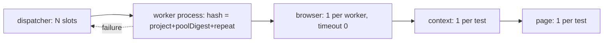

# playwright/test 1.62.1: instance lifetimes and contention knobs

Source paths are relative to `node_modules/.pnpm/`. `PW` = `playwright@1.62.1/node_modules/playwright/lib`,
`CORE` = `playwright-core@1.62.1/node_modules/playwright-core/lib`. Line numbers are from the bundled JS.

## TOC

1. Lifetime ladder
2. Worker count default
3. Worker identity and reuse across files (workerHash)
4. Worker recycle on failure, redundant worker stop
5. Fixture instantiation and teardown order
6. browser fixture
7. context and page fixtures (per-test, closed in parallel)
8. Context reuse mode (one context per worker, reset between tests)
9. Vitest counterparts already in this package

## 1. Lifetime ladder

| instance | scope | created at | destroyed at | key |
| --- | --- | --- | --- | --- |
| `playwright` (playwright-core module) | worker | first test in worker | worker stop | `PW/index.js:71-73` |
| `_browserOptions` | worker, auto | before any test | worker stop | `PW/index.js:201-215` |
| `browser` | worker, `timeout: 0` | first test needing it | worker stop, `close({reason})` | `PW/index.js:216-238` |
| `_reuseContext` (bool) | worker | with browser | worker stop | `PW/index.js:418-424` |
| `_contextFactory` | test | each test | end of test, `Promise.all(close)` | `PW/index.js:355-414` |
| `context` | test | each test | end of test | `PW/index.js:425-442` |
| `page` | test | each test | with context (no own teardown) | `PW/index.js:443-451` |



## 2. Worker count default

`PW/common/index.js:579`
```js
workers: resolveWorkers(takeFirst(configCLIOverrides.debug || configCLIOverrides.pause ? 1 : void 0, configCLIOverrides.workers, userConfig.workers, "50%")),
```

`PW/common/index.js:670-686`
```js
function resolveWorkers(workers) {
  if (typeof workers === "string") {
    if (workers.endsWith("%")) {
      const percent = parseInt(workers, 10);
      ...
      const cpus = import_os2.default.cpus().length;
      return Math.max(1, Math.floor(cpus * (percent / 100)));
    }
    const parsedWorkers = parseInt(workers, 10);
    ...
    return parsedWorkers;
```

Default: floor(cpus / 2). Debug or pause: 1.

Vitest default, `vitest@4.1.10/.../dist/chunks/cli-api.BK8pd4xc.js:2355-2358`
```js
function getDefaultThreadsCount(config) {
	const numCpus = typeof nodeos.availableParallelism === "function" ? nodeos.availableParallelism() : nodeos.cpus().length;
	return config.watch ? Math.max(Math.floor(numCpus / 2), 1) : Math.max(numCpus - 1, 1);
}
```

| runner | run mode | watch mode |
| --- | --- | --- |
| playwright/test | cpus/2 | cpus/2 |
| vitest | cpus-1 | cpus/2 |

## 3. Worker identity and reuse across files

`PW/common/index.js:1897`
```js
        test._poolDigest = pool.digest;
```
`PW/common/index.js:2101-2102`
```js
    if (test._poolDigest)
      test._workerHash = `${project.id}-${test._poolDigest}-0`;
```
`PW/common/index.js:2114-2115`
```js
      if (test._poolDigest)
        test._workerHash = `${project.id}-${test._poolDigest}-${repeatEachIndex}`;
```

`pool.digest` is the fixture pool validate() result (`PW/common/index.js:1597`, body `1657-1700`): a digest of
the registered fixture set. Two files with the same `test.extend` chain and same project share a hash and can
share a worker; the browser survives across those files.

`PW/runner/index.js:5251-5254`: dispatcher prefers a free slot whose live worker already has the job's hash.
```js
    let workerIndex = this._workerSlots.findIndex((w) => !w.jobDispatcher && w.worker && w.worker.hash() === job.workerHash && !w.worker.didSendStop());
    if (workerIndex === -1)
      workerIndex = this._workerSlots.findIndex((w) => !w.jobDispatcher);
    if (workerIndex === -1) {
      return;
```

`PW/runner/index.js:5271-5277`: hash mismatch kills the worker before reuse.
```js
    let worker = this._workerSlots[index].worker;
    if (worker && (worker.hash() !== job.workerHash || worker.didSendStop())) {
      await worker.stop();
      worker = void 0;
```

`PW/runner/index.js:5342-5345`: slot count = `config.workers`.
```js
    for (let i = 0; i < this._testRun.config.config.workers; i++)
      this._workerSlots.push({});
    for (let i = 0; i < this._workerSlots.length; i++)
      this._scheduleJob();
```

Test groups (`PW/runner/index.js:2355-2420`, `createTestGroups`): default one group per file per hash;
`fullyParallel` or `describe.configure({mode:'parallel'})` splits per test; suites with beforeAll/afterAll
inside parallel mode are chunked by `Math.ceil(tests / expectedParallelism)` (`:2409`).

## 4. Worker recycle on failure, redundant worker stop

`PW/runner/index.js:5292-5299`
```js
    this._updateCounterForWorkerHash(job.workerHash, -1);
    if (result.didFail)
      void worker.stop(
        true
        /* didFail */
      );
    else if (this._isWorkerRedundant(worker))
      void worker.stop();
```

`PW/runner/index.js:5321-5328`
```js
  _isWorkerRedundant(worker) {
    let workersWithSameHash = 0;
    for (const slot of this._workerSlots) {
      if (slot.worker && !slot.worker.didSendStop() && slot.worker.hash() === worker.hash())
        workersWithSameHash++;
    }
    return workersWithSameHash > this._queuedOrRunningHashCount.get(worker.hash());
  }
```

Any failed test ends the worker process, so the browser after a failure is a fresh launch. Workers whose
hash has no remaining queued jobs are stopped rather than kept idle with a browser open.

## 5. Fixture instantiation and teardown order

`PW/worker/workerProcessEntry.js:146-149`: one instance per registration id per worker.
```js
  async setup(testInfo, runnable) {
    this.runner.instanceForId.set(this.registration.id, this);
    if (typeof this.registration.fn !== "function") {
      this.value = this.registration.fn;
```

`PW/worker/workerProcessEntry.js:136-142`: worker fixtures get the project timeout as their slot unless
`timeout` is set on the registration.
```js
      } : this.registration.scope === "worker" ? {
        timeout: this.runner.workerFixtureTimeout,
        elapsed: 0
      } : void 0
```

`PW/worker/workerProcessEntry.js:298`: auto worker fixtures set up before auto test fixtures.
```js
    auto.sort((r1, r2) => (r1.scope === "worker" ? 0 : 1) - (r2.scope === "worker" ? 0 : 1));
```

`PW/worker/workerProcessEntry.js:268-284`: teardown walks instances in reverse creation order.
```js
  async teardownScope(scope, testInfo, runnable) {
    const allFixtures = Array.from(this.instanceForId.values()).reverse();
    const collector = /* @__PURE__ */ new Set();
    for (const fixture of allFixtures)
      fixture._collectFixturesInTeardownOrder(scope, collector);
    let firstError;
    for (const fixture of collector) {
      try {
        await fixture.teardown(testInfo, runnable);
      } catch (error) {
        firstError = firstError ?? error;
      }
    }
    if (scope === "test")
      this.testScopeClean = true;
```

`PW/worker/workerProcessEntry.js:1667`: test scope torn down after every test.
`PW/worker/workerProcessEntry.js:1692-1704`: on worker stop, order is test scope, afterAll hooks, worker scope.
```js
          await this._fixtureRunner.teardownScope("test", testInfo, { type: "test", slot: teardownSlot });
        ...
        for (const suite of reversedSuites) {
            await this._runAfterAllHooksForSuite(suite, testInfo);
        ...
          await this._fixtureRunner.teardownScope("worker", testInfo, { type: "teardown", slot: teardownSlot });
```

`PW/common/index.js:1677-1679`: a worker fixture may not depend on a test fixture (load error).
```js
        if (kScopeOrder.indexOf(registration.scope) > kScopeOrder.indexOf(dep.scope)) {
          addDependencyError(`${registration.scope} fixture "${registration.name}" cannot depend on a ${dep.scope} fixture "${name}" ...`, registration.location);
```

## 6. browser fixture

`PW/index.js:201-215`
```js
  _browserOptions: [async ({ playwright, headless, channel, launchOptions }, use) => {
    const options = {
      handleSIGINT: false,
      ...launchOptions,
      tracesDir: tracing().tracesDir(),
      artifactsDir: tracing().artifactsDir()
    };
    if (headless !== void 0)
      options.headless = headless;
    if (channel !== void 0)
      options.channel = channel;
    playwright._defaultLaunchOptions = options;
    await use(options);
    playwright._defaultLaunchOptions = void 0;
  }, { scope: "worker", auto: true, box: true }],
```

`PW/index.js:216-238`
```js
  browser: [async ({ playwright, browserName, _browserOptions, connectOptions }, use, workerInfo) => {
    if (!["chromium", "firefox", "webkit"].includes(browserName))
      throw new Error(`Unexpected browserName "${browserName}", must be one of "chromium", "firefox" or "webkit"`);
    if (connectOptions) {
      const browser2 = await playwright[browserName].connect(connectOptions.wsEndpoint, {
        ...connectOptions,
        exposeNetwork: connectOptions.exposeNetwork,
        headers: {
          // HTTP headers are ASCII only (not UTF-8).
          "x-playwright-launch-options": jsonStringifyForceASCII(_browserOptions),
          ...connectOptions.headers
        }
      });
      await use(browser2);
      await browser2.close({ reason: "Test ended." });
      return;
    }
    const browser = await playwright[browserName].launch();
    if (process.env.PLAYWRIGHT_DASHBOARD)
      await browser.bind(`worker-${workerInfo.parallelIndex}`);
    await use(browser);
    await browser.close({ reason: "Test ended." });
  }, { scope: "worker", timeout: 0 }],
```

Points: `handleSIGINT: false` so the runner owns shutdown; launch options travel through
`playwright._defaultLaunchOptions` rather than the `launch()` call; `timeout: 0` on the fixture so a slow
launch does not count against the worker fixture slot; `connectOptions` from env
(`PW_TEST_CONNECT_WS_ENDPOINT`, `PW/index.js:540`) switches every worker to a remote browser.

## 7. context and page fixtures

`PW/index.js:341-354`: per-test defaults are pushed onto the module singleton, then cleared.
```js
  _setupContextOptions: [async ({ playwright, actionTimeout, navigationTimeout, testIdAttribute }, use, _testInfo) => {
    const testInfo = _testInfo;
    if (testIdAttribute)
      playwrightLibrary.selectors.setTestIdAttribute(testIdAttribute);
    testInfo.snapshotSuffix = process.platform;
    ...
    playwright._defaultContextTimeout = actionTimeout || 0;
    playwright._defaultContextNavigationTimeout = navigationTimeout || 0;
    await use();
    playwright._defaultContextTimeout = void 0;
    playwright._defaultContextNavigationTimeout = void 0;
  }, { auto: "all-hooks-included", title: "context configuration", box: true }],
```

`PW/index.js:355-414`
```js
  _contextFactory: [async ({ browser, video, _reuseContext, _combinedContextOptions }, use, testInfo) => {
    const testInfoImpl = testInfo;
    const videoMode = normalizeVideoMode(video);
    const captureVideo = shouldCaptureVideo(videoMode, testInfo) && !_reuseContext;
    const contexts = /* @__PURE__ */ new Map();
    let counter = 0;
    await use(async (options) => {
      const hook = testInfoImpl._currentHookType();
      if (hook === "beforeAll" || hook === "afterAll") {
        throw new Error([
          `"context" and "page" fixtures are not supported in "${hook}" since they are created on a per-test basis.`,
          ...
      }
      ...
      const context = await browser.newContext({ ...videoOptions, ...options });
      let closed = false;
      const close = async () => {
        if (closed)
          return;
        closed = true;
        const closeReason = testInfo.status === "timedOut" ? "Test timeout of " + testInfo.timeout + "ms exceeded." : "Test ended.";
        await context.close({ reason: closeReason });
        const preserveVideo = captureVideo && shouldPreserveVideo(videoMode, testInfo);
        if (preserveVideo) {
          ...
            await v.saveAs(savedPath);
            testInfo.attachments.push({ name: "video", path: savedPath, contentType: "video/webm" });
        }
      };
      const contextData = { close, pagesWithVideo: [] };
      if (captureVideo)
        context.on("page", (page) => contextData.pagesWithVideo.push(page));
      contexts.set(context, contextData);
      return { context, close };
    });
    await Promise.all([...contexts.values()].map((data) => data.close()));
  }, { scope: "test", title: "context", box: true }],
```

`PW/index.js:425-451`
```js
  context: async ({ browser, video, _reuseContext, _contextFactory }, use, testInfoPublic) => {
    ...
    if (!_reuseContext) {
      const { context: context2, close } = await _contextFactory();
      await installScreencastTitleUpdater(testInfo, context2, show?.test);
      await use(context2);
      await close();
      return;
    }
    const context = await browserImpl._wrapApiCall(() => browserImpl._newContextForReuse(), { internal: true });
    await installScreencastTitleUpdater(testInfo, context, show?.test);
    await use(context);
    const closeReason = testInfo.status === "timedOut" ? "Test timeout of " + testInfo.timeout + "ms exceeded." : "Test ended.";
    await browserImpl._wrapApiCall(() => browserImpl._disconnectFromReusedContext(closeReason), { internal: true });
  },
  page: async ({ context, _reuseContext }, use) => {
    if (!_reuseContext) {
      await use(await context.newPage());
      return;
    }
    let [page] = context.pages();
    if (!page)
      page = await context.newPage();
    await use(page);
  },
```

Points: page has no teardown, context.close() closes pages; every context a test opened through the factory
is closed in parallel; context/page in beforeAll is a hard error; video is saved only when
`shouldPreserveVideo` (retain-on-failure etc) after close.

## 8. Context reuse mode

`PW/index.js:415-424`
```js
  _optionContextReuseMode: ["none", { scope: "worker", option: true, box: true }],
  _optionConnectOptions: [void 0, { scope: "worker", option: true, box: true }],
  reuseContext: [false, { scope: "worker", option: true, box: true }],
  _reuseContext: [async ({ video, _optionContextReuseMode, reuseContext }, use) => {
    let mode = _optionContextReuseMode;
    if (process.env.PW_TEST_REUSE_CONTEXT || reuseContext)
      mode = "when-possible";
    const reuse = mode === "when-possible" && normalizeVideoMode(video) === "off";
    await use(reuse);
  }, { scope: "worker", title: "context", box: true }],
```

Server side, `CORE/coreBundle.js:52312-52322`
```js
      async newContextForReuse(progress2, params2) {
        const hash = BrowserContext.reusableContextHash(params2);
        if (!this._contextForReuse || hash !== this._contextForReuse.hash || !this._contextForReuse.context.canResetForReuse()) {
          if (this._contextForReuse)
            await this._contextForReuse.context.close(progress2, { reason: "Context reused" });
          this._contextForReuse = { context: await this.newContext(progress2, params2), hash };
          return this._contextForReuse.context;
        }
        await this._contextForReuse.context.resetForReuse(progress2, params2);
        return this._contextForReuse.context;
      }
```

`CORE/coreBundle.js:51321-51333`: hash = context params minus defaults minus the resettable keys.
`CORE/coreBundle.js:51772-51780`
```js
    paramsThatAllowContextReuse = [
      "colorScheme",
      "forcedColors",
      "reducedMotion",
      "contrast",
      "screen",
      "userAgent",
      "viewport",
      "testIdAttributeName"
```

`CORE/coreBundle.js:51334-51356`: what reset does between tests.
```js
      async resetForReuse(progress2, params2) {
        await this.tracing.resetForReuse(progress2);
        if (params2) {
          for (const key of paramsThatAllowContextReuse)
            this._options[key] = params2[key];
          if (params2.testIdAttributeName)
            this.selectors().setTestIdAttributeName(params2.testIdAttributeName);
        }
        let page = this.pages()[0];
        const otherPages = this.possiblyUninitializedPages().filter((p) => p !== page);
        for (const p of otherPages)
          await p.close(progress2);
        if (page && page.isClosedOrClosingOrCrashed()) {
          await page.close(progress2);
          page = void 0;
        }
        await page?.mainFrame().gotoImpl(progress2, "about:blank", {});
        await this.clock.uninstall(progress2);
        await progress2.race(this.setUserAgent(this._options.userAgent));
        await progress2.race(this.doUpdateDefaultEmulatedMedia());
        await progress2.race(this.doUpdateDefaultViewport());
        await this.setStorageState(progress2, this._options.storageState, "resetForReuse");
        await page?.resetForReuse(progress2);
      }
```

`CORE/coreBundle.js:21828-21838` (Page.resetForReuse): about:blank, clear emulated size, media, extra headers.

Reuse is opt-in, off with video, and is the only path where a page outlives a test.

## 9. Vitest counterparts already in this package

| playwright/test mechanism | line | this package | status |
| --- | --- | --- | --- |
| workers default cpus/2 | `PW/common/index.js:579,678-679` | `0_options.ts:147` `workerBudget()` (memory + idle cores) | present, different formula |
| worker = process, browser per worker | `PW/index.js:216-238` | `5_streams.ts:96-105` `browser$` | present |
| `handleSIGINT: false` | `PW/index.js:203` | `5_streams.ts:102` | present |
| `timeout: 0` on browser fixture | `PW/index.js:238` | `resource$` has no timeout | equivalent |
| context per test, closed in parallel | `PW/index.js:384,413` | `5_streams.ts:112-147`, `contextScope: "test" \| "file"` | present, plus a file scope playwright lacks |
| page without own teardown | `PW/index.js:445` | `5_streams.ts:150-155` | present |
| action/navigation timeouts on context | `PW/index.js:349-350` | `5_streams.ts:125-126` via `setDefaultTimeout` | present |
| context/page forbidden in beforeAll | `PW/index.js:368-375` | none | absent |
| workerHash: worker reuse only across same fixture set | `PW/common/index.js:2102`, `PW/runner/index.js:5251` | vitest `isolate:false` (`1_plugin.ts:47`), no hash | absent, vitest has no equivalent |
| kill worker after any failed test | `PW/runner/index.js:5293-5296` | none | absent |
| stop redundant idle workers | `PW/runner/index.js:5297-5298,5321-5328` | vitest pool owns this | n/a |
| reuseContext + resetForReuse | `PW/index.js:418-424`, `CORE:52312-52322,51334-51356` | none (`contextScope:"file"` shares without reset) | absent |
| video forces no reuse | `PW/index.js:364,423` | n/a | n/a |
| connect via env `PW_TEST_CONNECT_WS_ENDPOINT` | `PW/index.js:197-199,540` | `0_options.ts:45` `browser.connect` | present, no env read |
