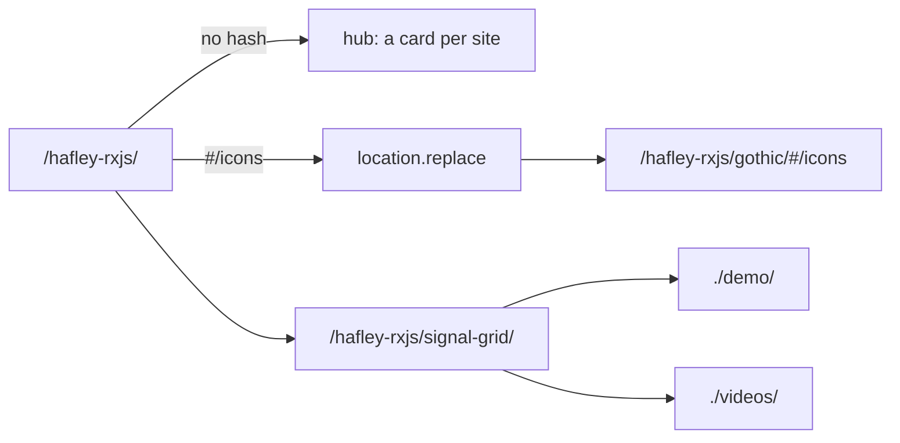
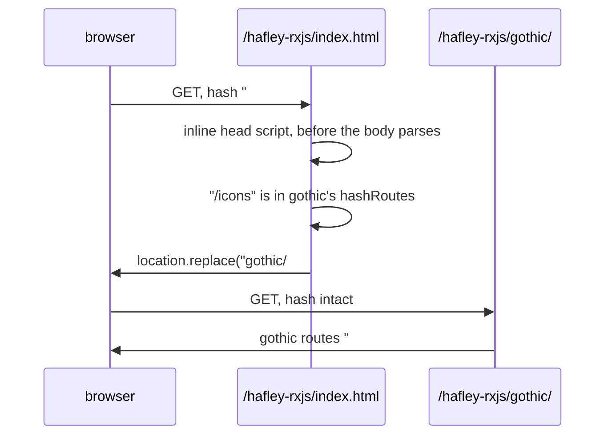

# pages

The GitHub Pages shell. One tab strip, one subdirectory per package.

## Contents

- [URL layout](#url-layout)
- [Adding a package](#adding-a-package)
- [The strip on a package page](#the-strip-on-a-package-page)
- [The root redirect](#the-root-redirect)
- [Build and publish](#build-and-publish)
- [Files](#files)

## URL layout



| Path | Owner | Built by |
| --- | --- | --- |
| `/hafley-rxjs/` + `/hafley-rxjs/shell/` + `/hafley-rxjs/strip.js` | this directory | `vite build -c pages/vite.config.ts` |
| `/hafley-rxjs/gothic/` | `@hafley66/gothic` | `pnpm --filter @hafley66/gothic build:single` |
| `/hafley-rxjs/signal-grid/` | `@hafley66/signal-grid` | `pnpm --filter @hafley66/signal-grid ship` |

No package writes the branch root, and no package writes another package's subdirectory.

## Adding a package

One object in `manifest.ts`, nothing else. No workflow edit, no shell edit.

```ts
{
  slug: "marbler",
  title: "marbler",
  blurb: "One line, what it is.",
  pkg: "@hafley66/marbler",
  build: "pnpm --filter @hafley66/marbler site:build",
  dist: "packages/marbler/site/dist",
}
```

Two requirements on the package side:

| Requirement | Why |
| --- | --- |
| its vite `base` is `/hafley-rxjs/<slug>/` | Pages resolves a root-absolute asset URL against the origin, not the site |
| its `index.html` carries the strip tag | otherwise the tab row stops at the hub |

`scripts/pages.mjs` prints a `warn` line for every root-absolute URL a site still emits outside its own prefix, so a missed `base` shows up in the build report rather than in a visitor's console.

## The strip on a package page

One tag, no import to resolve, no stylesheet to pair with it:

```html
<script src="/hafley-rxjs/strip.js" defer></script>
```

The script renders into the first `[data-pages-strip]` element, or prepends its own host to `<body>` when the page declares none. It reads the current slug out of `location.pathname` and sets `aria-current="page"` on that tab. It stays in static flow rather than sticky, because gothic's own `.kit-top` is `position: sticky; top: 0` and a second sticky bar at the same offset would cover it. The rendered height lands in `--pages-strip-h` for any page that wants to offset its own sticky header.

## The root redirect

`https://hafley66.github.io/hafley-rxjs/#/icons` was a gothic bookmark before the shell existed and has to keep working.



The route list is `hashRoutes` on the manifest entry, serialized into the inline script at build time by the `pages-inline-redirect` plugin in `vite.config.ts`. A hash that matches nothing renders the hub, and so does a bare root.

## Build and publish

```
node scripts/pages.mjs                              build and verify into out/pages, never pushes
PAGES_PUBLISH=1 node scripts/pages.mjs --publish    push out/pages to gh-pages
```

`--publish` alone refuses. Both gates have to be present, so no accidental deploy replaces the live gothic site.

The build fails when a slug ends up with an empty directory, when `out/pages/index.html` is not the shell, when gothic's own `index.html` is missing from `out/pages/gothic/`, or when `strip.js` is absent, over 4 kB, or carries an import.

## Files

| File | What it is |
| --- | --- |
| `manifest.ts` | `SITES`, `REPO_BASE`, and the hash and pathname lookups the shell and the strip share |
| `index.html` | the hub document, with a `<!-- pages:redirect -->` slot the build fills |
| `main.ts` | redirect, then the strip, then the filterable card list |
| `strip.ts` | the tab row, built twice: into the shell bundle and into standalone `strip.js` |
| `shell.css` | the card grid. `@hafley66/report-shell/kit.css` owns the tokens and the tab row |
| `vite.config.ts` | two modes, the workspace aliases, and the redirect-inlining plugin |
