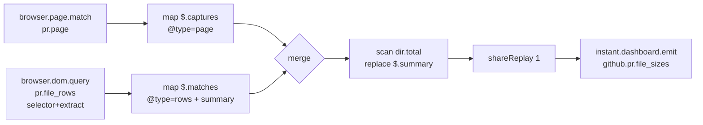

# Lane gh-diffsize

## What changed

Created four files, no other path touched:

| Path | Kind |
|---|---|
| `packages/json-rx/src/5_automations/2_github_diff_size/0_input.tsp` | create |
| `packages/json-rx/src/5_automations/2_github_diff_size/1_document.auto.ts` | create |
| `packages/json-rx/src/5_automations/2_github_diff_size/3_document.test.ts` | create |
| `REPORT.md` (worktree root) | create |

`8_v2_schema.ts` and `9_v2_runtime.ts` were read only.

## The document, explained

`githubDiffSizeAutomation` is a hand-authored `automation.v2` document. It is hand-authored because the current TypeSpec surface in `4_typespec/` only lowers to `automation.v1` (`http.event` / `host.emit`); nothing emits the v2 browser source kinds yet. `0_input.tsp` is a design sketch for the same reason and is not a compile target. `pnpm generate` and `typespec:check` do not reference this directory, so the sketch breaks nothing.



Two sources per the contract:

- `pr.page`, kind `browser.page.match`. Host regex `^github\.com$`, url regex with named groups `owner`, `repo`, `pr` on the `/pull/<pr>/files` route, `readyState: "complete"`. Emitted `captures` carry the PR identity.
- `pr.file_rows`, kind `browser.dom.query`. Same page match, `query` with one `extract` (path/added/removed over the node shape) and an `observe` block. `extract` was chosen over `captures`, so each matched element becomes `{ path, added, removed }` in `matches`.

Flow `file_sizes`:

- A `merge` combines the two mapped sources so the reducer sees a single event stream. Sort order: `page` context enters before `rows`.
- `scan` with reducer `dir.total` holds the emitted object. Seed `{}`. The `rows` case `replace`s the accumulator with the computed summary.
- `shareReplay` (bufferSize 1, refCount true) so late subscribers get the last aggregate.
- Output is `instant.dashboard.emit` on `github.pr.file_sizes`. DATA ONLY. No render output kind, no DOM mutation.

The document is only for schema and structure verification; it emits no DOM writes.

## Selector assumptions

No live GitHub page was available. The document uses stand-ins that must be reconciled against the sibling research lane's 2026 selectors.

| Assumption | Value used | What to confirm |
|---|---|---|
| File row selector | `[data-testid="pr-file-row"]` | Real row element in the "Files changed" list. Check whether GitHub exposes `data-testid`, a stable class, or `[data-file-name]` / `data-tagsearch-path`. Set `all: true`. |
| Path source | `$.dataset.path` | That the row element carries the file path on `data-*`, and which camelCased dataset key results. Candidates: `path` from `data-tagsearch-path` or `path` from `data-file-name`. |
| Added count source | `$.attributes['data-additions']` | That the row exposes `data-additions`. GitHub renders these counts on diff elements; need the exact attribute name and location relative to the row anchor. |
| Removed count source | `$.attributes['data-deletions']` | Same as added; confirm the attribute name and that string-to-number coercion happens. |
| Observe | subtree, childList, debounceMs 150 | Confirm the mutation source for the diff list (turbo-frame / diff re-render) so re-emit fires on refresh. |

The `extract` jsonata expression, the `url` regex, and the `summary` group-by expression all need live-page verification. They are coherent drafts, flagged in the parse of this report rather than asserted correct.

## Validation output

Typecheck passes:

```sh
$ pnpm --filter @hafley66/json-rx typecheck
$ tsgo --noEmit
```

Targeted vitest run (expected to fail against today's schema):

```sh
$ pnpm --filter @hafley66/json-rx exec vitest run src/5_automations/2_github_diff_size/
```

Result, 2 tests, 1 failed:

```
✓ expresses the two browser source kinds and the dashboard output
× parses as a valid automation.v2 document

AssertionError: Invalid input; Invalid input; Unrecognized key: "$schema": expected false to be true

Test Files  1 failed (1)
     Tests  1 failed | 1 passed (2)
```

Issue list with paths (captured via `AutomationV2Schema.safeParse`):

| path | message |
|---|---|
| `bindings.sources.pr.page` | Invalid input |
| `bindings.sources.pr.file_rows` | Invalid input |
| `` | Unrecognized key: "$schema" |

Contract fields the current schema rejected:

1. `bindings.sources.pr.page` and `bindings.sources.pr.file_rows`. The two new source kinds from CONTRACT.md, `browser.page.match` and `browser.dom.query`, are absent from the `bindings.sources` union in `8_v2_schema.ts`, which today accepts only `browser.network.response` and `host.event`.
2. `$schema`. `AutomationV2Schema` is a strict object without a `$schema` key, unlike the v1 sibling documents. Dropping it in a real lowerer is a separate cleanliness decision for the schema lane.

To prove the remaining circuit is sound independent of the missing kinds, I re-parsed the same document with the two bindings temporarily replaced by `kind: "host.event"` and the `$schema` key removed. The whole document, including the `merge` / `scan` / `shareReplay` expression and the `dir.total` reducer, validated clean. So the only contract rejections are the two source kinds plus `$schema`.

## Deviations from CONTRACT.md

- No deviations from the source-binding shapes in CONTRACT.md. The two sources, their emitted runtime values, and the capability names map one to one with the contract.
- The `0_input.tsp` file is aspirational prose, not a compilable TypeSpec program, because the v2 browser source kinds have no TypeSpec alias surface (`4_typespec/4a_aliasFunctions.tsp` exposes only `automation`, `source`, `map`, `logic`, `output`). This file was created to mirror sibling directory structure; it is excluded from the generate pipeline and from `typespec:check`.
- The scan reducer does the roll-up as `replace "$.summary"`, with the per-directory group-and-sum computed in the jsonata `summary` field. CONTRACT.md does not specify the `scan` reducer, so I used the current `9_v2_runtime.ts` semantics (whole-object `replace`, or static-key `patch`). A true reducer-side accumulation keyed by dynamic directory would need schema/runtime support that does not exist today. See Open questions.

## Open questions

1. Capability gating for the two new source kinds. The contract says a binding whose capability is absent from `grantedCapabilities` must fail at compile time, and names `browser.page.observe` and `browser.dom.read`. The current `compileAutomationV2` gates capabilities only through `bindings.hosts` host ports. This draft models the browser sources as plain `bindings.sources` entries (matching how `browser.network.response` is modeled), so no port exists to carry the capability. The coordinator must decide whether these source kinds lower to declared host source ports or to a separate source-capability gate.
2. Dynamic per-directory accumulation in `scan`. The reducer vocabulary resolves whole-object `replace` or static-key `patch`. Per-directory keys are unknown at author time. Decide whether to extend the reducer with dynamic-key accumulation or keep the jsonata-computed summary and treat `scan` as the carrier.
3. `$schema` on v2 documents. `AutomationV2Schema` rejects the `$schema` key the v1 generated documents carry. Confirm whether v2 lowerers should emit `$schema`, and if so add it to the schema.
4. Per-file versus per-emission row handling. The v2 `map` expression emits one object per input emission; it does not fan out one row per matched element. This draft keeps rows as an array inside one emission and aggregates with jsonata. Confirm the intended row cardinality for the output stream.
