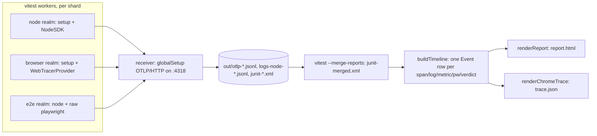

# vitest telemetry package: lab -> `@hafley66/vitest-telemetry`

Source lab: `~/projects/claude-research/labs/vitest-otel-logtape` (659 lines across lab/, src/log.ts, src/debug-bridge.ts).

## TOC

1. What ships
2. Pipeline
3. Public API (type signatures)
4. Pseudo-code per entry point
5. Instance lifetimes
6. Storage layout, read/write sequence, uniqueness
7. Lab -> package file map
8. Dependencies
9. Decisions needed
10. Steps

## 1. What ships

| entry | consumer writes | gives |
| --- | --- | --- |
| `@hafley66/vitest-telemetry/plugin` | `plugins: [telemetry({ root: 'app' })]` in vitest config | define, optimizeDeps, globalSetup receiver, otel sdk paths, one setupFile |
| `@hafley66/vitest-telemetry` | `const log = Logger(import.meta.url)` | LogTape logger, category = `[root, ...repo-relative path]` |
| `@hafley66/vitest-telemetry/report` | `buildTimeline(outDir)`, `renderReport(events)` | node API behind the CLI |
| bin `vitest-telemetry` | `vitest-telemetry report --open` | `out/timeline.jsonl`, `out/report.html`, `out/trace.json` |

Dropped from the lab: allure reporter, `summarize.mjs`, `cattree.mjs`, `serve.mjs` (Perfetto hosting), `by-test.md`.

## 2. Pipeline



Sharding: each shard runs the top row and writes to the same `out/`. CI uploads `out/` per shard, downloads with merge-multiple, then runs `--merge-reports` and `vitest-telemetry report`.

## 3. Public API

```ts
// plugin.ts
export interface TelemetryOptions {
  root?: string            // category root, default 'app'
  outDir?: string          // default 'out'
  otlp?: string            // default 'http://localhost:4318'
  receiver?: boolean       // default true; false when pointing at a real collector
  shard?: string           // default process.env.VITEST_SHARD ?? process.env.LAB_SHARD ?? 'none'
  debugNamespaces?: string // debug.js namespaces bridged into LogTape, default `${root}:*`
  fileSink?: boolean       // node realm jsonl per pid, default true
}
export function telemetry(options?: TelemetryOptions): Plugin

// index.ts
export function Logger(importMetaUrl: string): Logger      // from @logtape/logtape
export function bridgeDebugToLogTape(namespaces: string): void
export const captured: LogRecord[]                         // memory sink, for asserting logs in tests

// setup.ts  (setupFile, realm-detecting; imported by vitest, not by users)
export {}

// report.ts
export type Kind = 'span' | 'log' | 'metric' | 'playwright' | 'verdict'
export interface Event {
  t: number; tRel: number; iso: string
  kind: Kind; realm: 'node' | 'browser' | 'playwright' | 'junit'
  service: string; shard: string | null; project: string | null
  suitePath: string[]; file: string; test: string | null; testId: string | null
  traceId: string | null; spanId: string | null; parentSpanId: string | null; depth: number
  name?: string; durationMs?: number; status?: 'ok' | 'error' | 'pass' | 'fail' | 'skip'; error?: string | null
  level?: string; category?: string[]; categoryPath?: string; message?: string
  value?: number | null; count?: number | null; sum?: number | null
  attrs: Record<string, unknown>
}
export function buildTimeline(outDir: string): Event[]
export function renderReport(events: Event[]): string        // html
export function renderChromeTrace(events: Event[]): object   // trace.json

// cli.ts
// vitest-telemetry report [--out out] [--open]
// vitest-telemetry trace  [--out out]
```

## 4. Pseudo-code per entry point

```ts
export function telemetry(o) {
  // resolve own dist files: fileURLToPath(new URL('./otel.node.js', import.meta.url))
  // return { name, config: () => ({
  //   define: { __TELEMETRY__: JSON.stringify({ root, outDir, otlp, shard }) },
  //   optimizeDeps: { include: [logtape, otel, opentelemetry/*, debug] },
  //   test: {
  //     setupFiles: [ownDist('setup.js')],               // root-level; projects inherit with extends: true
  //     globalSetup: receiver ? [ownDist('receiver.js')] : [],
  //     experimental: { openTelemetry: { enabled: true, sdkPath: ownDist('otel.node.js'), browserSdkPath: ownDist('otel.browser.js') } },
  //   },
  // }) }
}

// setup.ts
// const realm = typeof window === 'undefined' ? 'node' : 'browser'
// const cfg = baseConfig(__TELEMETRY__)               // console + otel + memory sinks, loggers for root/debug/logtape.meta
// if (realm === 'node') {
//   const { getStreamFileSink } = await import('@logtape/file')
//   const { AsyncLocalStorage } = await import('node:async_hooks')
//   add file sink `${outDir}/logs-node-${pid}.jsonl`, contextLocalStorage
// }
// await configure(cfg); installLifecycle(); afterAll(dispose)

// Logger(url)
// path = new URL(url).pathname minus '/@fs' prefix minus __TELEMETRY__.rootDir minus query
// return getLogger([root, ...path.split('/')])

// buildTimeline(outDir)  = timeline.mjs body, minus writeFileSync, returns events
// renderReport(events)   = report.mjs body, returns html string
// cli: events = buildTimeline(out); write timeline.jsonl, report.html, trace.json; --open -> spawn('open')
```

## 5. Instance lifetimes

| instance | created | one per | disposed |
| --- | --- | --- | --- |
| receiver http server | first globalSetup call | vitest main process (globalThis guard, runs once per project otherwise) | process exit (unref, never closed: SDK flush lands after teardown) |
| LoggerProvider + OTLPLogExporter | setup file top level | worker (node) / page (browser) | `afterAll(dispose)` |
| NodeSDK / WebTracerProvider | vitest loads sdkPath | worker / page | vitest shuts down |
| `captured` array | setup module load | worker / page | never; tests slice it |
| Event[] | `buildTimeline` | CLI run | function return |

## 6. Storage layout

```
out/
  otlp-traces.jsonl      receiver, one OTLP batch per line, appended by every realm and shard
  otlp-logs.jsonl        same
  otlp-metrics.jsonl     same
  logs-node-<pid>.jsonl  node realm LogTape file sink, jsonLinesFormatter
  junit-<shard>.xml      vitest junit reporter (user config)
  junit-merged.xml       vitest --merge-reports (user config)
  pw-debug.log           optional DEBUG_FILE (user env)
  timeline.jsonl         buildTimeline
  report.html            renderReport
  trace.json             renderChromeTrace
```

Write sequence: workers append otlp + logs-node during the run -> junit per shard at run end -> merge writes junit-merged -> CLI reads all, writes the last three.

Uniqueness: `logs-node-<pid>` unique per worker. OTLP files are shared appends across shards on one machine; across CI machines each shard has its own `out/` and `download-artifact merge-multiple` concatenation must not clobber, so the receiver file names take `-${shard}` when shard != 'none'. `timeline.jsonl` rows are keyed by `(kind, spanId | t+message)`; verdicts by `file::test`.

## 7. Lab -> package file map

| lab | package `src/` | change |
| --- | --- | --- |
| `lab/plugin.ts` | `plugin.ts` | options object, resolve own dist paths, single setupFile |
| `lab/setup.shared.ts` + `setup.node.ts` + `setup.browser.ts` | `setup.ts` | merge, realm branch with dynamic import |
| `lab/otel.node.js`, `lab/otel.browser.js` | `otel.node.ts`, `otel.browser.ts` | read `__TELEMETRY__` for otlp/shard |
| `lab/receiver.ts` | `receiver.ts` | outDir + shard suffix from `__TELEMETRY__`? no define in main process: read `process.env.VITEST_TELEMETRY` json written by plugin |
| `src/log.ts` | `index.ts` | `__ROOT__` -> `__TELEMETRY__.rootDir`, `'lab'` -> `root` |
| `src/debug-bridge.ts` | `index.ts` | as is |
| `lab/timeline.mjs` | `report/timeline.ts` | return events; `'lab'` prefix removed from NOISE regex |
| `lab/report.mjs` | `report/html.ts` | export `renderReport` |
| `lab/perfetto.mjs` | `report/chrome-trace.ts` | export `renderChromeTrace` |
| `package.json` scripts | `cli.ts` | `report`, `trace` commands |
| `tests/*`, `src/cqrs.ts`, `src/counter.ts`, `src/app.*` | `packages/vitest-telemetry/fixtures/` | fixture project used by the package's own vitest run |

## 8. Dependencies

| package | role | version in lab |
| --- | --- | --- |
| vitest, vite | peer | ^4.1.11, ^8.2.2 |
| @logtape/logtape | peer (consumer calls getLogger) | ^2.3.3 |
| @logtape/otel, @logtape/file | dep | 2.3.3 |
| @opentelemetry/api | peer | ^1.9.0 |
| @opentelemetry/{sdk-node,sdk-logs,sdk-metrics,sdk-trace-web,resources,exporter-*-otlp-http} | dep | 0.222.0 / 2.11.0 |
| debug | optional peer | ^4.4.3 |
| @vitest/browser-playwright, playwright | dev (fixtures) | 4.1.11, 1.62.1 |

Repo root already has vitest ^4.1.10, vite ^8.2.1, playwright 1.62.1. Node >= 24 satisfied.

## 9. Decisions needed

| # | fork | options |
| --- | --- | --- |
| 1 | package name | `@hafley66/vitest-telemetry`, `@hafley66/vitest-otel`, other |
| 2 | one package or two | one with subpaths; or `vitest-telemetry` (runtime) + `vitest-telemetry-report` (CLI, no otel deps) |
| 3 | LogTape | peer (consumer picks version, uses getLogger directly) vs dep (re-export) |
| 4 | receiver default | on (zero-config local) vs off (assume collector) |
| 5 | chrome trace.json | keep (1 click at chrome://tracing) vs drop |

## 10. Steps

1. `packages/vitest-telemetry/` scaffold: package.json (marbler/boop-adapters shape, `prepack` gate, `files: [dist, README.md]`, `bin`), tsconfig.json, tsconfig.build.json.
2. Move files per section 7; replace `lab`/`__ROOT__`/`__OTLP__`/`__SHARD__` with `__TELEMETRY__`.
3. Move lab `tests/` + `src/` into `fixtures/`; `fixtures/vitest.config.ts` uses `telemetry()` from `../src/plugin.ts`.
4. `pnpm --filter @hafley66/vitest-telemetry test` = build, run fixtures with 2 shards, merge, `vitest-telemetry report`, assert `report.html` contains 12 verdicts and 1 fail.
5. README: install, 3-line config, what lands in `out/`, CI fan-in yaml.
6. `pnpm changeset`, `pnpm release:audit`, `just publish`.
