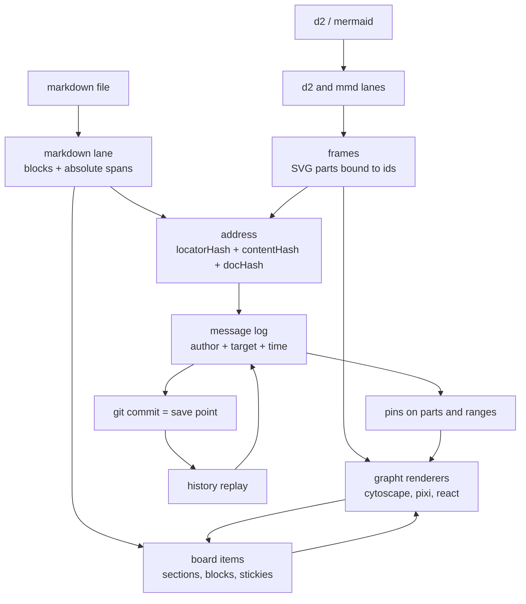

# Addressable markdown, a grapht board, and agent messages

Status: plan. Nothing here is implemented. Signatures are sketches.

Goal: grapht is the board (figjam or miro shaped). Markdown is one of its source languages,
next to d2 and mermaid. Every section, block, and diagram part on the board is addressable
by a location hash and a content hash, messages name who said what about which address, and
git commits are the save points.

## 1. Direction of dependency

```
grapht-model   ←  markdown lane, d2, mmd            (source languages)
grapht         →  grapht-model, d2, mmd             (board, frames, messages, history)
@hafley66/md   →  grapht                            (host: renders text, embeds the board)
```

grapht never imports `@hafley66/md`. `@hafley66/md` is a host that embeds grapht, not a
dependency of it. Markdown parsing therefore moves **down**: the lane that reads a markdown
file and produces blocks with absolute offsets belongs to grapht-model, and `@hafley66/md`
consumes it instead of owning its own copy.

No published export changes. `@hafley66/md` keeps every current export name and signature;
`parseMdSections` and friends become re-exports of the lane, so callers outside the repo see
the same module surface.

## 2. What already exists

| need | exists | where |
| --- | --- | --- |
| markdown structure with absolute offsets | `MdDoc` / `MdSection` (`id`, `depth`, `start`, `ownStart`, `ownEnd`, `end`) | `packages/md/src/model.ts:11-27` |
| fold keys that are source offsets | `ListFolds` | `packages/md/src/model.ts:49-53` |
| fence to grapht frame | `sequenceFrame()`, `svgFrame()`, `decorateSvg()` | `packages/md/src/0b_sequenceFrame.ts:105`, `packages/grapht/src/2_graph/21_svgFrame.ts` |
| SVG element to graph id | `SvgBindingReceipt`, `elementIdForBinding`, `role` + `ordinal` | `packages/grapht-model/src/1_sequenceSvgBinding.ts` |
| item identity across source edits | `occurrenceId`, `structuralKey`, `matchSequenceRevisions` | `packages/grapht-model/src/0_sequenceIdentity.ts` |
| source spans | `SequenceSourceSpan` | `packages/grapht-model/src/0_sequenceIdentity.ts` |
| content hash, git revisions | `contentHashOf`, `HistoryRevision`, `gitHistoryJournal` | `packages/grapht/src/5_history/0_journal.ts:26`, `1_gitWalk.ts:18` |
| board gestures | manual movement + undo history, group collapse, neighborhood highlight, sticky headers | `packages/grapht/src/2_graph/23_manualMovement.ts`, `plans/2026-09-13-anim-to-grapht/*` |
| renderer and interaction seam | `GraphFrameResource.render/unsubscribe`, `GraphInteraction`, `GraphSelection` variant `kind: "text-range"` | `packages/grapht/src/3_contracts/2_rendererRuntime.ts:28` |
| markdown in a host | md already mounts grapht frames for sequence fences | `packages/md/src/0b_SequenceDiagram.tsx:35` |

## 3. What is missing

1. Markdown is not a grapht source language. The only markdown parser is
   `packages/md/src/model.ts`, owned by the host.
2. The fence-relative span is never joined to the document. mmd and d2 attach
   `sourceSpan` per statement, but relative to the bare fence `code` string, and the fence
   renderer never receives its own offset. `DiagramLightboxEntry.bufferStart` / `bufferEnd`
   (`packages/md/src/0_DiagramLightbox.tsx:198-199`) anticipates this and is passed `0`
   (`:227-228`).
3. No board. grapht has graphs, frames, and gestures, but no document that holds arbitrary
   items and their placements with messages pinned to them.
4. No record anywhere pairs author, anchor, and timestamp. Boop's frames carry `from`,
   `to`, `timestamp`, `message` (`packages/boop-adapters/src/0_types.ts:110`) but the
   target is a peer session, not a document range.

## 4. The plot



## 5. Markdown as a source language

One span type for every language, so identity code is shared:

```ts
// grapht-model: SequenceSourceSpan becomes an alias of this
type SourceSpan = { start: number; end: number; lineStart: number; lineEnd: number }

type MdBlockKind =
  | "heading" | "paragraph" | "list" | "listItem" | "table"
  | "fence" | "blockquote" | "html"

type MdBlock = {
  id: string            // locator hash; stable across edits above it
  kind: MdBlockKind
  section: string       // owning section id (slug chain)
  ordinal: number       // position inside the section body
  span: SourceSpan      // absolute offsets into the file
  language?: string     // fence language
  codeStart?: number    // absolute offset of the fence body, the join that is missing today
  codeEnd?: number
}

type MdDocument = {
  path: string
  text: string
  docHash: string
  sections: MdSection[]
  blocks: MdBlock[]
}
```

Lane entry points, exported from grapht-model:

```ts
function mdDocument(path: string, text: string): MdDocument
function blockAt(document: MdDocument, offset: number): MdBlock | undefined
function mdAddressOf(document: MdDocument, blockId: string): MdAddress
```

`MdBlock.span` plus `codeStart` is the fix for missing item 2: a mermaid occurrence's
`sourceSpan.start` plus the fence's `codeStart` is an absolute file offset.

## 6. Address: location hash and content hash

```ts
type MdAddress = {
  path: string
  section: string
  block: number                        // ordinal
  span: SourceSpan                     // absolute offsets in this revision
  locatorHash: string                  // sha256("path#section/block")   identity, survives edits
  contentHash: string                  // sha256 of the slice at span    drift detector
  docHash: string                      // sha256 of the whole file       names the revision
}
```

`locatorHash` is the join key between the board, the diagram parts, and the messages.
`contentHash` answers whether the quoted text is still the quoted text. `docHash` pins the
revision that was read.

`documentFingerprint` (`packages/grapht-model/src/0_sequenceIdentity.ts`) is a 32-bit FNV and
stays an in-memory revision id. Persisted addresses use sha256: `sha256Hex`
(`packages/grapht/src/0_bench/3_hash.ts:6`) or `contentHashOf`
(`packages/grapht/src/5_history/0_journal.ts:26`). Both are `node:crypto`, so the board needs
one WebCrypto twin; adapters already do this privately, for example
`packages/grapht/adapters/2_render_cytoscape/src/3_fixture.ts:36`.

Relocation: recompute `contentHash` for `span`. Equal means anchored. Different means
relocate by structural key using the existing policy (`matchSequenceRevisions`: authored id
first, then a unique `structuralKey`, ambiguity blocks transfer) and mark the record
`reanchored` with the old span kept, or `orphaned` when no unique match exists. Orphans are
shown, never silently moved.

## 7. The board

What figjam or miro means here, in grapht types:

```ts
type BoardItem =
  | { kind: "block"; blockId: string; address: MdAddress }
  | { kind: "fence"; blockId: string; address: MdAddress; frame: GraphFrame }
  | { kind: "sticky"; id: string; text: string; address?: MdAddress }
  | { kind: "svg"; id: string; artifact: SealedSvgArtifact; address?: MdAddress }

type BoardPlacement = { itemId: string; x: number; y: number; z: number }

type Board = {
  format: "grapht-board/0"
  id: string
  sources: readonly { path: string; docHash: string }[]  // which revisions the board was built from
  items: readonly BoardItem[]
  placements: readonly BoardPlacement[]
}
```

The board is a grapht artifact, not a graph: a graph is topology, a board is topology plus
placed items. Movement reuses the existing gesture path and the movement journal plan
(`plans/2026-09-13-anim-to-grapht/5_optional-movement-journal.md`); the journal folds into
`placements` at commit time.

Markdown contributes items by projection: heading nesting becomes groups, blocks become
nodes, links become edges. That is what lets hover, hop gradient, collapse, and sticky
headers work on prose without new machinery.

## 8. Message record

```ts
type MessageAuthor =
  | { kind: "human"; id: string }
  | { kind: "agent"; id: string; model: string; session?: string }

type DocMessage = {
  id: string          // sha256 of (author | at | target.locatorHash | body)
  thread: string      // thread root id; self for a root
  replyTo?: string
  author: MessageAuthor
  at: string          // ISO 8601
  kind: "note" | "question" | "proposal" | "patch" | "verdict"
  target:
    | MdAddress
    | { kind: "board"; boardId: string; itemId: string }
    | { kind: "part"; path: string; locatorHash: string; elementId: string }
  body: string
  baseRevision?: string // git commit the author was looking at
  resolves?: string     // message id this closes
}

type MessageLog = { format: "grapht-messages/0"; artifact: string; messages: readonly DocMessage[] }
```

Same discipline as the history journal: one header line carrying `format`, one record per
line, verify on read, and `messageAnomalies()` naming duplicate ids, dangling `replyTo`, and
out-of-order `at` without touching bodies.

Storage: `<artifact>.messages.jsonl` beside the document or board, committed. Single writer.
The board and the host panel read it; they never append.

## 9. Git as save points

`grapht-history` already reconstructs any revision, content included, without git present
(`packages/grapht/src/5_history/0_journal.ts`). Add a commit trailer and a paired CLI:

```
Grapht-Artifacts: docs/example.md,docs/example.md.board.jsonl
Grapht-Messages: <id>,<id>
```

A message lifecycle then derives from git alone: written against `baseRevision`, resolved by
the commit whose trailer names it. No index, no second database.
`grapht-doc-history <path>` prints per message: author, `locatorHash`, anchor state
(anchored, reanchored, orphaned), the revision it was written against, and the revision that
resolved it. Exit codes follow `grapht-history` (`2` usage, `1` anomalies, `0` clean).

## 10. Composition seams

grapht needs no new renderer contract: `GraphFrameResource.render/unsubscribe`,
`GraphInteraction`, and `GraphPresentation` are already the composition surface, and
`hopsById` proves a renderer paints added state without a contract change. Two seams are new:

```ts
type GraphtBoardPlugin = {
  id: string
  ingest?: (source: string, language: string) => Graph                            // Ingest operator
  interact?: (event: GraphInteraction) => Signal<GraphInteraction>                // events$ (exists)
  paint?: (presentation: GraphPresentation) => GraphPresentation                  // hopsById pattern (exists)
  item?: ComponentType<{ item: BoardItem; frame?: GraphFrame }>                   // new: board item renderer
  overlay?: ComponentType<{ messages: readonly DocMessage[]; target?: MdAddress }> // new: pin layer
}
```

`@hafley66/md` gains two things and stays a host: a fence renderer registry (today a
hard-coded array at `packages/md/src/0_Streamdown.tsx:62-63`) and one intent member so a
message composed in the panel reaches the writer. `MdviewHost` is read-only today
(`packages/md/src/ports.ts:96-133`); it does not gain a file write.

```ts
type MessageIntent =
  | { kind: "say"; message: Omit<DocMessage, "id" | "at" | "baseRevision"> }
  | { kind: "resolve"; id: string; by: string }
```

## 11. Phases

| phase | status | work | acceptance |
| --- | --- | --- | --- |
| 0 | landed | markdown lane in grapht-model (`mdDocument`, `MdBlock`, absolute spans); `@hafley66/md` switches to it and its `model.ts` becomes thin re-exports | md's existing model tests pass unchanged against the lane; `parseMdSections` keeps its name, signature, and export path |
| 1 | landed | fence offset join: occurrence span plus `codeStart` | a mermaid and a d2 token resolve to the exact absolute offset in the file |
| 2 | landed | `MdAddress` with `locatorHash` / `contentHash` / `docHash`, plus the WebCrypto twin | an in-place edit above a fence: `locatorHash` unchanged, `span` moved, `contentHash` unchanged; edit inside: `contentHash` changes. An *inserted* block above shifts `${section}/${ordinal}` and with it the locator, so relocation falls through to `contentHash` (see 11a) |
| 3 | landed | `markdownGraph`: blocks as nodes, heading nesting as groups, links as edges | hover a section highlights its links and backlinks; ids survive an inserted section |
| 4 | half | board **document** landed (`4_board/0_board.ts`: items, placements, journal fold, relocation, validate, print/parse). Still open: a board surface — item renderers, the gestures that fill the journal, and the file write/read that makes the reload claim | place a section and a fence on a board, move both, reload, positions persist |
| 5 | | pin layer and click to address | click a mermaid message and get the absolute file range it came from |
| 6 | | message log, intent member, staleness and reanchor | a message survives an edit above it, reanchors by structural key, orphans when its own text changes |
| 7 | | commit trailer and `grapht-doc-history` | one command prints every message with the revision it was written against and the revision that resolved it |

Phases 0 to 3 are read-only and stand alone. Phase 4 is where the board exists.

## 11a. What phases 0 to 3 landed

| piece | where |
| --- | --- |
| shared span | `packages/grapht-model/src/0_sourceSpan.ts`; `SequenceSourceSpan` is now an alias |
| markdown lane | `packages/grapht-model/src/9_mdDocument.ts` (`mdDocument`, `MdBlock`, `blockAt`, section model) |
| host facade | `packages/md/src/model.ts` re-exports the lane; no export name or signature changed |
| fence origin channel | `packages/md/src/0b_fenceOrigin.ts` (`withFenceOrigins`, `fenceOriginOf`, `absoluteSpan`) |
| element to bytes | `packages/md/src/0b_sequenceSource.ts` (`sequenceSourceIndex`, `sourceSpanOfElement`) |
| frame carries the record | `sequenceFrameWithSource` beside the unchanged `sequenceFrame` |
| address | `packages/grapht-model/src/10_mdAddress.ts` (`MdAddress`, `mdAddressIndex`, `mdAddressOf`, `relocateAddress`, WebCrypto `sha256Hex`) |
| markdown projection | `packages/grapht/src/2_graph/25_markdownGraph.ts` (`markdownGraph`: blocks as nodes, headings as groups, in-document links as edges) |
| one path rule | `normalizeMdPath` is exported from the markdown lane; the projection compares a resolved self-link through it instead of mirroring the rule |
| package gate | the pinned model source list in `packages/grapht/tests/3_integration/20_packageGate.test.ts` carries the new lane file |

The sha256 twin lives in `grapht-model`, not `grapht`: the model is the leaf the browser lanes
import, so it uses WebCrypto only and throws rather than falling back when `crypto.subtle` is
absent. `grapht`'s own `sha256Hex` (`node:crypto`, string or bytes) stays where it is; the two
names would collide in a single barrel, which is a packaging decision for whoever builds one.

Measured, and the reason phase 6 still has work: `locatorHash` derives from the landed
`${section}/${ordinal}` block id. An in-place edit above a fence leaves the locator and the
fence's content hash alone; **inserting** a block above shifts the ordinal and moves the
locator. Relocation carries that case by content: `relocateAddress` reanchors when exactly one
block in the new revision carries the previous `contentHash`, and orphans when none does or two
do. A structural id that survives insertion is phase 6's, and changing it would change every
persisted address.

The projection follows the model's classification rather than inventing one: a link inside a
fence or an html block is not an edge, a path-bearing href goes through `resolveMdLink`, and only
a target that resolves inside this document becomes an edge. Reference-style links and autolinks
are not followed today.

Phase 4's document half landed as `packages/grapht/src/4_board/0_board.ts`, and it settles one
design question the sketch left open: an item's id **is** its address's `locatorHash`
(`{ kind: "block" | "fence"; itemId; blockId; address }`), so a placement is keyed to the prose
rather than to a position in a list. Edit above a fence and `reconcileBoard` carries the placement
onto the relocated item — the case that proves pins survive editing — and reports an item it could
not place as an orphan instead of moving it silently. A sticky or an svg keeps its own id and
follows the block it was pinned to. Frames come from the host: `boardFromDocuments` projects every
block, including fences, and `withFence` promotes one when whoever rendered the diagram hands the
frame over, because grapht does not parse mermaid or d2. `foldMoves` replays a `MoveHistory`
prefix onto placements (cursor included, so an undone gesture un-moves the board), `validateBoard`
names what is wrong with a board on read, and `parseBoard` refuses a file whose `format` is not
`grapht-board/0`. What is still missing is the surface: item renderers, the gestures that fill the
journal, and the file write/read that makes the reload half of the phase's acceptance true.

Known gap, pre-existing and outside these phases: `pnpm api` in `packages/signals` regenerates
`docs/reference-api.md` in a form that predates its `0_log.ts` re-export of `LogEmit` /
`LogFields` from `@hafley66/trace` — docs-kit renders those as `re-export` with `any` bodies.
Regenerating there rewrites the committed doc; the drift is the generator's, not this plan's.

The origin travels in the fence **metastring**, because that is the only field Streamdown
gives a fenced renderer besides code, language, and incompleteness. Measured alternatives:
overriding `pre` or `code` to read `node.position` removes the code-block container, its
language label, its copy button, and Shiki tokens. The metastring is invisible in the
rendered header, leaves the fence body byte-identical, and gives two identical fences two
distinct origins, which content matching cannot do.

Test environments: `@hafley66/md` has no jsdom. Pure tests run in node, component tests in
Chromium through vitest browser mode, and the viewer itself is covered as a real page by
`@hafley66/vitest-playwright` over `packages/md/fixtures/` (built and previewed by the serve
slot). The e2e suite asserts the fold, both fence routes, the fence origin on the host
element (`data-grapht-source`), and the lightbox.

Measured limit: in the panel today the grapht host holds a Cytoscape canvas and overlay
layers, so no bound SVG element is in the DOM to resolve from. The binding-id to span join
is proven end to end for mermaid and d2 (`packages/md/src/0b_SequenceDiagram.render.test.tsx`),
and the DOM walk is proven separately (`packages/md/src/0b_sequenceSource.test.ts`). The
element-in-DOM case arrives with the pin layer, over the sealed SVG or a DOM renderer.

## 12. Settled decisions

1. Dependency direction: grapht ingests markdown, `@hafley66/md` hosts grapht, grapht never
   imports md. Markdown parsing moves down into grapht and md consumes it.
2. No breaking changes. `@hafley66/md` keeps its export names and signatures; `model.ts`
   stays as re-exports over the lane rather than being deleted.
3. Message log: `<artifact>.messages.jsonl` beside the artifact, committed, matching
   `<path>.history.jsonl`. No tree-level log.
4. Writer: single writer, owned by boop through a verb. A panel or agent emits an intent; it
   never appends to the JSONL.
